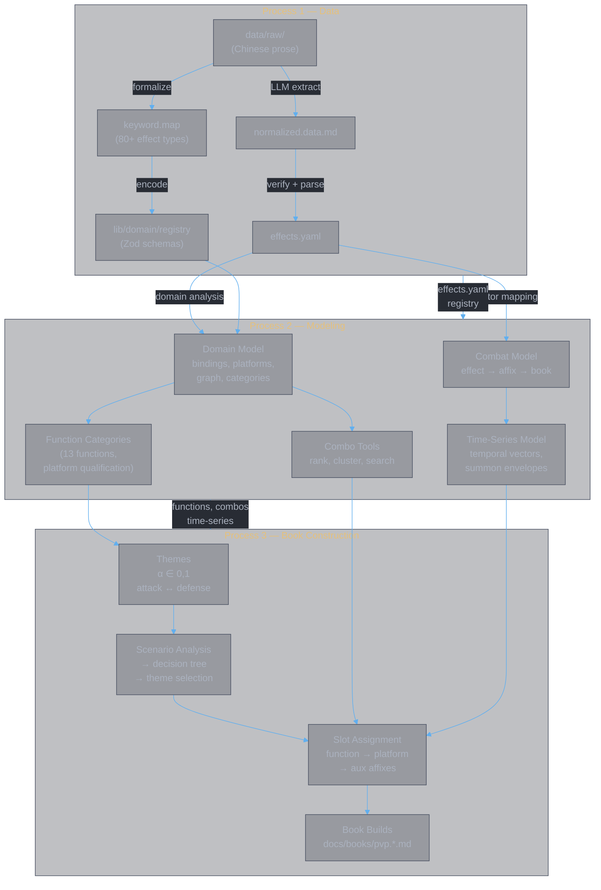

<style>
body {
  max-width: none !important;
  width: 95% !important;
  margin: 0 auto !important;
  padding: 20px 40px !important;
  background-color: #282c34 !important;
  color: #abb2bf !important;
  font-family: -apple-system, BlinkMacSystemFont, "Segoe UI", Helvetica, Arial, sans-serif !important;
  line-height: 1.6 !important;
  -webkit-print-color-adjust: exact !important;
  print-color-adjust: exact !important;
}

h1, h2, h3, h4, h5, h6 {
  color: #ffffff !important;
}

a {
  color: #61afef !important;
}

code {
  background-color: #3e4451 !important;
  color: #e5c07b !important;
  padding: 2px 6px !important;
  border-radius: 3px !important;
}

pre {
  background-color: #2c313a !important;
  border: 1px solid #4b5263 !important;
  border-radius: 6px !important;
  padding: 16px !important;
  overflow-x: auto !important;
}

pre code {
  background-color: transparent !important;
  color: #abb2bf !important;
  padding: 0 !important;
  border-radius: 0 !important;
  font-size: 13px !important;
  line-height: 1.5 !important;
}

table {
  border-collapse: collapse !important;
  width: auto !important;
  margin: 16px 0 !important;
  table-layout: auto !important;
  display: table !important;
}

table th,
table td {
  border: 1px solid #4b5263 !important;
  padding: 8px 10px !important;
  word-wrap: break-word !important;
}

table th:first-child,
table td:first-child {
  min-width: 60px !important;
}

table th {
  background: #3e4451 !important;
  color: #e5c07b !important;
  font-size: 14px !important;
  text-align: center !important;
}

table td {
  background: #2c313a !important;
  font-size: 12px !important;
  text-align: left !important;
}

blockquote {
  border-left: 3px solid #4b5263 !important;
  padding-left: 10px !important;
  color: #5c6370 !important;
  background-color: #2c313a !important;
}

strong {
  color: #e5c07b !important;
}
</style>


# Divine Book (灵书)

**Authors:** Z. Zhang & Claude Opus 4.6 (Anthropic)

> **Structured data, combat modeling, and book construction system for the Divine Book (灵书) mechanic** — a cultivation combat system comprising 28 skill books across four schools. Three processes: extract structured data from Chinese prose, model combat interactions and function categories, then construct optimized book sets for PvP scenarios.

---

## Architecture — Three Processes



### Process 1 — Data

Extract structured data from volatile Chinese prose. Formalizes the effect type vocabulary (80+ types), extracts normalized tables via LLM agents, verifies with two independent agents, and parses into YAML.

| Layer | What | Where |
|:------|:-----|:------|
| Structure | Effect type vocabulary | `data/keyword/keyword.map.cn.md`, `lib/domain/registry.ts` |
| Extraction | LLM-extracted tables | `data/normalized/normalized.data.md` |
| Verification | Schema + coverage checks | `/verify-schema`, `/verify-coverage` agents |
| Output | Parsed effect data | `data/yaml/effects.yaml` |

**Docs:** [design.md](docs/data/design.md), [impl.parser.md](docs/data/impl.parser.md), [note.data.md](docs/data/note.data.md)

### Process 2 — Modeling

Build models on top of the extracted data. Three interconnected models:

| Model | What it does | Where |
|:------|:-------------|:------|
| **Domain model** | Affix interactions as provides/requires graph (61 bindings, 10 platforms). Combo discovery and scoring. | `lib/domain/*.ts`, [domain.category.md](docs/data/domain.category.md), [domain.graph.md](docs/data/domain.graph.md) |
| **Combat model** | Effect → factor mapping. Four-level pipeline: effect → affix → book → book set. | `lib/schemas/*.ts`, `lib/model/*.ts`, [combat.md](docs/model/combat.md) |
| **Function categories** | 13 function types (F_burst, F_buff, etc.) with platform qualification, aux affix catalog, and three-tier structure. | `lib/domain/functions.ts`, [function-themes.md](docs/model/function-themes.md) |
| **Time-series** | Temporal factor vectors, summon envelopes, buff duration analysis. | `lib/model/time-series.ts`, [impl.time-series.md](docs/model/impl.time-series.md) |

**Docs:** [chain.md](docs/data/chain.md), [combat.qualitative.md](docs/model/combat.qualitative.md), [impl.binding-quality.md](docs/model/impl.binding-quality.md)

### Process 3 — Book Construction

Use the models to construct optimized 6-slot 灵書 sets for PvP. The process follows a defined pipeline:

```
Scenario Analysis → Theme Selection → Function → Slot → Platform → Aux → Build
```

| Step | What | Reference |
|:-----|:-----|:---------|
| **Themes** | Spectrum α∈[0,1] from all-attack to all-defense. 5 discrete themes. Strategic variance peaks at α≈0.5. | [function-themes.md §Themes](docs/model/function-themes.md) |
| **Scenario → Theme** | Decision tree over observables (power gap, enemy heal/DR) produces theme α. | [function-themes.md §Decision Tree](docs/model/function-themes.md) |
| **Slot assignment** | Per-slot function categories based on slot timing + dependencies. | [function-themes.md §Slot Assignment](docs/model/function-themes.md) |
| **Build process** | 6-step pipeline: scenario → theme → function → platform → aux → verify. | [guide.build.md](docs/books/guide.build.md) |
| **Working builds** | Concrete PvP builds with scenario analysis and slot-by-slot evaluation. | [pvp.md](docs/books/pvp.md), [pvp.zz.tools.md](docs/pvp.zz.tools.md) |

## Quick Start

```
bun install
bun run parse                                          # normalized.data.md → effects.yaml
bun run check                                          # typecheck + lint
bun run test                                           # unit + integration tests
bun app/combo-rank.ts --platform 春黎剑阵 --top 5       # rank combos for a platform
bun app/function-combos.ts --catalog                   # function category catalog
bun app/function-combos.ts --fn F_burst --top 3        # combos per function × platform
bun app/book-vector.ts --platform 春黎剑阵 --op1 灵犀九重 --op2 心逐神随  # time-series
bun app/build-candidates.ts --theme all_attack --top 5  # enumerate book set candidates
bun app/build-candidates.ts --list                      # list available themes
bun scripts/sync-style.ts                              # sync dark theme to all docs
```

## Tools

| Tool | Process | Purpose |
|:-----|:--------|:--------|
| `app/parse.ts` | Data | normalized.data.md → effects.yaml |
| `app/map.ts` | Data | effects.yaml → model.yaml (factor mapping) |
| `app/combo-search.ts` | Modeling | Platform combo search |
| `app/combo-rank.ts` | Modeling | Rank all combos for a platform (weighted scoring) |
| `app/combo-cluster.ts` | Modeling | K-means clustering for archetypes |
| `app/function-combos.ts` | Modeling | Function category catalog + combos per function × platform |
| `app/book-vector.ts` | Modeling | Time-series factor vectors per book |
| `app/book-vector-chart.ts` | Modeling | HTML chart visualization |
| `app/bookset-vector.ts` | Construction | Book set time-series evaluation (6-slot merge) |
| `app/bookset-chart.ts` | Construction | Book set time-series chart visualization |
| `app/candidates.ts` | Modeling | Affix candidate enumeration |
| `app/build-candidates.ts` | Construction | Theme-driven 6-slot book set candidate enumeration |
| `app/generate.ts` | Data | Registry → keyword.map generator |

## Project Structure

```
app/                             CLI tools (see table above)
lib/
  parse.ts                       Markdown table parser
  candidates.ts                  Affix candidate enumeration
  generators/
    keyword-map.ts               Registry → keyword.map.md generator
  schemas/                       Process 2: Combat model schemas
    effect.ts                    Zod schema — 80+ effect types
    effect.model.ts              Effect → factor contribution mapping
    affix.model.ts               Affix-level combinator
    book.model.ts                Book-level combinator
    bookset.model.ts             Book-set-level combinator
  domain/                        Process 2: Domain model
    registry.ts                  Effect type registry (80+ types)
    effects/                     Effect type definitions (17 files)
    enums.ts                     TargetCategory (T1-T10), School enums
    bindings.ts                  61 affix provides/requires bindings
    platforms.ts                 10 platform definitions
    functions.ts                 13 function categories + qualification logic
    named-entities.ts            6 named entity definitions
    amplifiers.ts                Offense zone classification
    binding-quality.ts           BQ scoring (utilization, platform fit, zone breadth)
    chains.ts                    filterByBinding + discoverChains
    constraints.ts               Construction constraint validator
  model/                         Process 2: Combat + time-series models
    model-data.ts                Factor vector building + combo distance
    time-series.ts               Temporal event collection + sampling
    combinators.ts               Model combinators
data/
  raw/                           Source of truth (Chinese prose)
  keyword/                       Effect type vocabulary (parsing spec)
  normalized/                    LLM-extracted tables
  yaml/                          Parsed output (effects.yaml, groups.yaml)
docs/
  data/                          Process 1 docs (data pipeline design, domain analysis)
  model/                         Process 2 docs (combat model, function themes, time-series)
  books/                         Process 3 docs (build guides, PvP scenarios)
  pvp.zz.tools.md                Tool-assisted PvP build (working example)
scripts/
  sync-style.ts                  Sync dark theme CSS to all markdown files
```

## Documentation

### Process 1 — Data

| Document | Purpose |
|:---------|:--------|
| [design.md](docs/data/design.md) | System design — containers, components, boundaries |
| [note.data.md](docs/data/note.data.md) | Pipeline quick reference — layers, commands, agents |
| [impl.parser.md](docs/data/impl.parser.md) | How the parser works |
| [usage.parser.md](docs/data/usage.parser.md) | Running the parser |
| [usage.domain.md](docs/data/usage.domain.md) | Domain analysis workflow |
| [keyword.map.md](data/keyword/keyword.map.md) | Effect type vocabulary (80+ types) |

### Process 2 — Modeling

| Document | Purpose |
|:---------|:--------|
| [domain.category.md](docs/data/domain.category.md) | Affix taxonomy with provides/requires bindings |
| [domain.graph.md](docs/data/domain.graph.md) | Graph model, named entities, platform provides |
| [domain.path.md](docs/data/domain.path.md) | Path catalog, platform projections |
| [chain.md](docs/data/chain.md) | Construction methodology — objectives, functions, scoring |
| [combat.md](docs/model/combat.md) | Effect → factor mapping (four-level pipeline) |
| [combat.qualitative.md](docs/model/combat.qualitative.md) | Qualitative combat analysis |
| [function-themes.md](docs/model/function-themes.md) | Function categories (13 types), themes (α spectrum), decision tree |
| [impl.binding-quality.md](docs/model/impl.binding-quality.md) | BQ scoring implementation |
| [impl.time-series.md](docs/model/impl.time-series.md) | Time-series model implementation |

### Process 3 — Book Construction

| Document | Purpose |
|:---------|:--------|
| [guide.build.md](docs/books/guide.build.md) | Build process guide — 6-step pipeline with mermaid diagrams |
| [guide.chain.md](docs/books/guide.chain.md) | Chain construction guide |
| [pvp.md](docs/books/pvp.md) | PvP book set construction (3 scenarios) |
| [pvp.candidates.md](docs/books/pvp.candidates.md) | Candidate enumeration across 5 themes (per-slot analysis + set-level) |
| [pvp.zz.tools.md](docs/pvp.zz.tools.md) | Tool-assisted PvP build with scoring + time-series |

---

## Document History

| Version | Date | Changes |
|---------|------|---------|
| 1.0 | 2026-02-25 | Initial project README |
| 2.0 | 2026-03-05 | Full rewrite — four-layer architecture |
| 3.0 | 2026-03-09 | Three-process architecture (data, modeling, book construction) |
