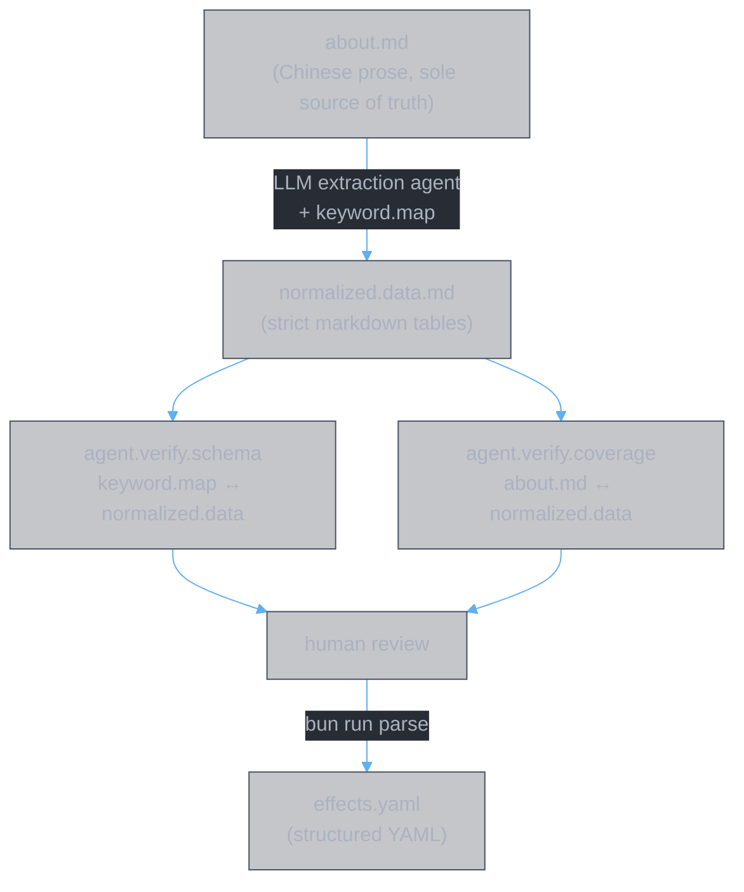

<style>
body {
  max-width: none !important;
  width: 95% !important;
  margin: 0 auto !important;
  padding: 20px 40px !important;
  background-color: #282c34 !important;
  color: #abb2bf !important;
  font-family: -apple-system, BlinkMacSystemFont, "Segoe UI", Helvetica, Arial, sans-serif !important;
  line-height: 1.6 !important;
  -webkit-print-color-adjust: exact !important;
  print-color-adjust: exact !important;
}

h1, h2, h3, h4, h5, h6 {
  color: #ffffff !important;
}

a {
  color: #61afef !important;
}

code {
  background-color: #3e4451 !important;
  color: #e5c07b !important;
  padding: 2px 6px !important;
  border-radius: 3px !important;
}

table {
  border-collapse: collapse !important;
  width: auto !important;
  margin: 16px 0 !important;
  table-layout: auto !important;
  display: table !important;
}

table th,
table td {
  border: 1px solid #4b5263 !important;
  padding: 8px 10px !important;
  word-wrap: break-word !important;
}

table th:first-child,
table td:first-child {
  min-width: 60px !important;
}

table th {
  background: #3e4451 !important;
  color: #e5c07b !important;
  font-size: 14px !important;
  text-align: center !important;
}

table td {
  background: #2c313a !important;
  font-size: 12px !important;
  text-align: left !important;
}

blockquote {
  border-left: 3px solid #4b5263;
  padding-left: 10px;
  color: #5c6370;
}

strong {
  color: #e5c07b;
}
</style>

# Divine Book (灵书)

**Authors:** Z. Zhang & Claude Opus 4.6 (Anthropic)

> **Structured data pipeline for the Divine Book system** — a cultivation combat mechanic comprising 28 skill books across four schools. Extracts structured data from volatile Chinese prose via LLM agents, validates through two independent verification stages, and produces machine-readable output through a deterministic code parser.

---

## Pipeline



## Quick Start

```
bun install
bun run parse                    # normalized.data.md -> effects.yaml
bun run check                    # typecheck + lint
bun run test                     # 37 unit + integration tests
```

## Project Structure

```
app/                             CLI entry points (side effects)
lib/                             Pure library (parser, schemas, tests)
  parse.ts                       Markdown table parser
  parse.test.ts                  Unit + integration tests
  schemas/effect.ts              Zod schema — 60+ effect types
docs/data/                       Pipeline documentation
  keyword.map.md / .cn.md        Effect type vocabulary (parsing spec)
  normalized.data.md / .cn.md    Extracted data (all data_state tiers)
  design.md                      Architectural rationale
  impl.parser.md                 Parser implementation details
  usage.dev.md                   Full pipeline workflow
  usage.parser.md                Parser usage guide
  references/元宝/               Chinese reference docs
data/
  raw/about.md                   Source of truth (volatile Chinese prose)
  yaml/effects.yaml              Generated output
.claude/commands/                LLM agent specifications
  extract.md                     /extract — extraction agent
  verify-schema.md               /verify-schema — schema verification
  verify-coverage.md             /verify-coverage — coverage verification
```

## Documentation

| Document | Purpose |
|:---|:---|
| [design.md](docs/data/design.md) | Why the pipeline is structured this way |
| [impl.parser.md](docs/data/impl.parser.md) | How the parser works — flow, components, tests |
| [usage.dev.md](docs/data/usage.dev.md) | Day-to-day pipeline operation |
| [usage.parser.md](docs/data/usage.parser.md) | Running the parser |
| [keyword.map.md](docs/data/keyword.map.md) | Effect type vocabulary |

---

## Document History

| Version | Date | Changes |
|---------|------|---------|
| 1.0 | 2026-02-25 | Initial project README |
