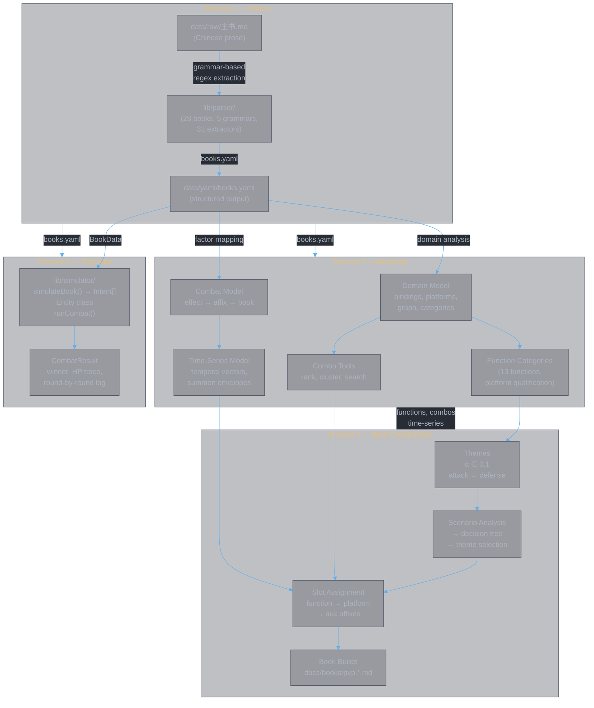

<style>
body {
  max-width: none !important;
  width: 95% !important;
  margin: 0 auto !important;
  padding: 20px 40px !important;
  background-color: #282c34 !important;
  color: #abb2bf !important;
  font-family: -apple-system, BlinkMacSystemFont, "Segoe UI", Helvetica, Arial, sans-serif !important;
  line-height: 1.6 !important;
  -webkit-print-color-adjust: exact !important;
  print-color-adjust: exact !important;
}

h1, h2, h3, h4, h5, h6 {
  color: #ffffff !important;
}

a {
  color: #61afef !important;
}

code {
  background-color: #3e4451 !important;
  color: #e5c07b !important;
  padding: 2px 6px !important;
  border-radius: 3px !important;
}

pre {
  background-color: #2c313a !important;
  border: 1px solid #4b5263 !important;
  border-radius: 6px !important;
  padding: 16px !important;
  overflow-x: auto !important;
}

pre code {
  background-color: transparent !important;
  color: #abb2bf !important;
  padding: 0 !important;
  border-radius: 0 !important;
  font-size: 13px !important;
  line-height: 1.5 !important;
}

table {
  border-collapse: collapse !important;
  width: auto !important;
  margin: 16px 0 !important;
  table-layout: auto !important;
  display: table !important;
}

table th,
table td {
  border: 1px solid #4b5263 !important;
  padding: 8px 10px !important;
  word-wrap: break-word !important;
}

table th:first-child,
table td:first-child {
  min-width: 60px !important;
}

table th {
  background: #3e4451 !important;
  color: #e5c07b !important;
  font-size: 14px !important;
  text-align: center !important;
}

table td {
  background: #2c313a !important;
  font-size: 12px !important;
  text-align: left !important;
}

blockquote {
  border-left: 3px solid #4b5263 !important;
  padding-left: 10px !important;
  color: #5c6370 !important;
  background-color: #2c313a !important;
}

strong {
  color: #e5c07b !important;
}
</style>


# Divine Book (灵书)

**Authors:** Z. Zhang & Claude Opus 4.6 (Anthropic)

> **Structured data, combat modeling, and simulation for the Divine Book (灵书) mechanic** — a cultivation combat system comprising 28 skill books across four schools. Four processes: parse structured data from Chinese prose, model combat interactions and function categories, construct optimized book sets, and simulate combat outcomes.

---

## Architecture — Four Processes



### Process 1 — Parser

Grammar-based parser that reads Chinese prose directly from `data/raw/主书.md`. No LLM, no intermediate normalized format. Deterministic extraction using 31 regex patterns across 5 grammar types.

| Layer | What | Where |
|:------|:-----|:------|
| MD Table Reader | Raw markdown → per-book cells | `lib/parser/md-table.ts` |
| Book Lookup | 28 books → grammar classification (G2–G6) | `lib/parser/book-table.ts` |
| Split Engine | Grammar-driven per-book parsing | `lib/parser/split.ts` |
| Regex Extractors | 31 pattern-matching functions for Chinese prose | `lib/parser/extract.ts` |
| State Extractor | 【name】patterns → state registry | `lib/parser/states.ts` |
| Tier Resolver | Enlightenment/fusion tier variable substitution | `lib/parser/tiers.ts` |
| Emitter | ParsedBook → BookData → YAML | `lib/parser/emit.ts` |
| Output | 28 books, ~125 effects | `data/yaml/books.yaml` |

**Docs:** [diagram.main.md](docs/parser/diagram.main.md), [note.update.md](docs/parser/note.update.md)

### Process 2 — Modeling

Build models on top of the parsed data. Three interconnected models:

| Model | What it does | Where |
|:------|:-------------|:------|
| **Domain model** | Affix interactions as provides/requires graph (61 bindings, 10 platforms). Combo discovery and scoring. | `lib/domain/*.ts`, [domain.category.md](docs/data/domain.category.md) |
| **Combat model** | Effect → factor mapping. Four-level pipeline: effect → affix → book → book set. | `lib/schemas/*.ts`, `lib/model/*.ts`, [combat.md](docs/model/combat.md) |
| **Function categories** | 13 function types (F_burst, F_buff, etc.) with platform qualification, aux affix catalog. | `lib/domain/functions.ts`, [function-themes.md](docs/model/function-themes.md) |
| **Time-series** | Temporal factor vectors, summon envelopes, buff duration analysis. | `lib/model/time-series.ts`, [impl.time-series.md](docs/model/impl.time-series.md) |

### Process 3 — Book Construction

Use the models to construct optimized 6-slot book sets for PvP:

```
Scenario Analysis → Theme Selection → Function → Slot → Platform → Aux → Build
```

| Step | What | Reference |
|:-----|:-----|:---------|
| **Themes** | Spectrum α∈[0,1] from all-attack to all-defense. 5 discrete themes. | [function-themes.md](docs/model/function-themes.md) |
| **Scenario → Theme** | Decision tree over observables (power gap, enemy heal/DR). | [function-themes.md](docs/model/function-themes.md) |
| **Slot assignment** | Per-slot function categories based on slot timing + dependencies. | [function-themes.md](docs/model/function-themes.md) |
| **Build process** | 6-step pipeline: scenario → theme → function → platform → aux → verify. | [guide.build.md](docs/books/guide.build.md) |
| **Candidate enumeration** | Two-layer architecture: per-slot LOCKED/FLEXIBLE detection + set-level Cartesian product. | [pvp.candidates.md](docs/books/pvp.candidates.md) |

### Process 4 — Combat Simulator

Entity-sovereign combat simulator. Main book vs main book (platform + primary affix).

| Component | What | Where |
|:----------|:-----|:------|
| **Types** | 21 intent types, operators, snapshots | `lib/simulator/types.ts` |
| **Combinator** | 3-pass pipeline: producers → modifiers → parent assembly | `lib/simulator/simulate.ts` |
| **Entity** | Sovereign HP/ATK/DEF/SP, derived stats, damage cascade, counter triggers | `lib/simulator/entity.ts` |
| **Arena** | Round orchestrator: snapshot → resolve → dispatch → tick | `lib/simulator/arena.ts` |

**Docs:** [contract.main.md](docs/simulator/contract.main.md), [impl.main.md](docs/simulator/impl.main.md), [model.actors.md](docs/simulator/model.actors.md), [config.md](docs/simulator/config.md)

## Quick Start

```bash
bun install
bun run test                                           # 229 tests

# Parser
bun app/parse-main-skills.ts                           # parse all books → stdout
bun app/parse-main-skills.ts -o data/yaml/books.yaml   # regenerate books.yaml
bun app/parse-main-skills.ts --book 通天剑诀            # debug single book

# Simulator
bun app/simulate.ts --list                             # list all 28 books
bun app/simulate.ts --book-a 通天剑诀 --book-b 新-青元剑诀 --hp 5000000
bun app/simulate.ts --book-a 煞影千幻 --book-b 疾风九变 --hp 5000000 --verbose

# Modeling
bun app/function-combos.ts --catalog                   # function category catalog
bun app/function-combos.ts --fn F_burst --top 3        # combos per function × platform
bun app/book-vector.ts --platform 春黎剑阵 --op1 灵犀九重 --op2 心逐神随  # time-series
bun app/build-candidates.ts --theme all_attack --top 5  # enumerate book set candidates

# Checks
bun run check                                          # typecheck + lint
```

## Tools

| Tool | Process | Purpose |
|:-----|:--------|:--------|
| `app/parse-main-skills.ts` | Parser | `data/raw/主书.md` → `data/yaml/books.yaml` |
| `app/simulate.ts` | Simulator | Combat simulation: main book vs main book |
| `app/map.ts` | Modeling | books.yaml → model.yaml (factor mapping) |
| `app/combo-search.ts` | Modeling | Platform combo search |
| `app/combo-rank.ts` | Modeling | Rank all combos for a platform (weighted scoring) |
| `app/combo-cluster.ts` | Modeling | K-means clustering for archetypes |
| `app/function-combos.ts` | Modeling | Function category catalog + combos per function × platform |
| `app/book-vector.ts` | Modeling | Time-series factor vectors per book |
| `app/book-vector-chart.ts` | Modeling | HTML chart visualization |
| `app/bookset-vector.ts` | Construction | Book set time-series evaluation (6-slot merge) |
| `app/bookset-chart.ts` | Construction | Book set time-series chart visualization |
| `app/build-candidates.ts` | Construction | Theme-driven 6-slot book set candidate enumeration |
| `app/generate.ts` | Data | Registry → keyword.map generator |

## Project Structure

```
app/                             CLI tools (see table above)
lib/
  parser/                        Process 1: Grammar-based parser
    md-table.ts                  Layer 1: markdown table reader
    book-table.ts                Static lookup: 28 books → grammar
    split.ts                     Layer 2: per-book grammar parsers
    states.ts                    Layer 3: named state extraction
    extract.ts                   Layer 4: 31 regex pattern extractors
    tiers.ts                     Tier resolution + variable substitution
    emit.ts                      Emitter: ParsedBook → BookData → YAML
    index.ts                     Orchestrator: parseMainSkills(), parseSingleBook()
    parser.test.ts               59 tests
  simulator/                     Process 4: Combat simulator
    types.ts                     Intent types, OwnerStats, EntitySnapshot, CombatConfig
    simulate.ts                  simulateBook() combinator, resolveSlot()
    entity.ts                    Entity class (sovereign HP/ATK/DEF/SP)
    arena.ts                     runCombat() round orchestrator
    index.ts                     Public API: loadBooks(), simulate()
    simulator.test.ts            26 tests
  domain/                        Process 2: Domain model
    registry.ts                  Effect type registry (80+ types)
    effects/                     Effect type definitions (17 files)
    enums.ts                     TargetCategory, School enums
    bindings.ts                  61 affix provides/requires bindings
    platforms.ts                 10 platform definitions
    functions.ts                 13 function categories + qualification logic
    build-candidates.ts          Two-layer candidate enumeration
  schemas/                       Process 2: Combat model schemas
    effect.ts                    Zod schema — 80+ effect types
    effect.model.ts              Effect → factor contribution mapping
  model/                         Process 2: Combat + time-series models
    model-data.ts                Factor vector building + combo distance
    time-series.ts               Temporal event collection + sampling
data/
  raw/                           Source of truth (Chinese prose)
  keyword/                       Effect type vocabulary (parsing spec)
  yaml/                          Parsed output (books.yaml, groups.yaml, model.yaml)
docs/
  parser/                        Process 1 docs (parser architecture, diagrams)
  data/                          Process 1+2 docs (domain analysis)
  model/                         Process 2 docs (combat model, function themes, time-series)
  books/                         Process 3 docs (build guides, PvP scenarios)
  simulator/                     Process 4 docs (contracts, implementation, config)
```

## Documentation

### Process 1 — Parser

| Document | Purpose |
|:---------|:--------|
| [diagram.main.md](docs/parser/diagram.main.md) | Parser pipeline class diagrams |
| [note.update.md](docs/parser/note.update.md) | Parser current state — scope, files, grammars |

### Process 2 — Modeling

| Document | Purpose |
|:---------|:--------|
| [domain.category.md](docs/data/domain.category.md) | Affix taxonomy with provides/requires bindings |
| [domain.graph.md](docs/data/domain.graph.md) | Graph model, named entities, platform provides |
| [domain.path.md](docs/data/domain.path.md) | Path catalog, platform projections |
| [chain.md](docs/data/chain.md) | Construction methodology — objectives, functions, scoring |
| [combat.md](docs/model/combat.md) | Effect → factor mapping (four-level pipeline) |
| [combat.qualitative.md](docs/model/combat.qualitative.md) | Qualitative combat analysis |
| [function-themes.md](docs/model/function-themes.md) | Function categories, themes, decision tree |
| [impl.binding-quality.md](docs/model/impl.binding-quality.md) | BQ scoring implementation |
| [impl.time-series.md](docs/model/impl.time-series.md) | Time-series model implementation |

### Process 3 — Book Construction

| Document | Purpose |
|:---------|:--------|
| [guide.build.md](docs/books/guide.build.md) | Build process guide — 6-step pipeline |
| [guide.chain.md](docs/books/guide.chain.md) | Chain construction guide |
| [pvp.md](docs/books/pvp.md) | PvP book set construction (3 scenarios) |
| [pvp.candidates.md](docs/books/pvp.candidates.md) | Candidate enumeration across 5 themes |

### Process 4 — Combat Simulator

| Document | Purpose |
|:---------|:--------|
| [contract.main.md](docs/simulator/contract.main.md) | Intent type contracts — 21 intent types, producer/modifier tables |
| [impl.main.md](docs/simulator/impl.main.md) | Combinator algorithm, worked examples, design decisions |
| [model.actors.md](docs/simulator/model.actors.md) | Entity class, Arena function, damage cascade, round lifecycle |
| [config.md](docs/simulator/config.md) | CLI usage, CombatConfig, output format |

---

## Document History

| Version | Date | Changes |
|---------|------|---------|
| 1.0 | 2026-02-25 | Initial project README |
| 2.0 | 2026-03-05 | Full rewrite — four-layer architecture |
| 3.0 | 2026-03-09 | Three-process architecture (data, modeling, book construction) |
| 4.0 | 2026-03-14 | Four-process architecture: grammar-based parser replaces LLM pipeline, combat simulator added, stale artifacts removed |
