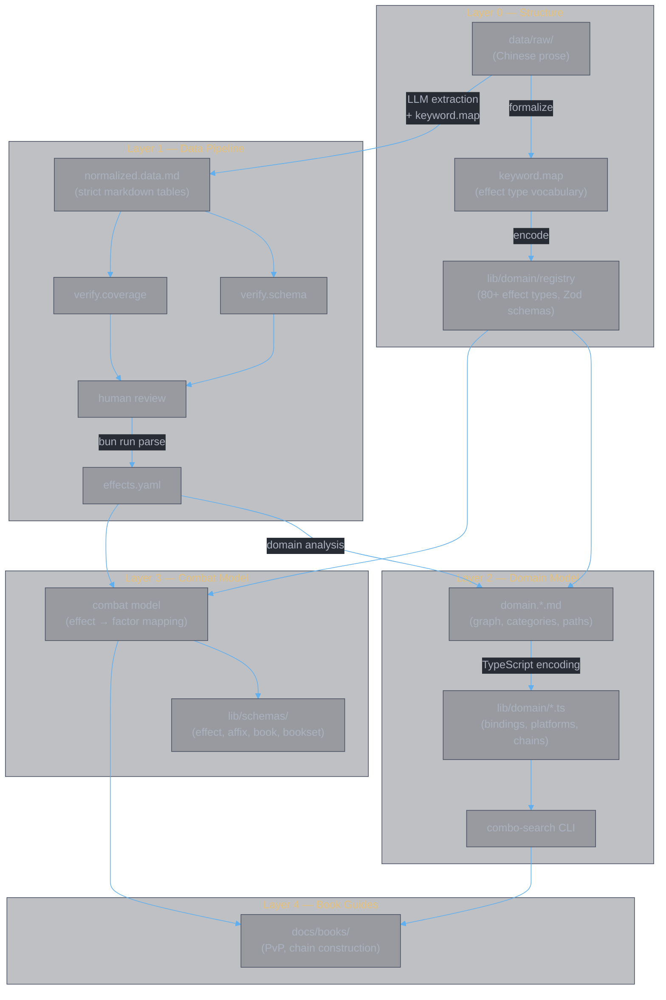

<style>
body {
  max-width: none !important;
  width: 95% !important;
  margin: 0 auto !important;
  padding: 20px 40px !important;
  background-color: #282c34 !important;
  color: #abb2bf !important;
  font-family: -apple-system, BlinkMacSystemFont, "Segoe UI", Helvetica, Arial, sans-serif !important;
  line-height: 1.6 !important;
  -webkit-print-color-adjust: exact !important;
  print-color-adjust: exact !important;
}

h1, h2, h3, h4, h5, h6 {
  color: #ffffff !important;
}

a {
  color: #61afef !important;
}

code {
  background-color: #3e4451 !important;
  color: #e5c07b !important;
  padding: 2px 6px !important;
  border-radius: 3px !important;
}

pre {
  background-color: #2c313a !important;
  border: 1px solid #4b5263 !important;
  border-radius: 6px !important;
  padding: 16px !important;
  overflow-x: auto !important;
}

pre code {
  background-color: transparent !important;
  color: #abb2bf !important;
  padding: 0 !important;
  border-radius: 0 !important;
  font-size: 13px !important;
  line-height: 1.5 !important;
}

table {
  border-collapse: collapse !important;
  width: auto !important;
  margin: 16px 0 !important;
  table-layout: auto !important;
  display: table !important;
}

table th,
table td {
  border: 1px solid #4b5263 !important;
  padding: 8px 10px !important;
  word-wrap: break-word !important;
}

table th:first-child,
table td:first-child {
  min-width: 60px !important;
}

table th {
  background: #3e4451 !important;
  color: #e5c07b !important;
  font-size: 14px !important;
  text-align: center !important;
}

table td {
  background: #2c313a !important;
  font-size: 12px !important;
  text-align: left !important;
}

blockquote {
  border-left: 3px solid #4b5263 !important;
  padding-left: 10px !important;
  color: #5c6370 !important;
  background-color: #2c313a !important;
}

strong {
  color: #e5c07b !important;
}
</style>


# Divine Book (灵书)

**Authors:** Z. Zhang & Claude Opus 4.6 (Anthropic)

> **Structured data and combat analysis system for the Divine Book (灵书) mechanic** — a cultivation combat system comprising 28 skill books across four schools. Formalizes the effect type system (80+ types), parses volatile Chinese prose into machine-readable YAML, models affix interactions as a provides/requires graph, and provides programmatic combo discovery and combat modeling.

---

## Architecture



**Layer 0** formalizes the game's effect type system — the structural foundation everything else builds on. Raw Chinese prose is analyzed into a controlled vocabulary (`keyword.map`), then encoded as TypeScript definitions with Zod schemas (80+ types across 17 files).

**Layer 1** is the data extraction pipeline — LLM agents extract structured tables from prose, two independent verification agents validate, and a deterministic parser produces YAML.

**Layer 2** models affix interactions as a provides/requires graph (61 affix bindings, 9 platforms, 6 named entities) for programmatic combo discovery.

**Layer 3** maps effects to combat model parameters — a four-level compositional pipeline (effect → affix → book → book set) with quantitative factor contributions.

**Layer 4** produces the actual deliverables — book construction guides for PvP scenarios, using combo search results and combat model analysis.

## Quick Start

```
bun install
bun run parse                    # normalized.data.md → effects.yaml
bun run check                    # typecheck + lint
bun run test                     # 88 unit + integration tests
bun app/combo-search.ts --list   # list all platforms
bun app/combo-search.ts -p 疾风九变  # combo search for a platform
```

## Style block (visual docs)

The repository uses a canonical HTML/CSS style block for Markdown rendering. The canonical block lives at `docs/style.block.md`.

To apply the canonical style to all Markdown files under `data/raw/` and `docs/data/`, run:

```bash
bun scripts/sync-style.ts
```

If you prefer to apply the style manually to a single file, copy the contents of `docs/style.block.md` and paste the `<style>...</style>` block after the file's frontmatter (the YAML `---` block) or at the top of the file.

You can add a short package script in `package.json` for convenience, for example:

```json
"scripts": {
  "sync-style": "bun scripts/sync-style.ts"
}
```


## Project Structure

```
app/
  parse.ts                       normalized.data.md → effects.yaml
  combo-search.ts                Platform combo search CLI
  candidates.ts                  Affix candidate enumeration CLI
  generate.ts                    Generator CLI
lib/
  parse.ts                       Markdown table parser
  candidates.ts                  Affix candidate enumeration
  generators/
    keyword-map.ts               Registry → keyword.map.md generator
  schemas/
    effect.ts                    Zod schema — 80+ effect types
    effect.model.ts              Effect → factor contribution mapping
    affix.model.ts               Affix-level combinator
    book.model.ts                Book-level combinator
    bookset.model.ts             Book-set-level combinator
  domain/
    registry.ts                  Effect type registry (80+ types)
    effects/                     Effect type definitions (17 files)
    enums.ts                     TargetCategory (T1-T10), School enums
    bindings.ts                  61 affix provides/requires bindings
    platforms.ts                 9 platform definitions
    named-entities.ts            6 named entity definitions
    chains.ts                    filterByBinding + discoverChains
    constraints.ts               Construction constraint validator
docs/
  data/
    keyword.map.md / .cn.md      Effect type vocabulary (parsing spec)
    normalized.data.md / .cn.md  Extracted data (all data_state tiers)
    domain.category.md           Affix taxonomy with provides/requires
    domain.graph.md              Graph model, named entities, platforms
    domain.path.md               Path catalog, platform projections
    design.md                    Architectural rationale
    usage.dev.md                 Full pipeline workflow
    usage.domain.md              Domain analysis workflow
    references/元宝/             Chinese reference docs
  model/
    combat.md                    Combat model — effect → factor mapping
    combat.qualitative.md        Qualitative combat analysis
    impl.combat.md               Combat model implementation
  books/
    guide.chain.md               Chain construction guide
    pvp.md                       PvP book set construction
    pvp.chain.md                 PvP chain-first construction
    pvp.graph.md                 PvP graph analysis
data/
  raw/                           Source of truth (split by topic)
    主书.md                      Main skill data (9 of 28 books)
    通用词缀.md                  Universal affixes
    修为词缀.md                  School affixes
    专属词缀.md                  Exclusive affixes
    构造规则.md                  Construction rules
  yaml/
    effects.yaml                 Parsed effect data
    groups.yaml                  Parsed group data
.claude/commands/                LLM agent specifications
  extract.md                     /extract — extraction agent
  verify-schema.md               /verify-schema — schema verification
  verify-coverage.md             /verify-coverage — coverage verification
```

## Documentation

| Document | Purpose |
|:---|:---|
| **Workflow** | |
| [usage.dev.md](docs/data/usage.dev.md) | Day-to-day pipeline operation |
| [usage.parser.md](docs/data/usage.parser.md) | Running the parser |
| [usage.domain.md](docs/data/usage.domain.md) | Domain analysis workflow — raw data to combo search |
| **Data design** | |
| [design.md](docs/data/design.md) | Why the pipeline is structured this way |
| [impl.parser.md](docs/data/impl.parser.md) | How the parser works — flow, components, tests |
| [keyword.map.md](docs/data/keyword.map.md) | Effect type vocabulary (80+ types) |
| **Domain model** | |
| [domain.category.md](docs/data/domain.category.md) | Affix taxonomy with provides/requires bindings |
| [domain.graph.md](docs/data/domain.graph.md) | Graph model, named entities, platform provides |
| [domain.path.md](docs/data/domain.path.md) | Path catalog, platform projections |
| **Combat model** | |
| [combat.md](docs/model/combat.md) | Effect → factor mapping (four-level pipeline) |
| [combat.qualitative.md](docs/model/combat.qualitative.md) | Qualitative combat analysis |
| [guide.chain.md](docs/books/guide.chain.md) | Chain construction guide |

---

## Document History

| Version | Date | Changes |
|---------|------|---------|
| 1.0 | 2026-02-25 | Initial project README |
| 2.0 | 2026-03-05 | Full rewrite — all four layers, complete project structure |
