

## Assumptions

### Progression Tiers Used

| Book | 悟境 | 融合 | 修炼 | Notes |
|------|------|------|------|-------|
| 春黎剑阵 | 10 | 83 | 24 | Max tier |
| 皓月剑诀 | 10 | 57 | 24 | Max tier |
| 甲元仙符 | 8 | 51 | — | 悟8 for 天光虹露 +190% |
| 天魔降临咒 | — | — | — | No tier-dependent values |
| 天刹真魔 | — | — | — | No tier-dependent values |
| 十方真魄 | — | — | — | No tier-dependent values |
| 大罗幻诀 (Var B) | 10 | 52 | — | 悟10 for 命損 100% |
| 玄煞灵影诀 (Set 2) | 1 | 51 | — | 悟1 base tier |
| 解体化形 | 2 | 63 | — | 心逐神随: 60%/80%/100% for 4x/3x/2x |
| 浩然星灵诀 | — | 52 | — | 龙象护身: +300% |
| 周天星元 | 2 | 50 | — | 奇能诡道: 93.5% |
| 千锋聚灵剑 | — | 50+ | — | 灵犀九重: 修为词缀 |

### Probability: 心逐神随

At 悟2/融合63, 心逐神随 has the following probability distribution:

| Multiplier | Probability | Cumulative |
|-----------|------------|-----------|
| 4x | 60% | 60% |
| 3x | 20% (80-60) | 80% |
| 2x | 20% (100-80) | 100% |

**Expected multiplier: ~3.4x** (0.6×4 + 0.2×3 + 0.2×2 = 2.4 + 0.6 + 0.4 = 3.4)

Throughout this document, "心逐神随 4x" refers to the **peak roll (60% chance)**. For expected-value analysis, substitute 3.4x. Key impacts:

- Opening hit (春黎剑阵): 22305% × 4x = 89220% peak, **75837% expected**
- 大罗幻诀 opening: 20265% × 4x = 81060% peak, **68901% expected**
- DoT amplification: 7% × 4x = 28% peak, **23.8% expected**

---

## pvp, stronger opponent

### Variation A — Weapon Doubling (current)

| Slot, Name | 主位 | 辅位1 | 辅位2 |
|------|------|-------|-------|
| 1，金光真剑 | `春黎剑阵` | `解体化形`（专属） | `千锋聚灵剑`（【灵犀九重】） |
| 2，洪荒真剑 | `皓月剑诀` | `春黎剑阵`（专属） | `无极御剑诀`（专属） |
| 3，风花真法 | `甲元仙符` | `浩然星灵诀`（专属） | `周天星元`（专属） |
| 4，九阳真魔言 | `天魔降临咒` | `皓月剑诀`（专属） | `梵圣真魔咒`（专属） |
| 5，浮云真魔典 | `天刹真魔` | `天轮魔经`（专属） | `无相魔劫咒`（专属） |
| 6，造化真灵 | `十方真魄` | `惊蜇化龙`（专属） | `通天剑诀`（专属）|

> Slot 1 clone doubles entire weapon system for 16s. 心逐神随 4x amplifies clone. Best when weapons are front-loaded.

### Variation B — Counter-Reflection

| Slot, Name | 主位 | 辅位1 | 辅位2 | Changes from A |
|------|------|-------|-------|-------|
| 1， | `大罗幻诀` | `解体化形`（专属） | `天轮魔经`（专属） | **new main + 辅位2** |
| 2，洪荒真剑 | `皓月剑诀` | `春黎剑阵`（专属） | `无极御剑诀`（专属） | — |
| 3，风花真法 | `甲元仙符` | `浩然星灵诀`（专属） | `周天星元`（专属） | — |
| 4，九阳真魔言 | `天魔降临咒` | `皓月剑诀`（专属） | `梵圣真魔咒`（专属） | — |
| 5， | `天刹真魔` | `疾风九变`（专属） | `无相魔劫咒`（专属） | **辅位1 changed** |
| 6，造化真灵 | `十方真魄` | `惊蜇化龙`（专属） | `通天剑诀`（专属）| — |

> Slot 1: 罗天魔咒 counter-reflection — enemy attacks trigger DoTs (28%/0.5s with 4x) + 命損 (-100% reduction). 心魔惑言 ×2 debuff stacks fully active on 大罗幻诀's debuff-heavy kit. Best vs aggressive opponents.
>
> Slot 5: 天轮魔经 moved to Slot 1 → replaced by 疾风九变（真言不灭, ALL state +55%）. Extends 天人五衰 15s→23.25s, 魔劫 8s→12.4s.

## pvp, weaker opponent

| Slot, Name | 主位 | 辅位1 | 辅位2 |
|------|------|-------|-------|
| 1，金光真剑 | `春黎剑阵` | `解体化形`（专属） | `千锋聚灵剑`（【灵犀九重】） |
| 2，洪荒真剑 | `皓月剑诀` | `春黎剑阵`（专属） | `无极御剑诀`（专属） |
| 3，风花真法 | `甲元仙符` | `浩然星灵诀`（专属） | `周天星元`（专属） |
| 4，九阳真魔言 | `天魔降临咒` | `皓月剑诀`（专属） | `梵圣真魔咒`（专属） |
| 5， | `玄煞灵影诀` | `无相魔劫咒`（专属） | `新-青元剑诀`（专属） |
| 6，造化真灵 | `十方真魄` | `惊蜇化龙`（专属） | `通天剑诀`（专属）|

---

## Construction Philosophy (Set 1: vs stronger opponent)

### Foundation: Combat Attribute System

All build decisions trace back to four combat attributes:

| Attribute | Role | Depleted by |
|-----------|------|-------------|
| **气血 (HP)** | Primary health pool. Zero = defeat. | Direct damage (攻击-based) |
| **灵力 (SP)** | Generates 护盾 (shields) when taking damage. Absorbs hits before HP. | **会心 (crit)** damage drains SP directly |
| **攻击 (ATK)** | Offensive scaling. Higher = more damage dealt. | — |
| **守御 (DEF)** | Damage mitigation. Higher = less damage taken. | — |

The critical insight: **会心 attacks 灵力, not 气血.** A guaranteed-crit hit strips the enemy's shield-generation resource. Once 灵力 is drained, the enemy can no longer produce shields — all subsequent damage lands on bare 气血. This creates two independent damage channels that cannot be mitigated by the same defense.

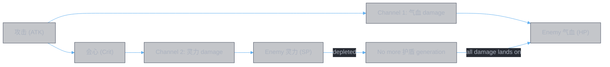

### Damage Channel Principle

Against a stronger opponent, single-channel damage is inefficient — they have large enough pools and mitigation to absorb it. Dual-channel attacks force the enemy to defend two resource pools simultaneously:

- **气血-only damage**: Enemy uses 守御 + 灵力-generated shields to absorb. Sustainable defense.
- **会心 + 气血 damage**: Enemy loses 灵力 (shield generation) while also losing 气血. Once 灵力 is drained, defense collapses — shields stop forming, and all subsequent damage (from 灵书 AND weapons) hits bare 气血.

This principle drives Slot 1's design and the core A vs B decision.

### Slot 1 Design Intent

Slot 1 (t=0) has a unique role: it fires first, before any buffs, debuffs, or weapon ramp-up. Its components must justify themselves at t=0 with no external support.

**Option A (春黎剑阵): Dual-Channel Attacker + Weapon Doubling**

Slot 1A provides self-sufficient offensive output on two channels, amplified by 心逐神随 ×4:

| Component | Channel 1: 气血 | Channel 2: 灵力 | Weapon Support |
|-----------|----------------|-----------------|----------------|
| 春黎剑阵 base (22305% atk) | ✓ Direct HP damage | — | — |
| 心逐神随 ×4 | ×4 HP damage | ×4 crit/SP damage | ×4 clone stats (assumed) |
| 灵犀九重 (guaranteed 会心 2.97x) | — | **✓ Drains SP directly** | — |
| 分身 clone (16s, +200% dmg) | Mirrors all hits | Mirrors all crits | **✓ Doubles weapon output** |

At t=0, with 4x peak roll:

- **气血 channel**: 89220% atk burst + clone continuing HP damage for 16s
- **灵力 channel**: 89220% × 2.97x = ~265k% crit damage to SP + clone replicating crit pressure for 16s
- **Weapon channel**: Clone doubles the entire weapon system output for t=0~16

This is not purely "Route 2" (weapon support) — it's a hybrid. The 灵书 does significant self-damage on two fronts while simultaneously doubling weapon output. The dual-channel pressure at t=0 forces the enemy into a resource crisis before the weapon system has even ramped up.

**Option B (大罗幻诀): Weapon Enabler**

Slot 1B sacrifices the SP damage channel to instead strip the enemy's defenses for the weapon system:

| Component | Channel 1: 气血 | Channel 2: 灵力 | Weapon Support |
|-----------|----------------|-----------------|----------------|
| 大罗幻诀 base (20265% atk) | ✓ Direct HP damage | — | — |
| 心逐神随 ×4 | ×4 HP damage | — | ×4 DoT values |
| 心魔惑言 ×2 stacks | — | — | ×2 debuffs for weapon amp |
| 罗天魔咒 counter + 命損 | DoTs on attacker | — | **✓ -100% enemy 最终伤害减免** |

Option B has no 会心 component — it operates entirely on the 气血 channel. The trade-off is explicit:

| | A: 春黎剑阵 | B: 大罗幻诀 |
|---|---|---|
| **灵力 pressure** | ✓ Drains SP via guaranteed crit | ✗ No SP damage |
| **Weapon amplification** | Clone doubles output (passive) | -100% enemy reduction (active, 8s) |
| **Self-sufficiency** | High — two channels, no dependency | Low — value depends on weapon system |
| **Against passive enemy** | Clone + crit pressure regardless | 罗天魔咒 doesn't trigger |
| **Against aggressive enemy** | Clone absorbs hits | Counter-DoTs punish attacker |

### The A vs B Decision

The choice is not "which is better" but "where does Slot 1's damage budget go":

- **Option A** allocates Slot 1's budget to the 灵书's own dual-channel output. The weapon system still benefits (clone doubling), but the primary value is the SP drain + HP burst at t=0. Best when: the 灵书's self-damage on two channels is more threatening than what the weapon system would gain from reduction shredding.

- **Option B** allocates Slot 1's budget entirely to weapon enablement. 命損 -100% 最终伤害减免 means every weapon hit for 8s lands at full power — no mitigation. Best when: the weapon system is strong enough that unmitigated weapon damage (for 8s) exceeds the value of 16s of dual-channel 灵书 pressure.

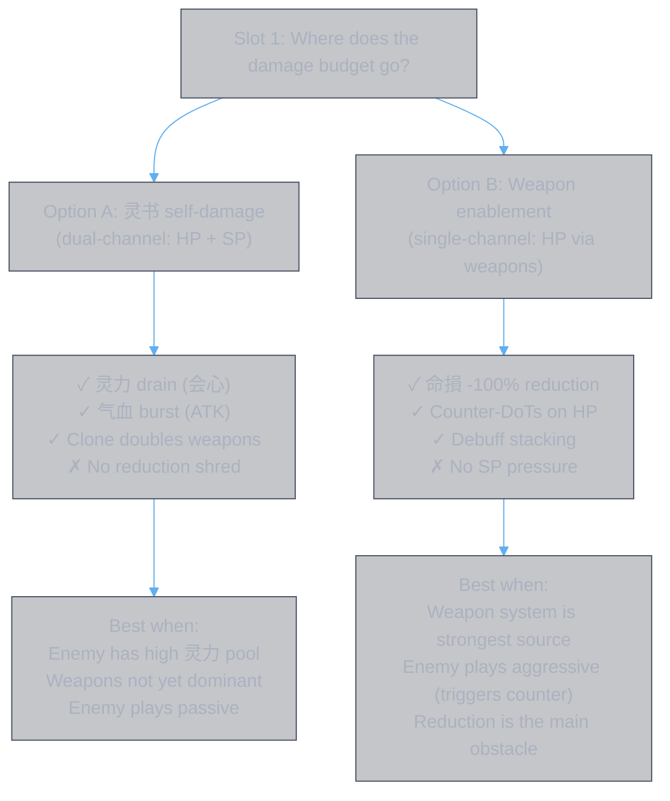

### Route Classification: Hybrid, Not Pure Route 2

The doc previously framed Set 1 as "Route 2: Aid Weapons." This undersells the design. In practice:

| Slot | Route 1 (self-damage) | Route 2 (weapon support) |
|------|----------------------|-------------------------|
| **Slot 1 (A)** | **✓ Dual-channel burst (HP + SP)** | ✓ Clone doubles weapons |
| Slot 2 | — | ✓ Shield strip for weapons |
| Slot 3 | — | ✓ +280% atk buff for weapons |
| Slot 4 | — | ✓ Permanent debuff amp for all sources |
| Slot 5 | — | ✓ Defense + damage amp |
| Slot 6 | ✓ Standalone finisher | ✓ Late buff for weapons |

Slot 1 (Option A) and Slot 6 are both hybrids — they do significant self-damage while also supporting weapons. Slots 2–5 are pure Route 2. The build's actual strategy is: **Slot 1 opens on two channels to force a resource crisis, Slots 2–5 systematically enable the weapon system during its peak, Slot 6 closes as an independent finisher that reads the debuff state.**

### Dimension Coverage

With the attribute foundation established, each slot's dimension maps to a specific combat system interaction:

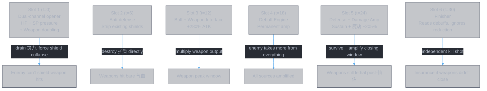

Note how Slots 1 and 2 work together on the defensive resource system: Slot 1 drains 灵力 (preventing new shield generation), Slot 2 destroys existing 护盾 (removing current shields). By t=6, the enemy's entire shield system is compromised — both the generator (灵力) and the existing shields (护盾) are stripped. Every weapon hit from t=6 onward lands on bare 气血.

### Open Questions

1. **Defense gap t=0~12**: No buffs, no counter-heal. Option A's clone provides distraction; Option B's counter punishes aggression. Neither fully closes the window.

2. **Weapon interface is single-point**: Only Slot 3 (奇能诡道) directly interfaces with weapon procs. Slots 1, 4, 5, 6 provide generic effects (buff, debuff, damage amp) that benefit weapons but don't specifically leverage weapon mechanics. Whether a second weapon-interface slot would improve overall output depends on available affix combinations.

3. **会心 channel sustainability**: Slot 1's SP pressure is front-loaded (t=0 burst + 16s clone). After the clone dies, no further 灵力 pressure is applied. If the enemy's 灵力 pool is large enough to survive the initial drain, the dual-channel advantage fades. Whether this matters depends on the matchup.

### Per-Slot Objectives

#### Slot 2 (t=6) — Objective: **Anti-defense**

> **Job**: Remove enemy defensive layers so weapon damage lands unmitigated. Shields absorb weapon hits — stripping them early means weapons deal real damage from t=6 onward. DoT creates a dispel dilemma: cleanse the DoT and eat 18000% burst + stun, or let it tick.

| Component | Serves objective? | How |
|-----------|------------------|-----|
| 皓月剑诀 main skill | ✓ | 10 hits, each destroys a shield + 12% maxHP damage; double damage if no shield — systematically removes shields |
| 碎魂剑意 (主词缀) | ✓ | Recurring DoT based on shields destroyed — continues stripping even after cast ends (4s) |
| 玄心剑魄 (辅1 春黎剑阵) | ✓ | 噬心 DoT 16s (悟10): 3000%atk/s sustained damage. Dispel trap: 18000% burst + 3s stun if cleansed — forces enemy to choose: eat the DoT or eat the burst |
| 无极剑阵 (辅2 无极御剑诀) | ✓ | +555% 神通伤害, -350% 神通伤害减免 (net +205% assuming additive formula) — amplifies all shield-stripping and DoT damage |

**Weapon service**: After Slot 2 fires, enemy shields are stripped and they face a dispel dilemma. Weapon hits from t=6 onward land on bare HP instead of shields.

#### Slot 3 (t=12) — Objective: **Buff + Weapon Synergy**

> **Job**: This is the most critical slot for weapon support. Activate the main buff timed exactly to the weapon peak window (t=12~24). Every weapon hit during this window benefits from +280% atk. 奇能诡道 directly interfaces with the weapon system — weapon procs trigger debuff duplication and enemy reduction shred.

| Component | Serves objective? | How |
|-----------|------------------|-----|
| 甲元仙符 main skill | ✓ | 仙佑 +70% atk/def/HP (12s) — the core weapon-amplifying buff |
| 天光虹露 (主词缀) | ✓ | +190% healing bonus (悟8) — extends survivability dimension; heals from all sources (weapons included) amplified |
| 龙象护身 (辅1 浩然星灵诀) | ✓ | Buff strength ×4 → 仙佑 becomes +280% atk/def/HP — the amplifier |
| 奇能诡道 (辅2 周天星元) | ✓ | 93.5% debuff duplication + 逆转阴阳 (-0.7× enemy reduction) — the weapon interface. When weapons apply 减益 or 伤害加深类增益, 奇能诡道 doubles the debuff or shreds enemy reduction |

**Weapon service**: Direct amplification (+280% atk to all weapon hits) + direct interface (奇能诡道 leverages weapon procs). This is the bridge between 灵书 and weapon systems.

**Timing rationale**: Weapons peak at t=12~24. 仙佑 lasts exactly 12s from t=12. Perfect alignment.

#### Slot 4 (t=18) — Objective: **Debuff Engine**

> **Job**: Apply permanent damage amplification that benefits ALL damage sources for the rest of the fight. Every weapon hit, every DoT tick, every proc — all deal more damage because 结魂锁链 makes the enemy take more. The permanent DoT also provides a baseline DPS floor that can't be removed.

| Component | Serves objective? | How |
|-----------|------------------|-----|
| 天魔降临咒 main skill | ✓ | 结魂锁链: permanent, +5.25% damage taken, +0.5% per debuff stack (cap 4%) — universal damage amp for all sources |
| 魔念生息 (主词缀) | ✓ | Permanent 1.6% maxHP/s DoT — unremovable baseline damage; raises 结魂锁链 cap to 4% |
| 追神真诀 (辅1 皓月剑诀) | ✓ | +26.5% lost HP per DoT tick + 50% maxHP boost + 300% damage increase (悟10) — amplifies the DoT engine |
| 天魔真解 (辅2 梵圣真魔咒) | ✓ | DoT tick rate ×2 (50.5% interval reduction) — doubles DoT DPS; the extender for the DoT dimension |

**Weapon service**: 结魂锁链's "enemy takes +X% more damage" applies to weapon damage too. More debuffs stacked = more damage from everything. The permanent DoT also counts as a debuff for 索心真诀's per-debuff scaling at Slot 6.

**Pattern**: amplify (追神真诀 +300% dmg) + extend (天魔真解 ×2 tick rate) on the permanent DoT. Same amplify+extend pattern as Slot 3's buff.

#### Slot 5 (t=24) — Objective: **Defense + Damage Amp**

> **Job**: Two roles. (1) Keep you alive from t=24 onward so weapons have time to finish — 仙佑 just expired, weapons are still dealing damage. (2) Stack more debuffs and apply massive damage amplification (魔劫 +205%) that benefits all damage sources including weapons during the closing window.

| Component | Serves objective? | How |
|-----------|------------------|-----|
| 天刹真魔 main skill | ✓ Defense | 不灭魔体: permanent 8% counter-heal — core sustain after 仙佑 expires |
| 魔妄吞天 (主词缀) | ✓ Defense + Debuff | 天人五衰: rotating stat shred (-50% crit rate/dmg, -23% atk/reduction) — weakens enemy, indirect defense |
| 心魔惑言 (辅1 天轮魔经) | ✓ Debuff | ×2 debuff stacks on 天人五衰 and 魔劫 — more stacks for 结魂锁链 and 索心真诀 scaling |
| 无相魔威 (辅2 无相魔劫咒) | ✓ Damage Amp | 魔劫 8s: **+105/205% damage amp to ALL sources** + 40.8% heal cut. Covers t=24~32 including Slot 6 and weapon hits |

**Weapon service**: 魔劫's +205% damage amp applies to weapon hits during t=24~32. 天人五衰 reduces enemy atk/crit — enemy deals less damage to you, buying more time for weapons. 心魔惑言 doubles all debuff stacks, feeding 结魂锁链's per-debuff amp.

**Key insight**: Slot 5 is not just "defense" — 无相魔威's +205% damage amp is one of the strongest weapon-supporting effects in the entire set. It bridges the gap after 仙佑 expires.

#### Slot 6 (t=30) — Objective: **Finisher + Late Buff**

> **Job**: Close out what weapons haven't killed. The build's insurance policy — if the enemy survives the full weapon rotation, this standalone burst reads all accumulated debuffs and ignores all remaining defenses. Also provides a late buff window (怒灵降世 +20% atk, 7.5s) for any weapon damage during the finisher.

| Component | Serves objective? | How |
|-----------|------------------|-----|
| 十方真魄 main skill | ✓ Finisher | 10 hits + 16% lost HP burst + self-heal recovery — standalone nuke |
| 星猿弃天 (主词缀) | ✓ Sustain | Extend 怒灵降世 to 7.5s + periodic cleanse — survive the finisher window |
| 索心真诀 (辅1 惊蜇化龙) | ✓ Debuff Reader | 2.1% enemy maxHP **true damage** per debuff stack (cap 10 = 21%) — harvests all debuffs from Slots 4-5 |
| 神威冲云 (辅2 通天剑诀) | ✓ Anti-defense | Ignore ALL damage reduction + 36% damage — nothing stops this |

**Weapon service**: 怒灵降世 (+20% atk + reduction, 7.5s) buffs weapon damage during the finisher window. The finisher itself provides cleanup, but weapons are still firing — they benefit from the late buff and from the enemy's debuff-stacked, reduction-stripped state.

**Design**: Slot 6 is self-contained by design. It doesn't depend on 仙佑 (expired), doesn't need prior buffs — 索心真诀 reads enemy debuffs (guaranteed from Slot 4-5), 神威冲云 ignores reduction (no dependency). This is intentional: as the last resort, it must work regardless of what happened before.

### Dimension Gap Analysis

| Dimension | Covered by | Weapon service | Gap? |
|-----------|-----------|---------------|------|
| **Pressure / Counter** | Slot 1 (clone 16s or counter-reflection) | Buy time for weapon ramp | ✓ t=0~16 |
| **Anti-defense** | Slot 2 (shield strip, dispel trap) | Remove shields so weapons hit bare HP | ✓ t=6 |
| **Buff** | Slot 3 (仙佑 ×4, t=12~24) | +280% atk to weapon hits during peak | ⚠️ Expires at t=24, weapons after this unbuffed |
| **Weapon interface** | Slot 3 (奇能诡道) | Debuff duplication + reduction shred from weapon procs | ✓ On-cast at t=12 |
| **Debuff engine** | Slot 4 (permanent 结魂锁链 + DoT) | Universal damage amp for all sources | ✓ t=18 onward, permanent |
| **Defense** | Slot 5 (不灭魔体 permanent, stat shred) | Keep alive so weapons can work | ⚠️ t=0~24 has no dedicated defense (仙佑 passive defense t=12~24) |
| **Damage amp** | Slot 5 (魔劫 +205%, t=24~32) | All weapon hits +205% during closing window | ✓ Bridges 仙佑 expiry |
| **Heal suppression** | Slot 5 (魔劫 -40.8% heal) | Prevent enemy from outhealing weapon damage | ✓ t=24~32 |
| **Healing** | Slot 3 (+760% healing bonus, t=12~24), Slot 5 (8% counter-heal, permanent) | Keep alive | ⚠️ 仙佑 healing expires t=24; counter-heal "不受治疗加成影响" |
| **Finisher** | Slot 6 (standalone, ignores reduction, reads debuffs) | Insurance kill | ✓ Self-contained |

### Key Gaps

1. **Buff gap after t=24**: 仙佑 expires. Weapons lose +280% atk. 魔劫's +205% damage amp partially compensates, but it's a different multiplicative zone — not the same as raw atk boost. No good fix without 仙露护元 (which loses to 奇能诡道 in practice).

2. **Defense gap t=0~12**: No buffs, no counter-heal. If Slot 1 uses 大罗幻诀 (Option B), this gap is partially addressed — enemy attacking you during this window hurts themselves. If Slot 1 uses 春黎剑阵 (Option A), the clone provides distraction but not defense.

3. **Weapon interface is single-point**: Only Slot 3 (奇能诡道) directly interfaces with the weapon system. All other slots provide generic effects (buff, debuff, damage amp) that happen to benefit weapons, but don't specifically leverage weapon procs. Is this enough, or should more slots have weapon-specific synergies?

---

## Variation A — Weapon Doubling (Detailed Analysis)

### Slot 1 — 金光真剑：`春黎剑阵` (Sword)

**主技能**：剑化万千，破空位移向前，对范围内目标造成五段共计x%攻击力的灵法伤害，并创建一个持续存在16秒的分身，继承自身y%的属性。主角释放神通后分身会攻击敌方，分身受到的伤害为自身的z%
悟10境，融合83重，修炼24阶： x=22305, y=54, z=400

**主词缀【幻象剑灵】**：分身受到伤害降低至自身的x%，造成的伤害增加y%
融合重数>=50: x=120, y=200

**辅位1 — `解体化形`（专属）【心逐神随】**：本神通施放时，会使本次神通所有效果x%概率提升4倍，y%概率提升3倍，z%概率提升2倍
悟0境，融合50重：x=11, y=31, z=51
悟2境，融合63重：x=60, y=80, z=100

**辅位2 — `千锋聚灵剑`（修为）【灵犀九重】**：使本神通必定`会心`造成x倍伤害，并有y%概率将之提升至z倍
融合重数>=50：x=2.97, y=25, z=3.97

### Slot 2 — 洪荒真剑：`皓月剑诀` (Sword)

**主技能**：剑墓既出，天地低昂，一剑出，诸天寂灭。对范围内目标造成十段共计x%攻击力的灵法伤害，神通释放时自身获得增益状态【寂灭剑心】：每段伤害命中时湮灭敌方1个护盾，并额外造成y%敌方最大气血值的伤害（对怪物最多造成z%攻击力的伤害）；对无盾目标造成双倍伤害（对怪物最多造成w%攻击力的伤害）；【寂灭剑心】上限1层，持续4秒
悟10境，融合57重，修炼24阶： x=22305, y=12, z=2400, w=4800

**主词缀【碎魂剑意】**：【寂灭剑心】每0.5秒对目标造成`湮灭护盾`的总个数\*600%攻击力的伤害（若触发`湮灭护盾`效果时敌方无护盾加持，则计算湮灭2个护盾）

**辅位1 — `春黎剑阵`（专属）【玄心剑魄】**：本神通施放后，会对敌方添加持续w秒的【噬心】：每秒受到x%攻击力的伤害，若被驱散，立即受到y%攻击力的伤害，并眩晕z秒
悟0境，融合50重：w=8, x=550, y=3300, z=2
悟10境，融合83重：w=16, x=3000, y=18000, z=3

**辅位2 — `无极御剑诀`（专属）【无极剑阵】**：本神通攻击目标时提升x%`神通伤害`，但目标对本神通提升y%`神通伤害减免`
融合50重：x=555, y=350

### Slot 3 — 风花真法：`甲元仙符` (Spell)

**主技能**：天书尽开，降下神威天光，对范围内目标造成x%攻击力的灵法伤害，释放神通时自身获得【仙佑】状态，提升自身y%攻击力加成、守御加成、最大气血值，持续12秒
悟1境，融合51重：x=1500, y=70
悟7境，融合51重：x=20310, y=70
悟8境，融合51重：x=21090, y=70

**主词缀【天光虹露】**：【仙佑】状态额外使自身获得x%治疗加成
悟1境，融合51重：x=70
悟7境，融合51重：x=170
悟8境，融合51重：x=190

**辅位1 — `浩然星灵诀`（专属）【龙象护身】**：使本神通添加的`增益`效果强度提升x%
融合52重：x=300

**辅位2 — `周天星元`（专属）【奇能诡道】**：
1. 当本神通为敌方添加`减益`状态时，有x%概率额外多附加1层该减益状态
2. 若本神通施加`伤害加深类`（神通伤害加深/技能伤害加深/最终伤害加深）`增益`状态时，则会额外对目标施加负面状态【逆转阴阳】：敌方会减少y倍触发属性的伤害减免类效果，持续时间与触发的增益状态相同
悟1境，融合20重：x=20, y=0.6
悟2境，融合50重：x=93.5, y=0.7

> 【龙象护身】×4 buff strength → 仙佑 becomes +280% atk/def/HP (12s base duration)
>
> 【奇能诡道】— 甲元仙符 itself does not apply 减益 or 伤害加深类增益. However, in full combat (灵书 + 法宝 + other weapons), weapon procs during the cast window can trigger 奇能诡道's effects. In practice, 风花真法 outperforms 伏魔真法 (念剑诀/仙露护元 variant with 48s buff duration), suggesting 奇能诡道 leveraging the broader combat system provides more total value than extended 仙佑 duration alone.

### Slot 4 — 九阳真魔言：`天魔降临咒` (Demon)

**主技能**：对目标造成五段共x%攻击力的灵法伤害，并对其施加【结魂锁链】：使受到的伤害减少y%，敌方受到的伤害增加z%，锁定目标具有的每层（个）减益效果会使敌方受到的伤害额外提升w%，最多提升至u%
【结魂锁链】战斗状态内永久生效，最多叠加1层
x=1500, y=5.2, z=5.25, w=0.5, u=2

**主词缀【魔念生息】**：敌方处于【结魂锁链】下，每秒受到x%最大气血值的伤害，并且【结魂锁链】提升敌方受到的伤害上限提升至y%
x=1.6, y=4

**辅位1 — `皓月剑诀`（专属）【追神真诀】**：
1. 本神通所添加的持续伤害触发时，额外造成目标x%已损失气血值的伤害
2. 本神通附加目标最大气血的伤害提高y%，并且造成的伤害提升z%
悟0境, 融合50重：x=26.5, y=0, z=0
悟10境，融合50重：x=26.5, y=50, z=300

**辅位2 — `梵圣真魔咒`（专属）【天魔真解】**：使本神通添加的持续伤害效果触发间隙缩短x%
融合50重：x=50.5

### Slot 5 — 浮云真魔典：`天刹真魔` (Demon)

**主技能**：对目标进行攻击，造成五段共x%攻击力的灵法伤害，并为自身添加【不灭魔体】：受到伤害时，自身恢复该次伤害损失气血值的y%的气血值（该效果不受治疗加成影响）
【不灭魔体】战斗状态内永久生效
x=1500, y=8

**主词缀【魔妄吞天】**：在【不灭魔体】状态下受到攻击时，为目标附加【天人五衰】：每3秒轮流降低目标x%致命率、x%暴击伤害、x%暴击率、y%攻击力、y%最终伤害减免，持续15秒
x=50, y=23

**辅位1 — `天轮魔经`（专属）【心魔惑言】**：使本神通添加的`减益`状态层数增加x%，敌方每有5层减益状态会使本神通所有伤害提升y%，最大提升z%（持续伤害效果受一半伤害加成）
*注*：25层能达到最大提升伤害
融合50重：x=100, y=5.5, z=27.5

**辅位2 — `无相魔劫咒`（专属）【无相魔威】**：本神通命中时，对目标施加负面状态【魔劫】，持续8秒
【魔劫】：降低敌方x%的治疗量，并使神通造成的伤害提升y%，若目标不存在任何治疗状态，伤害提升效果进一步提升至z%
融合50重：x=40.8, y=105, z=205

### Slot 6 — 造化真灵：`十方真魄` (Body)

**主技能**：借星灵之力快速接近目标，消耗自身x%当前气血值，对目标造成十段共y%攻击力的灵法伤害，在神通的最后会对踢向目标，额外对其造成自身z%已损失气血值的伤害，并`等额恢复自身气血`，同时为自身添加【怒灵降世】：持续期间提升自身w%的攻击力与伤害减免，持续4秒
x=10, y=1500, z=16, w=20

**主词缀【星猿弃天】**：延长x秒【怒灵降世】持续时间，并且每秒有y%概率驱散自身所有`控制状态`，25秒内最多触发1次驱散状态
x=3.5, y=30

**辅位1 — `惊蜇化龙`（专属）【索心真诀】**：
1. 本神通造成伤害时，目标每有1层`减益`状态，会使本次额外造成目标x%最大气血值的真实伤害，最多造成y%最大气血值的真实伤害
*注*：10层能达到最大气血值的真实伤害
2. 在`神通悟境`的条件下：本神通附加自身已损气血的伤害提高z%，并使造成的伤害提升w%
融合50重：x=2.1, y=21, z=50, w=75

**辅位2 — `通天剑诀`（专属）【神威冲云】**：使本神通无视敌方所有伤害减免效果，并提升x%伤害
融合50重：x=36

---

### A: Effect Timeline (6s intervals)

```mermaid
%%{init: {'theme': 'base', 'themeVariables': {'primaryColor': '#3e44514D', 'primaryTextColor': '#abb2bf', 'primaryBorderColor': '#4b5263', 'lineColor': '#61afef', 'secondaryColor': '#2c313a4D', 'secondaryTextColor': '#abb2bf', 'secondaryBorderColor': '#4b5263', 'tertiaryColor': '#282c344D', 'mainBkg': '#3e44514D', 'nodeBorder': '#4b5263', 'clusterBkg': '#2c313a4D', 'clusterBorder': '#4b5263', 'titleColor': '#e5c07b', 'edgeLabelBackground': '#282c34', 'textColor': '#abb2bf', 'background': '#282c34'}}}%%
gantt
    title Effect Duration Timeline (Set 1, 6s intervals)
    dateFormat X
    axisFormat %s

    section Slot Casts
    Slot1 春黎剑阵           :milestone, 0, 0
    Slot2 皓月剑诀           :milestone, 6, 0
    Slot3 风花真法            :milestone, 12, 0
    Slot4 天魔降临咒          :milestone, 18, 0
    Slot5 天刹真魔            :milestone, 24, 0
    Slot6 十方真魄            :milestone, 30, 0

    section Slot 1 Effects
    分身 clone +200% dmg     :active, 0, 16
    心逐神随 4x proc         :crit, 0, 1
    灵犀九重 crit 2.97x      :crit, 0, 1

    section Slot 2 Effects
    寂灭剑心 shield destroy  :active, 6, 10
    噬心 DoT 悟10 (16s)      :active, 6, 22

    section Slot 3 Effects
    仙佑 +280% atk/def/HP   :crit, 12, 24
    奇能诡道 weapon procs    :active, 12, 13

    section Slot 4 Effects
    结魂锁链 +dmg/debuff     :crit, 18, 36
    魔念生息 1.6% maxHP/s    :crit, 18, 36

    section Slot 5 Effects
    不灭魔体 8% counter-heal :crit, 24, 36
    天人五衰 stat shred      :active, 24, 36
    魔劫 +105/205% dmg       :active, 24, 32

    section Slot 6 Effects
    怒灵降世 +20% atk/red   :active, 30, 37
```

> Slot 4–6 effects marked as extending to 36s+ represent permanent effects (结魂锁链, 魔念生息, 不灭魔体) that last the entire fight.

### A: Slot-to-Slot Chains

#### Slot 1 → Slot 2 (t=0~6)

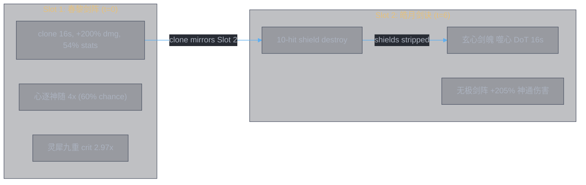

#### Slot 3 → Slot 4 (t=12~18)

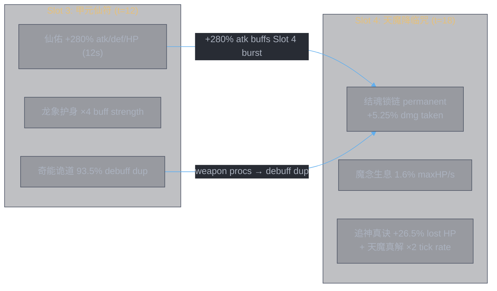

#### Slot 4 → Slot 5 (t=18~24)

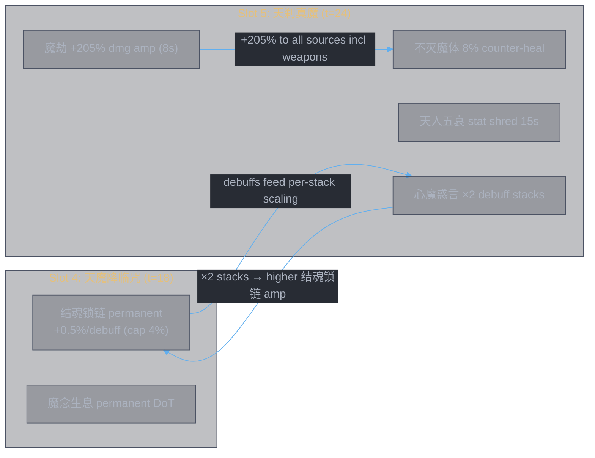

#### Slot 5 → Slot 6 (t=24~30)

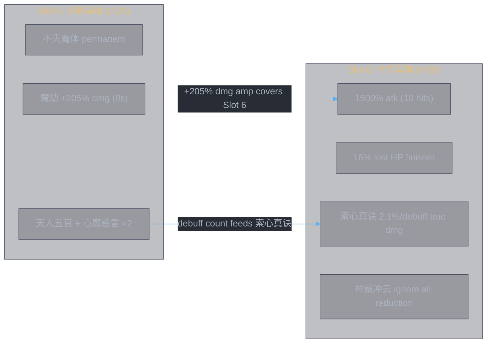

### A: 仙佑 ×4 Per-Slot Impact

仙佑 (增益状态): +70% atk/defense/maxHP, 12s base duration
- 龙象护身: buff strength ×4 → **+280% atk, +280% defense, +280% maxHP**
- 天光虹露: +190% healing bonus (悟8), ×4 → **+760% healing bonus**
- Duration: 12s (t=12 to t=24, covers Slots 3–4, edge of 5)

#### Slot 4 — 天魔降临咒 (t=18, 仙佑 active ✓)

| 仙佑 stat | Scales what | Impact |
|-----------|-------------|--------|
| **+280% atk** | base_attack 1500% atk (5 hits) | Direct burst ×3.8 |
| **+280% atk** | 追神真诀 +300% damage increase | Multiplies on top of buffed atk |
| +280% maxHP | — | 魔念生息 uses *enemy* maxHP, doesn't scale |
| +280% defense | survivability | Tanking during DoT phase |
| +760% healing | — | No heals on this slot |

#### Slot 5 — 天刹真魔 (t=24, 仙佑 razor edge ⚠️)

仙佑 expires at t=24, Slot 5 fires at t=24 — depends on cast animation timing.

| 仙佑 stat | Scales what | Impact (if still active) |
|-----------|-------------|--------|
| **+280% atk** | base_attack 1500% atk (5 hits) | Direct burst ×3.8 |
| **+280% maxHP** | HP pool for 不灭魔体 | More HP to absorb → more counter-heal triggers |
| **+280% defense** | damage reduction | Tank slot survives much longer |
| +760% healing | — | 魔骨明心 not used in this build (exclusive slot taken by 心魔惑言/真言不灭) |

#### Slot 6 — 十方真魄 (t=30, 仙佑 expired ✗)

| 仙佑 stat | Scales what | Impact |
|-----------|-------------|--------|
| — | — | 仙佑 has expired; Slot 6 relies on its own mechanics |

十方真魄 fights without 仙佑, but has: 怒灵降世 (+20% atk/reduction), 索心真诀 (true dmg per debuff, enemy maxHP-based), 神威冲云 (ignore all reduction). These are mostly enemy-stat-based or self-contained, so they work well independently.

### A: Phase Structure

**Phase 1 — Burst (t=0~16)**: Slots 1-2 fire with clone amplification. 心逐神随 4x + 灵犀九重 guaranteed crit on Slot 1. Clone mirrors Slot 2's 10-hit shield-destroyer. 噬心 DoT pressures dispel (18000% burst + 3s stun if dispelled).

**Phase 2 — Buff + Weapon Synergy (t=12~18)**: Slot 3 fires 仙佑 ×4 (+280% atk/def/HP, 12s). 奇能诡道 leverages weapon procs for debuff duplication and 逆转阴阳 reduction shred. Clone is still alive until t=16, amplifying Slot 3's damage.

**Phase 3 — Debuff Engine (t=18~24)**: Slot 4 applies permanent 结魂锁链 (damage scales with debuff count). 魔念生息 starts ticking 1.6% maxHP/s. 追神真诀 adds 26.5% lost HP to each DoT tick. 天魔真解 halves DoT intervals. 仙佑 ×4 buff still active.

**Phase 4 — Attrition + Finish (t=24~30+)**: 仙佑 expires around t=24. Slot 5 天刹真魔 adds permanent counter-heal + stat shred. 魔劫 from 无相魔威 amps all damage +105/205% for 8s. Slot 6 十方真魄 finishes with 神威冲云 (ignore ALL reduction) + 索心真诀 (2.1% maxHP true dmg per debuff stack) — these are enemy-stat-based mechanics that work independently of 仙佑.

---

### A: Debuff Accumulation Model

索心真诀 (Slot 6) deals 2.1% enemy maxHP true damage per debuff stack (cap 10 stacks = 21%). 结魂锁链 (Slot 4) increases damage per debuff stack (+0.5% per stack, cap 4%). Both scale with how many debuffs are on the enemy when Slot 6 fires at t=30.

### A: Debuff Sources by Slot

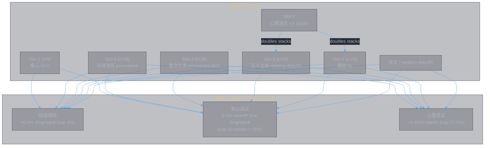

### A: Debuff Count at t=30 (Slot 6)

| Debuff | Applied at | Still alive at t=30? | Stacks | With 心魔惑言 ×2 |
|--------|-----------|---------------------|--------|------------------|
| 噬心 DoT | t=6 | 悟0: ✗ (expired t=14) / 悟10: ✗ (expired t=22) | 0 | 0 |
| 结魂锁链 | t=18 | ✓ permanent | 1 | 1 (not from Slot 5) |
| 魔念生息 DoT | t=18 | ✓ permanent | 1 | 1 (not from Slot 5) |
| 天人五衰 | t=24+ on-hit | ✓ 15s duration, still rolling | 1-5 (rotating) | ×2 from 心魔惑言 |
| 魔劫 | t=24 | ✓ expires t=32 | 1 | ×2 from 心魔惑言 |
| 法宝 debuffs | various | depends on weapon | ? | possibly doubled |

**Conservative estimate (灵书 only, no 法宝)**:
- 结魂锁链 (1) + 魔念生息 (1) + 天人五衰 (2-4 with ×2) + 魔劫 (2 with ×2) = **6-8 stacks**
- 索心真诀: 6-8 × 2.1% = **12.6-16.8% enemy maxHP** as true damage
- 结魂锁链 damage amp: capped at 4% (reached at 8 stacks × 0.5%)

**With 法宝 debuffs**: Could easily reach 10+ stacks → 索心真诀 at cap (**21% enemy maxHP true damage**) + 结魂锁链 capped at 4%.

> 心魔惑言's ×2 stack doubling only applies to Slot 5's debuffs (天人五衰, 魔劫). Earlier debuffs (结魂锁链, 魔念生息) are from Slot 4 and not doubled. 法宝 debuffs timing determines if they're doubled.

---

### A: Vulnerability Windows

### A: Timeline with Defensive States

```mermaid
%%{init: {'theme': 'base', 'themeVariables': {'primaryColor': '#3e44514D', 'primaryTextColor': '#abb2bf', 'primaryBorderColor': '#4b5263', 'lineColor': '#61afef', 'secondaryColor': '#2c313a4D', 'secondaryTextColor': '#abb2bf', 'secondaryBorderColor': '#4b5263', 'tertiaryColor': '#282c344D', 'mainBkg': '#3e44514D', 'nodeBorder': '#4b5263', 'clusterBkg': '#2c313a4D', 'clusterBorder': '#4b5263', 'titleColor': '#e5c07b', 'edgeLabelBackground': '#282c34', 'textColor': '#abb2bf', 'background': '#282c34'}}}%%
gantt
    title Defensive Coverage (Set 1)
    dateFormat X
    axisFormat %s

    section Slot Casts
    Slot1           :milestone, 0, 0
    Slot2           :milestone, 6, 0
    Slot3           :milestone, 12, 0
    Slot4           :milestone, 18, 0
    Slot5           :milestone, 24, 0
    Slot6           :milestone, 30, 0

    section Defensive Buffs
    仙佑 +280% def/HP         :crit, 12, 24
    不灭魔体 8% counter-heal   :active, 24, 36
    怒灵降世 +20% reduction    :active, 30, 37

    section Offensive Pressure
    分身 clone pressure        :done, 0, 16
    噬心 dispel trap           :done, 6, 22
    天人五衰 stat shred        :done, 24, 36

    section Vulnerability
    EXPOSED t=0~12            :crit, 0, 12
    GAP t=24 仙佑→不灭魔体    :crit, 23, 25
```

### A: Window Analysis

**Window 1 — t=0 to t=12 (EXPOSED)**: No defensive buffs active. You rely on base stats only. The clone (分身) provides offensive pressure to keep the opponent busy, but you're vulnerable to burst. If the opponent has a strong opener, this is when you're most at risk.

> This is the main reason 风花真法 stays at Slot 3 (t=12) instead of Slot 1 (t=0). Moving it to t=0 would close this window but open a larger one at t=12-24 when the debuff engine needs protection.

**Window 2 — t=24 transition (RAZOR EDGE)**: 仙佑 expires at t=24, 不灭魔体 activates at t=24. If the timing is tight and there's a gap between the buff expiring and the counter-heal registering, there's a brief moment of exposure. In practice this is likely negligible — both happen at the same slot transition.

**Window 3 — t=24 to t=30 (PARTIAL)**: 不灭魔体 is active (8% counter-heal) but 仙佑's +280% defense/HP is gone. You're relying on base defense + counter-heal. 天人五衰 starts shredding the enemy's damage output, which acts as indirect defense.

**Window 4 — t=30+ (COVERED)**: 怒灵降世 (+20% atk + reduction, 7.5s) + 不灭魔体 + 星猿弃天 (30%/s cleanse chance). This is the most protected window — you have counter-heal, damage reduction, and cleanse.

### A: Set 2 Vulnerability (玄煞灵影诀)

Set 2 is **much more exposed** from t=24 onward:
- No 不灭魔体 counter-heal
- 玄煞灵影诀 actively burns 4%/s of your own HP (怒意滔天)
- No 魔劫 heal cut on enemy → opponent can heal through your damage
- You're racing: can 怒意滔天's DPS + Slot 6's finisher kill before you die?

| Window | Set 1 (天刹真魔) | Set 2 (玄煞灵影诀) |
|--------|------------------|---------------------|
| t=0~12 | Exposed (same) | Exposed (same) |
| t=12~24 | 仙佑 ×4 (strong) | 仙佑 ×4 (strong) |
| t=24~30 | 不灭魔体 (sustained) | **Self-burning, no heal** (vulnerable) |
| t=30+ | 不灭魔体 + 怒灵降世 | **Self-burning + 怒灵降世** (partial) |

> Set 2's vulnerability at t=24~30 is the trade-off for the higher damage output. The 天威煌煌 +128% 神通伤害加深 forwarded to Slot 6 must make the finisher lethal enough to close the fight before the self-burn kills you.

---

## Variation B — Counter-Reflection (Detailed Analysis)

Variation B changes Slot 1 and Slot 5. Slots 2, 3, 4, 6 are identical to Variation A — refer to those sections above.

### B: Slot 1 — `大罗幻诀` (Demon)

**主技能**：对目标进行攻击，造成五段共x%攻击力的灵法伤害，并为自身添加【罗天魔咒】：受到伤害时，各有30%概率对攻击方添加1层【噬心之咒】与【断魂之咒】，各自最多叠加5层。【罗天魔咒】持续8秒
【噬心之咒】：每0.5秒额外造成目标y%当前气血值的伤害，持续4秒
【断魂之咒】：每0.5秒额外造成目标y%已损失气血值的伤害，持续4秒
悟0境，融合20重：x=1500, y=2
悟10境，融合50重：x=20265, y=7

**主词缀【魔魂咒界】**：【罗天魔咒】状态下附加异常概率提升至60%，受到攻击时，额外给目标附加【命损】：`最终伤害减免`减低x%，持续8秒
悟0境，融合20重：x=46
悟10境，融合52重：x=100

**辅位1 — `解体化形`（专属）【心逐神随】**：本神通施放时，会使本次神通所有效果x%概率提升4倍，y%概率提升3倍，z%概率提升2倍
悟0境，融合50重：x=11, y=31, z=51
悟2境，融合63重：x=60, y=80, z=100

**辅位2 — `天轮魔经`（专属）【心魔惑言】**：使本神通添加的`减益`状态层数增加x%，敌方每有5层减益状态会使本神通所有伤害提升y%，最大提升z%（持续伤害效果受一半伤害加成）
*注*：25层能达到最大提升伤害
融合50重：x=100, y=5.5, z=27.5

#### B: Slot 1 Affix-Skill Synergy

| 副词缀 | Effect | 大罗幻诀 triggers it? | How |
|--------|--------|----------------------|-----|
| 心逐神随 4x | "本次神通所有效果" multiplied | **✓** | base_attack ×4, 噬心之咒/断魂之咒 7%→28%, 命損 values amplified |
| 心魔惑言 ×2 stacks | "本神通添加的减益状态层数增加100%" | **✓** | 噬心之咒, 断魂之咒, 命損 are all enemy 减益 — stacks doubled |
| 心魔惑言 per-debuff dmg | "敌方每有5层减益状态，伤害提升5.5%" | **✓** | Reads all enemy debuffs |

> Both affixes fully active. 大罗幻诀 is a debuff-heavy skill — every effect targets the enemy as 减益.

#### B: Slot 1 Combined Effect (悟10, 心逐神随 4x + 心魔惑言 ×2)

| Effect | Base (悟10) | ×4 (心逐神随) | ×2 stacks (心魔惑言) | Combined |
|--------|------------|--------------|---------------------|----------|
| base_attack | 20265% atk | 81060% atk | — | 81060% atk opening hit |
| 噬心之咒 per tick | 7% current HP/0.5s | 28% current HP/0.5s | ×2 per proc (cap 5) | **28%/0.5s × 5 stacks** |
| 断魂之咒 per tick | 7% lost HP/0.5s | 28% lost HP/0.5s | ×2 per proc (cap 5) | **28%/0.5s × 5 stacks** |
| 命損 | -100% 最终伤害减免 | -100% (capped) | ×2 stacks | -100% reduction shred (8s) |
| 罗天魔咒 proc rate | 60% (with 魔魂咒界) | assumed not multiplied (state property, needs in-game test) | — | 60% per hit taken |
| 罗天魔咒 duration | 8s | — | — | 8s |

**Weapon service**: 命損 -100% 最终伤害减免 means every weapon hit lands at full power from t=0. Enemy has zero damage reduction while 罗天魔咒 is active. Window is 8s (t=0~8).

### B: Slot 5 — 浮云真魔典：`天刹真魔` (Demon) — modified aux

Same main skill and 主词缀 as Variation A. Only 辅位1 changes:

**辅位1 — `疾风九变`（专属）【真言不灭】** replaces `天轮魔经`（心魔惑言）：使本神通添加的`所有状态`持续时间延长x%
融合50重：x=55

**辅位2 — `无相魔劫咒`（专属）【无相魔威】**（unchanged）

#### B: Slot 5 Affix-Skill Synergy

| 副词缀 | Effect | 天刹真魔 triggers it? | Impact |
|--------|--------|----------------------|--------|
| 真言不灭 +55% ALL state duration | "所有状态持续时间延长55%" | **✓** | 天人五衰 15s→23.25s, 魔劫 8s→12.4s |
| 无相魔威 魔劫 | "本神通命中时施加魔劫 8s" | **✓** | +105/205% dmg amp + 40.8% heal cut → 12.4s with 真言不灭 |

> Both affixes fully active. 真言不灭 compensates for losing 心魔惑言 ×2 by extending debuff durations — different approach (longer windows vs more stacks) to the same goal of maximizing debuff uptime.

#### B: Slot 5 Duration Comparison (vs Variation A)

| Effect | A: 心魔惑言 | B: 真言不灭 | Trade-off |
|--------|------------|------------|-----------|
| 天人五衰 | 15s, ×2 stacks | 23.25s, ×1 stacks | B: longer window, fewer stacks |
| 魔劫 | 8s, ×2 stacks | 12.4s, ×1 stacks | B: 魔劫 covers t=24→36.4 (past Slot 6) |
| Slot 5 per-debuff dmg | +5.5%/5 stacks, cap 27.5% | — (lost) | A: more Slot 5 self-damage |
| Weapon benefit | More stacks → higher 结魂锁链 amp | Longer 魔劫 +205% window for weapons | B: weapons benefit from +205% for 4.4s longer |

### B: Effect Timeline

> Slots 2-4, 6 are identical to Variation A. Only Slot 1 (NEW) and Slot 5 (MODIFIED) differ.

```mermaid
%%{init: {'theme': 'base', 'themeVariables': {'primaryColor': '#3e44514D', 'primaryTextColor': '#abb2bf', 'primaryBorderColor': '#4b5263', 'lineColor': '#61afef', 'secondaryColor': '#2c313a4D', 'secondaryTextColor': '#abb2bf', 'secondaryBorderColor': '#4b5263', 'tertiaryColor': '#282c344D', 'mainBkg': '#3e44514D', 'nodeBorder': '#4b5263', 'clusterBkg': '#2c313a4D', 'clusterBorder': '#4b5263', 'titleColor': '#e5c07b', 'edgeLabelBackground': '#282c34', 'textColor': '#abb2bf', 'background': '#282c34'}}}%%
gantt
    title Effect Duration Timeline (Variation B)
    dateFormat X
    axisFormat %s

    section Slot Casts
    Slot1 大罗幻诀           :milestone, 0, 0
    Slot2 皓月剑诀           :milestone, 6, 0
    Slot3 风花真法            :milestone, 12, 0
    Slot4 天魔降临咒          :milestone, 18, 0
    Slot5 天刹真魔            :milestone, 24, 0
    Slot6 十方真魄            :milestone, 30, 0

    section Slot 1 Effects (NEW)
    罗天魔咒 counter (8s)    :crit, 0, 8
    命損 -100% reduction     :crit, 0, 8
    噬心之咒 28%/0.5s (cap 5) :active, 0, 8
    断魂之咒 28%/0.5s (cap 5) :active, 0, 8

    section Slot 2 Effects
    寂灭剑心 shield destroy  :active, 6, 10
    噬心 DoT 悟10 (16s)      :done, 6, 22

    section Slot 3 Effects
    仙佑 +280% atk/def/HP   :crit, 12, 24
    奇能诡道 weapon procs    :active, 12, 13

    section Slot 4 Effects
    结魂锁链 +dmg/debuff     :crit, 18, 36
    魔念生息 1.6% maxHP/s    :crit, 18, 36

    section Slot 5 Effects (MODIFIED)
    不灭魔体 8% counter-heal :crit, 24, 36
    天人五衰 23.25s          :active, 24, 36
    魔劫 +205% (12.4s)       :active, 24, 36

    section Slot 6 Effects
    怒灵降世 +20% atk/red   :active, 30, 37
```

### B: Slot Chains (diffs from A)

> Slots 3→4 and 4→5 chains are identical to Variation A. Only the changed chains are shown.

#### B: Slot 1 → Slot 2 (t=0~6)

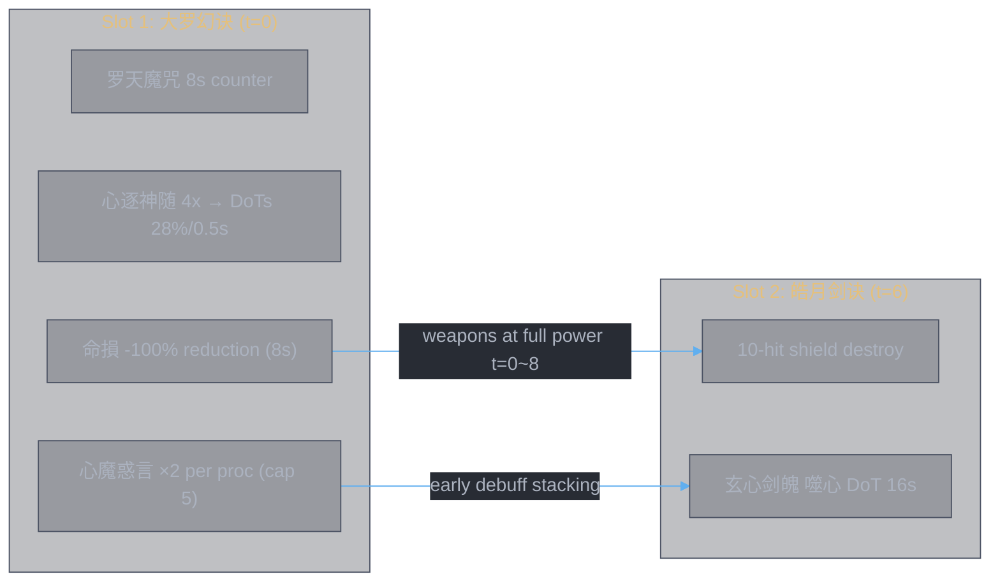

#### B: Slot 5 → Slot 6 (t=24~30)

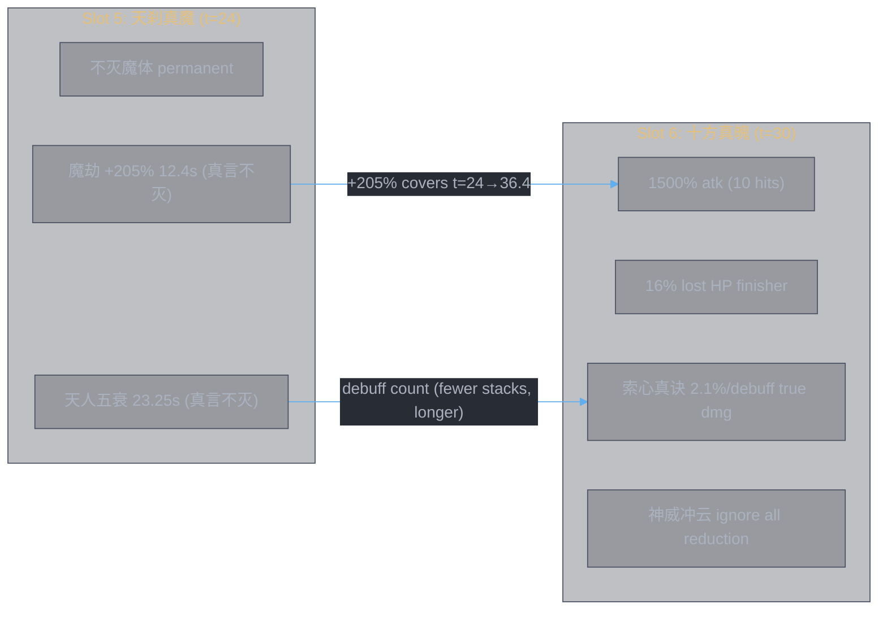

### B: Debuff Accumulation at t=30

| Debuff | Source | Still alive at t=30? | Stacks | Notes |
|--------|--------|---------------------|--------|-------|
| 噬心之咒 (大罗) | Slot 1 (t=0) | ✗ expired (4s DoT, applied during 8s window) | 0 | Short-lived, value is in early damage |
| 断魂之咒 (大罗) | Slot 1 (t=0) | ✗ expired | 0 | Same |
| 命損 | Slot 1 (t=0) | ✗ expired at t=8 | 0 | 8s only — weapons benefit early |
| 噬心 (皓月) | Slot 2 (t=6) | ✗ expired t=22 | 0 | — |
| 结魂锁链 | Slot 4 (t=18) | ✓ permanent | 1 | — |
| 魔念生息 | Slot 4 (t=18) | ✓ permanent | 1 | — |
| 天人五衰 | Slot 5 (t=24) | ✓ 23.25s → expires t=47.25 | 1-5 (rotating) | ×1 stacks (no 心魔惑言) |
| 魔劫 | Slot 5 (t=24) | ✓ 12.4s → expires t=36.4 | 1 | ×1 stacks |
| 法宝 debuffs | various | depends | ? | — |

**Conservative estimate (灵书 only)**:
- 结魂锁链 (1) + 魔念生息 (1) + 天人五衰 (1-5) + 魔劫 (1) = **4-8 stacks**
- 索心真诀: 4-8 × 2.1% = **8.4-16.8% enemy maxHP** true damage

> Fewer stacks than Variation A (6-8) because no 心魔惑言 ×2 on Slot 5's debuffs. But Variation B's debuffs last longer (天人五衰 23.25s vs 15s, 魔劫 12.4s vs 8s), and the early-game 命損 -100% reduction provides value that doesn't show up in Slot 6 debuff counts.

### B: Vulnerability Windows

```mermaid
%%{init: {'theme': 'base', 'themeVariables': {'primaryColor': '#3e44514D', 'primaryTextColor': '#abb2bf', 'primaryBorderColor': '#4b5263', 'lineColor': '#61afef', 'secondaryColor': '#2c313a4D', 'secondaryTextColor': '#abb2bf', 'secondaryBorderColor': '#4b5263', 'tertiaryColor': '#282c344D', 'mainBkg': '#3e44514D', 'nodeBorder': '#4b5263', 'clusterBkg': '#2c313a4D', 'clusterBorder': '#4b5263', 'titleColor': '#e5c07b', 'edgeLabelBackground': '#282c34', 'textColor': '#abb2bf', 'background': '#282c34'}}}%%
gantt
    title Defensive Coverage (Variation B)
    dateFormat X
    axisFormat %s

    section Slot Casts
    Slot1           :milestone, 0, 0
    Slot2           :milestone, 6, 0
    Slot3           :milestone, 12, 0
    Slot4           :milestone, 18, 0
    Slot5           :milestone, 24, 0
    Slot6           :milestone, 30, 0

    section Defensive Buffs
    罗天魔咒 counter-punish  :active, 0, 8
    命損 -100% enemy reduction :crit, 0, 8
    仙佑 +280% def/HP         :crit, 12, 24
    不灭魔体 8% counter-heal   :active, 24, 36
    怒灵降世 +20% reduction    :active, 30, 37

    section Vulnerability
    GAP t=8~12 (no counter, no buff) :crit, 8, 12
    GAP t=24 仙佑→不灭魔体    :crit, 23, 25
```

**B vs A vulnerability comparison:**

| Window | A: 春黎剑阵 | B: 大罗幻诀 |
|--------|------------|------------|
| t=0~8 | Exposed (clone distracts) | **Covered** — 罗天魔咒 punishes attackers + 命損 strips enemy reduction |
| t=8~12 | Exposed (clone still alive) | **Exposed** — 罗天魔咒 expired, no buffs. But enemy is DoT'd and reduction-stripped |
| t=12~24 | 仙佑 ×4 (same) | 仙佑 ×4 (same) |
| t=24~30 | 不灭魔体 (same) | 不灭魔体 (same) |
| t=30+ | 不灭魔体 + 怒灵降世 (same) | 不灭魔体 + 怒灵降世 (same) |

> Variation B trades the clone's 16s distraction for 8s of active counter-punishment. Against aggressive opponents who attack early, B is stronger (they hurt themselves). Against passive opponents, A's clone provides pressure regardless. The gap at t=8~12 is B's weak point, but the enemy should be dealing with DoTs and reduced defenses from the counter phase.

---

## Variation A vs B — Comparison Summary

| Dimension | A: Weapon Doubling | B: Counter-Reflection |
|-----------|-------------------|----------------------|
| **Slot 1 main** | 春黎剑阵 (clone 16s) | 大罗幻诀 (counter-reflection 8s) |
| **Slot 1 weapon service** | Clone doubles entire weapon output for 16s | 命損 -100% reduction → weapons at full power for 8s |
| **Slot 5 辅位1** | 天轮魔经（心魔惑言 ×2 stacks） | 疾风九变（真言不灭 +55% duration） |
| **Slot 5 debuff approach** | More stacks (×2) | Longer duration (+55%) |
| **Early fight (t=0~12)** | Clone pressure + weapon doubling | Counter-reflection + reduction shred |
| **Mid fight (t=12~24)** | Same (仙佑 + debuff engine) | Same |
| **Late fight (t=24+)** | 魔劫 8s, 天人五衰 15s | 魔劫 12.4s, 天人五衰 23.25s |
| **Debuff count at t=30** | 6-8 stacks (with ×2) | 4-8 stacks (no ×2, but longer duration) |
| **索心真诀 true dmg** | 12.6-16.8% maxHP | 8.4-16.8% maxHP |
| **Best against** | Passive opponents; front-loaded weapons | Aggressive opponents; weapons needing reduction shred |

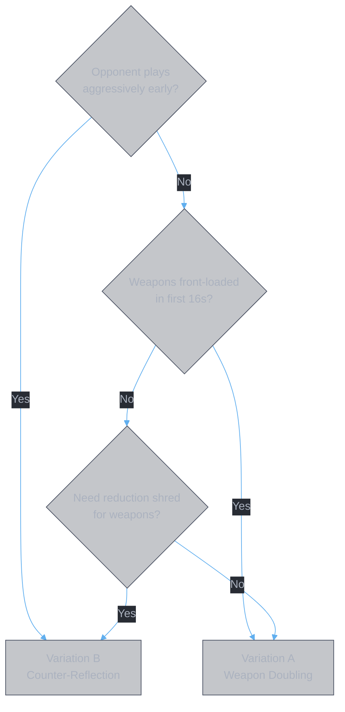

---

## Set 2 Deep Dive (vs weaker opponent) — Slot 5 Swap

Set 2 swaps Slot 5 from `天刹真魔` to `玄煞灵影诀` for a damage race against weaker opponents. Slots 1-4 and 6 are shared with Set 1.

### Slot 5 — `玄煞灵影诀` (Body) + `无相魔劫咒`（专属）+ `新-青元剑诀`（专属）

**主技能**：通灵星辰巨猿之影，星辰巨猿与自身同时位移向前，分别对目标进行攻击，造成四段共x%攻击力的灵法伤害，并为自身添加【怒意滔天】：自身每秒损失y%的当前气血值，并每秒对目标造成自身z%已损气血值和期间消耗气血的伤害。【怒意滔天】战斗状态内永久生效，最多叠加1层。
悟1境，融合51重：x=18255, y=4, z=11

**主词缀【星猿之怒】**：【怒意滔天】每造成4次伤害，额外附加x%自身已损气血值和期间消耗气血值的伤害
悟1境，融合51重：x=12

**辅位1 — `无相魔劫咒`（专属）【无相魔威】**：本神通命中时，对目标施加负面状态【魔劫】，持续8秒
【魔劫】：降低敌方x%的治疗量，并使神通造成的伤害提升y%，若目标不存在任何治疗状态，伤害提升效果进一步提升至z%
融合50重：x=40.8, y=105, z=205

**辅位2 — `新-青元剑诀`（专属）【天威煌煌】**：本神通施放后，使下一个施放的神通额外获得x%的`神通伤害加深`
融合40重：x=128

### Affix-Skill Synergy

| 副词缀 | Effect | 玄煞灵影诀 triggers it? | How |
|--------|--------|------------------------|-----|
| 无相魔威 魔劫 | "本神通命中时施加魔劫 8s" | **✓** | 玄煞灵影诀 hits (4 hits) → applies 魔劫 |
| 天威煌煌 +128% | "下一个神通额外获得128%神通伤害加深" | **✓** | Unconditional, forwards to Slot 6 |

Both affixes fully active. No waste.

> **Why not 天轮魔经（心魔惑言）?** 心魔惑言's ×2 debuff stacking requires "本神通添加的减益状态" — but 玄煞灵影诀 applies zero enemy debuffs. 怒意滔天 is a self-burn state, not an enemy debuff. The ×2 stacking would be completely dead. 无相魔劫咒 replaces it with 魔劫 (+205% damage amp + 40.8% heal cut) which fully triggers on hit.

### How Set 2 Slot 5 Works

玄煞灵影诀 serves two roles simultaneously:

**1. Self-burn DPS (permanent):** 怒意滔天 costs 4%/s current HP but deals 11% lost HP/s damage to enemy. 星猿之怒 adds +12% lost HP burst every 4 ticks. This is a damage race — you burn yourself to burn the enemy faster.

**2. Finisher setup:** 魔劫 +205% damage amp covers t=24~32 (including Slot 6 at t=30). 天威煌煌 +128% 神通伤害加深 forwards directly to Slot 6. The self-burn also grows the 已损 pool — by t=30 (6s later), ~24% additional current HP is lost, feeding 十方真魄's 16% lost HP finisher.

### Slot 5 → Slot 6 Chain

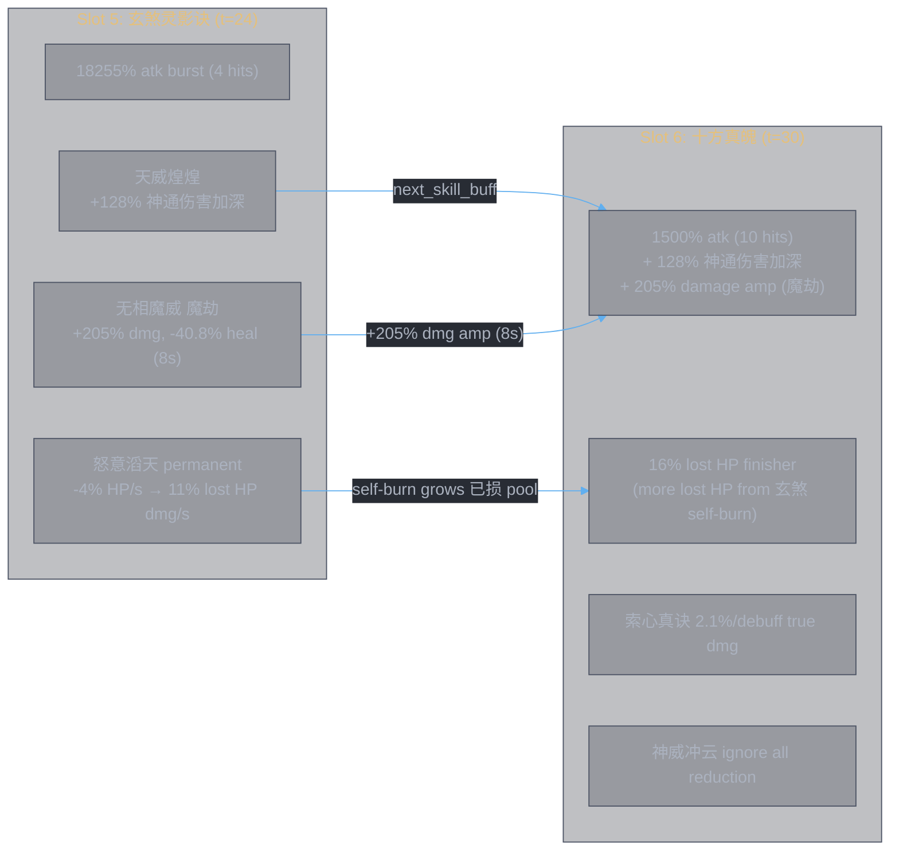

### What Set 2 Trades vs Set 1

| Lost (天刹真魔) | Gained (玄煞灵影诀) |
|-----------------|-------------------|
| 不灭魔体 permanent counter-heal | 怒意滔天 permanent self-burn DPS |
| 天人五衰 stat shred | 魔劫 +205% damage amp + heal cut |
| 心魔惑言 ×2 debuff stacking | 天威煌煌 +128% 神通伤害加深 to Slot 6 |
| Survivability | Damage race |

### When to Use Set 1 vs Set 2

| Scenario | Best Set | Why |
|----------|----------|-----|
| Opponent can kill you | Set 1 (天刹真魔) | 不灭魔体 + 仙佑 ×4 defense keeps you alive |
| You can kill opponent | Set 2 (玄煞灵影诀) | Self-burn DPS + 魔劫 +205% + 天威煌煌 +128% to finisher |
| Opponent has strong heals | Set 2 | 魔劫 -40.8% heal cut now on this set too |
| Opponent is tanky (high reduction) | Set 2 | 天威煌煌 +128% multiplicative zone + 神威冲云 ignores reduction |
