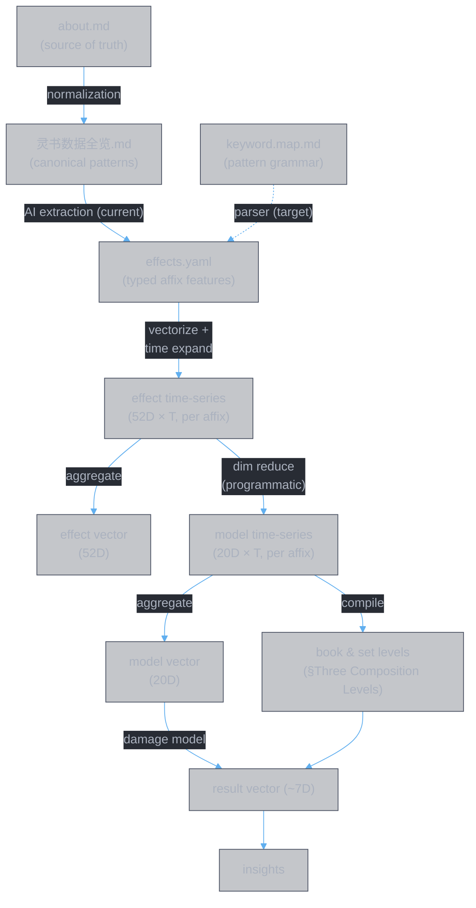
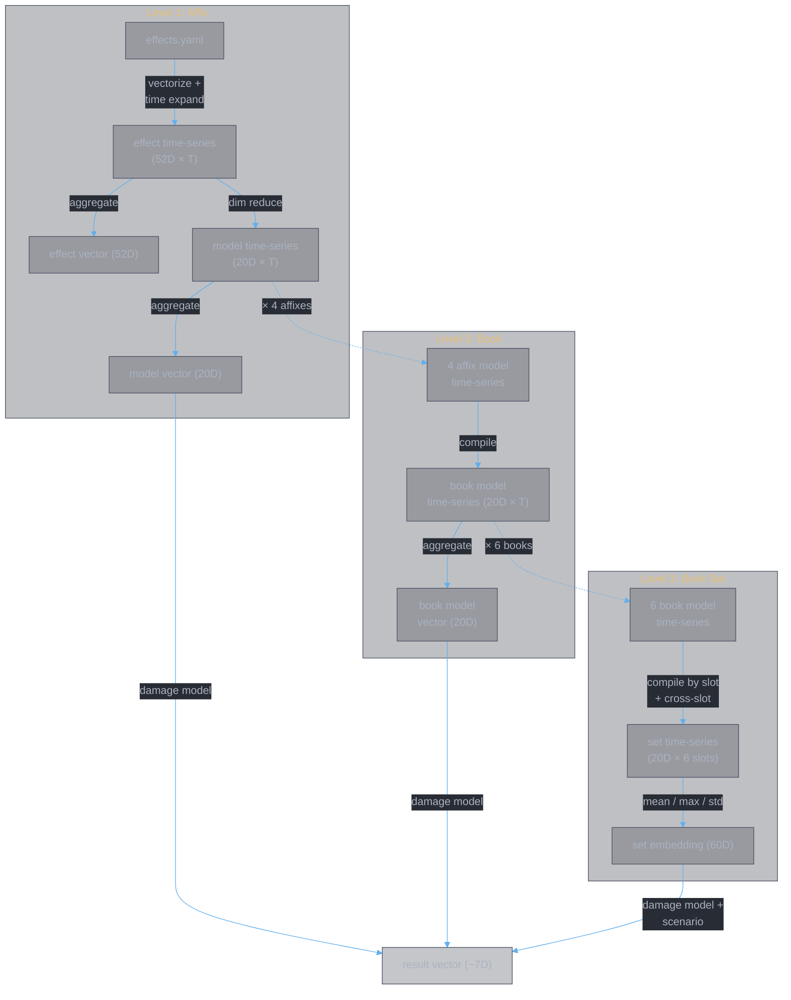

<style>
body {
  max-width: none !important;
  width: 95% !important;
  margin: 0 auto !important;
  padding: 20px 40px !important;
  background-color: #282c34 !important;
  color: #abb2bf !important;
  font-family: -apple-system, BlinkMacSystemFont, "Segoe UI", Helvetica, Arial, sans-serif !important;
  line-height: 1.6 !important;
  -webkit-print-color-adjust: exact !important;
  print-color-adjust: exact !important;
}

h1, h2, h3, h4, h5, h6 {
  color: #ffffff !important;
}

a {
  color: #61afef !important;
}

code {
  background-color: #3e4451 !important;
  color: #e5c07b !important;
  padding: 2px 6px !important;
  border-radius: 3px !important;
}

table {
  border-collapse: collapse !important;
  width: auto !important;
  margin: 16px 0 !important;
  table-layout: auto !important;
  display: table !important;
}

table th,
table td {
  border: 1px solid #4b5263 !important;
  padding: 8px 10px !important;
  word-wrap: break-word !important;
}

table th:first-child,
table td:first-child {
  min-width: 60px !important;
}


table th {
  background: #3e4451 !important;
  color: #e5c07b !important;
  font-size: 14px !important;
  text-align: center !important;
}

table td {
  background: #2c313a !important;
  font-size: 12px !important;
  text-align: left !important;
}

blockquote {
  border-left: 3px solid #4b5263;
  padding-left: 10px;
  color: #5c6370;
}

strong {
  color: #e5c07b;
}
</style>

# 灵书系统设计

**Authors:** Z. Zhang & Claude Sonnet 4.5 (Anthropic)

> This document captures the logical foundation of the 灵书 project.
> Its purpose is to preserve the reasoning across sessions —
> **why** the system is built this way, not just **how** it works.

---

## Why This Project Exists

The 灵书 project builds a **vector representation** of 功法书 affixes and books.
The goal is to enable:

1. **Similarity analysis** — find affixes/books that produce similar combat outcomes
2. **Clustering** — discover natural groupings in the design space
3. **Classification** — categorize affixes by role and effect
4. **GCG pattern extraction** — surface game design patterns to be formalized in the GCG axiomatic framework

This is not a game simulator. It is a tool for studying the game's design.

---

## The Data Pipeline

```
about.md  (single source of truth, volatile wording)
  ↓  [normalization — variant expressions → canonical patterns]
灵书数据全览.md  (normalized canonical form)
  ↓  [current: AI extraction | target: deterministic parser using keyword.map.md regex]
effects.yaml  (typed affix features — data, not vectors)
  ↓  [vectorize + time expand]
effect time-series  (52D × T, per affix)
  ├→ [aggregate along time axis] → effect vector  (52D, per affix)
  └→ [programmatic dim reduce]
     model time-series  (20D × T, per affix)
       ├→ [aggregate] → model vector  (20D, per affix)
       └→ [compile: book and set levels — see §Three Composition Levels]
            → result vector  (~7D)
               → insights
```



### about.md — Single Source of Truth

`剑九/about.md` is the authoritative reference for all game mechanics. All numbers,
conditions, and effect descriptions originate here. When about.md and effects.yaml
disagree, about.md wins.

### Why effects.yaml Exists

`effects.yaml` is the **structured data** form of about.md. This is the architectural
pivot point of the entire pipeline: once game mechanics are extracted into structured
typed objects, all downstream operations become **deterministic code** — no AI needed.

```
about.md (natural language — human-readable, not computable)
  ↓  [AI extraction — the ONLY step requiring AI]
effects.yaml (structured typed data — machine-readable, computable)
  ↓  [EffectsDataSchema validation — Zod gate]
  ↓  [validateAboutConsistency — name matching gate]
  ↓  [deterministic code — no AI]
  ├→ toModelTimeSeries()  → time-series vectors (20D × T)
  ├→ toModelVector()      → flat model vectors (20D)
  ├→ generateVectorDatabase() → full vector database
  └→ (future) optimization, similarity search, clustering
```

The boundary is clear: **AI is used once** to cross the natural-language-to-structured-data
gap. Everything after effects.yaml is algorithmic. This is why effects.yaml exists — it
makes the entire downstream pipeline possible without AI involvement.

**Target architecture:** The normalization layer (`灵书数据全览.md`) and `keyword.map.md`'s regex patterns together enable a deterministic parser to replace AI extraction. In this model:
- Normalization absorbs about.md's wording variance into stable patterns
- keyword.map.md regex matches patterns → produces Effect[] + model vector contributions
- effects.yaml becomes a generated cache, not a maintained source
- model-vector.ts's switch cases become derivable from keyword.map.md's model mapping column

Three design constraints ensure this works:

1. **Typed vocabulary** — `effect.types.md` defines the only allowed effect types. Every
   AI extraction session must use these types, ensuring consistency across sessions. Without
   this, one session calls an effect `damage_increase` and another calls it `atk_bonus` —
   the resulting data is incompatible.

2. **Zod schema** — `lib/schemas/effects.ts` defines `EffectsDataSchema`, the structural
   contract for effects.yaml. Every entry must have a stable `id`, every effect must have a
   `type` field, and every `data_state` value must be from the `DataStateEnum` vocabulary.
   The schema is validated on load by `loadEffects()` — malformed data never reaches the
   merge pipeline. This schema is also the contract for the AI extraction agents
   (`lingshu-effects`, `lingshu-inspect`).

3. **Completeness** — every field required by downstream code (hits, duration, tick_interval,
   value, etc.) must be present in effects.yaml. If a field is missing, the algorithmic
   pipeline cannot compute the correct time-series.

### The Join Key

The join key between the markdown structure layer and effects.yaml is the
**Chinese name** — bare, no brackets, no backticks. The same name must appear in both.

---

## The Vector Pipeline

### Three Vector Levels

| Level | What it represents | Approx. dimensions |
|-------|-------------------|---------------------|
| Effect vector | What types of effects exist and when they fire | 52D |
| Model vector | Parameters feeding the damage model | 20D |
| End result vector | Actual combat outcomes | ~7D |

The end result vector is what makes embedding meaningful — two affixes that produce
similar outcomes through different mechanisms should cluster together, regardless of
how they achieve those outcomes.

### End Result Vector Dimensions

Derived from studying `about.md`:

| Dimension | Example source |
|-----------|---------------|
| ATK-scaled damage | Base skill damage, 摧云折月 |
| %max_HP true damage | 紫心真诀, 千锋聚灵剑 per-segment |
| DoT damage | 噬心之咒, 断魂之咒, 雷阵剑影 |
| Reflected damage | 疾风九变's 极怒 |
| Self sustain / healing | 十方真魄's equal heal, 星猿复灵 |
| Anti-heal | 天哀灵涸, 天倾灵枯, 魔劫 |
| Delayed burst | 无相魔劫咒's on-expire damage |

This list may not be exhaustive. Additional dimensions should be added as new
mechanics are discovered in about.md.

### The Time Axis Problem

Effects are not instantaneous — they have time structure:

- `base_attack` with n hits fires at t = 0, 1, 2, ..., n−1 seconds
- `dot` with tick_interval fires at t = 0, interval, 2×interval, ...
- `self_buff` with duration d is active over [0, d]
- `delayed_burst` fires at the end of its duration window

The mapping `段 → hits` assumes each 段 = 1 second (implicit, unverified).

This means the effect vector for an affix is not a single point — it is a
**time-series of vectors**. To apply embedding algorithms, this must be aggregated
into a single vector.

### Three Composition Levels

The vector pipeline operates at three hierarchical levels. Each level composes
time-series from the level below, aggregates to a vector, and can produce a
result vector through the damage model.



#### Level 1: Affix

The foundation. Each affix's typed effects are vectorized and expanded along
the time axis to produce the **effect time-series** (52D × T). All downstream
vectors derive from this.

```
effects.yaml (typed features per affix)
  → effect time-series (52D × T)
      ├→ aggregate → effect vector (52D)
      └→ dim reduce (programmatic, 52→20) → model time-series (20D × T)
          └→ aggregate → model vector (20D) → result vector (~7D)
```

- **Effect time-series → effect vector**: Collapse the time axis. Used for
  per-affix similarity search.
- **Effect time-series → model time-series**: Programmatic dimension reduction.
  Maps 52 effect types to 20 combat-meaningful dimensions per time step via
  `embedding.md` §2. This is derived from the effect time-series, not
  re-extracted from about.md.
- **Model time-series → model vector**: Collapse the time axis.
- **Model vector → result vector**: Through the damage model.

#### Level 2: Book (single spirit book)

A spirit book has 4 affix components: skill + primary affix + sub-affix 1 +
sub-affix 2. The book-level pipeline compiles their time-series.

```
4 affix model time-series (skill + primary + sub1 + sub2)
  → compile → book model time-series (20D × T)
      → aggregate → book model vector (20D) → book result vector (~7D)
```

#### Level 3: Book set (6 spirit books)

A set consists of 6 spirit books assigned to slots. The set-level pipeline
compiles book time-series with slot timing and cross-slot temporal effects.

```
6 book model time-series, positioned by slot
  → compile (with cross-slot temporal propagation)
      → set time-series (20D × 6 slots)
          → aggregate (mean / max / std) → set embedding (60D)
              → set result vector (~7D)
```

At this level, temporal effects with sufficient duration propagate from
earlier slots to later ones: s_k = v^self_k + v^received_k. The aggregation
strategy (mean/max/std) is defined in `embedding.md` §4. The set result
vector requires the scenario framework to resolve conditional effects
(see §The Scenario Framework).

---

## The Time Model

### Parameters (both configurable)

| Parameter | Default | Meaning |
|-----------|---------|---------|
| `n` | 6 | Number of slots |
| `x` | 6s | Slot duration — gap between adjacent slot releases (empirically measured) |

### One Cycle

The analysis unit is **one cycle** = n × x seconds.

- Slot k fires at t = (k−1) × x
- Cycle ends at t = n × x = 36s (with defaults)
- Exit state is evaluated at t = nx

A d-second effect from slot k is active over [(k−1)x, (k−1)x + d].
Within the cycle it contributes for min(d, nx − (k−1)x) seconds.
Effects that extend beyond nx are truncated — they do not carry over.

Coverage formula: a d-second effect from slot k covers ⌊d/x⌋ full subsequent
slots, with (d mod x) seconds of partial overlap into the next slot.

### Book Set Structure

Each 灵书 slot = 1 主位 (main) + 2 辅助位 (auxiliary) = 3 功法书.
6 slots = 18 功法书 total.

- 主位 → deterministic 主技能 + 主词缀
- 辅助位 → random draw from each book's 副词缀 pool

### Slot Roles

Established from 叶钦's configuration (the reference opponent / reverse-engineered
benchmark):

| Slot | Role | Function |
|------|------|---------|
| 1 | PREP-BUFF | Stack buffs to amplify subsequent slots |
| 2 | PREP-MULT | Establish damage multipliers |
| 3 | VITAL | Main damage output — benefits from slots 1–2 |
| 4 | ASSIST-A | Supplementary output / debuff exploitation |
| 5 | ASSIST-B | DoT / sustained damage |
| 6 | FINISH | Delayed burst / self-preservation |

Priority: VITAL > PREP > ASSIST.

The damage model per slot (from `theory.md`):

$$D_k = D_{base} \times M_{buff} \times M_{affix} \times M_{debuff}$$

Only persistent states (buffs/debuffs with duration) carry across slots.
Effects scoped to "本神通/本次神通" are slot-local only.

---

## The Scenario Framework

### Fixed Scenario Parameters

| Parameter | Value |
|-----------|-------|
| Mode | PvP |
| Enemy power advantage | y% (configurable) |
| Enemy book set | e.g. `configs/yeqin-combo2.yaml` |
| Player cultivation | Max enlightenment (悟10境) |
| Analysis window | One cycle (nx seconds) |

### Scenario Dimensions

Conditions that affect effect evaluation — must be specified per scenario:

| Dimension | Effects affected |
|-----------|-----------------|
| Enemy HP state | 怒目, 溃魂击瑕, 天倾灵枯 (threshold at 30%) |
| Enemy debuff count | 心魔惑言, 紫心真诀 (scale with stack count) |
| Enemy shield state | 皓月剑诀 (shield destruction + double damage on no-shield) |
| Enemy healing state | 无相魔威 (105% vs 205% damage boost) |
| Enemy controlled | 击瑕, 乘胜逐北 |
| Self HP state | 战意, 吞海, 意坠深渊, 十方真魄, 疾风九变 |
| Self enlightenment level | 追神真诀, 奇能诡道, 魔骨明心, 紫心真诀 (conditional at 悟10境) |

### Circularity and How to Handle It

Some conditions (e.g. enemy HP at time t) depend on how much damage has been
dealt, which depends on those same conditions. Three strategies:

1. **Fix stateless scenarios first** — evaluate effects with no conditional
   dependency as a baseline
2. **Scenario analysis** — define explicit sub-scenarios (enemy stays above 30%
   HP for the whole cycle vs. drops below at t = T for a given T)
3. **Forward simulation within a fixed scenario** — step through time, computing
   outgoing damage → updating enemy HP → resolving conditions → next step,
   until convergence

Strategy 3 is what reintroduces simulation as a tool, nested inside the
scenario analysis outer frame.

---

## Open Questions

### Aggregator Design

At the **set level**, the aggregation strategy is defined: mean/max/std along
the 6-slot time axis (see `embedding.md` §4). This preserves temporal structure
(std encodes burst-vs-sustained).

At the **affix and book levels**, how to collapse the fine-grained time-series
(per-hit, per-tick) into a single vector is less settled. The aggregator must
preserve enough temporal structure to distinguish a front-loaded burst from a
back-loaded DoT. Candidates:

- Simple sum over all time steps
- Weighted sum (positional decay or ramp)
- Area under the time-series curve
- Separate dimensions for coarse time buckets (early / mid / late cycle)

### Damage Model Implementation

The scenario analysis requires a damage model to resolve circular HP dependencies.
The formula in `theory.md` gives the framework (D_k = D_base × M_buff × M_affix × M_debuff)
but a full implementation mapping effect types from effects.yaml to numeric
multipliers does not yet exist.

### End Result Vector Completeness

The 7 dimensions listed above were derived from reading about.md for the 剑九
(剑修) character. Other schools (法修, 魔修, 体修) or future content may introduce
additional outcome dimensions. The list should be treated as provisional.

---

## Document History

| Version | Date | Changes |
|---------|------|---------|
| 1.0 | 2026-02-18 | Initial: vector pipeline, three composition levels, time model, scenario framework, open questions |
| 1.1 | 2026-02-19 | Restructured from tools/ to embedding/ |
| 1.2 | 2026-02-23 | Added normalization layer to pipeline, current/target architecture framing |
