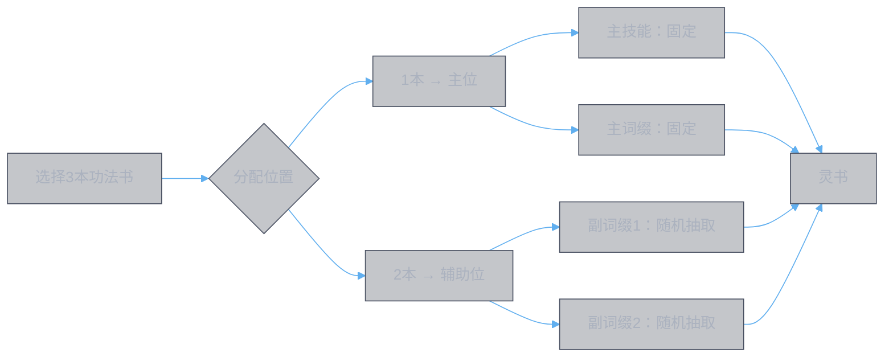
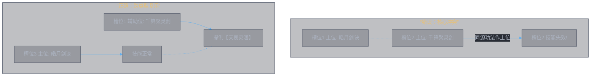

# 灵书系统机制

## 概述
本文档旨在阐明《凡人修仙传人界篇》手游中，灵书系统从创造到生效的核心运行规则。我们将首先解析游戏内实际存在的机制（基于《灵书数据全览》与《about.md》），然后在此基础上，探讨更具策略深度的优化设计可能。

## 1. 当前版本核心规则解析

### 1.1 灵书合成：一本灵书的诞生
每本灵书由三本`人界功法书`（品阶需为仙品及以上）合成，其属性构成如下：
| 组成部分 | 决定因素 | 来源 | 是否随机 |
| :--- | :--- | :--- | :--- |
| **主技能** (神通效果) | 功法书的技能描述、融合重数、悟境等级 | `主位`功法书 | **否**，固定 |
| **主词缀** (质变效果) | 功法书的固定主词缀、悟境等级 | `主位`功法书 | **否**，固定（需悟境解锁）|
| **副词缀** (随机加成) | 从辅助位功法的副词缀池中随机抽取 | `辅助位`功法书 | **是**，随机获得2个 |

**合成流程简述**：

1.  **选择功法书**：挑选1本作为`主位`，2本作为`辅助位`。
2.  **确定属性**：主技能与主词缀由主位书决定；两个副词缀分别从两本辅助位书的词缀池中**独立随机**抽取。
3.  **影响因素**：辅助位功法书的`融合重数`、`悟境等级`、`阶数`会影响高阶词缀（如专属词缀【心逐神随】）的出现概率与解锁状态。

### 1.2 冲突规则：装配的艺术
这是灵书搭配中最关键的约束条件，直接决定了6个灵书槽位能否协同生效。
| 冲突类型 | 触发条件 | 生效规则 | 策略影响 |
| :--- | :--- | :--- | :--- |
| **核心冲突** | 两本灵书的**主技能来源功法**相同。 | **序号大的槽位灵书完全失效，无法施放。** | 绝对禁止。同一本源功法不能作为两个灵书的主位。 |
| **副词缀冲突** | 两本灵书的**某一副词缀来源功法**相同。 | **序号大的槽位，该特定词缀失效，但灵书技能仍可施放。** | 需要权衡。可以牺牲一个低优先级槽位的词缀效果，来换取高优先级槽位的完整技能。 |
| **跨类型复用** | 同一本功法书，在一个槽位作`主位`，在另一个槽位作`辅助位`。 | **无冲突**，两者皆可正常生效。 | 核心技巧。允许玩家重复利用一本强力的功法书，既作为核心技能来源，又作为优质副词缀提供者。 |

**案例说明（基于”叶钦配置”思路）**：
假设玩家希望同时使用`皓月剑诀`（主技能强）和`千锋聚灵剑`（专属词缀【天哀灵涸】反治疗强）。

*   **错误搭配**：两本都放在主位 → 触发**核心冲突**，后一个技能废掉。
*   **正确搭配**：`皓月剑诀`放主位（槽位3输出），`千锋聚灵剑`放辅助位（为槽位1提供【天哀灵涸】词缀）→ **跨类型复用**，无冲突，两者效果共存。

### 1.3 释放机制：固定的战斗序列
在当前版本中，6本灵书按照**装配槽位顺序（1→6）固定释放**，每本灵书释放后进入独立的冷却。

*   **机制**：战斗开始后，系统自动按1、2、3、4、5、6的顺序依次施放灵书技能。
*   **策略局限**：玩家无法控制技能释放时机。这意味着，增益类词缀（如【灵威】：使**下一个**神通伤害加深）必须放在需要被增益的技能**之前**。例如，【灵威】必须在槽位2，才能增益槽位3的主输出技能。

## 2. 前瞻设计：从“固定”到“策略”

当前固定顺序系统简化了操作，但限制了策略深度。一个更优的系统应允许玩家掌控战斗节奏。

### 2.1 释放优化：优先级队列
**设计理念**：用**玩家编程的触发条件**取代固定顺序。
*   **机制**：战前，玩家为每个灵书槽位设置一个`触发条件`（如“战斗开始”、“目标生命低于30%”、“自身释放增益后”）和一个`优先级`。
*   **战斗时**：系统实时检测所有条件，触发条件满足且优先级最高的灵书将自动施放。
*   **战略价值**：
    *   **精准联动**：可确保【灵威】类增益词缀稳定地作用于下一个核心输出技能。
    *   **反应策略**：可设置“生命低于40%时自动施放保命技能”或“目标被控制时施放爆发技能”。
    *   **动态调整**：面对不同敌人，可切换不同的触发方案。

### 2.2 制作优化：分叉树与定向重铸
**设计理念**：用**确定的成长路径**取代完全随机的词缀获取。
*   **分叉树制作**：将副词缀获取设计为一棵决策树。玩家在制作时，面对一系列选择（如“选择通用池->选择攻击向->选择【破竹】”），每步选择消耗材料，最终**确定性地**获得目标词缀。
*   **定向重铸**：允许玩家对已有灵书的**单个辅助位**进行重铸，消耗部分材料，在分叉树上重新选择路径，以替换不满意的副词缀。
*   **战略价值**：
    *   **规划可控**：玩家可以明确规划资源，培养目标配置。
    *   **减少挫败**：消除无意义的重复随机，将投入转化为稳定进度。
    *   **生态健康**：材料需求明确，便于游戏内经济系统设计。

### 2.3 冲突优化：共鸣与补偿
**设计理念**：将**惩罚性冲突**转变为**有代价的协同**。
*   **时序冲突**：冲突判定基于**实际释放顺序**，而非槽位编号。后释放者受影响。
*   **共鸣奖励**：当触发副词缀冲突时，后释放的技能其**非冲突的其他词缀**获得强化（例如×1.3倍效果）。
*   **战略价值**：玩家可以主动进行“战略性共享”。例如，故意在两个槽位使用同一本辅助位书，牺牲一个次要词缀，来换取另一个槽位核心词缀的巨额强化，从而创造出新的构建思路。

## 3. 灵书作为属性插件：底层逻辑

无论系统如何设计，灵书在游戏底层都表现为一套属性修改器的集合。
1.  **词缀即插件**：每个词缀（如【灵威】、【天倾灵枯】）在战斗中被视为一个独立的“属性插件”。
2.  **注册与生效**：灵书装配后，其所有词缀插件在战斗开始时向系统注册。当满足条件（如技能释放、命中、状态触发）时，相应的插件效果被激活。
3.  **冲突即覆盖**：当前的“副词缀冲突”规则，在底层即表现为后注册的相同来源插件失效。
4.  **作用域**：
    *   `本次神通`：仅影响当前释放的灵书技能（如【破竹】）。
    *   `自身`/`目标`：产生一个持续一段时间、影响自身或敌方的状态（如【仙佑】、【灵枯】）。
    *   `下一个神通`：影响紧随其后的一个灵书技能（如【灵威】）。

理解这一底层逻辑有助于预测复杂交互，例如多个全局增益/减益状态的叠加与覆盖关系。

## 总结
当前的灵书系统是一个以**随机性获取（副词缀）**和**固定序列释放**为核心，通过**严格冲突规则**来约束构建的策略体系。玩家需要在随机产出中规划“目标词缀组合”，并巧妙地利用“跨类型复用”来规避冲突，组成有效的6技能循环。

而前瞻性的优化方向，旨在将策略点从“战前构建的随机博弈”更多地转向“战前编程的逻辑编排”与“制作路径的确定性规划”，通过引入**优先级队列**、**分叉树制作**和**共鸣系统**，在保持深度的同时，提升玩家的控制感与策略自由度。

---
**下一步**：掌握了“有什么”（数据全览）、“为什么”（战斗原理）和“系统怎么运作”（系统机制）之后，最后一步就是“怎么做”。接下来，我将撰写最后一篇文档《灵书配置实战指南》，为您提供从开荒到顶配，分职业、分场景的具体配置思路与养成路线图。