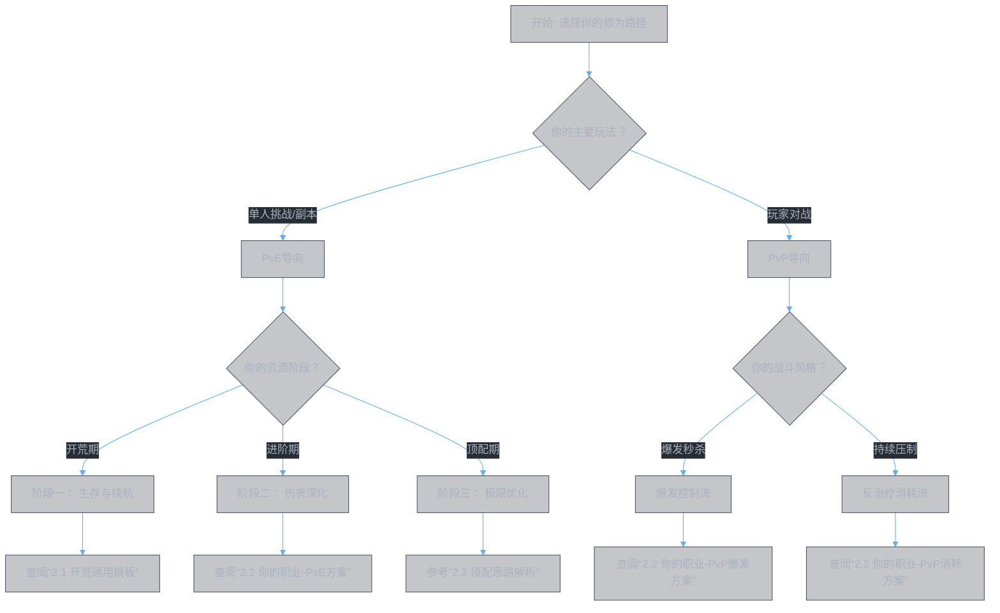

# 灵书配置实战指南

## 概述
本文档是灵书知识体系的终极应用层。它将指导你，如何运用《灵书数据全览》中的素材，遵循《灵书战斗原理》中的逻辑，在《灵书系统机制》的规则约束下，构建出属于自己的最强灵书组合。

我们将遵循一个清晰的决策流程：**确定职业 -> 选择场景 -> 定位阶段 -> 搭建配置**。

## 1. 配置决策总流程图

面对海量的功法书和词缀，按以下路径决策可以快速锁定方向：

## 2. 分职业配置蓝图

### 2.1 开荒通用模板 (适用于所有职业)
在资源有限的开荒期，目标是在冲突规则内凑齐一套能用的6灵书循环，优先保证功能全面和生存。
*   **核心思路**：利用高品阶功法书作为主位，确保基础伤害；辅助位优先选择提供通用生存词缀的功法。
*   **关键词缀目标**：【金汤】(减伤)、【仙灵汲元】(吸血)、【玄女护心】(护盾)、【摧山】(攻击)。
*   **一个简单的6槽位框架示例**：
    1.  **槽位1 (启动)**：选择带控制或减速效果的功法作为主位，辅助位追求【金汤】。
    2.  **槽位2 (增益)**：选择能提供自身攻击或伤害加成buff的功法作为主位。
    3.  **槽位3 (主输出)**：使用你当前伤害最高的功法作为主位，辅助位追求【摧山】、【破竹】。
    4.  **槽位4 (副输出/功能)**：使用另一本伤害功法或功能功法（如召唤分身）。
    5.  **槽位5 (续航)**：务必通过辅助位获取【仙灵汲元】或【玄女护心】。
    6.  **槽位6 (应变)**：放置一个保命或收割类技能。
*   **养成优先级**：集中资源将1-2本核心输出功法的`融合重数`和`悟境等级`提上去，这比盲目追求全套紫色词缀提升更大。

### 2.2 进阶专项方案

#### **剑修**
*   **PvE 持续输出流**
    *   **核心功法**：`皓月剑诀` (主输出)、`春黎剑阵` (分身承伤/输出)。
    *   **核心词缀**：【追神真诀】 (悟境后质变)、【仙灵汲元】 (续航核心)、【灵威】/【天威煌煌】 (神通增伤)、【心火淬锋】 (多段增益)。
    *   **配置逻辑**：利用`皓月剑诀`的高段数和`春黎剑阵`的分身，配合【仙灵汲元】实现伤害与回血一体化。【追神真诀】在悟境10后成为核心爆发点。
*   **PvP 爆发秒杀流**
    *   **核心功法**：`千锋聚灵剑` (斩杀)、`念剑诀` (无敌切入)。
    *   **核心词缀**：【天哀灵涸】 (不可驱散反治疗)、【命損】 (通过`大罗幻诀`辅助位获得，100%减防)、【溃魂击瑕】 (斩杀)、【灵犀九重】 (极限暴击)。
    *   **配置逻辑**：通过【天哀灵涸】压制回复，用【命損】创造破防窗口，由`千锋聚灵剑`完成斩杀。`念剑诀`提供无敌时间规避伤害。

#### **法修**
*   **PvE/PvP 通用增伤流**
    *   **核心功法**：`甲元仙符` (核心增益与反治疗)、`周天星元` (减益叠加)。
    *   **核心词缀**：【明王之路】 (最终伤害加深，核心乘区)、【天命有归】 (稳定触发)、【天倾灵枯】 (反治疗)、【奇能诡道】 (减益扩散)。
    *   **配置逻辑**：【明王之路】提供顶级独立乘区。【天命有归】让所有概率效果变稳定，大幅提升输出下限。【天倾灵枯】应对高治疗场景，【奇能诡道】增强团队辅助能力。

#### **魔修**
*   **PvP 控制消耗流**
    *   **核心功法**：`大罗幻诀` (反手控制)、`无相魔劫咒` (持续增伤)。
    *   **核心词缀**：【无相魔威】 (强力反治疗+增伤)、【祸星无妄】 (全面减益)、【心逐神随】 (概率爆发)、【玄女护心】 (伤害转护盾)。
    *   **配置逻辑**：通过【祸星无妄】和`大罗幻诀`的【命損】效果持续削弱对手，【无相魔威】压制治疗并伺机增伤。【心逐神随】提供爆发上限，【玄女护心】保证生存。
*   **PvE 持续伤害流**
    *   **核心功法**：`解体化形` (概率爆发)、`天魔降临咒` (减益联动)。
    *   **核心词缀**：【古魔之魂】 (DoT增伤)、【天魔真解】 (DoT加速)、【引灵摘魂】 (减益增伤)、【心逐神随】。
    *   **配置逻辑**：围绕持续伤害(DoT)构建，利用【古魔之魂】和【天魔真解】极大化DoT输出，【引灵摘魂】提供额外加成。【心逐神随】则赌高倍率爆发。

#### **体修**
*   **PvE/PvP 生存反击流**
    *   **核心功法**：`十方真魄` (血量转化伤害)、`疾风九变` (伤害反射)。
    *   **核心词缀**：【破釜沉舟】 (高风险高爆发)、【真言不灭】 (状态延长)、【意坠深渊】 (保底增伤)、【金刚护体】 (高额减伤)。
    *   **配置逻辑**：体修的核心是以血换伤。【破釜沉舟】提供巨额爆发但需谨慎使用。【真言不灭】延长增益和减益时间。【意坠深渊】确保低血量时伤害不低，配合【金刚护体】在爆发期间生存。

### 2.3 顶配思路解析：“叶钦”剑修案例
以广为流传的“叶钦”配置为例，解析其顶配逻辑：
*   **场景定位**：偏向**高强度单人PvE**（如高层爬塔、单挑世界BOSS）。
*   **核心矛盾**：如何在无队友治疗的情况下，承受持续伤害并击败高血量敌人？
*   **解决方案**：
    1.  **极致续航**：核心携带【仙灵汲元】词缀，将造成伤害的55%转化为生命，从根本上解决生存问题。
    2.  **伤害深化**：采用`皓月剑诀`（高频多段）与【追神真诀】（悟境后按已损生命加成）组合，伤害随战斗时间推移和敌人血量降低而越来越高，完美契合持久战。
    3.  **功能补全**：通过`春黎剑阵`分身分摊伤害，`千锋聚灵剑`辅助位提供【天哀灵涸】应对偶尔的治疗需求，构成攻防一体、自给自足的体系。
*   **启发**：顶配不是词缀的简单堆砌，而是围绕一个**核心机制**（如吸血续航），选择能**最大化利用该机制**的功法与词缀（如多段伤害、按已损生命加成），并补全其他必要功能（反治疗、分身），形成的有机整体。

## 3. 从零构建与资源规划

### 3.1 四步构建法
1.  **定核心**：根据你的职业和喜好，从2.2节选择一个**核心功法**（如剑修选`皓月剑诀`）。将全部资源优先投入，提升其`融合`与`悟境`。
2.  **凑循环**：围绕核心功法，根据冲突规则，挑选5个其他功法作为主位，凑齐6本可用的灵书。优先考虑**功能覆盖**（输出、增益、生存、控制）。
3.  **锁词缀**：为你的核心输出灵书，确定1-2个必须的**目标副词缀**（如【仙灵汲元】、【明王之路】）。在辅助位反复尝试，直到刷出。
4.  **优顺序**：在固定顺序下，将增益类（如【灵威】）、减益类（如【天倾灵枯】）灵书放在你的核心输出灵书**之前**。

### 3.2 资源规划表（以“叶钦”式剑修为例）
| 养成目标 | 所需核心功法/词缀 | 资源投放优先级 | 获取途径/备注 |
| :--- | :--- | :--- | :--- |
| **核心输出** | `皓月剑诀` (悟境10) | 最高 | 所有悟境材料优先供给，解锁【追神真诀】质变效果。 |
| **核心续航** | 【仙灵汲元】词缀 | 最高 | 需要`星元化岳`功法书作为辅助位，反复重铸直至获得。 |
| **核心反治疗** | 【天哀灵涸】词缀 | 高 | 需要`千锋聚灵剑`功法书作为辅助位。 |
| **关键增伤** | 【灵威】词缀 | 中 | 通用词缀，相对容易获取，优先刷出并提升融合等级。 |
| **功能组件** | `春黎剑阵` (分身) | 中 | 提供额外输出和承伤，品阶和等级跟上即可。 |
| **其他槽位** | 其余攻击/生存词缀 | 低 | 在资源富余后逐步优化，如【摧山】、【金汤】等。 |

## 4. 前瞻：释放顺序编程思维
尽管当前版本为固定顺序，但以“优先级队列”思维去规划，能提前适应更深的策略层面。
*   **如果【灵威】可以编程**：你会将它设置为`on_combat_start`（战斗开始）触发，确保第一个增益生效。
*   **如果【天倾灵枯】可以编程**：你会将它设置为`on_enemy_buff_heal`（敌方获得治疗时）触发，实现精准反制。
*   **如果保命技能可以编程**：你会设置为`on_hp_below(30%)`（生命低于30%）触发，实现自动保命。

在现有固定顺序下，你仍需手动将【灵威】放在槽位1，将保命技能放在槽位6。这种手动模拟“编程逻辑”的思考，正是通向高阶理解的路径。

完全理解。我们将立即执行此次体系升级，实现从定性到定量的跨越，构建一个**数据可输入、模型可计算、结论可验证**的完整理论闭环。

以下是升级后的《灵书战斗原理》（新增量化章节）与《灵书配置实战指南》（新增量化依据）的核心内容。

---

### **《灵书战斗原理》升级部分：第四章 量化模型与词缀价值评估**

#### **4.1 基础伤害模型与乘区框架**
我们将一个灵书技能的期望伤害分解为可量化计算的乘区：

$$D_{\text{总}} = \text{基础攻击力} \times \text{技能系数} \times (1 + \text{攻击力加成\%} + \text{伤害加深\%}) \times (1 + \text{神通伤害加深\%}) \times (1 + \text{最终伤害加深\%}) \times E_{\text{暴击}} \times M_{\text{特殊}} \times \cdots$$

*   **基础攻击力与技能系数**：由功法书的`融合重数`、`悟境等级`、`阶数`决定，是伤害的固定基数。
*   **加法区（A类增伤）**：同类百分比加成直接相加。例如，【破竹】（满层10%）+【摧山】（20%）在同一技能上提供 $1 + (0.1 + 0.2) = 1.3$ 倍率。
*   **独立乘区（B类增伤）**：不同来源的乘区之间独立相乘，收益远高于加法。我们定义三个核心独立乘区：
    *   **神通伤害加深乘区** $M_s$: $1 + \text{神通伤害加深\%}$。来源如【灵威】（1.18）、【天威煌煌】（0.5）。
    *   **最终伤害加深乘区** $M_f$: $1 + \text{最终伤害加深\%}$。来源如【明王之路】（0.5）。
    *   **技能特殊乘区** $M_x$: $1 + \text{技能特定加成\%}$。来源如【心火淬锋】（满层0.5）、【追神真诀】（悟境后3.0）。
*   **暴击期望**：$E_{\text{暴击}} = 1 + \text{暴击率} \times (\text{暴击伤害} - 1)$。受【灵犀九重】等词缀影响。
*   **模型意义**：独立乘区的**稀缺性**和**乘法效应**，使其成为伤害放大的核心杠杆。优先堆叠独立乘区词缀，是伤害最大化的关键。

#### **4.2 量化价值评估：等效伤害提升百分比 (EDIP)**
为横向比较不同词缀，我们引入**等效伤害提升百分比 (Equivalent Damage Increase Percentage, EDIP)**。EDIP 指在标准战斗模型下，添加该词缀对角色**总输出（或生存等效输出）的百分比提升**。

**标准战斗模型假设**（用于PvE场景计算）：
*   战斗时长：20秒
*   技能循环：包含6个灵书技能，其中1个为主输出技能（占总伤40%），其余为功能/次要技能。
*   目标：单体首领，无特殊抗性。
*   基础暴击率：20%，基础暴击伤害：150%。

**计算示例1：通用词缀【灵威】**
*   **效果**：使下一个神通伤害加深118%（即 $M_s$ 增加1.18）。
*   **应用场景**：通常用于增幅主输出技能。
*   **计算**：
    *   设主输出技能原伤害为 $D_{\text{main}}$，占总输出比例 $R = 40\%$。
    *   无【灵威】时，主技能伤害为 $D_{\text{main}}$。
    *   有【灵威】时，主技能伤害变为 $D_{\text{main}} \times (1 + 1.18) = 2.18 \, D_{\text{main}}$。
    *   总输出提升：$\frac{R \times 2.18 + (1-R) \times 1}{1} - 1 = 0.4 \times 2.18 + 0.6 - 1 = 0.472$
*   **EDIP(灵威) ≈ 47.2%**
*   **结论**：在标准模型中，【灵威】为整体输出带来约 **47.2%** 的提升，是极高价值的通用词缀。

**计算示例2：剑修专属词缀【追神真诀】（悟境10）**
*   **效果**：造成伤害提升300%（$M_x = 1 + 3.0 = 4.0$），且附加伤害提高50%。
*   **应用场景**：搭配 `皓月剑诀`，其附加伤害占比约35%。
*   **计算**：
    *   附加伤害部分提升：$0.35 \times 0.5 = 0.175$（总伤害提升17.5%）。
    *   独立乘区部分：$M_x = 4.0$。
    *   综合提升：$(1 + 0.175) \times 4.0 - 1 = 4.7 - 1 = 3.7$
*   **EDIP(追神真诀) ≈ 370%**
*   **结论**：在满足条件时，此词缀提供**约370%** 的恐怖提升，量化证明了其作为顶级输出词缀的地位。

**计算示例3：生存词缀【仙灵汲元】的PvE等效价值**
*   **效果**：造成伤害的55%转化为生命值。
*   **模型转化**：在PvE续航场景中，生存能力等价于**可承受的伤害总量**。吸血效果将输出转化为生存，其价值取决于战斗中对治疗的需求强度。
*   **计算（简化生存模型）**：
    *   假设角色每秒受到伤害为 $D_{\text{in}}$，每秒输出伤害为 $D_{\text{out}}$。
    *   无吸血时，生存时间 $T = \dfrac{HP}{D_{\text{in}}}$。
    *   有【仙灵汲元】时，有效治疗每秒 $H = 0.55 \times D_{\text{out}}$。净承伤变为 $D_{\text{in}} - H$。
    *   生存时间提升倍数：
        $$K = \frac{HP / (D_{\text{in}} - H)}{HP / D_{\text{in}}} = \frac{D_{\text{in}}}{D_{\text{in}} - 0.55 \, D_{\text{out}}}$$
    *   假设一场势均力敌的战斗中 $D_{\text{out}} \approx D_{\text{in}}$，则 $K \approx \dfrac{1}{1 - 0.55} = 2.22$。
*   **EDIP(生存，仙灵汲元) ≈ 122%**（通过延长战斗时间，等效于增加输出）。
*   **结论**：在高压续航场景，【仙灵汲元】的生存价值**等效于超过120%的输出提升**，是其成为PvE核心词缀的数学依据。

#### **4.3 场景化词缀价值矩阵（量化版）**
基于EDIP计算和场景修正，得出如下量化评分（5星制）：

| 词缀 | PvE续航场景 | PvE爆发场景 | PvP对抗场景 | **核心量化依据 (EDIP估算)** |
| :--- | :--- | :--- | :--- | :--- |
| **【仙灵汲元】** | ★★★★★ | ★★☆ | ★★★ | **续航场景EDIP ~122%**。将输出转化为生存，是越级挑战的数值基础。 |
| **【追神真诀】** | ★★★★☆ | ★★★★★ | ★★★☆ | **对主技能EDIP ~370%**。顶级的独立乘区，但依赖悟境10和特定功法。 |
| **【灵威】** | ★★★★ | ★★★★★ | ★★★★★ | **循环EDIP ~47.2%**。稳定、通用、高数值的独立乘区增伤。 |
| **【明王之路】** | ★★★★☆ | ★★★★★ | ★★★★★ | **最终乘区EDIP ~50%**。因作用于最终结算，实际提升常高于50%。 |
| **【天倾灵枯】** | ☆ | ★☆ | ★★★★★ | **PvP等效EDIP可变**。若对手治疗占EHP 30%，则其EDIP约等于降低对手30%有效生命。 |
| **【命損】** | ★★★★ | ★★★★★ | ★★★★★ | **爆发窗口EDIP >100%**。使目标减伤归零，在覆盖期内等效伤害翻倍以上。 |
| **【心火淬锋】** | ★★★★ (多段) | ★★★☆ | ★★★ | **对10段技能EDIP ~50%**。收益与技能段数正相关，是`千锋聚灵剑`等的最佳搭档。 |

---

### **《灵书配置实战指南》升级部分：量化驱动配置**

在原有推荐基础上，增加 **「量化依据与边际分析」** 小节。

#### **以“2.2 剑修PvE持续输出流”为例的升级内容：**

**【配置核心量化论证】**

1.  **核心生存逻辑验证：【仙灵汲元】的必要性**
    *   **问题**：为何必须优先保证【仙灵汲元】？
    *   **量化依据**：根据《战斗原理》4.2节生存模型，在 $D_{\text{out}} \approx D_{\text{in}}$ 的极限战斗中，【仙灵汲元】能将生存时间提升至**2.22倍**。这意味着没有它，许多高难战斗的生存公式无法成立（即 $D_{\text{in}} > HPS + \text{自然回复}$）。其等效输出提升在高压下超过120%，优先级在**任何纯输出词缀之上**。
    *   **配置体现**：在资源规划中，不惜通过“跨类型复用”或反复重铸，也必须确保一个灵书的辅助位提供此词缀。

2.  **核心输出逻辑验证：【追神真诀】 vs 【灵威】 vs 通用词缀**
    *   **问题**：输出词缀如何排序？
    *   **量化对比**：
        *   【追神真诀】 (悟境10): EDIP ~370%，但仅作用于`皓月剑诀`。
        *   【灵威】: EDIP ~47.2%，作用于下一个神通，可通过循环覆盖主输出技能。
        *   【破竹】 (满层): 对10段技能，EDIP约10%（加法区，易稀释）。
    *   **边际收益分析**：将资源投入`皓月剑诀`悟境9->10，解锁【追神真诀】，获得约370%的独立乘区提升。而将同等资源投入另一个功法的融合，可能仅获得20%的全局伤害提升（加法区）。前者的**边际收益是后者的18倍以上**。
    *   **配置体现**：资源绝对优先倾斜给`皓月剑诀`的悟境，直至10级。其次追求【灵威】。通用伤害词缀【破竹】等仅在最后补强。

3.  **功能词缀选择：【天哀灵涸】的价值**
    *   **问题**：PvE中是否需要反治疗？
    *   **场景量化**：在部分高难首领战中，BOSS可能拥有强力恢复技能（如每秒恢复2%最大生命）。此时，【天哀灵涸】（降低治疗31%）相当于将BOSS的恢复能力削减近三分之一。
    *   **等效计算**：假设战斗时长60秒，BOSS总恢复量为120%最大生命。被压制后恢复量为82.8%，相当于你**无需额外造成37.2%最大生命的伤害**。在数亿血量的首领战中，这等价于数千万甚至上亿的伤害前置。
    *   **配置体现**：在挑战具备高恢复能力的特定BOSS时，通过辅助位携带`千锋聚灵剑`获取【天哀灵涸】，其战略价值可能超过一个纯输出词缀。

#### **新增：3.3 资源分配的边际收益模型**

*   **决策框架**：玩家资源（时间、材料）有限，应用在何处效率最高？
*   **模型应用**：
    1.  **阶数/融合/悟境的收益曲线**：通常，功法提升存在“收益递减”。例如，融合从1重到10重提升巨大，从90重到100重提升较小。资源应优先投向**收益曲线陡峭阶段**或能**解锁质变词缀（如悟境10）** 的节点。
    2.  **词缀获取的期望成本**：获取稀有词缀（如专属）的成本远高于通用词缀。根据“分叉树”模型，获取一个顶级专属词缀的成本，可能相当于获取5-8个优质通用词缀。
    3.  **配置选择**：在开荒期，用较低成本凑齐一套【仙灵汲元】+【灵威】+【摧山】的组合，其带来的**整体EDIP提升**，可能远高于将所有资源赌在一个顶级专属词缀上但无法成型。
*   **简明结论**：
    *   **前期**：优先达成**核心机制循环**（如续航+1个核心输出），资源投向能快速形成战力的“通用词缀”和主功法的基础提升。
    *   **中期**：集中资源**解锁核心质变点**（如主功法的悟境10），实现EDIP的跃升。
    *   **后期**：优化其他位置的词缀，并开始追求**第二个核心机制**（如反治疗、控制链），实现多维度强化。

---

### **总结：量化闭环的达成**

通过此次升级，我们的理论体系现已形成完整的逻辑闭环：

1.  **数据层** (`全览`) 提供 **“是什么”** —— 所有技能和词缀的原始数值。
2.  **原理层** (`战斗原理`) 提供 **“为什么”** 和 **“多重要”** —— 通过乘区模型和EDIP计算，量化每个词缀在标准场景下的具体价值。
3.  **机制层** (`系统机制`) 定义 **“有何限制”** —— 冲突规则和合成逻辑，规定了配置的可行性边界。
4.  **实战层** (`实战指南`) 给出 **“怎么做”** 和 **“为何选它”** —— 在边界内，根据量化价值排序（EDIP和边际收益），给出最优配置方案，且每一条推荐都追溯至原理层的计算结果。

现在，任何配置建议都可以被追溯和验证：“为什么剑修PvE首选【仙灵汲元】和【追神真诀】？”
**答案**：因为根据第四章的生存模型和EDIP计算，【仙灵汲元】在高压下的等效输出提升超过120%，是阵容成立的基石；而【追神真诀】在悟境10后提供约370%的独立乘区提升，其边际收益远高于其他投资选项。

这套体系不仅告诉你答案，更给出了推导答案的公式和计算过程。