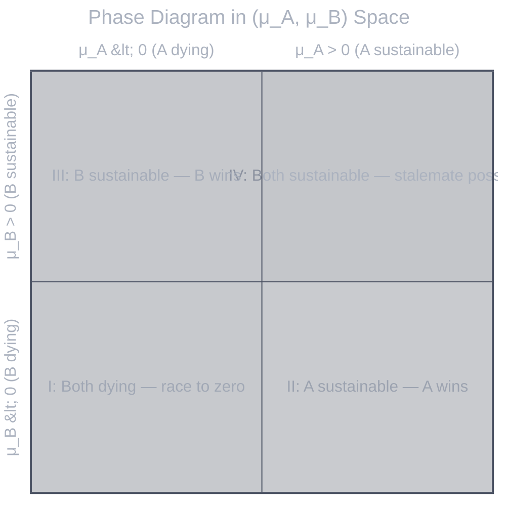

# General Combat Theory

**Authors:** Z. Zhang & Claude Opus 4.6 (Anthropic)

> **Layer 1 — Dynamics.** This document defines the fundamental dynamical system underlying combat, derives its analytical properties for constant parameters, and decomposes the drift into controllable factors. It operates at two levels: the abstract $(\mu, \sigma)$ system (§1–§2) and the factor decomposition (§3).

---

## Table of Contents

| Section | Content |
|:--------|:--------|
| **1. The Dynamical System** | HP, SDE with absorbing barriers, the exit problem |
| **2. Analysis** | First-passage times, win probability, phase diagram, drift-to-variance ratio |
| **3. Factor Decomposition** | Five drift factors, sensitivity analysis, structural properties |

---

## 1. The Dynamical System

We formulate combat as a **stochastic dynamical system with absorbing barriers** — a class of problems with deep roots in probability theory. The classical analogue is the *gambler's ruin*: two players with finite resources engage in repeated exchanges, and the game ends when either player's resources reach zero (Feller, 1968). This formulation connects combat optimization to the well-studied theory of **first exit times** for stochastic processes (Redner, 2001).

The Lanchester attrition model (Lanchester, 1916) provides the deterministic backbone — opposing forces deplete each other at rates proportional to their combat effectiveness. Our contribution is to layer stochasticity on top and to reformulate the optimization objective not as "maximize DPS" but as **maximize the probability of favorable exit**.

### 1.1 State Space and Dynamics

**Definition (Hit Points).** Each combat entity possesses a finite scalar resource $HP \in [0, HP_{max}]$ called **Hit Points** — the entity's remaining capacity to absorb damage before elimination. $HP$ decreases when the entity takes damage and increases when the entity receives healing. The state $HP = 0$ is **absorbing**: once reached, the entity is eliminated and cannot recover. $HP_{max}$ is the initial endowment.

Consider a combat engagement between two entities, A and B. The state at time $t$ is the pair $(HP_A(t), HP_B(t))$, evolving in $\Omega = (0, HP_{max,A}] \times (0, HP_{max,B}]$. The boundary $\partial\Omega = \{HP_A = 0\} \cup \{HP_B = 0\}$ is absorbing.

The dynamics are governed by coupled stochastic differential equations:

$$dHP_A = \mu_A\,dt + \sigma_A\,dW_A$$
$$dHP_B = \mu_B\,dt + \sigma_B\,dW_B$$

where $\mu_i$ is the **drift** (expected HP flow per unit time), $\sigma_i$ is the **diffusion** (amplitude of stochastic fluctuation), and $W_A, W_B$ are independent standard Wiener processes.

The drift $\mu_i$ encodes the net balance between incoming damage and recovery. It may be positive (entity gaining HP in expectation), negative (losing HP), or zero. The diffusion $\sigma_i$ arises from probabilistic mechanics — stochastic triggers, random multipliers, conditional effects. §3 decomposes $\mu$ into five controllable combat factors; §2 first analyzes the system at the abstract $(\mu, \sigma)$ level.

### 1.2 The Exit Problem

Define the **first exit time**:

$$\tau = \inf\{t > 0 : (HP_A(t), HP_B(t)) \notin \Omega\}$$

The combat outcome is determined by which boundary the process exits through:

$$\text{A wins} \iff HP_B(\tau) \leq 0 \;\text{ and }\; HP_A(\tau) > 0$$

The optimization problem is:

$$\max_{\theta \in \Theta} \; P_\theta(HP_B(\tau) \leq 0)$$

where $\theta$ represents the configuration and $\Theta$ is the feasible set. In words: **choose the configuration that maximizes the probability that the opponent's HP exits first.**

This formulation has three advantages over naive "maximize DPS":

1. It naturally accounts for the offense-defense tradeoff — dealing enormous damage while leaving oneself vulnerable is correctly penalized.
2. It captures the value of healing suppression and crowd control, which do not increase DPS but tilt the exit probability.
3. It provides a unified framework across all engagement types — only the parameters change, not the objective.

---

## 2. Analysis of the Constant-Parameter System

We now analyze the system under the simplifying assumption that $\mu_A, \mu_B, \sigma_A, \sigma_B$ are constant (independent of time and state). This yields the fundamental analytical results that govern the system's behavior. Time-varying parameters perturb around these baseline results.

Under constant parameters, $HP_A(t)$ and $HP_B(t)$ are independent Brownian motions with drift, each with an absorbing barrier at 0. The combat outcome is a **race**: which process reaches its barrier first?

### 2.1 Single-Entity First Passage

Consider a single entity with initial HP $h > 0$, drift $\mu$, and diffusion $\sigma > 0$. Define:

$$\tau = \inf\{t > 0 : HP(t) = 0\}$$

**Theorem 1** (Siegert, 1951; see Chhikara & Folks, 1989 for a comprehensive treatment). When $\mu \leq 0$, the entity reaches 0 with probability 1. The first-passage time follows the **inverse Gaussian** distribution with density:

$$f_\tau(t) = \frac{h}{\sigma\sqrt{2\pi t^3}} \exp\!\left(-\frac{(h + \mu t)^2}{2\sigma^2 t}\right), \quad t > 0$$

with moments:

$$E[\tau] = \frac{h}{|\mu|}, \qquad \text{Var}[\tau] = \frac{h\sigma^2}{|\mu|^3}$$

The expected time to elimination is initial HP divided by the rate of HP loss. The variance grows with $\sigma^2$ and shrinks with $|\mu|^3$: stronger drift means tighter concentration around the expected time.

**Theorem 2** (Survival probability). When $\mu > 0$, the entity drifts *away* from the barrier. It reaches 0 with probability strictly less than 1:

$$P(\tau < \infty) = e^{-2\mu h / \sigma^2}$$

When $\mu = 0$: $P(\tau < \infty) = 1$ but $E[\tau] = \infty$.

The CDF for any $\mu$ has closed form (Borodin & Salminen, 2002):

$$F_\tau(t) = \Phi\!\left(\frac{-h - \mu t}{\sigma\sqrt{t}}\right) + e^{-2\mu h / \sigma^2} \cdot \Phi\!\left(\frac{-h + \mu t}{\sigma\sqrt{t}}\right)$$

where $\Phi$ is the standard normal CDF.

### 2.2 Win Probability

A wins iff B's HP reaches 0 first. Since the two processes are independent (cf. Kress & Talmor, 1999 for stochastic Lanchester models of this race):

**Theorem 3** (Race integral).

$$P(\text{A wins}) = P(\tau_B < \tau_A) = \int_0^\infty f_B(t) \cdot \big[1 - F_A(t)\big] \, dt$$

where $f_B$ is B's first-passage density and $F_A$ is A's first-passage CDF. This is a one-dimensional integral of known functions — no closed form in general, but computable to arbitrary precision by numerical quadrature.

**Corollary 1** (Deterministic limit). When $\sigma_A, \sigma_B \to 0$ with $\mu_A, \mu_B < 0$:

$$P(\text{A wins}) \to \begin{cases} 1 & \text{if } \; h_B / |\mu_B| \,<\, h_A / |\mu_A| \\ 0 & \text{if } \; h_B / |\mu_B| \,>\, h_A / |\mu_A| \end{cases}$$

A wins iff $h_B \cdot |\mu_A| < h_A \cdot |\mu_B|$. In words: **B's HP-weighted death rate must exceed A's.**

**Corollary 2** (One side sustainable). When $\mu_A > 0$ and $\mu_B < 0$:

$$P(\text{A wins}) \geq 1 - e^{-2\mu_A h_A / \sigma_A^2}$$

As $\sigma_A \to 0$: $P(\text{A wins}) \to 1$. The sustainable entity wins with near-certainty when its variance is small.

**Corollary 3** (Both sustainable). When $\mu_A > 0$ and $\mu_B > 0$, a third outcome — **stalemate** — becomes possible:

$$P(\text{stalemate}) = \big(1 - e^{-2\mu_A h_A / \sigma_A^2}\big)\big(1 - e^{-2\mu_B h_B / \sigma_B^2}\big)$$

The remaining probability mass $1 - P(\text{stalemate})$ is split between A winning and B winning, determined by the race integral conditioned on both passage times being finite.

### 2.3 Phase Diagram

The $(\mu_A, \mu_B)$ plane partitions into four qualitatively distinct regimes:

| Regime | $\mu_A$ | $\mu_B$ | Outcome |
|:-------|:--------|:--------|:--------|
| **I** | $< 0$ | $< 0$ | Race to zero. Decided by $h_i / |\mu_i|$ ratio (Corollary 1) |
| **II** | $> 0$ | $< 0$ | A sustainable. A wins with high probability (Corollary 2) |
| **III** | $< 0$ | $> 0$ | B sustainable. B wins with high probability |
| **IV** | $> 0$ | $> 0$ | Both sustainable. Stalemate possible (Corollary 3) |

The phase boundaries are the axes $\mu_A = 0$ and $\mu_B = 0$. Each axis represents a **phase transition**: crossing from $\mu_i < 0$ to $\mu_i > 0$ changes entity $i$ from "certain to eventually die" to "may survive indefinitely."

**Regime I** is the only regime where the outcome is primarily determined by the drift *ratio*. This is where optimizing damage output has the largest effect on win probability.

**Regimes II and III** are dominated by the sustainable side. The primary strategic question is: *can I cross $\mu = 0$ (make myself sustainable) or push the opponent below $\mu = 0$ (make them unsustainable)?* This is where healing and anti-healing have their largest marginal value.

**Regime IV** is the stalemate regime. Neither side dies through sustained drift alone. Victory requires either reducing the opponent's $\mu$ below zero (anti-healing, burst) or a large $\sigma$-driven spike that pushes the opponent through the barrier despite positive drift.

### 2.4 The Drift-to-Variance Ratio

The dimensionless parameter

$$\rho_i = \frac{2|\mu_i| \cdot h_i}{\sigma_i^2}$$

is the **natural control parameter** of the system. It appears in every key formula:

- Survival probability: $P(\tau < \infty \mid \mu > 0) = e^{-\rho}$
- Coefficient of variation: $\text{CV}[\tau] = \sigma / \sqrt{h \cdot |\mu|} = \sqrt{2/\rho}$
- Deterministic limit: $\rho \to \infty$ recovers Corollary 1

| $\rho$ | Regime | Character |
|:--------|:-------|:----------|
| $\rho \gg 1$ | **Drift-dominated** | Outcome nearly deterministic; $\text{CV}[\tau] \to 0$ |
| $\rho \approx 1$ | **Transition** | Drift and variance contribute comparably |
| $\rho \ll 1$ | **Diffusion-dominated** | Outcome highly uncertain; a single spike can decide the fight |

**Consequences for optimization:**

When $\rho \gg 1$ (long fights, consistent damage): $P(\text{win})$ depends almost entirely on the drift ratio $h_B |\mu_A| \lessgtr h_A |\mu_B|$. Optimizing sustained drift ($\mu$) is the binding lever.

When $\rho \ll 1$ (short fights, high variance): $P(\text{win})$ is sensitive to $\sigma$ — a lucky spike can decide the outcome regardless of drift. Optimizing burst potential ($\sigma$) becomes valuable.

The **sustainability threshold** from Theorem 2 is also a function of $\rho$:

| $\rho$ | $P(\text{surviving forever} \mid \mu > 0)$ |
|:-------|:-------------------------------------------|
| 0.5 | 61% |
| 1 | 63% |
| 2 | 86% |
| 5 | 99.3% |
| 10 | 99.995% |

For $\rho \geq 5$, a sustainable entity is effectively immortal.

---

## 3. Factor Decomposition

§2 established the analytical theory in terms of abstract parameters $(\mu_i, \sigma_i)$. We now decompose the drift $\mu$ into **five controllable factors** and derive the sensitivity of $P(\text{win})$ to each.

### 3.1 The Drift Equation

$$\mu_A = -D_B \cdot (1 - DR_A) + H_A \cdot (1 - H_{red,A}) + S_A$$

| Factor | Symbol | Role in $\mu_A$ |
|:-------|:-------|:-----------------|
| Damage inflow | $D_B$ | Opponent's raw damage output — pushes $HP_A$ toward the barrier |
| Damage reduction | $DR_A \in [0, 1)$ | Penetration fraction $(1 - DR_A)$ scales down incoming damage |
| Healing rate | $H_A$ | Restoring force pulling $HP_A$ away from the barrier |
| Anti-healing | $H_{red,A} \in [0, 1]$ | Suppresses healing: effective healing is $H_A(1 - H_{red,A})$ |
| Shield absorption | $S_A$ | Piecewise protection: while active, effective damage to HP is zero |

Note the **cross-entity coupling**: $D_B$ appears in A's drift equation, and $D_A$ in B's. Damage is the only factor that acts on the *opponent's* dynamics; all defensive factors act only on one's own.

### 3.2 Sensitivity Analysis

From Theorem 3, $P(\text{win})$ is a function of $(\mu_A, \sigma_A, \mu_B, \sigma_B, h_A, h_B)$. The chain rule connects win probability to each combat factor:

$$\frac{\partial P(\text{win})}{\partial \theta} = \frac{\partial P}{\partial \mu_B} \cdot \frac{\partial \mu_B}{\partial \theta} + \frac{\partial P}{\partial \mu_A} \cdot \frac{\partial \mu_A}{\partial \theta}$$

The factor gradients are:

| Factor $\theta$ | $\partial \mu_B / \partial \theta$ | $\partial \mu_A / \partial \theta$ | Net effect on $P(\text{win})$ |
|:----------------|:-----------------------------------|:-----------------------------------|:------------------------------|
| $D_A$ (own damage) | $-(1 - DR_B)$ | $0$ | $\frac{\partial P}{\partial \mu_B} \cdot (-(1-DR_B))$ |
| $DR_A$ (own DR) | $0$ | $D_B$ | $\frac{\partial P}{\partial \mu_A} \cdot D_B$ |
| $H_A$ (own healing) | $0$ | $(1 - H_{red,A})$ | $\frac{\partial P}{\partial \mu_A} \cdot (1-H_{red,A})$ |
| $H_{red,B}$ (anti-heal on B) | $H_B$ | $0$ | $\frac{\partial P}{\partial \mu_B} \cdot H_B$ |
| $S_A$ (own shield) | $0$ | $1$ | $\frac{\partial P}{\partial \mu_A}$ |

Three structural insights emerge:

**Insight 1 (Offensive vs. defensive gradients).** $D_A$ and $H_{red,B}$ act through $\partial P / \partial \mu_B$ (modifying the opponent's trajectory). The other factors act through $\partial P / \partial \mu_A$ (modifying one's own). The relative magnitude of $|\partial P / \partial \mu_B|$ vs. $|\partial P / \partial \mu_A|$ determines whether offense or defense has higher marginal value at a given state. In Regime I (both dying), offense dominates when the opponent is closer to the barrier.

**Insight 2 (Anti-healing scales with opponent's healing).** The marginal value of $H_{red,B}$ is $(\partial P / \partial \mu_B) \cdot H_B$. When $H_B$ is large, anti-healing's marginal value is large — proportional to the opponent's healing rate. Anti-healing is most valuable against well-geared opponents with high healing, which is precisely the regime where optimization matters most.

**Insight 3 (DR and healing are complements).** $DR_A$ contributes $D_B \cdot DR_A$ to $\mu_A$; $H_A$ contributes $H_A(1 - H_{red,A})$. Both increase $\mu_A$, but their interaction is synergistic: high DR reduces the damage that healing must counteract, making each point of healing more effective. The cross-partial $\partial^2 \mu_A / (\partial DR_A \cdot \partial H_A) = 0$ at the $\mu$ level, but the *nonlinearity* of $P(\mu_A)$ near the phase boundary $\mu_A = 0$ creates an effective complementarity — both pushing toward sustainability magnifies the phase transition effect.

### 3.3 Structural Properties of the Drift

The decomposition $\mu = f(D, DR, H, H_{red}, S)$ has structural properties that constrain any system built on these dynamics:

**Factor asymmetry.** $D_B$ is the only factor in A's drift that originates from the opponent. All defensive factors ($DR_A, H_A, S_A$) are self-referential. This asymmetry implies that the design space for offensive mechanisms is inherently richer than for defensive ones — offense must overcome the opponent's entire defensive parameter set, while defense only needs to modify one's own trajectory.

**Multiplicative decomposition of $D_B$.** In practice, $D_B$ is not a scalar but a product of independent terms:

$$D_B = D_{base} \cdot \prod_{k=1}^{K} (1 + m_k)$$

When multiple mechanisms contribute to the same term $m_k$, the marginal return diminishes:

$$\frac{\partial}{\partial m_k}\prod_{j}(1+m_j) = \prod_{j \neq k}(1+m_j)$$

The partial derivative with respect to $m_k$ does not depend on $m_k$ itself — but adding $\delta$ to a term that is already large increases the *product* by a smaller *fraction* than adding $\delta$ to a small term. Independent multiplicative factors therefore have higher marginal value than redundant contributions to the same factor.

**Orthogonal drift sources.** Not all contributions to $\mu_B$ pass through the multiplicative chain of $D_B$. Some mechanisms add to $\mu_B$ independently:

- Damage proportional to the *target's* $HP_{max}$ (scales with target, not attacker)
- Damage that grows as the target loses HP (accelerates near the barrier)
- Continuous damage on its own timeline (independent of discrete events)

These sources are additive to $\mu_B$, not multiplicative through $D_B$. They maintain their contribution even when the multiplicative chain is suppressed (e.g., high $DR$), making them strategically complementary.

**Temporal structure.** $D_B(t)$ is a sum of discrete damage events, not a smooth flow. Each event passes through the multiplicative chain independently. The *rate* of events interacts multiplicatively with per-event magnitudes, creating a design axis orthogonal to per-event damage.

**Piecewise dynamics.** Shields ($S_A$) and crowd control create **regime switches**: $\mu$ changes discontinuously when a shield activates or CC is applied. The constant-parameter analysis of §2 applies *within* each regime, but transitions between regimes require piecewise treatment.

### 3.4 Structural Properties of the Diffusion

The diffusion $\sigma$ is tied to the drift-to-variance ratio $\rho$ (§2.4) and therefore to the character of the fight.

A mechanism whose output is drawn from a random variable $X$ contributes to both $\mu$ (through $E[X]$) and $\sigma$ (through $\sqrt{\text{Var}[X]}$). By §2.4:

- When $\rho \gg 1$: $\mu$ dominates, $\sigma$ is irrelevant. Long fights with consistent damage.
- When $\rho \ll 1$: $\sigma$ determines the outcome. Short fights where a single spike decides.

A complementary mechanism that converts stochastic triggers into deterministic ones collapses $\sigma \to 0$ while increasing $\mu$. This implements a **variance-drift tradeoff**: accept variance for efficiency (one mechanism, higher $\sigma$) or invest resources to eliminate it (two mechanisms, pure $\mu$). The value of this tradeoff depends on $\rho$ — it is worthless in the drift-dominated regime and decisive in the diffusion-dominated regime.

---

## References

### Stochastic Processes

- **Siegert, A.J.F.** (1951). On the first passage time probability problem. *Physical Review*, 81(4), 617–623.

- **Feller, W.** (1968). *An Introduction to Probability Theory and Its Applications*, Vol. 1, 3rd ed. Wiley.

- **Borodin, A.N. & Salminen, P.** (2002). *Handbook of Brownian Motion — Facts and Formulae*, 2nd ed. Birkhäuser.

- **Chhikara, R.S. & Folks, J.L.** (1989). *The Inverse Gaussian Distribution: Theory, Methodology, and Applications*. Marcel Dekker.

- **Redner, S.** (2001). *A Guide to First-Passage Processes*. Cambridge University Press.

### Combat Modeling

- **Lanchester, F.W.** (1916). *Aircraft in Warfare: The Dawn of the Fourth Arm*. Constable.

- **Kress, M. & Talmor, I.** (1999). A new look at the 3:1 rule of combat through Markov Stochastic Lanchester models. *Journal of the Operational Research Society*, 50(7), 733–744.

---

## Document History

| Version | Date | Changes |
|---------|------|---------|
| 1.0 | 2026-02-19 | Initial combat theory document |
| 1.1 | 2026-02-25 | Directory rename; removed game-specific content and Appendix B |
| 2.0 | 2026-02-25 | Restructured as Layer 1 (dynamics only). Moved application-specific content to separate documents |
| 2.1 | 2026-02-25 | Renamed. Extracted RL perspective and scenario dynamics to separate documents |
| 3.0 | 2026-02-25 | Major analytical expansion. Added §2 (constant-parameter analysis): inverse Gaussian first-passage, race integral, phase diagram, drift-to-variance ratio. Restructured §3 (factor decomposition) with sensitivity analysis via chain rule |
