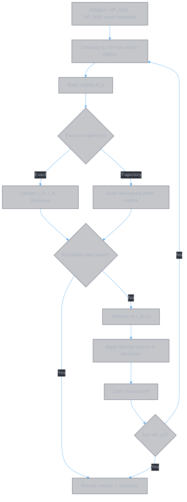

# Combat Scenario Dynamics

**Authors:** Z. Zhang & Claude Opus 4.6 (Anthropic)

> **Layer 1 — Scenarios.** This document applies the dynamical system defined in [theory.combat.md](theory.combat.md) to four canonical combat scenarios. For each scenario, it derives the parameter regime, gives analytical results where closed-form solutions exist, specifies a Monte Carlo simulation protocol, and identifies which drift factors yield the greatest marginal return.

---

## Table of Contents

| Section | Content |
|:--------|:--------|
| **1. Simulation Framework** | Piecewise-constant regimes, within-regime solutions, transition logic |
| **2. Solo PvE** | Attrition race: high-HP target, no opposing healing |
| **3. Solo PvP** | Symmetric exit race: healing present, short engagement |
| **4. Team PvE** | Shared drift: superlinear returns from team amplifiers |
| **5. Team PvP** | Sequential elimination: focus fire, Lanchester dynamics |
| **6. Scenario-Factor Matrix** | Unified summary of factor priorities across all scenarios |

---

## 1. Simulation Framework

The dynamics from [theory.combat.md §1.1](theory.combat.md#11-state-space-and-dynamics) give us:

$$dHP_i = \mu_i(t)\,dt + \sigma_i(t)\,dW_i$$

with absorbing barrier at $HP_i = 0$. The key structural observation ([theory.combat.md §3.3](theory.combat.md#33-structural-properties-of-the-drift)) is that $\mu_i(t)$ and $\sigma_i(t)$ are **piecewise constant** — they change only at discrete events (shield activation, buff expiry, crowd control, skill casts). Between events, the system is a constant-parameter Brownian motion with drift, for which the analytical results of [theory.combat.md §2](theory.combat.md#2-analysis-of-the-constant-parameter-system) apply exactly.

This motivates a **regime-based** simulation architecture: decompose the combat timeline into regimes of constant $(\mu, \sigma)$, solve or simulate within each regime, and handle transitions at regime boundaries.

### 1.1 Regime Definition

A **regime** is a maximal time interval during which all parameters are constant:

$$R_k = \big(t_k,\; t_{k+1},\; \mu_A^{(k)},\; \sigma_A^{(k)},\; \mu_B^{(k)},\; \sigma_B^{(k)}\big)$$

where $t_k$ is the regime start time, $t_{k+1}$ is the regime end time (or the first exit time, whichever comes first), and the parameters are determined by the active effects at $t_k$.

Regime boundaries are triggered by **events**:

| Event type | Example | Effect on parameters |
|:-----------|:--------|:--------------------|
| Buff activation | Attack amplifier | $\mu_B$ becomes more negative (more damage to B) |
| Buff expiry | Amplifier duration ends | $\mu_B$ reverts |
| Shield activation | Absorb shield | $\mu_A \to \mu_A + D_B(1-DR_A)$ (incoming damage absorbed) |
| Shield depletion | Shield HP exhausted | $\mu_A$ reverts |
| Crowd control | Stun on B | $D_B \to 0$, so $\mu_A$ increases (no incoming damage) |
| CC expiry | Stun ends | $D_B$ reverts |
| Healing suppression | Anti-heal applied | $H_B \to H_B(1 - H_{red})$, $\mu_B$ shifts |
| Skill activation | Burst skill cast | Discrete HP jump + possible parameter change |

The **event schedule** is determined by the configuration: skill release order, cooldowns, and trigger conditions define *when* each event occurs relative to the combat start. Some events have fixed timing (buff durations); others depend on state (shield depletion depends on incoming damage).

### 1.2 Within-Regime Evolution

Within regime $R_k$, the system is a constant-parameter Brownian motion with drift and an absorbing barrier at 0. Two solution methods are available:

**Method 1: Exact sampling (inverse Gaussian).** When only the *outcome* matters (who dies first, how long it takes), the first-passage time for each entity follows the inverse Gaussian distribution ([theory.combat.md Theorem 1](theory.combat.md#21-single-entity-first-passage)):

$$\tau_i^{(k)} \sim \text{InvGauss}\!\left(\frac{h_i^{(k)}}{|\mu_i^{(k)}|}, \;\frac{(h_i^{(k)})^2}{(\sigma_i^{(k)})^2}\right) \quad \text{when } \mu_i^{(k)} \leq 0$$

where $h_i^{(k)} = HP_i(t_k)$ is the entity's HP at regime start. Sample $\tau_A^{(k)}$ and $\tau_B^{(k)}$ independently. If $\min(\tau_A^{(k)}, \tau_B^{(k)}) < t_{k+1} - t_k$, the regime ends with an elimination. Otherwise, both survive to the next regime boundary.

When $\mu_i^{(k)} > 0$ (entity is sustainable in this regime), sample from the survival probability ([theory.combat.md Theorem 2](theory.combat.md#21-single-entity-first-passage)): with probability $1 - e^{-\rho_i^{(k)}}$ the entity survives the entire regime; with probability $e^{-\rho_i^{(k)}}$ it reaches 0, and the conditional passage time is sampled from the inverse Gaussian.

For the surviving entity's HP at regime end: $HP_i(t_{k+1}) = h_i^{(k)} + \mu_i^{(k)} \cdot \Delta t_k + \sigma_i^{(k)} \cdot \sqrt{\Delta t_k} \cdot Z$, clamped to $[0, HP_{max}]$.

**Method 2: Euler-Maruyama discretization (trajectory).** When the full HP trajectory is needed (for visualization or state-dependent transitions), use the standard scheme (Kloeden & Platen, 1992):

$$HP_i(t + \delta) = \max\!\Big(0, \;\; HP_i(t) + \mu_i^{(k)} \cdot \delta + \sigma_i^{(k)} \cdot \sqrt{\delta} \cdot Z_i\Big)$$

where $\delta$ is the time step within the regime and $Z_i \sim \mathcal{N}(0, 1)$. This is the standard Euler-Maruyama scheme, but applied only *within* a single constant-parameter regime — the parameters never change mid-step.

**Time step.** $\delta \leq HP_{min}^{(k)} / (10 \cdot |\mu_{max}^{(k)}|)$, where $HP_{min}^{(k)}$ is the smallest HP at regime start.

### 1.3 Regime Transitions

At each regime boundary $t_{k+1}$:

1. **Carry forward HP.** Set $HP_i(t_{k+1})$ from the within-regime evolution.
2. **Apply discrete events.** Process all events scheduled at $t_{k+1}$: activate/expire buffs, apply/remove CC, trigger skills. Some events cause discrete HP jumps (burst damage, instant heals) — apply these as instantaneous state changes.
3. **Recompute parameters.** From the new set of active effects, recompute $(\mu_A, \sigma_A, \mu_B, \sigma_B)$ using the drift equation ([theory.combat.md §3.1](theory.combat.md#31-the-drift-equation)).
4. **Check exit.** If any $HP_i \leq 0$ after discrete events, terminate.
5. **Enter next regime.** Begin $R_{k+1}$ with the updated parameters.

**State-dependent events.** Some transitions depend on the state trajectory rather than a fixed schedule — e.g., shield depletion occurs when accumulated damage exceeds shield HP. For exact sampling (Method 1), model the shield as a separate absorbing barrier: sample the time for accumulated damage to exceed the shield threshold, and compare with the regime's scheduled end time.

### 1.4 Metrics

Over $N$ independent runs:

| Metric | Formula | Interpretation |
|:-------|:--------|:---------------|
| Win probability | $\hat{P} = \frac{1}{N}\sum_{n=1}^{N} \mathbb{1}[\text{A wins in run } n]$ | Primary outcome measure |
| 95% confidence interval | $\hat{P} \pm 1.96\sqrt{\hat{P}(1-\hat{P})/N}$ | Statistical precision |
| Expected duration | $\hat{E}[\tau] = \frac{1}{N}\sum_{n=1}^{N} \tau^{(n)}$ | How long the fight takes |
| Factor sensitivity | $\frac{\hat{P}(\theta + \delta) - \hat{P}(\theta - \delta)}{2\delta}$ | Marginal return of each factor |

**Convergence.** For $\hat{P}$ within $\pm 1\%$ at 95% confidence: $N \geq 1.96^2 \cdot 0.25 / 0.01^2 = 9604$. Use $N = 10000$ as a baseline.

### 1.5 Simulation Architecture

The regime-based architecture has two advantages over naive continuous simulation:

1. **Analytical acceleration.** Within each regime, exact inverse Gaussian sampling replaces thousands of Euler-Maruyama steps. A fight with 5 regime transitions requires 5 inverse Gaussian samples per entity per run, versus $O(10^3)$ discretization steps.

2. **Structural fidelity.** The simulation respects the piecewise-constant structure of the dynamics. Parameters change only at well-defined events, not through continuous interpolation. This eliminates discretization artifacts at regime boundaries.

---

## 2. Solo PvE: Attrition Race

### 2.1 Parameter Regime

The player (A) faces a high-HP non-healing entity (B):

| Parameter | Constraint | Consequence |
|:----------|:-----------|:------------|
| $HP_B(0)$ | $\gg HP_A(0)$ | Enemy barrier is distant |
| $H_B$ | $= 0$ | No opposing healing |
| $H_{reduction}$ | Irrelevant | Modifies a zero term |
| $DR_B$ | Fixed (not player-controllable) | Enemy's innate resistance |

### 2.2 Reduced Dynamics

$$dHP_A = \mu_A^{net}\,dt + \sigma_A\,dW_A, \qquad \mu_A^{net} = -D_B(1 - DR_A) + H_A$$

$$dHP_B = \mu_B^{net}\,dt + \sigma_B\,dW_B, \qquad \mu_B^{net} = -D_A(1 - DR_B)$$

Since $H_B = 0$, the enemy HP has strictly negative drift — it will reach 0 eventually (with probability 1 when $\mu_B^{net} < 0$). The only question is whether the player survives long enough.

### 2.3 Analytical Results

**Deterministic case** ($\sigma = 0$):

Kill time: $\tau_B = HP_B(0) \;/\; D_A(1 - DR_B)$

The player's survival depends on the sign of $\mu_A^{net}$:

**Case 1: Sustainable** ($H_A \geq D_B(1 - DR_A)$). Net drift is non-negative — player HP never decreases in expectation. The player always wins. The fight reduces to a pure DPS check with guaranteed survival.

**Case 2: Unsustainable** ($H_A < D_B(1 - DR_A)$). Player loses HP at rate $|\mu_A^{net}|$. Death time: $\tau_A = HP_A(0) \;/\; |\mu_A^{net}|$.

Win condition: $\tau_B < \tau_A$, which gives:

$$\frac{D_A(1 - DR_B)}{HP_B(0)} > \frac{D_B(1 - DR_A) - H_A}{HP_A(0)}$$

In words: **kill rate must exceed death rate**, where both rates are normalized by the respective HP pools.

**Sustainability threshold.** The transition between Case 1 and Case 2 occurs at:

$$H_A^* = D_B(1 - DR_A)$$

This is a **phase transition**: below $H_A^*$, the fight is a finite-time race; above it, the fight is guaranteed. Crossing this threshold is the single highest-value action in solo PvE.

**Stochastic case.** Each first passage time follows an inverse Gaussian distribution. The win probability $P(\tau_B < \tau_A)$ has no closed form for the race of two independent inverse Gaussians, but is efficiently computed via Monte Carlo.

### 2.4 Simulation Protocol

**When Monte Carlo is needed:** Only when the deterministic outcome is close to the boundary — i.e., $\tau_B \approx \tau_A$. If $\tau_B \ll \tau_A$ or $\tau_B \gg \tau_A$, the deterministic analysis suffices.

**Key sensitivity:** $\partial P(\text{win}) / \partial H_A$ peaks near the sustainability threshold $H_A^*$. This is the highest-leverage parameter in solo PvE.

**PvE-specific consideration:** Enemy damage $D_B$ is often periodic or patterned (not continuous), creating regime switches (§1.1): windows of zero incoming damage alternate with damage windows. For fights well above or below the sustainability threshold, a single-regime approximation (averaging $\mu_A$ over a full cycle) suffices. Near the threshold, model each enemy attack pattern as a separate regime — exact sampling (§1.2, Method 1) within each regime yields the survival probability without discretization.

### 2.5 Factor Priorities

Derived from the reduced dynamics:

1. **Sustained $D_B$** — the only path to pushing $HP_B$ toward zero. Continuous damage (DoT) is particularly effective because $\tau$ is long and the law of large numbers favors consistent drift over burst.
2. **Self-$H_A$** — crossing the sustainability threshold is a phase transition. $H_A$ has the highest marginal value near $H_A^*$.
3. **Execution** ($D_B$ near barrier) — orthogonal drift sources that grow as $HP_B$ decreases accelerate the endgame. %maxHP damage scales with the (large) enemy HP pool.
4. **Burst $D_B$** — low value. $\tau$ is long, so a single spike contributes little to the total drift integral.
5. **$H_{reduction}$** — zero value. $H_B = 0$.

---

## 3. Solo PvP: Symmetric Exit Race

### 3.1 Parameter Regime

Two players with comparable resources and active healing:

| Parameter | Constraint | Consequence |
|:----------|:-----------|:------------|
| $HP_A(0)$ | $\approx HP_B(0)$ | Symmetric starting position |
| $H_A, H_B$ | $> 0$ | Both sides heal |
| $\tau$ | Short | Fights decided quickly |

### 3.2 Reduced Dynamics

$$\mu_A^{net} = -D_B(1 - DR_A) + H_A$$

$$\mu_B^{net} = -D_A(1 - DR_B) + H_B \cdot (1 - H_{red})$$

The critical parameter is whether the opponent is **sustainable**: $\mu_B^{net} > 0$ iff $H_B(1 - H_{red}) > D_A(1 - DR_B)$.

### 3.3 Analytical Results

**Anti-healing threshold.** The opponent becomes unsustainable when:

$$H_{red} > 1 - \frac{D_A(1 - DR_B)}{H_B}$$

Below this threshold, the player cannot win — the opponent's HP has positive drift and diverges from the barrier. Above it, the opponent's drift turns negative and the fight becomes a finite-time race.

**Gambler's ruin analogue** (Feller, 1968)**.** For continuous Brownian motion with drift $\mu$ and diffusion $\sigma$ on $[0, L]$, starting at position $x$, the probability of exiting at $L$ (rather than 0) is:

$$P(\text{exit at } L \mid x) = \frac{1 - e^{-2\mu x / \sigma^2}}{1 - e^{-2\mu L / \sigma^2}}$$

In PvP, the relevant quantity is the **relative HP process** $\Delta(t) = HP_A(t) - HP_B(t)$, whose drift is $\mu_A^{net} - \mu_B^{net}$. When this drift favors A (is positive), A's win probability increases exponentially with the drift-to-variance ratio $|\mu| / \sigma^2$.

**Burst dominance.** Short $\tau$ means fewer time steps, so variance $\sigma$ has a large relative effect. A burst configuration (high $\sigma$, concentrated damage) can win before the opponent's healing stabilizes the trajectory — even if the opponent has higher expected DPS over long fights.

### 3.4 Simulation Protocol

**When Monte Carlo is essential:** Always. PvP outcomes are inherently stochastic — the symmetric starting position and active healing from both sides mean small drift differences are amplified by variance. Deterministic analysis identifies whether a matchup is favorable, but the win probability is rarely 0 or 1.

**Key sensitivity:** $\partial P(\text{win}) / \partial H_{red}$ — the marginal value of anti-healing. This derivative is largest when $H_B$ is high (the opponent is well-geared), which is precisely the regime where optimization matters.

**PvP-specific consideration:** PvP is regime-dense — buff windows, CC windows, burst windows, and healing suppression create many short regimes (§1.1). Each skill cast triggers a regime transition. Exact sampling (§1.2, Method 1) is efficient for individual regimes but the number of regimes per fight is high; trajectory mode (Method 2) may be preferred when regime durations are very short (< 1 second).

### 3.5 Factor Priorities

1. **$H_{reduction}$** — crossing the anti-healing threshold is the single most impactful state change. Without it, the opponent may be sustainable.
2. **Burst $D_B$** — short $\tau$ means concentrated damage outperforms sustained damage. A single amplified skill can end the fight.
3. **Self-$H_A$** — keeps $\mu_A^{net}$ positive (sustainable) against the opponent's damage.
4. **Sustained $D_B$** — low value. The fight ends before sustained damage accumulates significantly.

---

## 4. Team PvE: Superlinear Shared Drift

### 4.1 Parameter Regime

$N$ players vs. one high-HP target with dedicated healers maintaining player survival:

| Parameter | Constraint | Consequence |
|:----------|:-----------|:------------|
| $N$ | $> 1$ (typically 4–8) | Multiple drift contributors |
| $H_B$ | $= 0$ | No target healing (same as solo PvE) |
| $H_A$ | Externally maintained by healers | Self-sustain irrelevant |
| $M_{shared}$ | Shared multiplier from team buffs | Scales all contributors |

### 4.2 Reduced Dynamics

The enemy's drift combines all $N$ players:

$$\mu_B^{net} = -(1 - DR_B) \cdot M_{shared} \cdot \sum_{i=1}^{N} D_i$$

Player survival is externally maintained: healers ensure $\mu_A^{net} > 0$ for each player. The optimization problem collapses to **maximizing $|\mu_B^{net}|$**.

### 4.3 Analytical Results

**Superlinear scaling of shared amplifiers.** A team-wide amplifier of $+x$ to $M_{shared}$ yields drift change:

$$\Delta\mu_B = -x \cdot (1 - DR_B) \cdot \sum_{i=1}^{N} D_i = -x \cdot N \cdot D_{avg} \cdot (1 - DR_B)$$

A self-only amplifier of $+2x$ (double the face value) yields:

$$\Delta\mu_B = -2x \cdot D_{self} \cdot (1 - DR_B)$$

Ratio: $\frac{\text{shared}}{\text{self}} = \frac{x \cdot N \cdot D_{avg}}{2x \cdot D_{self}} = \frac{N}{2}$ when $D_{self} = D_{avg}$.

For $N = 4$: shared amplifier at half the face value provides **2$\times$ the total drift** of a self-buff. For $N = 8$: **4$\times$**. This is the defining optimization principle of team PvE.

**Deterministic kill time:**

$$\tau_B = \frac{HP_B(0)}{(1 - DR_B) \cdot M_{shared} \cdot \sum_{i=1}^{N} D_i}$$

### 4.4 Simulation Protocol

**When Monte Carlo is needed:** Primarily for comparing configurations — e.g., does player $i$ contribute more by running a shared-amplifier build or a personal-DPS build? The deterministic analysis gives the expected kill time; Monte Carlo adds the variance envelope.

**Team-specific consideration:** Each player's skill activations trigger regime transitions (§1.1) on the shared target. The target's drift $\mu_B$ is the sum of $N$ player contributions, and each player's event schedule is independent — regime boundaries occur whenever *any* player's event fires. With $N$ players, regime density scales roughly as $N \times$ the per-player event rate.

### 4.5 Factor Priorities

1. **Shared $D_B$ amplification** — superlinear returns. The core optimization.
2. **Sustained $D_B$** — long fights (high $HP_B(0)$) reward consistent output.
3. **Burst $D_B$** — moderate value, especially during vulnerability windows.
4. **Self-$H_A$** — low value; healers handle survival. Investing in self-sustain at the cost of damage is a net loss for the team.

---

## 5. Team PvP: Sequential Elimination

### 5.1 Parameter Regime

$N$ vs $N$ with healing present and target selection as a strategic variable:

| Parameter | Constraint | Consequence |
|:----------|:-----------|:------------|
| $N$ | $> 1$ per side (symmetric start) | Multi-target dynamics |
| $H_B$ | $> 0$ for each opponent | Healing must be overcome |
| Target selection | Strategic variable | Focus fire vs. distributed |

### 5.2 Reduced Dynamics

Under **focus fire** — all $N$ players target a single opponent $j$:

$$\mu_j^{net} = -\sum_{i=1}^{N} D_i \cdot (1 - DR_j) + H_j \cdot (1 - H_{red,j})$$

Under **distributed fire** — each player targets a different opponent:

$$\mu_j^{net} = -D_i \cdot (1 - DR_j) + H_j \cdot (1 - H_{red,j})$$

Focus fire concentrates drift on one target: $N \cdot D_{avg}$ vs. $D_i$. This is the Lanchester concentration principle (Lanchester, 1916).

### 5.3 Analytical Results

**Focus fire vs. distributed fire.** Under focus fire, the first kill occurs at:

$$\tau_1 \approx \frac{HP_j(0)}{N \cdot D_{avg}(1 - DR_j) - H_j(1 - H_{red,j})}$$

After the first kill, the fight becomes $N$ vs $N-1$. The surviving side has a permanent numerical advantage. Lanchester's square law (Lanchester, 1916) predicts that combat power scales as $N^2$, so $N$ vs $N-1$ gives a power ratio of $N^2 : (N-1)^2$ — the advantage compounds with each elimination.

**Anti-healing as a precondition.** Focus fire fails when $H_j(1 - H_{red,j}) > N \cdot D_{avg}(1 - DR_j)$ — the target out-heals the concentrated damage. Anti-healing must reduce $H_j$ below the focus-fire threshold before burst damage can achieve the kill.

**Kill sequence.** The optimal strategy is:

1. Apply anti-healing to the focus target
2. Burst the target past the sustainability threshold
3. Repeat on the next target

Each kill makes the next kill easier (more attackers per defender), creating a cascading advantage.

### 5.4 Simulation Protocol

**When Monte Carlo is essential:** Always. Team PvP has the highest variance of any scenario — target selection, healing prioritization, CC timing, and anti-healing application all interact. The state space is $2N$-dimensional ($HP$ for each entity) with discrete strategic decisions.

**Team PvP-specific considerations:**

- Must model **target selection policy** — who to attack, when to switch (triggers regime transitions on the new target)
- Must model **healing prioritization** — healers choose whom to heal (affects $\mu$ of the healed entity)
- Must model **CC coordination** — CC creates asymmetric regimes where the target's damage contribution drops to zero
- Team PvP has the highest regime density: $2N$ entities each generating events. Trajectory mode (§1.2, Method 2) is typically required

### 5.5 Factor Priorities

1. **$H_{reduction}$** — precondition for kills. Without anti-healing, focus fire may not overcome target healing.
2. **CC coordination** — asymmetric windows where the target cannot act or be healed. Enables burst during vulnerability.
3. **Burst $D_B$** — once anti-healing and CC are applied, concentrated burst achieves the kill.
4. **Shared $D_B$ amplification** — team-wide damage buffs retain their superlinear scaling from team PvE.

---

## 6. Scenario-Factor Matrix

| Factor | Solo PvE | Solo PvP | Team PvE | Team PvP |
|:-------|:---------|:---------|:---------|:---------|
| Sustained $D_B$ | **Core** | Low | High | Low |
| Burst $D_B$ | Low | **Core** | Medium | **Core** |
| $H_{reduction}$ | Irrelevant | **Core** | Irrelevant | **Critical** |
| Self-$H_A$ / $S_A$ / $DR_A$ | **Core** | High | Low | Low |
| Shared $D_B$ amplification | N/A | N/A | **Core** | High |
| CC exploitation | N/A | Medium | Low | **Core** |

Each entry follows from the scenario's parameter regime and is verifiable by simulation: sweep the factor while holding others constant, measure $\partial P(\text{win}) / \partial \theta$.

---

## References

- **Lanchester, F.W.** (1916). *Aircraft in Warfare: The Dawn of the Fourth Arm*. Constable.

- **Feller, W.** (1968). *An Introduction to Probability Theory and Its Applications*, Vol. 1, 3rd ed. Wiley.

- **Kloeden, P.E. & Platen, E.** (1992). *Numerical Solution of Stochastic Differential Equations*. Springer.

---

## Document History

| Version | Date | Changes |
|---------|------|---------|
| 1.0 | 2026-02-25 | Extracted from theory.combat.md §3; added simulation framework, analytical results per scenario, Monte Carlo protocols |
| 1.1 | 2026-02-25 | Rewrote §1 simulation framework around piecewise-constant regime architecture; added regime definition, exact inverse Gaussian sampling, regime transition logic |
