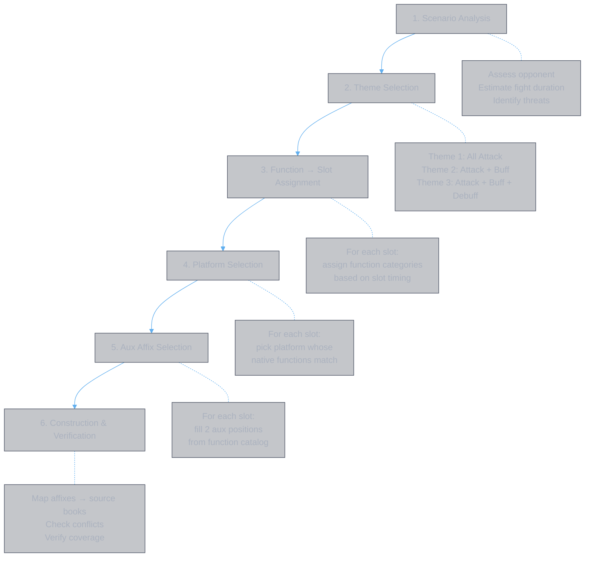
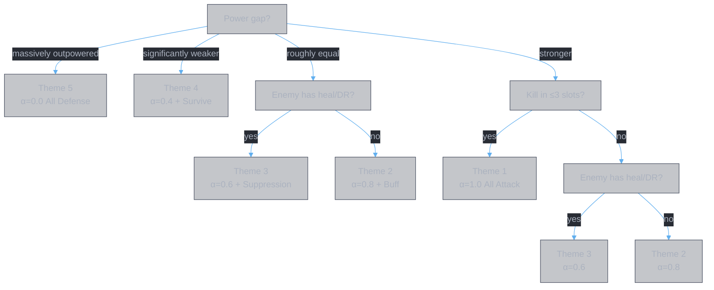
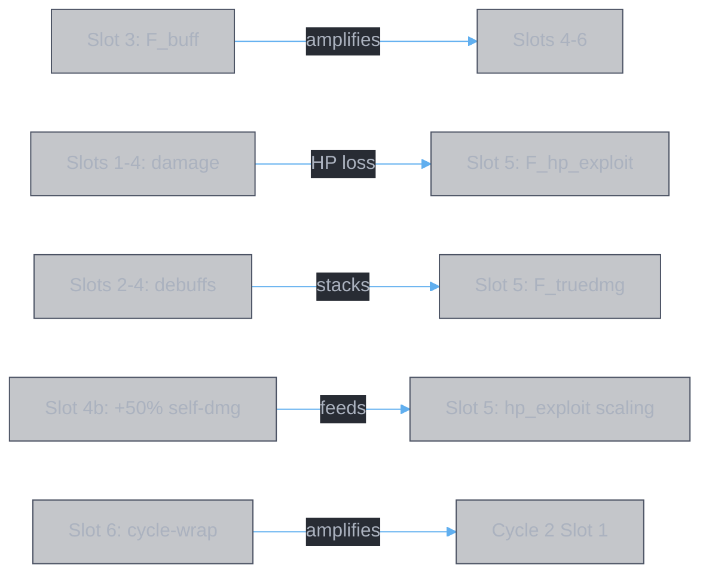
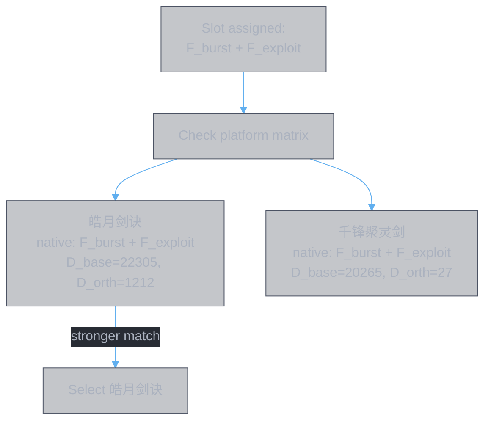
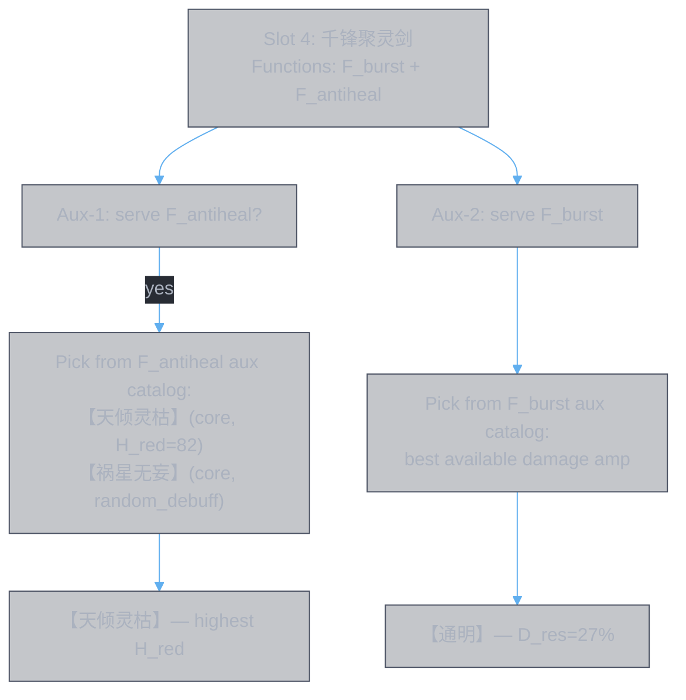
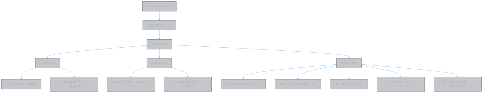

<style>
body {
  max-width: none !important;
  width: 95% !important;
  margin: 0 auto !important;
  padding: 20px 40px !important;
  background-color: #282c34 !important;
  color: #abb2bf !important;
  font-family: -apple-system, BlinkMacSystemFont, "Segoe UI", Helvetica, Arial, sans-serif !important;
  line-height: 1.6 !important;
  -webkit-print-color-adjust: exact !important;
  print-color-adjust: exact !important;
}

h1, h2, h3, h4, h5, h6 {
  color: #ffffff !important;
}

a {
  color: #61afef !important;
}

code {
  background-color: #3e4451 !important;
  color: #e5c07b !important;
  padding: 2px 6px !important;
  border-radius: 3px !important;
}

pre {
  background-color: #2c313a !important;
  border: 1px solid #4b5263 !important;
  border-radius: 6px !important;
  padding: 16px !important;
  overflow-x: auto !important;
}

pre code {
  background-color: transparent !important;
  color: #abb2bf !important;
  padding: 0 !important;
  border-radius: 0 !important;
  font-size: 13px !important;
  line-height: 1.5 !important;
}

table {
  border-collapse: collapse !important;
  width: auto !important;
  margin: 16px 0 !important;
  table-layout: auto !important;
  display: table !important;
}

table th,
table td {
  border: 1px solid #4b5263 !important;
  padding: 8px 10px !important;
  word-wrap: break-word !important;
}

table th:first-child,
table td:first-child {
  min-width: 60px !important;
}

table th {
  background: #3e4451 !important;
  color: #e5c07b !important;
  font-size: 14px !important;
  text-align: center !important;
}

table td {
  background: #2c313a !important;
  font-size: 12px !important;
  text-align: left !important;
}

blockquote {
  border-left: 3px solid #4b5263 !important;
  padding-left: 10px !important;
  color: #5c6370 !important;
  background-color: #2c313a !important;
}

strong {
  color: #e5c07b !important;
}
</style>

# Build Process — 灵書 Set Construction Guide

**Authors:** Z. Zhang & Claude Opus 4.6 (Anthropic)

This document defines the process for constructing a 6-slot 灵書 set for PvP. It references model docs as building blocks and points to working examples.

---

## Process Overview



---

## Step 1: Scenario Analysis

**Input:** Opponent information (power level, known build, playstyle).

**Output:** Fight characteristics that constrain the build.

| Question | Determines |
|:---------|:-----------|
| Is the opponent stronger, equal, or weaker? | How much you need to survive vs pure offense |
| Does the opponent have healing? | Whether F_antiheal is needed |
| Does the opponent have damage reduction? | Whether F_dr_remove is needed |
| Does the opponent have initial immunity? | Whether early slots should be setup (buff/debuff) instead of burst |
| Expected fight duration? | 1 cycle (24s) or 2+ cycles (48s+) — affects buff timing and cycle-wrap value |

**Examples:**
- [pvp.md §1.2](pvp.md) — "Against Stronger Opponent": asymmetry features, fight duration ~43s, strategy derivation
- [pvp.md §2.1](pvp.md) — "Against Opponent with Initial Immunity": immunity window analysis
- [pvp.md §3.1](pvp.md) — "Standard PvP Meta": equal power, mutual immunity

---

## Step 2: Theme Selection

**Input:** Scenario observables from step 1.

**Output:** A theme α ∈ [0,1] (offense/defense ratio).

Theme selection is a **decision tree** over scenario observables. The first split is power gap, then enemy capabilities:



| Theme | α | Burst slots | Strategic variance | When to use |
|:------|:--|:-----------|:-------------------|:-----------|
| **Theme 1** | 1.0 | 5 | Low — forced all-burst | Damage race, kill fast |
| **Theme 2** | 0.8 | 4 | Medium — which burst to drop | General purpose |
| **Theme 3** | 0.6 | 4 | **High** — slot 4 has 5+ variants | Opponent has heal/DR |
| **Theme 4** | 0.4 | 3 | Medium — limited def platforms | Dying before slot 5 |
| **Theme 5** | 0.0 | 2 | Low — forced all-defense | Massively outpowered |

At the extremes (α≈0 or α≈1), the build is forced — few choices. In the middle (α≈0.5-0.6), strategic variance peaks — the most slot variants and adaptive branching options.

**Reference:** [function-themes.md §Theme Selection](../model/function-themes.md) — full decision tree with scenario observables, slot-level adaptations, pre-build inventory.

---

## Step 3: Function → Slot Assignment

**Input:** Chosen theme + slot timing constraints.

**Output:** For each slot, which function categories it must serve.

### Slot Timing Constraints

Slots fire sequentially at T_gap ≈ 4s. Each function has a temporal sweet spot:

| Slot | Time | Natural functions | Why |
|:-----|:-----|:-----------------|:----|
| 1 | t=0s | F_burst | Alpha strike — enemy full HP |
| 2 | t=4s | F_burst, F_exploit | Follow-up — %maxHP while enemy HP high |
| 3 | t=8s | F_buff | Buff duration covers slots 4-6 |
| 4 | t=12s | F_burst + utility | Under buff, enemy healing starts |
| 5 | t=16s | F_hp_exploit, F_truedmg | Own HP low, debuffs accumulated |
| 6 | t=20s | F_burst + F_dr_remove | Enemy DR stacked, cycle-wrap |

### Function Dependencies

Some function assignments depend on earlier slots:



Moving F_buff to slot 1 wastes buff duration. Moving F_hp_exploit to slot 2 has no HP loss to exploit. The ordering follows the dependency chain.

### Example Assignment (Theme 3)

| Slot | Native function | Aux function | Total |
|:-----|:---------------|:-------------|:------|
| 1 | F_burst | — | F_burst |
| 2 | F_burst, F_exploit | — | F_burst, F_exploit |
| 3 | F_buff, F_sustain | — | F_buff, F_sustain |
| 4 | F_burst | F_antiheal | F_burst, F_antiheal |
| 5 | F_hp_exploit | F_truedmg | F_hp_exploit, F_truedmg |
| 6 | F_burst, F_dot | F_dr_remove | F_burst, F_dot, F_dr_remove |

**Reference:** [function-themes.md §Function Catalog](../model/function-themes.md) — three-tier structure (native platforms, aux affixes, adaptable platforms) for all 13 functions.

---

## Step 4: Platform Selection

**Input:** Function assignment per slot.

**Output:** One platform (main skill book) per slot.

For each slot, choose the platform whose native functions best match the assigned functions:



### Platform Pool

| Platform | D_base | Native functions | Best for slot |
|:---------|:-------|:----------------|:-------------|
| `春黎剑阵` | 22305 | F_burst (summon ×2.62) | 1 (alpha strike) |
| `皓月剑诀` | 22305 | F_burst, F_exploit, F_dot | 2 (%maxHP) |
| `念剑诀` | 22305 | F_burst, F_dot | 6 (cycle-wrap) |
| `甲元仙符` | 21090 | F_buff, F_sustain | 3 (buff timing) |
| `千锋聚灵剑` | 20265 | F_burst | 4 (flex) |
| `大罗幻诀` | 20265 | F_burst, F_truedmg, F_dot | 6 alt (M_final) |
| `玄煞灵影诀` | — | F_hp_exploit | 5 (HP drain) |
| `十方真魄` | 1500 | F_survive, F_buff, F_hp_exploit | 4 alt (defensive) |
| `疾风九变` | 1500 | F_counter, F_sustain, F_hp_exploit | 4 alt (counter) |
| `无相魔劫咒` | 1500 | F_delayed, F_truedmg | — (D_base too low) |

**Reference:** [function-themes.md §Platform × Function Matrix](../model/function-themes.md) — complete platform-to-function mapping with baseline vectors.

---

## Step 5: Aux Affix Selection

**Input:** Platform per slot + function assignment.

**Output:** 2 aux affixes per slot (12 total).

Each slot has 2 aux positions. For each position, pick from:
1. **Function-serving affixes** — core or amplifier for the slot's assigned functions
2. **Damage amplification** — if no utility function needed

### Selection Process



### Constraints

| Constraint | Rule |
|:-----------|:-----|
| Affix uniqueness | Each affix used at most once across all 6 slots |
| Book uniqueness | Each book appears as aux at most once across all 6 slots |
| Dependency pairs | Some affixes need a partner (e.g. 【索心真诀】needs [Debuff] provider → 【无相魔威】) |
| School match | School affixes follow aux book's school, not main's |
| Binding validity | Affix requires must be satisfied by platform + combo provides |

### Aux Catalog

The function catalog lists all available aux affixes per function:

```
bun app/function-combos.ts --catalog
```

**Reference:** [function-themes.md §Function Catalog — Three-Tier Structure](../model/function-themes.md) — aux affixes (core + amplifier) for each function.

---

## Step 6: Construction & Verification

**Input:** Platform + 2 aux affixes per slot.

**Output:** 灵書 build specification + verification.

### 6a. Map Affixes to Source Books

Each aux affix comes from a specific source book:

| Affix type | How to find source book |
|:-----------|:----------------------|
| Exclusive (专属) | Each book has exactly one — lookup in affix registry |
| School (修为) | Any book of that school |
| Universal (通用) | Any book |

### 6b. Verify Conflict Rules

| Check | Rule | Consequence of violation |
|:------|:-----|:------------------------|
| Core conflict | Same book as main in two slots | Later slot's skill disabled entirely |
| Affix conflict | Same book as aux in two slots | Later slot's affix disabled |
| Cross-type reuse | Book as main in one slot, aux in another | **No conflict** (legal) |
| Aux uniqueness | Each book as aux at most once | Violation → affix disabled |

### 6c. Coverage Check

Verify all required functions are served:

| Function | Required by theme | Served at slot | Via (native/aux) |
|:---------|:-----------------|:--------------|:-----------------|
| F_burst | Theme 1/2/3 | Slots 1,2,4,6 | native |
| F_buff | Theme 2/3 | Slot 3 | native |
| F_antiheal | Theme 3 | Slot 4 | aux |
| ... | ... | ... | ... |

---

## Adaptive Branching

After constructing a base build from a theme, prepare **variants** for flex slots. Slot 4 sits at the offense/defense boundary and has the most variants.



Pre-build multiple 灵書 for flex slots. Choose which set to equip before each match based on opponent assessment.

**Reference:** [function-themes.md §Adaptive Strategies](../model/function-themes.md) — decision tree, adaptation variants, pre-build inventory.

---

## Working Examples

| Example | Scenario | Theme | Doc |
|:--------|:---------|:------|:----|
| vs stronger opponent | Asymmetric power, need to survive | Theme 3 (attack + buff + debuff) | [pvp.md §1](pvp.md) |
| vs opponent with immunity | Early slots wasted → setup first | Theme 3, reordered (buff→debuff→burst) | [pvp.md §2](pvp.md) |
| Standard meta (mutual immunity) | Equal power, known opponent | Theme 3 with cycle-wrap | [pvp.md §3](pvp.md) |
| Tool-assisted build (Scenario A) | Defensive, vs stronger | Theme 3 | [pvp.zz.tools.md](../pvp.zz.tools.md) |
| Tool-assisted build (Scenario B) | Aggressive, vs equal/weaker | Theme 3, slot 4 → self-damage | [pvp.zz.tools.md](../pvp.zz.tools.md) |

---

## Model References

| Model | What it provides | Doc |
|:------|:----------------|:----|
| Function categories | 13 functions, three-tier structure (platform/aux/adaptable) | [function-themes.md](../model/function-themes.md) |
| Themes & slot assignment | Theme 1-5 spectrum, slot timing, coverage, decision tree | [function-themes.md](../model/function-themes.md) |
| Combat model (qualitative) | Damage chain, factor zones, multiplicative structure | [combat.qualitative.md](../model/combat.qualitative.md) |
| Binding quality (BQ) | Affix pair scoring: utilization, platform fit, zone breadth | [impl.binding-quality.md](../model/impl.binding-quality.md) |
| Time-series model | Temporal factor vectors, summon envelopes, buff duration | [impl.time-series.md](../model/impl.time-series.md) |
| Domain categories | Effect types, target categories, zone mapping | [domain.category.md](../data/domain.category.md) |

### Tools

| Tool | Purpose | When to use |
|:-----|:--------|:-----------|
| `bun app/function-combos.ts --catalog` | List aux affixes per function | Step 5 (aux selection) |
| `bun app/function-combos.ts --fn X --platform Y --top N` | Rank combos for a function × platform | Step 5 (aux ranking) |
| `bun app/combo-rank.ts --platform X --top N` | Rank all combos for a platform | Step 5 (general ranking) |
| `bun app/book-vector.ts --platform X --op1 Y --op2 Z` | Time-series factor vectors | Step 5 (temporal analysis) |
| `bun app/book-vector-chart.ts --platform X` | HTML chart visualization | Step 5 (visual inspection) |
