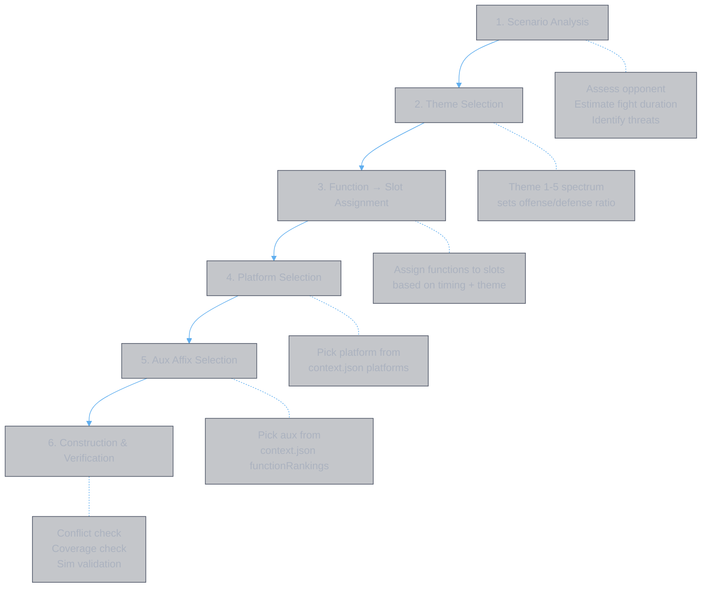
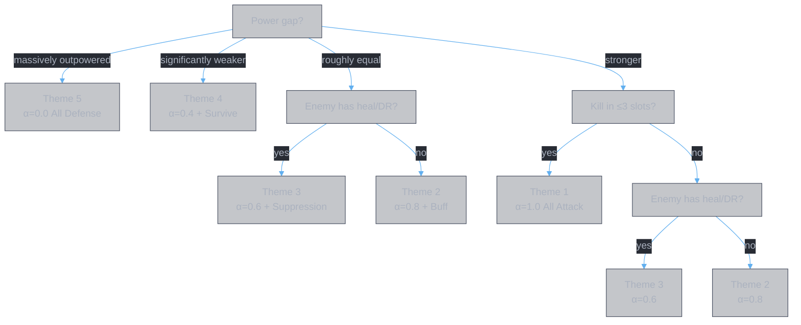
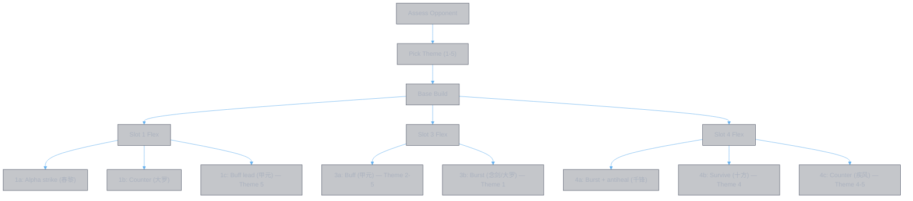

<style>
body {
  max-width: none !important;
  width: 95% !important;
  margin: 0 auto !important;
  padding: 20px 40px !important;
  background-color: #282c34 !important;
  color: #abb2bf !important;
  font-family: -apple-system, BlinkMacSystemFont, "Segoe UI", Helvetica, Arial, sans-serif !important;
  line-height: 1.6 !important;
  -webkit-print-color-adjust: exact !important;
  print-color-adjust: exact !important;
}

h1, h2, h3, h4, h5, h6 {
  color: #ffffff !important;
}

a {
  color: #61afef !important;
}

code {
  background-color: #3e4451 !important;
  color: #e5c07b !important;
  padding: 2px 6px !important;
  border-radius: 3px !important;
}

pre {
  background-color: #2c313a !important;
  border: 1px solid #4b5263 !important;
  border-radius: 6px !important;
  padding: 16px !important;
  overflow-x: auto !important;
}

pre code {
  background-color: transparent !important;
  color: #abb2bf !important;
  padding: 0 !important;
  border-radius: 0 !important;
  font-size: 13px !important;
  line-height: 1.5 !important;
}

table {
  border-collapse: collapse !important;
  width: auto !important;
  margin: 16px 0 !important;
  table-layout: auto !important;
  display: table !important;
}

table th,
table td {
  border: 1px solid #4b5263 !important;
  padding: 8px 10px !important;
  word-wrap: break-word !important;
}

table th:first-child,
table td:first-child {
  min-width: 60px !important;
}

table th {
  background: #3e4451 !important;
  color: #e5c07b !important;
  font-size: 14px !important;
  text-align: center !important;
}

table td {
  background: #2c313a !important;
  font-size: 12px !important;
  text-align: left !important;
}

blockquote {
  border-left: 3px solid #4b5263 !important;
  padding-left: 10px !important;
  color: #5c6370 !important;
  background-color: #2c313a !important;
}

strong {
  color: #e5c07b !important;
}
</style>

# Build Process — 灵書 Set Construction Guide

**Authors:** Z. Zhang & Claude Opus 4.6 (Anthropic)

This document defines the end-to-end process for constructing a 6-slot 灵書 set — from data entry through reasoning to final build output.

---

## Data Pipeline

Construction starts from structured data, not raw text. The pipeline:


### Data stores

| File | Role | Updated by |
|:-----|:-----|:-----------|
| `data/raw/game.data.json` | Source of truth — all books, effects, affixes | Editor (`bun run editor`) |
| `data/yaml/books.yaml` | Parsed structured YAML — effects as typed arrays | Parser (`bun run parse` or editor's gen-yaml) |
| `data/yaml/affixes.yaml` | Parsed affix data — universal, school, exclusive | Parser |
| `data/builds/{name}/context.json` | Build-specific context — platforms, rankings, vectors | `bun scripts/construct-data.ts` |

### Tools

| Command | What it does | When to use |
|:--------|:-------------|:------------|
| `bun run editor` | Launch data editor (port 3002) | Edit book effects, affixes, view parse results |
| `bun run parse` | Regenerate YAML from game.data.json | After editing raw data |
| `bun scripts/construct-data.ts --character X --scenario Y` | Generate context.json for a build | Before starting construction reasoning |
| `bun app/function-combos.ts --fn X --platform Y --top N` | Rank aux affix pairs for a function × platform | During Step 5 (aux selection) |
| `bun app/book-vector.ts --book X --json` | Time-series factor vectors for a book | During Step 5 (temporal analysis) |
| `bun app/simulate.ts --sweep --json --a X --b Y` | Validate slot damage output | After Step 6 (verification) |

### Preparing for construction

Before reasoning, ensure data is current:

```bash
# 1. Edit data if needed
bun run editor

# 2. Regenerate YAML
bun run parse

# 3. Generate build context
bun scripts/construct-data.ts --character "剑九" --scenario "pvp vs stronger" --school Sword
```

This produces `data/builds/剑九-pvp-vs-stronger/context.json` containing:
- `platforms` — all books with effects, dBase, hits, native functions
- `affixPool` — all available affixes by kind (universal, school, exclusive)
- `functionRankings` — top aux combos per function × platform
- `timeSeriesVectors` — per-second factor values per book
- `constraints` — build rules

---

## Construction Process

Six steps. Steps 1-2 are scenario-driven decisions. Steps 3-5 use context.json data. Step 6 validates.



---

### Step 1: Scenario Analysis

**Input:** Opponent information (power level, known build, playstyle).

**Output:** Fight characteristics that constrain the build.

| Question | Determines |
|:---------|:-----------|
| Is the opponent stronger, equal, or weaker? | How much you need to survive vs pure offense |
| Does the opponent have healing? | Whether F_antiheal is needed |
| Does the opponent have damage reduction? | Whether F_dr_remove is needed |
| Does the opponent have initial immunity? | Whether early slots should be setup (buff/debuff) instead of burst |
| Expected fight duration? | 1 cycle (30s) or 2+ cycles (60s+) — affects buff timing and cycle-wrap value |

---

### Step 2: Theme Selection

**Input:** Scenario observables from Step 1.

**Output:** A theme α ∈ [0,1] (offense/defense ratio).



| Theme | α | Burst slots | Strategic variance | When to use |
|:------|:--|:-----------|:-------------------|:-----------|
| **Theme 1** | 1.0 | 5 | Low — forced all-burst | Damage race, kill fast |
| **Theme 2** | 0.8 | 4 | Medium — which burst to drop | General purpose |
| **Theme 3** | 0.6 | 4 | **High** — slot 4 has 5+ variants | Opponent has heal/DR |
| **Theme 4** | 0.4 | 3 | Medium — limited def platforms | Dying before slot 5 |
| **Theme 5** | 0.0 | 2 | Low — forced all-defense | Massively outpowered |

**Reference:** [function.themes.md §Theme Selection](../model/function.themes.md)

---

### Step 3: Function → Slot Assignment

**Input:** Chosen theme + slot timing constraints.

**Output:** For each slot, which function categories it must serve.

Slots fire sequentially at T_gap ≈ 6s. Each function has a temporal sweet spot:

| Slot | Time | Natural functions | Why |
|:-----|:-----|:-----------------|:----|
| 1 | t=0 | F_burst | Alpha strike — enemy full HP |
| 2 | t=6 | F_burst, F_exploit | Follow-up — %maxHP while enemy HP high |
| 3 | t=12 | F_buff | Buff duration covers slots 4-6 |
| 4 | t=18 | F_burst + utility | Under buff, enemy healing starts |
| 5 | t=24 | F_hp_exploit, F_truedmg | Own HP low, debuffs accumulated |
| 6 | t=30 | F_burst + F_dr_remove | Enemy DR stacked, cycle-wrap |

**Data source:** `context.json → platforms[book].nativeFunctions` maps each platform to its native functions.

**Reference:** [function.themes.md §Function Catalog](../model/function.themes.md)

---

### Step 4: Platform Selection

**Input:** Function assignment per slot.

**Output:** One platform (main skill book) per slot.

For each slot, choose the platform from `context.json → platforms` whose `nativeFunctions` best match the assigned functions. Use `dBase` as tiebreaker (higher = better for burst slots).

| Platform | D_base | Native functions | Best for slot |
|:---------|:-------|:----------------|:-------------|
| `春黎剑阵` | 22305 | F_burst (summon ×2.62) | 1 (alpha strike) |
| `皓月剑诀` | 22305 | F_burst, F_exploit, F_dot | 2 (%maxHP) |
| `念剑诀` | 22305 | F_burst, F_dot | 6 (cycle-wrap) |
| `甲元仙符` | 21090 | F_buff, F_sustain | 3 (buff timing) |
| `千锋聚灵剑` | 20265 | F_burst | 4 (flex) |
| `大罗幻诀` | 20265 | F_burst, F_truedmg, F_dot | 6 alt (M_final) |
| `玄煞灵影诀` | — | F_hp_exploit | 5 (HP drain) |
| `十方真魄` | 1500 | F_survive, F_buff, F_hp_exploit | 4 alt (defensive) |
| `疾风九变` | 1500 | F_counter, F_sustain, F_hp_exploit | 4 alt (counter) |
| `无相魔劫咒` | 1500 | F_delayed, F_truedmg | — (D_base too low) |

**Data source:** `context.json → platforms[book].dBase`, `platforms[book].nativeFunctions`

---

### Step 5: Aux Affix Selection

**Input:** Platform per slot + function assignment.

**Output:** 2 aux affixes per slot (12 total).

Each slot has 2 aux positions. For each position, pick from:
1. **Function-serving affixes** — core or amplifier for the slot's assigned functions
2. **Damage amplification** — if no utility function needed

**Important: select by effect type and value, not by affix name.** See the `selection.*.md` series for rigorous selection processes:

- [selection.amp.md](selection.amp.md) — amplifier selection (5-step process + complete inventory)

**Data source:** `context.json → functionRankings[fnId][platformId]` provides ranked aux pairs per function × platform. Note: `functionRankings` scores by catalog name, not effect type — use selection docs for effect-type comparison.

```bash
# Ad-hoc ranking query
bun app/function-combos.ts --fn F_burst --platform 千锋聚灵剑 --top 5
```

### Constraints

| Constraint | Rule |
|:-----------|:-----|
| Affix uniqueness | Each affix used at most once across all 6 slots |
| Book uniqueness | Each book appears as aux at most once across all 6 slots |
| Dependency pairs | Some affixes need a partner (e.g. 索心真诀 needs debuff provider) |
| School match | School affixes follow aux book's school, not main's |
| Binding validity | Affix requires must be satisfied by platform + combo provides |

**Data source:** `context.json → constraints.rules`, validated by `lib/construct/constraints.ts::isValidPair()`

---

### Step 6: Construction & Verification

**Input:** Platform + 2 aux affixes per slot.

**Output:** Build table + verification results.

#### 6a. Map Affixes to Source Books

| Affix type | How to find source book |
|:-----------|:----------------------|
| Exclusive (专属) | Each book has exactly one — lookup in `context.json → platforms[book].exclusiveAffix` |
| School (修为) | Any book of that school — lookup in `context.json → affixPool.school` |
| Universal (通用) | Any book — lookup in `context.json → affixPool.universal` |

#### 6b. Verify Conflict Rules

| Check | Rule | Consequence of violation |
|:------|:-----|:------------------------|
| Core conflict | Same book as main in two slots | Later slot's skill disabled entirely |
| Affix conflict | Same book as aux in two slots | Later slot's affix disabled |
| Cross-type reuse | Book as main in one slot, aux in another | **No conflict** (legal) |

#### 6c. Sim Validation

```bash
bun app/simulate.ts --sweep --json --a "{platform}" --b "{default opponent}" --top 10
```

Check: is the selected affix pair in the top 10 for each slot? If not, flag it. The sim validates per-slot damage output, not cross-slot synergy.

#### 6d. Coverage Check

Verify all required functions are served:

| Function | Required by theme | Served at slot | Via (native/aux) |
|:---------|:-----------------|:--------------|:-----------------|
| F_burst | Theme 1/2/3 | Slots 1,2,4,6 | native |
| F_buff | Theme 2/3 | Slot 3 | native |
| F_antiheal | Theme 3 | Slot 4 | aux |
| ... | ... | ... | ... |

---

## Iteration

A single pass through Steps 1-6 produces **Proposal 1**. Identify its weaknesses, then iterate:

```
Proposal 1 → weaknesses → Proposal 2 → weaknesses → ... → final build
```

Each iteration follows the same structure:
1. State the weaknesses from the previous proposal
2. For each weakness, list possible enhancements
3. Analyze each enhancement (what it gains, what it loses, explicit tradeoff)
4. Verdict: fix it, or accept as structural tradeoff with mitigation

When all weaknesses are either fixed or accepted, the build is at a **local optimum**. Further improvement requires changing the feature assignment (Step 3), not just swapping aux affixes (Step 5).

**Working example:** [pvp.so.1.md](pvp.so.1.md) → [pvp.so.2.md](pvp.so.2.md) → [pvp.so.3.md](pvp.so.3.md) → [pvp.so.4.md](pvp.so.4.md)

---

## Adaptive Branching

After reaching a local optimum, prepare **variants** for matchup-dependent slots.



Pre-build multiple 灵書 for flex slots. Choose which set to equip before each match based on opponent assessment.

**Reference:** [function.themes.md §Adaptive Strategies](../model/function.themes.md)

---

## Specializations

For specific routes, use the specialized construction guide on top of this generic process:

| Route | Specialization doc | What it adds |
|:------|:-------------------|:-------------|
| Route 2: Weapon support | [weapon.support.build.md](weapon.support.build.md) | Feature/amplifier/sustain layers, slot-to-feature mapping |

---

## Working Examples

| Example | Scenario | Theme | Doc |
|:--------|:---------|:------|:----|
| 剑九 vs stronger (Var A) | Asymmetric power, dual-channel opener | Theme 3 | [剑九.md §Var A](../../data/books/剑九.md) |
| 剑九 vs stronger (Var B) | Counter-reflection opener vs aggressive | Theme 3 | [剑九.md §Var B](../../data/books/剑九.md) |
| 剑九 vs weaker | Weaker opponent, pure offense | Theme 2 | [剑九.md §pvp weaker](../../data/books/剑九.md) |
| pvp vs stronger iteration | 4-proposal iteration chain | Theme 3 | [pvp.so.1.md](pvp.so.1.md) → [pvp.so.4.md](pvp.so.4.md) |

---

## Model References

| Model | What it provides | Doc |
|:------|:----------------|:----|
| Weapon support taxonomy | Feature/amplifier/sustain layers for Route 2 builds | [weapon.support.taxonomy.md](../model/weapon.support.taxonomy.md) |
| Function categories | 13 functions, three-tier structure (platform/aux/adaptable) | [function.themes.md](../model/function.themes.md) |
| Themes & slot assignment | Theme 1-5 spectrum, slot timing, coverage, decision tree | [function.themes.md](../model/function.themes.md) |
| Combat model (qualitative) | Damage chain, factor zones, multiplicative structure | [combat.qualitative.md](../model/combat.qualitative.md) |
| Binding quality (BQ) | Affix pair scoring: utilization, platform fit, zone breadth | [impl.binding.quality.md](../model/impl.binding.quality.md) |
| Time-series model | Temporal factor vectors, summon envelopes, buff duration | [impl.time.series.md](../model/impl.time.series.md) |
| Domain categories | Effect types, target categories, zone mapping | [domain.category.md](../data/domain.category.md) |
