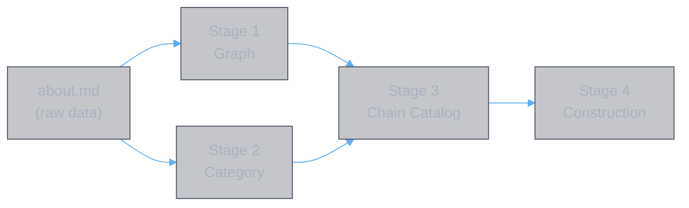

# Chain Construction Guide

**Authors:** Z. Zhang & Claude Opus 4.6 (Anthropic)

> **Walkthrough of the chain-first process from `about.md` to a complete book set.** This guide describes the four stages — graph, category, chain catalog, construction — and what each stage produces. Details live in the individual documents; this guide explains the sequence and how the stages connect.

---

## Overview

| Stage | Document | Input | Output |
|:------|:---------|:------|:-------|
| 1. Graph | [domain.graph.md](../data/domain.graph.md) | `about.md` effect types | Closed network model (terminals, connectors, ports, loops) |
| 2. Category | [domain.category.md](../data/domain.category.md) | `about.md` affixes | Affix taxonomy (tiers, interaction types, subcategory associations) |
| 3. Chain Catalog | [domain.path.md](../data/domain.path.md) | Graph + Category | All qualified chains, structural properties, combo pairing tables |
| 4. Construction | [pvp.chain.md](./pvp.chain.md) | Chain Catalog + Scenario | Complete book set |

Stages 1 and 2 read `about.md` independently — they can be done in parallel. Stage 3 depends on both. Stage 4 depends on Stage 3 plus a PvP scenario.

---

## Stage 1: Graph

**Document:** [domain.graph.md](../data/domain.graph.md)

**What to do.** Read all effect types from `about.md` and formalize their relationships as a closed two-terminal network.

1. **Define terminals.** Player A and Player B, each with HP, ATK, DEF, and active states (buffs, debuffs, shields).

2. **Classify connectors.** Every effect type falls into exactly one of four connector directions:
   - Self-input (A → Network): resources the player contributes (HP cost, stats)
   - Offense (Network → B): damage, debuffs, dispels applied to enemy
   - Opponent-state reads (B → Network): effects that scale with enemy state (HP lost, debuff stacks)
   - Self-benefit (Network → A): healing, shields, buffs applied to self

3. **Annotate ports.** Each effect type node gets typed input/output ports — what it requires (input) and what it produces (output). A chain is valid only when every node's input ports are satisfied by upstream outputs.

4. **Identify bridges.** Effects that convert one resource into another (damage → shield, healing → damage, damage → lifesteal). These create indirect paths between otherwise disconnected subgraphs.

5. **Trace feedback loops.** Cycles in the graph where output feeds back as input (damage → HP loss → more damage). List each loop and its constituent nodes.

6. **Write the chain discovery algorithm.** A procedure for enumerating all valid paths from terminal A to terminal B through the network.

> **The graph is scenario-independent.** It describes what CAN connect, not what SHOULD connect. Scenario-specific decisions happen in Stage 4.

---

## Stage 2: Category

**Document:** [domain.category.md](../data/domain.category.md)

**What to do.** Read all 61 affixes from `about.md` and classify each by its combat role and interaction structure.

1. **Assign tiers.** Every affix is one of:
   - Source — produces a combat effect directly, has standalone value
   - Amplifier — multiplies an existing source, needs its target in the build
   - Enabler — makes an amplifier/source viable, needs its target in the build
   - Context modifier — changes data_state, altering what effects exist

2. **Label interaction types.** Each affix's relationships are one of: static (always modifies B), conditional (only when condition met), cross-cutting (modifies multiple chains), dynamic (depends on placement).

3. **Build subcategory associations.** Group affixes by shared properties (probability-based, time-based, HP-loss-dependent, etc.). For each subcategory, list the member affixes and their natural partners. This table is the construction shortcut — it narrows the search space from 61 to the relevant handful.

4. **Walk all affixes.** For each of the three pools (universal, school, exclusive), write one row: affix name, effect types, chain classification, tier, and dependencies/notes.

> **Convention:** skill books in backticks (`` `book` ``), affixes in lenticular brackets (【affix】).

---

## Stage 3: Chain Catalog

**Document:** [domain.path.md](../data/domain.path.md)

**What to do.** Project the graph (Stage 1) back to book space using the taxonomy (Stage 2). Enumerate every qualified chain — a path through the graph where all nodes have their inputs satisfied and every node maps to a concrete affix on a concrete skill book.

1. **Define the effect type glossary.** One table listing every effect type symbol and its meaning, grouped by role (offense, bridges, debuffs, buffs, survival, amplifiers, cross-cutting, enablers, resource generators).

2. **Enumerate paths by category.** Nine sections:
   - §I Offense paths (A → B.hp)
   - §II Bridge paths (resource conversion)
   - §III Debuff paths (A → B.state)
   - §IV Self-buff paths (A → A.stats)
   - §V Survival paths (preserving A.hp)
   - §VI Cross-cutting amplifiers (X1–X3) — with **combo pairing tables**
   - §VII Damage amplifiers (conditional, per-hit, per-state)
   - §VIII Enablers (E1–E5) — with **combo pairing tables**
   - §IX Structural properties (bottlenecks, monopolies, rich paths, competitors)

   For each path: list the nodes in the chain, then the concrete book chains that realize it.

3. **Build combo pairing tables.** Cross-cutting amplifiers and enablers have no intrinsic output. Their value = f(what they pair with). For each one, build a ranked table of combos showing combined output, zone quality, and conditions. This is the critical step — without it, construction compares apples to oranges.

4. **Identify structural properties.** Scan the catalog for:
   - Bottleneck paths — chains where one node has no substitute
   - Monopoly nodes — affixes that are the sole provider of an effect type
   - Rich paths — chains with many alternative realizations
   - Competing affixes — pairs that contest the same slot

> **Same-灵書 vs cross-灵書.** Chains where the amplifier must be on the same 灵書 as the source (scope = "本神通") constrain what goes together. Chains where effects persist as states on players work from any slot. This distinction determines whether a chain constrains construction or slot ordering.

---

## Stage 4: Construction

**Document:** [pvp.chain.md](./pvp.chain.md)

**What to do.** Given a PvP scenario, select chains from the catalog (Stage 3) that satisfy the win condition, resolve conflicts, and map the result to a 6-slot book set.

### The 7-step pipeline

| Step | What to do | Space |
|:-----|:-----------|:------|
| **1. Scenario** | Define matchup conditions (stat asymmetry, immunities, planning horizon) | Physical |
| **2. Functions** | Decompose the win condition into required functions (burst, DR removal, self-buff, HP exploitation, anti-heal, survival, ...) | Abstract |
| **3. Chains** | For each function, select the best chain(s) from the catalog. Use combo pairing tables for amplifiers/enablers. Use subcategory associations to narrow the search. | Effect |
| **4. Conflicts** | Check uniqueness constraint: each affix appears exactly once. If two chains share an affix, one must yield. Resolve by comparing marginal value. | Effect |
| **5. Reverse map** | Map each affix back to its skill book. Group into 灵書 (1 main + 2 aux skill books per 灵書). Same-灵書 chains must be on the same 灵書. | Book |
| **6. Construct** | Assign skill books to 灵書 respecting scope rules. Each skill book appears at most once as main and once as aux. | Physical |
| **7. Slot order** | Order the 6 灵書 temporally. Cross-灵書 chains constrain ordering (buffs before damage, debuffs before conditionals). | Physical |

### Principles

- **Chains first, books second.** Work in effect space (Steps 2–4), then map to book space (Steps 5–7). Never start from "which books are good" — start from "which functions are needed."

- **Compare combos, not affixes.** Amplifiers and enablers must be evaluated as pairs. 【天命有归】 alone has no output. 【天命有归】+【心逐神随】= ×6.00. The combo is the unit of comparison.

- **Zone quality matters.** An amplifier in a crowded zone (ATK under 仙佑 +142.8%) contributes less marginal value than an amplifier in an empty zone (final damage). Always compute marginal multiplier, not face value.

- **Enablers are scenario-dependent.** Against a stronger opponent who inflicts HP loss for free, HP-loss enablers are redundant. Against an equal opponent, they may be essential. The chain catalog is fixed; which chains are selected depends on the scenario.

- **Monopoly chains are forced.** If a function requires an effect type that only one affix provides (monopoly node), that affix is in the build unconditionally. Start from monopolies and build outward.

---

## Repeating the Process

To construct a book set for a new scenario:

1. **Check if the catalog is current.** If `about.md` has changed, re-run Stages 1–3. If not, skip to Stage 4.

2. **Define the scenario** (Step 1). What are the matchup conditions? What is the win condition? What is the planning horizon?

3. **Decompose into functions** (Step 2). What does the build need to do? Each function maps to one 灵書.

4. **Select chains** (Step 3). For each function, consult the catalog. Use combo pairing tables for amplifiers/enablers. Use subcategory associations to narrow the search.

5. **Resolve conflicts** (Step 4). Check that no affix appears twice. If it does, the lower-value chain loses the affix and must find an alternative.

6. **Map to books** (Steps 5–7). Group affixes into 灵書, assign slot order, verify all constraints.

The result is a complete 6-slot build derived entirely from effect chains — reproducible by anyone with access to the catalog.

---

## Document History

| Version | Date | Changes |
|---------|------|---------|
| 1.0 | 2026-02-27 | Initial: 4-stage walkthrough (graph → category → chain catalog → construction) |
