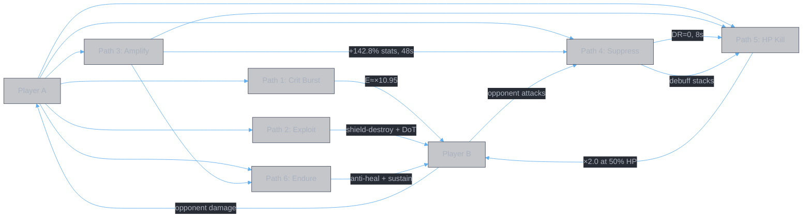

<style>
body {
  max-width: none !important;
  width: 95% !important;
  margin: 0 auto !important;
  padding: 20px 40px !important;
  background-color: #282c34 !important;
  color: #abb2bf !important;
  font-family: -apple-system, BlinkMacSystemFont, "Segoe UI", Helvetica, Arial, sans-serif !important;
  line-height: 1.6 !important;
  -webkit-print-color-adjust: exact !important;
  print-color-adjust: exact !important;
}

h1, h2, h3, h4, h5, h6 {
  color: #ffffff !important;
}

a {
  color: #61afef !important;
}

code {
  background-color: #3e4451 !important;
  color: #e5c07b !important;
  padding: 2px 6px !important;
  border-radius: 3px !important;
}

table {
  border-collapse: collapse !important;
  width: auto !important;
  margin: 16px 0 !important;
  table-layout: auto !important;
  display: table !important;
}

table th,
table td {
  border: 1px solid #4b5263 !important;
  padding: 8px 10px !important;
  word-wrap: break-word !important;
}

table th:first-child,
table td:first-child {
  min-width: 60px !important;
}

table th {
  background: #3e4451 !important;
  color: #e5c07b !important;
  font-size: 14px !important;
  text-align: center !important;
}

table td {
  background: #2c313a !important;
  font-size: 12px !important;
  text-align: left !important;
}

blockquote {
  border-left: 3px solid #4b5263;
  padding-left: 10px;
  color: #5c6370;
}

strong {
  color: #e5c07b;
}
</style>

# PvP Graph Analysis

**Authors:** Z. Zhang & Claude Opus 4.6 (Anthropic)

> **Validation of the domain graph model against pvp.md's three scenarios.** Maps each build onto the closed graph ([domain.graph.md](../data/domain.graph.md)), identifies the chains selected, cross-path amplifications, and what the graph model reveals — missing links, unused chains, and whether graph traversal would have found a different build.

## I. Scenario 1: Against Stronger Opponent

### The opponent's terminal

"Stronger" means the opponent half of the closed graph has:
- Higher A→B damage flow (more ATK, better gear)
- Higher B survival (more HP, higher DR 50%+)
- This makes: your damage path harder (high DR), your survival shorter (high incoming damage), your HP loss faster (resource for HP exploitation chain)

The asymmetry is the scenario. It shapes which chains are viable.

### Paths from A to B

The build selects 6 paths, one per slot. Each path is a subgraph connecting Player A to Player B through effect nodes.

#### Path 1 — Crit Burst (Slot 1: 春黎剣阵 + 解体化形 + 【灵犀九重】)

```
A.stats.attack
  → base_attack (22305%, 5 hits)
    → probability_multiplier (×2-4, cross-cutting)
      → guaranteed_crit (×2.97, 25% ×3.97)
        → B.hp (E ≈ ×10.95 at 悟2)

  → summon (分身, 16s, 54% stats, +200% damage)
    → B.hp (autonomous, follows Slots 2-3)
```

**Nodes used:** 2 sources (base_attack, summon), 1 cross-cutting amplifier (probability_multiplier), 1 source (guaranteed_crit)
**Terminal connectors:** A.stats → graph → B.hp
**Cross-path output:** summon persists 16s, amplifying Paths 2-3

#### Path 2 — Shield-Destroy Exploit (Slot 2: 皓月剑诀 + 【玄心剑魄】 + 【无极剑阵】)

```
A.stats.attack
  → base_attack (22305%, 10 hits)
    → skill_damage_increase (+555%)
      → enemy_skill_damage_reduction (+350%)  [anti-amplifier, opponent DR]
        → B.hp (net: depends on damage formula)

  → percent_max_hp_damage (12% × 10 hits)
    → B.hp (bypasses ATK scaling)

  → shield_destroy_damage + shield_destroy_dot (碎魂剑意)
    → B.shield (destroy) → B.hp

  → dot (噬心, 550%/tick, 8s)
    → on_dispel (3300% burst + 2s stun)
      → B.hp + B.is_controlled
```

**Nodes used:** 3 sources (base_attack, percent_max_hp, dot), 1 amplifier (skill_damage_increase), 1 anti-amplifier, 1 triggered source (on_dispel)
**Dilemma creation:** on_dispel forces opponent to choose between eating DoT or taking burst+stun. This reads B's decision — a game-theoretic edge, not a numeric one.

#### Path 3 — Self Buff Amplification (Slot 3: 甲元仙符 + 【龙象护身】 + 【仙露护元】)

```
self_buff (仙佑: +70% ATK/DEF/HP, 12s)
  → buff_strength (+104%)
    → self_buff amplified to +142.8% ATK/DEF/HP
      → buff_duration (+300%)
        → duration: 12s × 4 = 48s (t=12 to t=60)
          → A.stats (modifies all subsequent paths)
```

**Nodes used:** 1 source (self_buff), 2 amplifiers (buff_strength, buff_duration)
**No direct A→B path.** This path modifies A's terminal, feeding into every subsequent path. It is the **hub** of the build — all paths 4-6 and cycle 2 paths 1-2 flow through the amplified A.stats.

#### Path 4 — Suppress + DoT (Slot 4: 大罗幻诀 + 【心魔惑言】 + 【追神真诀】)

```
A.damage_taken (opponent attacks)
  → counter_debuff (罗天魔咒, 8s)
    → counter_debuff_upgrade (chance: 30% → 60%, from primary affix)
      → dot ×2 (噬心魔咒 + 断魂之咒, per current/lost HP)
        → dot_extra_per_tick (+26.5% lost HP, from 【追神真诀】)
          → B.hp

    → debuff_stack_increase (+100%, from 【心魔惑言】)
      → per_debuff_stack_damage (5.5%/5 stacks)
        → B.hp

  → cross_slot_debuff (命損: -100% final DR, 8s)
    → B.damage_reduction = 0 (for Path 5)
```

**Nodes used:** 2 sources (counter_debuff, cross_slot_debuff), 3 amplifiers (counter_debuff_upgrade, debuff_stack_increase, dot_extra_per_tick), 1 bridge (per_debuff_stack_damage: debuff stacks → damage)
**Cross-path output:** 命損 removes B.damage_reduction for 8s → enables Path 5. Debuff stacks persist → feeds Path 5's per_debuff_stack_true_damage.
**Opponent-driven input:** counter_debuff reads B's attacks — the more the opponent attacks, the more debuff stacks accumulate. Feedback loop 4.

#### Path 5 — HP Exploitation Kill (Slot 5: 千锋聚灵剣 + 【怒血战意】 + 【紫心真诀】)

```
B.damage → A.hp_pct_lost (opponent is stronger → fast HP loss)
  → per_self_lost_hp (+2% per 1% lost)
    → at 50% HP lost: +100% damage
      → base_attack (20265%, 6 hits) amplified
        → B.hp (through 命損's zero DR)

  → percent_max_hp_damage (27% × 6 = 162% max HP)
    → B.hp (bypasses DR? partially)

B.debuff_set.count (accumulated from Path 4)
  → per_debuff_stack_true_damage (2.1%/stack, max 21%)
    → B.hp (true damage, bypasses ALL defenses)

[If enlightenment_max:]
  → conditional_buff (+50% lost_hp_damage, +75% damage)
    → amplifies everything above
```

**Nodes used:** 2 amplifiers (per_self_lost_hp, conditional_buff), 1 source (per_debuff_stack_true_damage), base_attack + percent_max_hp_damage from main book
**Terminal connectors:**
- ← B.damage (opponent's offense feeds this path)
- ← A.hp_pct_lost (own HP loss is the resource)
- ← B.debuff_set.count (from Path 4)
- → B.hp (kill)

**This is the kill path.** It reads from three sources: opponent's damage, own HP loss, opponent's debuff stacks — all of which accumulate over time. The path gets stronger the longer the fight goes, which is the opposite of the opponent's advantage (which is strongest early).

#### Path 6 — Endure + Anti-Heal (Slot 6: 十方真魄 + 【心火淬锋】 + 【天哀灵涸】)

```
self_hp_cost (10% current HP)
  → A.hp_pct_lost (generates HP loss resource)
  → self_lost_hp_damage (16% lost HP → B.hp, heals equal → A.hp)

self_buff (怒灵降世: +20% ATK/DR, 4s)
  → self_buff_extend (+3.5s → 7.5s)
    → A.stats, A.damage_reduction

periodic_cleanse (30%/s, max 1 trigger in 25s)
  → A.debuff_set (removes CC)

per_hit_escalation (+5%/hit, max 50%, on 10 hits, avg +22.5%)
  → base_attack amplified → B.hp

debuff (灵涸: healing -31%, 8s, undispellable)
  → B.healing_rate (reduce)
```

**Nodes used:** 1 resource generator (self_hp_cost), 2 sources (self_lost_hp_damage, debuff), 2 amplifiers (self_buff_extend, per_hit_escalation), 1 source (periodic_cleanse)
**Dual function:** damages opponent AND sustains self (self_lost_hp_damage heals equal). Anti-heal (undispellable) prevents opponent from recovering accumulated damage.

### Cross-Path Amplification Map

The paths don't operate independently. Three cross-path edges make the build work:

| From | To | Edge | Mechanism |
|:---|:---|:---|:---|
| Path 3 (Amplify) | Paths 4, 5, 6 + Cycle 2 Paths 1, 2 | A.stats amplified (+142.8%) | 48s buff covers t=12 to t=60 |
| Path 4 (Suppress) | Path 5 (Kill) | B.damage_reduction = 0 | 命損 8s window covers Slot 5 |
| Path 4 (Suppress) | Path 5 (Kill) | B.debuff_set.count | Accumulated stacks feed per_debuff_stack_true_damage |



### What the graph reveals

#### Chains used

| Chain | Nodes in build | Complete? |
|:---|:---|:---|
| Crit | guaranteed_crit, probability_multiplier | Yes — source + cross-cutting amplifier |
| Self Buff | self_buff → buff_strength → buff_duration | Yes — source + 2 amplifiers |
| Debuff Stacking | counter_debuff → debuff_stack_increase → per_debuff_stack_damage | Yes |
| DoT | dot → dot_extra_per_tick | Partial — no dot_damage_increase, no dot_frequency_increase, no extended_dot |
| HP Exploitation | per_self_lost_hp (source: opponent damage) | Partial — no min_lost_hp_threshold, no self_damage_taken_increase |
| Anti-Heal | debuff (healing reduction, undispellable) | Source only — no debuff_strength amplifier |
| True Damage | per_debuff_stack_true_damage (source: debuff stacks) | Yes — source fed by debuff chain |

#### Chains NOT used

| Chain | Key nodes | Why absent? |
|:---|:---|:---|
| Healing → Damage bridge | lifesteal → healing_to_damage | No healing conversion in this build |
| Shield cycle | damage_to_shield → on_shield_expire | No shield chain at all |
| Delayed burst | delayed_burst → delayed_burst_increase + all_state_duration | 无相魔劫咒 not selected |
| Summon amplification | summon → summon_buff | 分身 is used but not amplified (no summon_buff) |
| All-state duration | all_state_duration (【业焰】/【真言不灭】) | **Not used in Scenario 1** |

#### Missing links — edges that would strengthen existing chains

| Missing node | Would connect | Current gap | Cost |
|:---|:---|:---|:---|
| `all_state_duration` (【业焰】+69%) | Path 4 命損 8s → 13.5s | 命損 covers 1 slot (Path 5). With +69%: covers 2 slots (Paths 5+6) | 1 aux slot |
| `dot_damage_increase` (【古魔之魂】+104%) | Path 4 DoTs | DoTs are unamplifed (base damage only) | 1 aux slot |
| `min_lost_hp_threshold` (【意坠深渊】11%) | Path 5 per_self_lost_hp | At t=0 or low damage taken, HP loss may be small; floor guarantees baseline | 1 aux slot |
| `self_damage_taken_increase` (【破釜沉舟】+50%) | Path 5 HP loss rate | Against weaker sub-scenario: HP loss is slow, chain starves | 1 aux slot (but double-edged) |

The most impactful missing link is **`all_state_duration`**. In Scenario 2, 【业焰】is added to Slot 2's aux, extending 命損 from 8s to 13.5s. Scenario 1 doesn't have it — 命損 barely reaches Path 5 ($T_{overlap} = 8 - 6 = 2\text{s}$). This is a known weakness acknowledged in pvp.md but not resolved.

#### Dead amplifiers — nodes that amplify nothing

None. Every amplifier in the build has its source present. The build has no wasted nodes.

#### Feedback loops active in this build

| Loop | Path | Status |
|:---|:---|:---|
| Damage → opponent HP loss → more damage | Path 2 (percent_max_hp) | Weak — only reads max HP, not lost HP |
| Opponent attacks → counter_debuff → stacks → damage | Path 4 → Path 5 | **Active** — core kill mechanism |
| Self HP loss → damage → lifesteal → recovery | — | **Not active** — no lifesteal bridge |
| Self HP cost → damage → self-heal | Path 6 | **Active** — self_lost_hp_damage heals equal |

---

## II. Scenario 2: Against Opponent with Initial Immunity

### What changes in the graph

The opponent has an immunity window (8-12s). This means: **the B.hp terminal is unreachable for Slots 1-2**. Any Path that writes to B.hp in Slots 1-2 produces zero output. But paths that write to A.stats (self-buff) or B.debuff_set (debuffs) are unaffected — they modify state, not HP.

This single constraint reshapes the entire graph:

| Slot | Scenario 1 path | Scenario 2 path | Why |
|:---|:---|:---|:---|
| 1 | Crit Burst → B.hp | Amplify → A.stats | B.hp unreachable; A.stats still writable |
| 2 | Exploit → B.hp | Suppress → B.debuff_set | B.hp unreachable; B.debuff_set still writable |
| 3 | Amplify → A.stats | Crit Burst → B.hp | Immunity expired; burst under full setup |
| 4 | Suppress → B.debuff_set | Exploit → B.hp | |
| 5 | HP Kill → B.hp | HP Kill → B.hp | Same |
| 6 | Endure | Endure | Same |

### New cross-path edges

| From | To | Edge | Scenario 1 had this? |
|:---|:---|:---|:---|
| Path 1 (Amplify) | Paths 2-6 + all Cycle 2 | A.stats +142.8%, 48s from t=0 | No — Amplify was Slot 3, buff started at t=12 |
| Path 2 (Suppress) | Paths 3-4 | 命損 13.5s (via 【业焰】+69%) | **No — this is new** |
| Path 3 (Burst) | Path 4 | 分身 16s covers Exploit | No — in §1, 分身 expired before Slot 5 |

The critical addition: **`all_state_duration` (【业焰】)** in Path 2. This cross-cutting amplifier extends 命損 from 8s to 13.5s, giving DR removal to both Burst (Path 3) AND Exploit (Path 4). In Scenario 1, 命損 covered only 1 path. Here it covers 2.

### Graph comparison

| Metric | Scenario 1 | Scenario 2 |
|:---|:---|:---|
| Paths writing to B.hp in cycle 1 | 5 (Slots 1-2, 4-6) | 4 (Slots 3-6) |
| Paths amplified by self-buff | 4 (Slots 4-6, Cycle 2 Slot 1) | 5 (Slots 2-6) |
| Paths under DR removal (命損) | 1 (Slot 5, barely) | 2 (Slots 3-4, comfortably) |
| Cross-cutting amplifiers used | 1 (probability_multiplier) | 2 (probability_multiplier + all_state_duration) |
| 分身 covers Slot 5? | No (expires at t=16, Slot 5 at t=24) | Yes (spawns at t=12, expires at t=28, Slot 5 at t=24) |
| First real damage output | Slot 1, t=0, unbuffed | Slot 3, t=12, fully buffed + DR removed |

Scenario 2 has **more edges** in the graph — more cross-path amplifications, one more cross-cutting amplifier, and the 分身 bridge reaching Slot 5. The immunity constraint, paradoxically, produces a **better-connected subgraph** because it forces setup into the "wasted" slots.

### What the graph reveals about Scenario 2

The graph makes visible something pvp.md discusses narratively: **Slot 3 Burst in Scenario 2 is the strongest single-slot event in either build.** It fires under:
- +142.8% ATK (Path 1 self-buff, active since t=0)
- 0% DR (Path 2 命損, active since t=6)
- E ≈ ×10.95 crit (own crit chain)
- 分身 following (from this slot's own summon)

In the graph, this slot has **4 incoming edges** (self-buff, DR removal, crit amplification, summon) vs Scenario 1's Slot 1 Burst which has **1** (just the crit chain, no buff, no DR removal). The graph would have discovered this convergence point.

---

## III. Scenario 3: Mutual Immunity (vs ye.1)

### The opponent's subgraph

For the first time, we can model the opponent concretely. ye.1 reordered:

| Slot | Book | Key effects |
|:---|:---|:---|
| 1 | 春黎剣阵 (Burst) | base_attack + summon + 【天命有归】(probability_to_certain + damage_increase 50%) |
| 2 | 皓月剑诀 (Exploit) | base_attack + percent_max_hp + shield_destroy + dot |
| 3 | 甲元仙符 (Amplify) | self_buff (仙佑 +70%, 12s, no duration extension) |
| 4 | 大罗幻诀 (Suppress) | counter_debuff + cross_slot_debuff (命損) |
| 5 | 念剑诀 | untargetable + base_attack + DoT zone |
| 6 | 十方真魄 | self_hp_cost + self_lost_hp_damage + counter_buff |

### Opponent's graph weaknesses (visible through the model)

| Weakness | Graph explanation |
|:---|:---|
| Burst fires into our immunity (Slot 1) | Path 1 → B.hp: edge blocked by immunity. ×6.00 crit output = 0 effective damage. |
| Exploit fires into our immunity (Slot 2) | Path 2 → B.hp: edge blocked. Their two highest-damage paths produce nothing. |
| Buff expires before cycle 2 | self_buff (12s, no buff_duration amplifier) expires at t=24. Paths 4-6 and all cycle 2 paths have **no incoming edge from A.stats amplification**. |
| No cross-cutting amplifiers | No all_state_duration, no probability_multiplier. Each path is isolated — no inter-path synergy. |
| No anti-heal | No debuff targeting B.healing_rate. Our lifesteal / healing is unrestricted. |

### Advantage expressed as graph properties

**Our subgraph vs opponent's subgraph:**

| Property | Our build | ye.1 reordered |
|:---|:---|:---|
| Edges from hub (self-buff) to other paths | 5+ (48s covers everything) | 2 (12s covers Slots 2-3 only) |
| Cross-cutting amplifiers | 2 (probability_multiplier, all_state_duration) | 0 |
| Feedback loops active | 2 (counter_debuff→stacks→damage, self_hp_cost→heal cycle) | 1 (counter_debuff→stacks) |
| Bridges used | 0 (same as us) | 0 |
| Dead paths in cycle 1 (due to mutual immunity) | 0 (Slots 1-2 are setup, no damage wasted) | 2 (Slots 1-2 are damage, fully wasted) |
| Anti-heal edge | Yes (【天哀灵涸】undispellable) | No |

The three-layer advantage from pvp.md maps directly to graph properties:
1. **Strategic (ordering):** our graph has 0 dead paths; theirs has 2
2. **Technical (aux innovation):** our graph has 2 cross-cutting amplifiers and a 48s hub; theirs has 0 and a 12s hub
3. **Investment (enlightenment):** probability_multiplier at 悟2 has degree proportional to ALL effects on the skill — the more effects, the more edges the node has. At 悟0, same degree but lower weight per edge.

---

## IV. Graph Model Assessment

### What the model got right

1. **Hub identification.** The self-buff chain (Path 3) is clearly the highest-degree node — it feeds into every subsequent path. The model would have identified this as the most important chain to maximize (buff_strength + buff_duration amplifiers).

2. **Kill chain dependency.** The model shows that Path 5 (HP Kill) requires 3 incoming edges (A.hp_pct_lost, B.damage_reduction=0, B.debuff_set.count). Without Path 4 (Suppress) firing first, 2 of those 3 edges are missing. The temporal sequencing constraint is visible in the graph.

3. **Immunity as edge blocking.** Scenario 2's reordering is not an ad hoc trick — it's the graph-theoretic optimal response to edge blocking. When B.hp is unreachable, move damage paths later and setup paths earlier. The model derives this directly.

4. **【业焰】as missing link.** The model identifies `all_state_duration` as a high-value node because it amplifies multiple chains. Scenario 1's omission of this node is a visible gap — 命損 barely reaches Path 5. Scenario 2 fixes this.

5. **Opponent weakness diagnosis.** ye.1's short buff and wasted Slots 1-2 are immediately visible as graph properties (low hub degree, dead paths).

### What the model doesn't capture

1. **Temporal sequencing within a slot.** The graph shows inter-path dependencies but not the firing order within a skill. 春黎剣阵's summon activates during the skill, not after — timing within the cast window matters but isn't modeled.

2. **Probabilistic edges.** probability_multiplier is ×2-4 with probabilities, not a fixed weight. guaranteed_crit is 75%/25% on two tiers. The graph has unweighted edges; a weighted version would distinguish ×6.00 deterministic from E=10.95 stochastic.

3. **Diminishing returns between zones.** Multiple damage_increase amplifiers in different slots are additive within the same zone but multiplicative across zones. The graph doesn't model zone interactions — two +50% damage_increase nodes don't produce ×2.25, they produce ×2.00.

4. **The game-theoretic dilemma.** on_dispel creates a choice for the opponent (eat DoT or take burst+stun). This is a decision tree, not a dataflow edge. The graph can note that the node exists but can't evaluate its strategic value.

5. **Slot ordering optimization.** Given a set of 6 paths, the graph doesn't directly solve "which order minimizes wasted edges?" This requires temporal reasoning over the graph, not just structural analysis.

### Verdict

The domain graph model would have discovered the same core structure: crit chain for burst, self-buff hub with maximum duration, suppress→kill temporal dependency, HP exploitation against stronger opponents. It would have flagged 【业焰】as a missing link in Scenario 1. It would have derived Scenario 2's reordering from the immunity constraint.

What it would NOT have done: discover the 分身-reaches-Slot-5 synergy (requires temporal simulation), evaluate the ×6.00 vs E=10.95 crit tradeoff (requires probability math), or model the on_dispel dilemma (requires game theory).

The model is a **necessary foundation** for construction, not a complete solver. It finds the chains and their connections. The quantitative evaluation (weights, probabilities, temporal coverage) is the next layer.

---

## Document History

| Version | Date | Changes |
|---------|------|---------|
| 1.0 | 2026-02-27 | Initial: three scenarios mapped to domain graph, cross-path analysis, missing link identification, model assessment |
