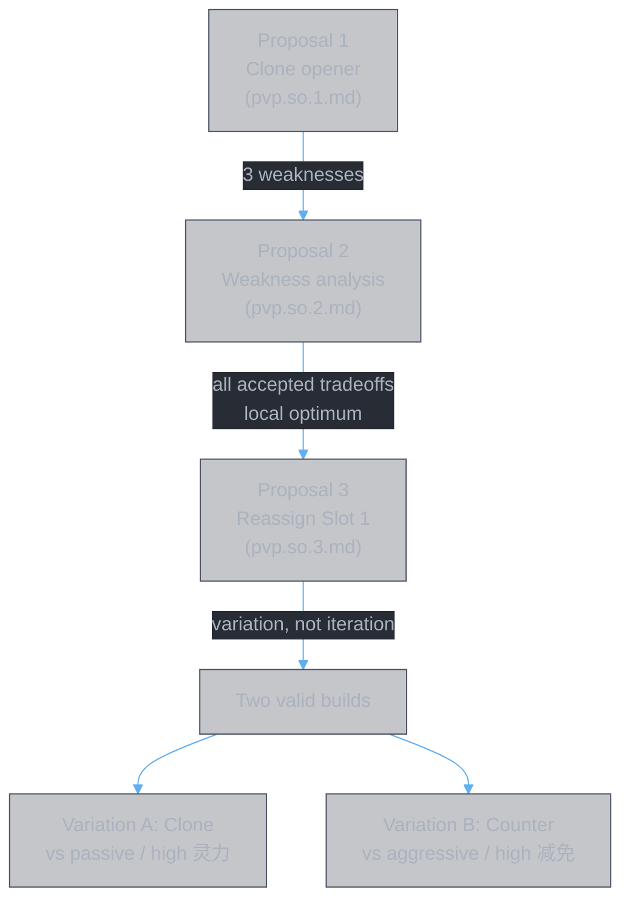

# Proposal 3 — Reassign Slot 1 Feature

**Base:** [pvp.so.2.md](pvp.so.2.md)

Proposal 2 concluded that Proposal 1 is at a **local optimum** within its feature assignment. To find improvements, we must question the feature assignment itself (Step 3).

The most impactful reassignment point is **Slot 1** — it fires first, sets the tempo, and its feature choice (clone vs counter vs burst) reshapes the entire build's dynamics.

---

## Slot 1 Feature Reassignment

### Current (Proposal 1): Clone

`春黎剑阵` — clone doubles weapon system for 16s. Dual-channel (HP + SP via guaranteed crit).

Strengths:
- Weapon doubling is passive — works regardless of enemy behavior
- SP drain via 灵犀九重 crit opens a second damage channel
- 心逐神随 x4 multiplies everything

Weaknesses (from Proposal 2):
- No buff at t=0~12 (accepted as setup phase)
- No heal suppression at t=0~24 (accepted, pressure outpaces)
- **Single-channel dependency**: value depends on clone surviving 16s. If enemy burst-kills clone early, 16s of weapon doubling becomes much less

### Alternative: Counter-Reflection

`大罗幻诀` — counter-reflection punishes enemy attacks with DoTs + 命損 reduction shred.

### Possible Enhancement: Clone → Counter at Slot 1

**Changes required:**

| Slot | Component | Before (Proposal 1) | After |
|:-----|:----------|:---------------------|:------|
| 1 主位 | Platform | `春黎剑阵` (clone) | `大罗幻诀` (counter) |
| 1 辅1 | Aux 1 | `解体化形` 心逐神随 (x4) | `解体化形` 心逐神随 (x4) — **unchanged** |
| 1 辅2 | Aux 2 | `千锋聚灵剑` 灵犀九重 (crit) | `天轮魔经` 心魔惑言 (x2 debuff stacks) |
| 5 辅1 | Aux 1 | `天轮魔经` 心魔惑言 (x2) | `疾风九变` 真言不灭 (+55% all state duration) |

**Cascade effect:** 天轮魔经 moves from Slot 5 to Slot 1. Slot 5 needs a new 辅1 — 疾风九变（真言不灭）fills it, extending Slot 5's state durations by +55%.

### Analysis

**What Slot 1 gains:**

| Feature | Detail |
|:--------|:-------|
| **Reduction shred** | 命損 -100% enemy 最终伤害减免 for 8s (t=0~8). Every weapon hit at full power, no mitigation |
| **Counter-DoTs** | 罗天魔咒: enemy attacks trigger DoTs. With 心逐神随 x4: 28%/0.5s. Punishes aggressive enemy |
| **Debuff stacking** | 心魔惑言 x2 doubles all debuffs applied by 大罗幻诀's debuff-heavy kit |
| **Early debuff count** | 噬心之咒 + 断魂之咒 + 命損 — multiple debuffs active from t=0, feeding 结魂锁链 (Slot 4) earlier |

**What Slot 1 loses:**

| Feature | Detail |
|:--------|:-------|
| **Clone/weapon doubling** | No 16s weapon duplication. Weapons run single-instance |
| **SP drain channel** | No 灵犀九重 guaranteed crit → no 灵力 pressure. Single-channel (HP only) |
| **Self-sufficiency** | Clone works regardless of enemy behavior. Counter requires enemy to attack — passive enemy gets no DoTs, 命損 still applies but counter-DoTs are the main damage source |

**What Slot 5 gains from cascade:**

真言不灭 (+55% all state duration) at Slot 5 extends:
- 天人五衰: 15s → 23.25s (covers t=24~47.25 instead of t=24~39)
- 魔劫: 8s → 12.4s (covers t=24~36.4 instead of t=24~32)

This **partially addresses Proposal 1's weakness #2** (buff expiry at t=24). While 仙佑 is unchanged, 魔劫's extended window (+4.4s) provides longer damage amp coverage post-buff.

**What Slot 5 loses from cascade:**

心魔惑言 x2 debuff stacks no longer at Slot 5. Debuff doubling moves to Slot 1 instead. 天人五衰 and 魔劫 stacks are no longer doubled at Slot 5 — but 大罗幻诀's debuffs at Slot 1 are doubled instead.

### Tradeoff Summary

| Dimension | Proposal 1 (Clone) | Proposal 3 (Counter) |
|:----------|:-------------------|:---------------------|
| **Weapon support at t=0** | Clone doubles output (passive, 16s) | 命損 -100% reduction shred (8s) |
| **Damage channels** | Dual: HP + SP (via crit) | Single: HP only |
| **Enemy dependency** | None — clone works regardless | Counter-DoTs require enemy aggression |
| **Debuff count at t=18** | Low (few debuffs before Slot 4) | High (噬心/断魂/命損 from t=0) |
| **Slot 5 魔劫 duration** | 8s (t=24~32) | 12.4s (t=24~36.4) |
| **Best against** | Passive enemy, high 灵力 pool | Aggressive enemy, high 最终伤害减免 |

### Verdict

Neither strictly dominates. The choice depends on the **matchup**:

- **Proposal 1 (Clone)** — best when: enemy plays passive (clone pressure regardless), enemy has high 灵力 (SP drain matters), weapon system benefits more from doubling than from reduction shred
- **Proposal 3 (Counter)** — best when: enemy plays aggressive (counter-DoTs trigger), enemy has high 最终伤害减免 (命損 -100% is decisive), debuff count matters for Slot 4/6 scaling

**Both are valid builds. They are variations, not iterations.** The "better" build cannot be determined without knowing the specific opponent.

---

## Proposal 3 Build Table

| Slot | Name | 主位 | 辅位1 | 辅位2 | Changes from P1 |
|:-----|:-----|:-----|:------|:------|:----------------|
| 1 | 鸣鸿真魔相 | `大罗幻诀` | `解体化形`（专属） | `天轮魔经`（专属） | **main + 辅2 changed** |
| 2 | 洪荒真剑 | `皓月剑诀` | `春黎剑阵`（专属） | `无极御剑诀`（专属） | — |
| 3 | 风花真法 | `甲元仙符` | `浩然星灵诀`（专属） | `周天星元`（专属） | — |
| 4 | 九阳真魔言 | `天魔降临咒` | `皓月剑诀`（专属） | `梵圣真魔咒`（专属） | — |
| 5 | | `天刹真魔` | `疾风九变`（专属） | `无相魔劫咒`（专属） | **辅1 changed** |
| 6 | 造化真灵 | `十方真魄` | `惊蜇化龙`（专属） | `通天剑诀`（专属） | — |

### Taxonomy Summary

| Slot | Feature(s) | Amplifier(s) | Sustain |
|:-----|:-----------|:-------------|:--------|
| 1 | Counter (罗天魔咒 DoTs), reduction shred (命損 -100%) | Stack mult (心逐神随 x4, 心魔惑言 x2) | — |
| 2 | Anti-defense (皓月 shield strip), debuff (噬心 DoT trap) | Damage amp (无极剑阵 +205% net) | — |
| 3 | Buff (仙佑 +280%), weapon interface (奇能诡道) | Stack mult (龙象护身 x4) | Healing (天光虹露 +190%) |
| 4 | Debuff (结魂锁链 permanent) | Damage amp (追神真诀 +300%), duration ext (天魔真解 x2 tick) | — |
| 5 | Damage amp (魔劫 +205%, extended 12.4s) | Duration ext (真言不灭 +55%) | Defense (不灭魔体 8%), disruption (天人五衰, extended 23.25s) |
| 6 | Reduction shred (神威冲云 ignore all), debuff reader (索心真诀) | — | Sustain (怒灵降世 cleanse + buff) |

### Weaknesses

| # | Weakness | Severity |
|:--|:---------|:---------|
| 1 | t=0~12 no buff — same as Proposal 1 | Accepted (setup phase) |
| 2 | t=24 buff expires — mitigated: 魔劫 now 12.4s instead of 8s | Improved |
| 3 | t=0~24 no heal suppression — same as Proposal 1 | Accepted (pressure outpaces) |
| 4 | **NEW: Single damage channel** — no SP drain, no 灵力 pressure | Matchup-dependent |
| 5 | **NEW: Enemy dependency** — counter-DoTs require enemy aggression | Matchup-dependent |

---

## Iteration Status

Proposals 1 and 3 are **matchup-dependent variations**, not strictly ordered iterations. Both are local optima for different opponent profiles. Further iteration would require:

- **Weapon rotation data** to determine whether clone doubling or reduction shred produces more total weapon DPS
- **Opponent-specific data** to determine 灵力 pool size and 最终伤害减免 level
- **Slot 4 reassignment** exploration (different debuff platform for earlier heal suppression)

---

## References

| Doc | Role |
|:----|:-----|
| [pvp.so.1.md](pvp.so.1.md) | Proposal 1: clone opener |
| [pvp.so.2.md](pvp.so.2.md) | Weakness analysis, accepted tradeoffs |
| [weapon.support.build.md](weapon.support.build.md) | Construction method |
| [剑九.md](../../data/books/剑九.md) | Detailed analysis (Var A = P1, Var B = P3) |
