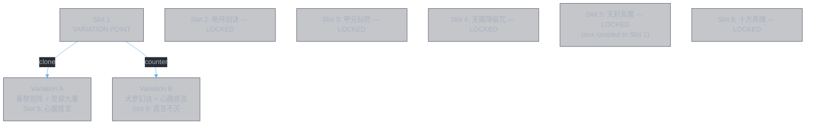

# Proposal 4 — Remaining Variation Points

**Base:** [pvp.so.3.md](pvp.so.3.md)

Proposal 3 established that Slot 1 is a variation point (clone vs counter) based on matchup. This proposal examines whether Slots 2-6 have similar variation points, or if they are locked.

---

## Slot-by-Slot Variation Analysis

### Slot 2: `皓月剑诀` — Locked?

**Current feature:** Anti-defense (shield strip)

**Alternative platforms for anti-defense:**
- No other platform has native shield destroy. 皓月剑诀 is the only platform with `shield_destroy_damage` + `no_shield_double_damage`.

**Alternative features for Slot 2 (t=6):**
- F_burst: 千锋聚灵剑 (dBase=46395) or 念剑诀 (dBase=22305) — pure damage, no shield strip
- Replacing shield strip means weapons hit shields for the entire fight. Against a stronger opponent with high 灵力, shields regenerate continuously. Without strip, weapons waste damage on shields instead of HP.

**Verdict: Locked.** 皓月剑诀 is irreplaceable at Slot 2. No other platform provides anti-defense, and anti-defense at t=6 is essential for Route 2.

**Aux variation?** Both aux (玄心剑魄, 无极剑阵) serve the anti-defense feature directly:
- 玄心剑魄 creates the dispel dilemma (keeps shields down)
- 无极剑阵 amplifies the shield strip damage (+205%)

Neither has a competitive alternative that serves anti-defense better. **Aux locked.**

---

### Slot 3: `甲元仙符` — Locked?

**Current feature:** Buff + weapon interface

**Alternative platforms for buff:**
- `十方真魄` has F_buff — but its buff (怒灵降世 +20% atk, 4s/7.5s) is far weaker than 仙佑 (+70% base, +280% with 龙象护身, 12s). 十方真魄 is needed at Slot 6 as finisher.
- No other platform has F_buff.

**Alternative features for Slot 3 (t=12):**
- Buff at t=12 is uniquely positioned to cover the weapon peak window (t=12~24). Any other feature at t=12 loses the buff entirely — Proposal 2 showed this cannot be compensated.

**Verdict: Locked.** 甲元仙符 is the only viable buff platform, and buff at t=12 is irreplaceable.

**Aux variation?** Proposal 2 exhaustively analyzed Slot 3 aux options:
- 龙象护身 (x4 strength): dropping it reduces buff from +280% to +70%. Rejected.
- 奇能诡道 (weapon interface): dropping it loses the only weapon interface. Rejected.

**Aux locked.**

---

### Slot 4: `天魔降临咒` — Variation possible?

**Current feature:** Debuff (permanent) + heal suppression (via aux)

**Alternative platforms for permanent debuff:**
- `大罗幻诀` has F_dot + F_truedmg — but it's used at Slot 1 (Proposal 3, counter variation). If Slot 1 uses 春黎 (Proposal 1), 大罗幻诀 is available for Slot 4.

**Possible enhancement: 大罗幻诀 at Slot 4**

| | 天魔降临咒 (current) | 大罗幻诀 (alternative) |
|:--|:---------------------|:----------------------|
| Debuff type | 结魂锁链: permanent, +5.25% damage taken, per-debuff scaling | 噬心/断魂之咒: DoTs 4s each, counter-triggered. 命損 -100% reduction 8s |
| Permanence | Permanent — accumulates for rest of fight | 4-8s durations — needs re-application |
| Heal suppression | None native (comes from Slot 5 魔劫) | None native |
| Debuff count | 1 permanent debuff + 1 permanent DoT | Multiple short-lived debuffs |

**Analysis:** 天魔降临咒's value is its **permanence**. 结魂锁链 activates at t=18 and stays forever — every hit from t=18 onward benefits. 大罗幻诀's debuffs expire and require enemy aggression (counter-triggered). At Slot 4 (t=18), permanence matters more than burst because Slots 5-6 and all weapon hits from t=18 onward need the amp.

Additionally, if Proposal 1 (clone opener) is chosen, 大罗幻诀 is available for Slot 4 — but 天魔降临咒's permanence still wins. If Proposal 3 (counter opener) is chosen, 大罗幻诀 is already at Slot 1, making this moot.

**Verdict: Locked.** 天魔降临咒's permanent debuff is irreplaceable at Slot 4.

**Aux variation?**
- 追神真诀 (+300% damage, +50% maxHP, +26.5% lost HP/tick): directly amplifies the permanent DoT engine. The strongest damage amp for this platform.
- 天魔真解 (x2 tick rate): doubles permanent DoT DPS. No alternative provides equivalent sustained damage increase.

**Aux locked.**

---

### Slot 5: `天刹真魔` — Variation possible?

**Current feature:** Damage amp (魔劫 via aux) + sustain (不灭魔体)

**Alternative platforms for sustain at t=24:**
- `疾风九变`: F_counter + F_sustain + F_hp_exploit. Counter + lifesteal. But counter at t=24 is late — less useful than permanent counter-heal.
- `十方真魄`: F_survive + F_sustain. But needed at Slot 6.
- `玄煞灵影诀`: F_hp_exploit. Pure damage, no sustain.

**Analysis:** 天刹真魔 provides **permanent** counter-heal (不灭魔体 8%) — the only platform with sustain that never expires. At t=24 (post-buff), permanent sustain is essential. 疾风九变's lifesteal is conditional (requires hitting), 十方真魄 is needed at Slot 6.

**Verdict: Locked.** 天刹真魔's permanent sustain is irreplaceable at Slot 5.

**Aux variation?** This is where Proposal 3 already created a variation:
- **Proposal 1 aux:** 心魔惑言 (x2 debuff stacks) + 无相魔威 (魔劫 +205%, 8s)
- **Proposal 3 aux:** 真言不灭 (+55% duration) + 无相魔威 (魔劫 +205%, 12.4s)

The aux choice at Slot 5 is **coupled to the Slot 1 decision** — 天轮魔经 (心魔惑言) can only be at Slot 1 or Slot 5, not both. This is not an independent variation point.

**Aux locked to Slot 1 decision.**

---

### Slot 6: `十方真魄` — Variation possible?

**Current feature:** Reduction shred (via aux) + finisher

**Alternative platforms for finisher:**
- `玄煞灵影诀`: F_hp_exploit, dBase=18255. HP-cost burst. Loses F_survive, F_buff (怒灵降世).
- `念剑诀`: F_burst + F_dot, dBase=22305. 4s untargetable + escalating damage. But no hp_exploit — finisher at t=30 should read accumulated HP loss.
- `千锋聚灵剑`: F_burst + F_exploit, dBase=46395 (highest). But its exclusive 天哀灵涸 (heal reduction) is less valuable at t=30 than 索心真诀 (debuff reader).

**Possible enhancement: 玄煞灵影诀 at Slot 6**

| | 十方真魄 (current) | 玄煞灵影诀 (alternative) |
|:--|:-------------------|:------------------------|
| dBase | 1500 | 18255 |
| HP exploit | 16% lost HP damage | 11% lost HP damage (lower) |
| Sustain | 怒灵降世 +20% atk, 7.5s + cleanse | Shield (12% maxHP, 8s) |
| Debuff reader (aux) | 索心真诀: 2.1% maxHP true dmg per debuff | Same aux available |

**Analysis:** 十方真魄 has lower dBase (1500 vs 18255) but higher HP exploit coefficient (16% vs 11%). More importantly, 十方真魄's native F_survive provides cleanse + reduction — essential at t=30 when debuffs have accumulated on self. 玄煞灵影诀 provides a shield instead of cleanse, which is less valuable at the end of the fight. 十方真魄's 怒灵降世 also buffs weapon damage (+20% atk, 7.5s) during the finisher window.

Additionally, the finisher's main damage comes from **aux**, not the platform: 索心真诀 (2.1% maxHP per debuff × 10 stacks = 21% maxHP true damage) + 神威冲云 (ignore all reduction + 36%). These aux are platform-independent — they work on either platform. The platform's role is to provide sustain (cleanse vs shield) and secondary damage (HP exploit coefficient).

**Verdict: Marginal.** 十方真魄 is slightly better (cleanse > shield at t=30, +20% atk buff for weapons, higher HP exploit). Not worth changing.

---

## Summary

| Slot | Platform | Verdict | Why |
|:-----|:---------|:--------|:----|
| 1 | 春黎剑阵 / 大罗幻诀 | **Variation point** | Matchup-dependent (P1 vs P3) |
| 2 | 皓月剑诀 | **Locked** | Only anti-defense platform |
| 3 | 甲元仙符 | **Locked** | Only viable buff platform + irreplaceable aux pair |
| 4 | 天魔降临咒 | **Locked** | Only permanent debuff platform |
| 5 | 天刹真魔 | **Locked** | Only permanent sustain platform; aux coupled to Slot 1 |
| 6 | 十方真魄 | **Locked** | Best finisher (cleanse + buff + HP exploit); marginal over alternatives |

**Conclusion:** The build has exactly **one variation point** — Slot 1. All other slots are locked by platform uniqueness (no alternative provides the same feature) or by aux coupling (Slot 5 aux depends on Slot 1 choice).

---

## Iteration Status

The pvp vs stronger opponent construction is **complete**:

- **Proposal 1** (pvp.so.1.md): Initial build via framework. Identified 3 weaknesses.
- **Proposal 2** (pvp.so.2.md): Weakness analysis. All 3 accepted as structural tradeoffs with existing mitigation.
- **Proposal 3** (pvp.so.3.md): Slot 1 feature reassignment. Produced Variation B (counter). Matchup-dependent, not strictly better.
- **Proposal 4** (pvp.so.4.md): Remaining slot analysis. All other slots locked. One variation point confirmed.

**Final output:** Two builds for pvp vs stronger opponent, differing only at Slot 1 (+ cascading Slot 5 aux change).

| Build | Slot 1 | Best against |
|:------|:-------|:-------------|
| Variation A | 春黎剑阵 (clone) | Passive enemy, high 灵力 |
| Variation B | 大罗幻诀 (counter) | Aggressive enemy, high 减免 |

Further iteration requires **external data** (weapon rotation, opponent-specific stats) that the 灵書 construction framework alone cannot provide.

---

## References

| Doc | Role |
|:----|:-----|
| [pvp.so.1.md](pvp.so.1.md) | Proposal 1: initial build |
| [pvp.so.2.md](pvp.so.2.md) | Proposal 2: weakness analysis |
| [pvp.so.3.md](pvp.so.3.md) | Proposal 3: Slot 1 variation |
| [pvp.so.4.md](pvp.so.4.md) | This document: remaining slots locked |
| [剑九.md](../../data/books/剑九.md) | Detailed per-slot analysis |
