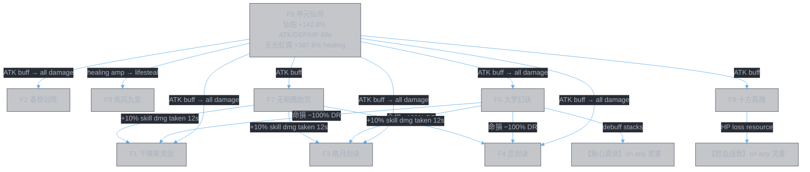

<style>
body {
  max-width: none !important;
  width: 95% !important;
  margin: 0 auto !important;
  padding: 20px 40px !important;
  background-color: #282c34 !important;
  color: #abb2bf !important;
  font-family: -apple-system, BlinkMacSystemFont, "Segoe UI", Helvetica, Arial, sans-serif !important;
  line-height: 1.6 !important;
  -webkit-print-color-adjust: exact !important;
  print-color-adjust: exact !important;
}

h1, h2, h3, h4, h5, h6 {
  color: #ffffff !important;
}

a {
  color: #61afef !important;
}

code {
  background-color: #3e4451 !important;
  color: #e5c07b !important;
  padding: 2px 6px !important;
  border-radius: 3px !important;
}

pre {
  background-color: #2c313a !important;
  border: 1px solid #4b5263 !important;
  border-radius: 6px !important;
  padding: 16px !important;
  overflow-x: auto !important;
}

pre code {
  background-color: transparent !important;
  color: #abb2bf !important;
  padding: 0 !important;
  border-radius: 0 !important;
  font-size: 13px !important;
  line-height: 1.5 !important;
}

table {
  border-collapse: collapse !important;
  width: auto !important;
  margin: 16px 0 !important;
  table-layout: auto !important;
  display: table !important;
}

table th,
table td {
  border: 1px solid #4b5263 !important;
  padding: 8px 10px !important;
  word-wrap: break-word !important;
}

table th:first-child,
table td:first-child {
  min-width: 60px !important;
}

table th {
  background: #3e4451 !important;
  color: #e5c07b !important;
  font-size: 14px !important;
  text-align: center !important;
}

table td {
  background: #2c313a !important;
  font-size: 12px !important;
  text-align: left !important;
}

blockquote {
  border-left: 3px solid #4b5263 !important;
  padding-left: 10px !important;
  color: #5c6370 !important;
  background-color: #2c313a !important;
}

strong {
  color: #e5c07b !important;
}
</style>

# Chain Construction Framework

**Authors:** Z. Zhang & Claude Opus 4.6 (Anthropic)

> **Scenario-independent framework for 灵書 construction.** Two layers: Layer 1 defines all 61 secondary affixes as **operators** with a uniform API. Layer 2 defines the 9 detailed skill books as **foundations** — the operands that operators act on. Construction = select a foundation, then plug operators into its ports. Scenario-specific builds (which foundations, which operators, what slot order) live in separate documents; this framework provides the parts catalog.

> **Convention:** skill books in backticks (`` `book` ``), affixes in lenticular brackets (【affix】). Effect types in `monospace`. Operator definitions use `input → transform → output` format.

> **Important — 会心 ≠ 暴击.** The game has **two distinct critical-hit mechanics** that must not be conflated:
>
> | Term | Mechanic | Examples |
> |:-----|:---------|:--------|
> | **会心** (resonance strike) | Fixed multiplier on the entire skill. Deterministic output (e.g., ×2.97). No interaction with crit rate/crit damage stats. | 【通明】(×1.2), 【灵犀九重】(×2.97) |
> | **暴击** (critical hit) | Standard crit system — scales with crit rate and crit damage stats. | 【怒目】(+30% 暴击率), 【溃魂击瑕】(必定暴击), 【破碎无双】(+15% 暴击伤害) |
>
> In this document, `guaranteed_resonance` refers to 会心 (resonance), not 暴击. Affixes that modify 暴击率 (crit rate) or 暴击伤害 (crit damage) operate in the standard crit system — a **separate multiplier zone**. Both can coexist on the same 灵書 and multiply independently.

---

## Construction Methodology

### §A Overview

```mermaid
%%{init: {'theme': 'base', 'themeVariables': {'primaryColor': '#3e44514D', 'primaryTextColor': '#abb2bf', 'primaryBorderColor': '#4b5263', 'lineColor': '#61afef', 'secondaryColor': '#2c313a4D', 'secondaryTextColor': '#abb2bf', 'secondaryBorderColor': '#4b5263', 'tertiaryColor': '#282c344D', 'mainBkg': '#3e44514D', 'nodeBorder': '#4b5263', 'clusterBkg': '#2c313a4D', 'clusterBorder': '#4b5263', 'titleColor': '#e5c07b', 'edgeLabelBackground': '#282c34', 'textColor': '#abb2bf', 'background': '#282c34'}}}%%
graph LR
    A["Objective<br/>§C lookup"] -->|"required functions"| B["Function Catalog<br/>§D"]
    B -->|"qualifying foundations"| C["Solution Tables<br/>Layer 2"]
    C -->|"scored candidates"| D["Global Optimization<br/>§F"]
    D --> E["6-slot build"]
```



| Phase | Input | Operation | Output |
|:------|:------|:----------|:-------|
| 1. Objective | Scenario matchup conditions | **Table lookup** (§C) | Required function set |
| 2. Solutions | Function set + Foundation catalog | **Table lookup** (§D → Layer 2) | Scored candidate list per slot |
| 3. Assignment | Candidate lists + uniqueness constraints | **Optimization** (§F) | 6-slot build with slot ordering |

Three table lookups and one optimization. No reasoning steps.

### §B Scope Rules

All affixes use "本神通" (this skill) — they affect only the 灵書 they are on. Two scopes exist:

- **same**: the operator modifies THIS 灵書's output only. Must be placed on the same 灵書 as the source it interacts with. Constrains **construction** (what goes together).
- **cross**: the operator creates a persistent state (buff, debuff, DoT, shield) that persists beyond this 灵書's cast. Its value extends to the whole build. Constrains **slot ordering** (what fires when).

### §C Objective Inventory

All structural PvP matchup types. Each objective specifies a win condition and the function set required to achieve it.

| Obj | Pattern | Win Condition | Horizon | Required Functions |
|:----|:--------|:--------------|:--------|:-------------------|
| O1 | vs stronger (stat gap) | Survive + exploit HP loss → lethal total damage | Long (~43s) | F_burst, F_dr_remove, F_buff, F_hp_exploit, F_antiheal, F_survive |
| O2 | vs equal (no immunity) | Outscale via buff + burst window | Medium (~30s) | F_burst, F_buff, F_exploit, F_antiheal, F_dot, F_survive |
| O3 | vs equal (immunity heavy) | Bypass immunity + sustain through delay | Long (~50s) | F_burst, F_dr_remove, F_buff, F_survive, F_delayed, F_sustain |
| O4 | vs weaker (stat advantage) | Overwhelm before opponent stabilizes | Short (~18s) | F_burst, F_exploit, F_buff, F_dot |
| O5 | Low enlightenment | Deterministic chains (avoid probability-gated effects) | Any | Replace F_burst combos with 【天命有归】variants; add E1/E3 enablers |
| O6 | Healing-heavy opponent | Suppress healing + sustained pressure | Long (~50s) | F_antiheal, F_burst, F_dot, F_buff, F_truedmg |

> **Usage.** Given a matchup, select the matching objective row. Read off the required function set. For each function, consult §D for qualifying foundations, then the Foundation Solution Tables (Layer 2) for scored operator pairings. Feed all candidates into §F's optimization.

### §D Function Catalog

Each function is an atomic 灵書-level purpose. The catalog maps functions to the effect types that implement them and the foundations qualified to serve them.

| Fn | Purpose | Required Effect Types | Qualifying Foundations |
|:---|:--------|:----------------------|:-----------------------|
| F_burst | Maximize single-slot damage output | `base_attack`, `guaranteed_resonance`, `probability_multiplier` | F1, F2, F3, F4 (high base); F5, F6, F7, F8, F9 (moderate) |
| F_dr_remove | Remove / bypass enemy DR | `cross_slot_debuff`(命損), `ignore_damage_reduction` | F6(命損 cross, 8s); any+【神威冲云】(same-灵書 only) |
| F_buff | Persistent team stat buff | `self_buff`, `random_buff` | F5(【仙佑】 +142.8%, 48s); F8(怒灵降世 +20%, 7.5s) |
| F_hp_exploit | Convert own HP loss → damage | `per_self_lost_hp` | any+【怒血战意】; F8/F9(HP cost creates resource) |
| F_antiheal | Suppress enemy healing | `debuff`, `conditional_debuff`, `random_debuff` | any+【天哀灵涸】(−31% undispellable); any+【天倾灵枯】(−31%/−51%, 20s); F7+【无相魔威】(−40.8%) |
| F_survive | CC cleanse + damage reduction | `periodic_cleanse`, `self_damage_reduction_during_cast`, `untargetable_state` | F8(cleanse monopoly) |
| F_truedmg | True damage from debuff stacks | `per_debuff_stack_true_damage` | any+【紫心真诀】(`惊蛰化龙`, monopoly) |
| F_exploit | Secondary high-damage source | `percent_max_hp_damage`, `shield_destroy_damage` | F1(27%×6=162%maxHP); F3(24%×10=240%maxHP shieldless) |
| F_dot | Sustained DoT damage | `dot`, `extended_dot`, `shield_destroy_dot`, `on_dispel` | F4(extended 6.5s, ×28.9 peak); F6(counter DoTs); any+【玄心剑魄】(噬心 550%/tick) |
| F_counter | Reflect enemy attacks | `counter_buff` | F9(极怒: 50% reflect + 15% lost HP, 4s) |
| F_sustain | Lifesteal / self-healing | `lifesteal`, `conditional_heal_buff` | F9(82% lifesteal via 星猿复灵); any+【仙灵汲元】(55%) |
| F_dispel | Strip enemy buffs | `periodic_dispel` | any+【天煞破虚】(1 buff/s, 10s) |
| F_delayed | Delayed burst accumulation | `delayed_burst` | F7(无相魔劫: 10% accumulated + 5,000% ATK) |

> **Lookup chain.** Objective (§C) → function set → for each function, read "Qualifying Foundations" → consult that foundation's Solution Table (Layer 2) for scored (op1, op2) pairs.

### §E Scoring Model

Each candidate solution (foundation, op1, op2) is scored on three components:

**1. Same-灵書 score (S_same):** Direct output of the (foundation, op1, op2) triplet — combo damage multiplier, DR value, debuff strength, or buff potency. Computed from operator API (Layer 1) applied to foundation effect set (Layer 2). Zone quality is implicit: marginal multiplier = total_with / total_without. An amplifier in an empty zone (crit, final damage) contributes more than one in a crowded zone (ATK under 【仙佑】 +142.8%).

**2. Cross-灵書 score (S_cross):** Value of persistent states this slot creates for OTHER slots — buff duration × strength, debuff duration × potency, shield value. Only cross-scope outputs contribute.

**3. Feed dependency bonus (S_feed):** Conditional score gained when another slot provides a required input. Notation: `+X if slot_j provides Y`. Creates edges in the dependency graph. Example: 【紫心真诀】gains `+21%maxHP true damage if F6 provides debuff stacks`.

**4. Total slot score:**

$$S_i = S_{\text{same},i} + S_{\text{cross},i} + \sum_j S_{\text{feed},ij}$$

Solution Tables (Layer 2) report all three components per candidate. The optimizer (§F) resolves feed dependencies during assignment.

### §F Global Optimization

**Variables:** For each slot $i \in \{1..6\}$, select one tuple $(foundation_i, op1_i, op2_i)$ from the Solution Tables.

**Constraints:**

| Constraint | Description |
|:-----------|:------------|
| Foundation uniqueness | No foundation appears in more than one slot (核心冲突) |
| Affix uniqueness | No affix (operator) appears in more than one slot (副词缀冲突) |
| Function coverage | Each objective's required functions (§C) are covered by at least one slot |
| Monopoly forcing | Monopoly affixes (Structural Properties) are forced — prune all candidates that conflict |

**Objective:** Maximize $\sum_{i=1}^{6} S_i$ with feed dependencies resolved.

**Tractability.** 6 slots × ~5–20 candidates each = search space ≤ $20^6 \approx 6.4 \times 10^7$. Monopoly pruning and uniqueness constraints reduce this by orders of magnitude. Exhaustive search or branch-and-bound is tractable.

**Slot ordering.** After selecting 6 tuples, assign to temporal slots 1–6 to maximize cross-灵書 feed coverage. Cross-scope states have finite duration — the source slot must fire before the consuming slot, within the state's window. Solved by topological sort on the feed dependency graph with duration constraints.

---

## Layer 1: Aux Operators

All 61 secondary affixes (16 universal + 17 school + 28 exclusive), defined as operators with uniform API.

### §1 Source Operators

**Input = ∅.** Produce effects standalone — no dependency on main skill or other affixes. Always have value (may be conditional on game state, but not on build composition).

#### 1.1 Damage Sources

```
【斩岳】
  input:     ∅
  transform: add flat bonus damage to each hit
  output:    +2000% ATK (additive, bypasses multiplier zones)
  scope:     same
  carriers:  ALL (universal)

【破灭天光】
  input:     ∅
  transform: add flat bonus damage to each hit
  output:    +2500% ATK (additive)
  scope:     same
  carriers:  体修 (school)

【无极剑阵】
  input:     ∅
  transform: massive skill damage boost offset by enemy DR increase
  output:    +555% skill_damage / enemy +350% skill_DR against this skill
  scope:     same
  carriers:  无极御剑诀 (exclusive)
  note:      net effect depends on damage formula — NOT 555−350=205%
```

#### 1.2 Per-Hit Escalation Sources

```
【破竹】
  input:     ∅ (needs multi-hit skill)
  transform: each hit boosts remaining hits
  output:    +1%/hit, max +10%
  scope:     same
  carriers:  ALL (universal)

【心火淬锋】
  input:     ∅ (needs multi-hit skill)
  transform: each hit boosts remaining hits (5× stronger)
  output:    +5%/hit, max +50%
  scope:     same
  carriers:  剑修 (school)
```

#### 1.3 会心 (Resonance) Sources

```
【通明】
  input:     ∅
  transform: guaranteed 会心 (resonance strike — fixed multiplier, distinct from 暴击)
  output:    ×1.2 base, 25% chance ×1.5; E[multiplier] = 0.75×1.2 + 0.25×1.5 = 1.28
  scope:     same
  carriers:  ALL (universal)

【灵犀九重】
  input:     ∅
  transform: guaranteed 会心 (strongest resonance in game)
  output:    ×2.97 base, 25% chance ×3.97 (max fusion); E[multiplier] = 0.75×2.97 + 0.25×3.97 = 3.22
  scope:     same
  carriers:  剑修 (school)
```

#### 1.4 Survival Sources

```
【金汤】
  input:     ∅
  transform: damage reduction during skill cast
  output:    +10% DR during cast
  scope:     same
  carriers:  ALL (universal)

【金刚护体】
  input:     ∅
  transform: damage reduction during skill cast (5.5× stronger)
  output:    +55% DR during cast
  scope:     same
  carriers:  体修 (school)
```

#### 1.5 Bridge Sources (create conversion paths)

```
【玄女护心】
  input:     ∅
  transform: convert damage dealt into self-shield
  output:    50% of damage → shield, 8s duration
  scope:     same (creation) → cross (shield persists)
  carriers:  魔修 (school)
  note:      creates shield resource for 【灵盾】/【青云灵盾】/【玉石俱焚】

【仙灵汲元】
  input:     ∅
  transform: convert damage dealt into self-healing
  output:    55% lifesteal
  scope:     same
  carriers:  星元化岳 (exclusive)
  note:      creates healing source for 【长生天则】/【瑶光却邪】
```

#### 1.6 State Sources (debuffs, DoTs, dispels)

```
【天哀灵涸】
  input:     ∅
  transform: apply undispellable anti-heal debuff on enemy
  output:    debuff 灵涸: healing −31%, 8s, UNDISPELLABLE
  scope:     cross (debuff persists on enemy)
  carriers:  千锋聚灵剑 (exclusive)
  note:      only undispellable anti-heal in the game

【天倾灵枯】
  input:     ∅
  transform: apply long-duration anti-heal debuff, escalates at low HP
  output:    debuff 灵枯: healing −31%, 20s; if target HP < 30%: −51%
  scope:     cross (debuff persists on enemy)
  carriers:  甲元仙符 (exclusive)

【无相魔威】
  input:     ∅
  transform: apply anti-heal debuff + conditional damage boost
  output:    debuff 魔劫: healing −40.8%, 8s; damage +105% (or +205% if target has no healing)
  scope:     cross (debuff) + same (damage)
  carriers:  无相魔劫咒 (exclusive)
  note:      dual-nature — debuff is source, damage boost is conditional

【玄心剑魄】
  input:     ∅
  transform: apply DoT with on-dispel trap
  output:    DoT 噬心: 550% ATK/tick, 8s; on dispel: 3300% ATK burst + 2s stun
  scope:     cross (DoT persists on enemy)
  carriers:  春黎剑阵 (exclusive)
  note:      creates dilemma: eat DoT or take burst+stun

【天煞破虚】
  input:     ∅
  transform: periodically strip enemy buffs and deal damage
  output:    dispel 1 buff/s for 10s; 25.5% skill damage per dispel (×2 if no buffs)
  scope:     cross (dispel effect persists)
  carriers:  天煞破虚诀 (exclusive)
```

#### 1.7 HP-Scaling Sources

```
【战意】
  input:     ∅ (reads self HP state)
  transform: scale damage by own HP lost
  output:    +0.5% damage per 1% max HP lost
  scope:     same
  carriers:  ALL (universal)

【怒血战意】
  input:     ∅ (reads self HP state)
  transform: scale damage by own HP lost (4× stronger)
  output:    +2% damage per 1% max HP lost
  scope:     same
  carriers:  玄煞灵影诀 (exclusive)

【吞海】
  input:     ∅ (reads enemy HP state)
  transform: scale damage by enemy HP lost
  output:    +0.4% damage per 1% enemy max HP lost
  scope:     same
  carriers:  ALL (universal)

【贪狼吞星】
  input:     ∅ (reads enemy HP state)
  transform: scale damage by enemy HP lost (2.5× stronger)
  output:    +1% damage per 1% enemy max HP lost
  scope:     same
  carriers:  体修 (school)
```

#### 1.8 Random Sources

```
【福荫】
  input:     ∅
  transform: apply one random buff
  output:    ATK +20% OR crit_damage +20% OR damage +20% (1/3 each)
  scope:     same
  carriers:  ALL (universal)

【景星天佑】
  input:     ∅
  transform: apply one random buff (2.75× stronger)
  output:    ATK +55% OR crit_damage +55% OR damage +55% (1/3 each)
  scope:     same
  carriers:  法修 (school)

【祸星无妄】
  input:     ∅
  transform: apply one random debuff on enemy
  output:    ATK −20% OR crit_rate −20% OR crit_damage −50% (1/3 each)
  scope:     cross (debuff persists)
  carriers:  魔修 (school)
```

#### 1.9 State-Trigger Source

```
【九雷真解】
  input:     ∅ (but value scales with state-application count)
  transform: deal damage each time THIS skill applies any buff/debuff/shield
  output:    50.8% of skill damage per state application
  scope:     same
  carriers:  九天真雷诀 (exclusive)
  note:      cross-cutting source — benefits from ALL state-applying effects on same 灵書.
             On 大罗幻诀: each counter_debuff trigger (噬心+断魂+命損 = 3 states)
             → 3 × 50.8% = 152.4% skill damage per enemy attack
```

> **Source operator count: 24.** 3 damage + 2 escalation + 2 会心 + 2 survival + 2 bridge + 5 state + 4 HP-scaling + 3 random + 1 state-trigger = 24.

---

### §2 Amplifier Operators

**Input = specific effect type.** Modify an existing effect on the same 灵書. Zero value without their target.

#### 2.1 ATK / Damage Amplifiers

```
【摧山】
  input:     any damage source
  transform: increase ATK for this skill
  output:    +20% ATK bonus (ATK zone)
  scope:     same
  carriers:  ALL (universal)

【摧云折月】
  input:     any damage source
  transform: increase ATK for this skill (2.75× stronger)
  output:    +55% ATK bonus (ATK zone)
  scope:     same
  carriers:  剑修 (school)

【破碎无双】
  input:     any damage source
  transform: triple-zone amplifier — three multiplier zones at once
  output:    +15% ATK, +15% damage, +15% crit_damage (three separate zones)
  scope:     same
  carriers:  剑修 (school)
  note:      weak per zone but multiplicative across zones

【明王之路】
  input:     any damage source
  transform: final multiplier zone (empty, high marginal value)
  output:    +50% final_damage_bonus
  scope:     same
  carriers:  法修 (school)
  note:      monopoly — only source of final_damage_bonus
```

#### 2.2 Buff Amplifiers

```
【清灵】
  input:     self_buff on this skill
  transform: increase buff stat values
  output:    +20% buff_strength
  scope:     same
  carriers:  ALL (universal)

【龙象护身】
  input:     self_buff on this skill
  transform: increase buff stat values (5× stronger)
  output:    +104% buff_strength
  scope:     same
  carriers:  浩然星灵诀 (exclusive)
  note:      on 仙佑 (+70% ATK): 70% × 2.04 = +142.8% ATK/DEF/HP
             on 天光虹露 (+190% healing): 190% × 2.04 = +387.6% healing

【仙露护元】
  input:     self_buff on this skill
  transform: extend buff duration
  output:    +300% buff_duration (max fusion)
  scope:     same
  carriers:  念剑诀 (exclusive)
  note:      on 仙佑 (12s): → 48s. Only way to achieve full-horizon coverage.

【真极穿空】
  input:     buff stacks on this skill
  transform: double buff stack capacity + convert stacks to damage
  output:    +100% buff_stack_capacity; +5.5% damage per 5 stacks, max +27.5%
  scope:     same
  carriers:  元磁神光 (exclusive)
```

#### 2.3 Debuff Amplifiers

```
【咒书】
  input:     debuff on this skill
  transform: increase debuff stat values
  output:    +20% debuff_strength
  scope:     same
  carriers:  ALL (universal)

【心魔惑言】
  input:     debuff stacks on this skill
  transform: double debuff stack capacity + convert stacks to damage
  output:    +100% debuff_stack_capacity; +5.5% damage per 5 stacks, max +27.5% (DoT at half)
  scope:     same
  carriers:  天轮魔经 (exclusive)
  note:      mirror of 【真极穿空】for debuffs

【奇能诡道】
  input:     debuff application on this skill
  transform: extra stack chance + conditional DR reduction at enlightenment
  output:    +20% chance for extra debuff stack; at enlightenment: 逆转阴阳 (−0.6× enemy DR)
  scope:     same
  carriers:  周天星元 (exclusive)
  note:      dual-nature — amplifier (stack chance) + context modifier (逆转阴阳)
```

#### 2.4 DoT Amplifiers

```
【鬼印】
  input:     DoT on this skill
  transform: add %lost_HP damage per DoT tick
  output:    +2% enemy lost HP per tick
  scope:     same
  carriers:  ALL (universal)

【古魔之魂】
  input:     DoT on this skill
  transform: increase DoT damage per tick
  output:    +104% dot_damage_increase
  scope:     same
  carriers:  大罗幻诀 (exclusive)
  note:      strongest single DoT amplifier

【天魔真解】
  input:     DoT on this skill
  transform: increase DoT tick rate
  output:    +50.5% dot_frequency (nearly doubles DPS)
  scope:     same
  carriers:  焚圣真魔咒 (exclusive)

【追神真诀】
  input:     DoT on this skill (+ conditional buff at enlightenment)
  transform: add %lost_HP per tick + massive conditional damage
  output:    +26.5% enemy lost HP per tick; at 悟10: +50% maxHP damage, +300% damage
  scope:     same
  carriers:  皓月剑诀 (exclusive)
  note:      dual-nature — DoT amplifier + context modifier at enlightenment=10
```

#### 2.5 Shield Amplifiers

```
【灵盾】
  input:     shield on this skill (from 【玄女护心】or main)
  transform: increase shield HP
  output:    +20% shield_strength
  scope:     same
  carriers:  ALL (universal)

【青云灵盾】
  input:     shield on this skill
  transform: increase shield HP (2.5× stronger)
  output:    +50% shield_strength
  scope:     same
  carriers:  体修 (school)

【玉石俱焚】
  input:     shield on this skill (from 【玄女护心】or main)
  transform: convert expired shield into enemy damage
  output:    100% of shield value as damage on expiry
  scope:     same
  carriers:  九重天凤诀 (exclusive)
  note:      bridge operator — shield → damage. Creates loop with 【玄女护心】.
```

#### 2.6 Healing Amplifiers

```
【长生天则】
  input:     healing source on this skill (lifesteal, self-heal)
  transform: increase healing output
  output:    +50% healing_increase
  scope:     same
  carriers:  法修 (school)

【瑶光却邪】
  input:     healing source on this skill
  transform: convert healing done into enemy damage
  output:    50% of healing → enemy damage
  scope:     same
  carriers:  魔修 (school)
  note:      bridge operator — healing → damage. Needs 【仙灵汲元】or other healing source.
```

> **Amplifier operator count: 20.** 4 ATK/damage + 4 buff + 3 debuff + 4 DoT + 3 shield + 2 healing = 20.

---

### §3 Cross-Cutting Operators

**Input = ALL or multiple effect types.** Modify multiple chains simultaneously. Value scales with how many effects exist on the same 灵書.

```
【心逐神随】
  input:     ALL effects on this skill
  transform: multiply all effects by probability-gated factor
  output:    ×2/×3/×4 (probability: 悟0 11%/31%/51%; 悟2 60%/80%/100%)
             E[multiplier] at 悟2: 3.40
  scope:     same
  carriers:  解体化形 (exclusive)
  note:      MONOPOLY — no substitute. Most powerful node in the graph by degree.
             Pair value = main_output × E[心逐] × aux2_effect.

【业焰】
  input:     any time-based state on this skill (buffs, debuffs, DoTs)
  transform: extend ALL state durations
  output:    +69% all_state_duration (max fusion)
  scope:     same
  carriers:  ALL (universal)
  note:      value = Σ(state_importance × duration_gain). Extends DoTs, buffs, debuffs equally.

【真言不灭】
  input:     any time-based state on this skill
  transform: extend ALL state durations (weaker, body-school version)
  output:    +55% all_state_duration
  scope:     same
  carriers:  疾风九变 (exclusive)

【神威冲云】
  input:     ALL damage on this skill
  transform: bypass ALL enemy damage reduction + damage bonus
  output:    ignore_damage_reduction + +36% damage_increase
  scope:     same
  carriers:  通天剑诀 (exclusive)
  note:      MONOPOLY — only DR bypass in the game.
             Value = output × 1.36 × 1/(1−DR). At 50% DR: ×2.72. At 70% DR: ×4.53.

【灵威】
  input:     next skill (temporal, cross-slot)
  transform: buff the NEXT 灵書's damage
  output:    +118% skill_damage_increase on next skill (max fusion)
  scope:     cross (explicitly cross-slot)
  carriers:  ALL (universal)
  note:      value depends entirely on slot ordering — what follows this skill?

【天威煌煌】
  input:     next skill (temporal, cross-slot)
  transform: buff the NEXT 灵書's damage (weaker)
  output:    +50% skill_damage_increase on next skill
  scope:     cross (explicitly cross-slot)
  carriers:  新-青元剑诀 (exclusive)
  note:      dominated by 【灵威】(2.4× weaker, exclusive vs universal)
```

> **Cross-cutting operator count: 6.** 1 all-effects multiplier + 2 all-state duration + 1 DR bypass + 2 next-skill = 6.

---

### §4 Enabler Operators

**Input = ∅, output = resource.** Create a resource consumed by other operators. Dual-nature: each also carries an intrinsic combat bonus.

```
【天命有归】
  input:     ∅
  resource:  certainty — converts probability-gated triggers to 100%
  targets:   【心逐神随】(×4 certain), 【灵犀九重】(×3.97 certain), 【通明】(×1.5 certain), 罗天魔咒 (30%→100%), 【怒目】(+30% crit→100%)
  bonus:     +50% damage_increase (standalone)
  scope:     same (certainty) + same (damage)
  carriers:  法修 (school)
  note:      enabler function: transforms probability triggers.
             On 【心逐神随】: 心逐 certain ×4 × 天命 +50% = ×6.00 (deterministic).
             On 【灵犀九重】: 灵犀 certain ×3.97 × 天命 +50% = ×5.96 (deterministic).
             On 【通明】: 通明 certain ×1.5 × 天命 +50% = ×2.25 (deterministic).
             Redundant when probability is already near-certain (悟2 已100% for ×2 tier).

【意坠深渊】
  input:     ∅
  resource:  HP-loss floor — guarantees minimum 11% HP lost for calculations
  targets:   【怒血战意】(floor +22% min), 【战意】(floor +5.5% min)
  bonus:     +50% damage_increase (standalone)
  scope:     same (floor) + same (damage)
  carriers:  体修 (school)
  note:      redundant when actual HP loss exceeds 11% (e.g., vs stronger opponent).

【天人合一】
  input:     ∅
  resource:  enlightenment — raises equipped book's enlightenment level by 1 (max 3)
  targets:   any book with enlightenment-gated effects (【心逐神随】, 【追神真诀】, 【魔骨明心】, 【奇能诡道】, 【紫心真诀】)
  bonus:     +5% damage_increase (negligible)
  scope:     same (enlightenment affects this book)
  carriers:  玉书天戈符 (exclusive)
  note:      FULLY DYNAMIC — value depends on which book receives it and what tier unlocks.
             Redundant at max enlightenment.

【破釜沉舟】
  input:     ∅
  resource:  accelerated HP loss — self takes +50% damage from enemy
  targets:   【怒血战意】, 【战意】 (HP loss accumulates faster)
  bonus:     +380% skill_damage_increase (massive standalone, fusion=54)
  scope:     same (skill damage) + cross (HP loss persists on self)
  carriers:  十方真魄 (exclusive)
  note:      dual-nature — the +50% self-damage-taken LOOKS like a cost,
             but it ENABLES the HP exploitation chain.
             Against stronger opponent: redundant (opponent already provides HP loss).
             Against equal opponent: may be necessary to CREATE the resource.
```

> **Enabler operator count: 4.**

---

### §5 Conditional Operators

**Gated by game state.** Active only when their condition is met. Value depends on condition uptime in the scenario.

#### 5.1 Execute Conditions (target HP < 30%)

```
【怒目】
  input:     any damage source (conditional gate: target HP < 30%)
  transform: damage boost + 暴击率 increase in execute range
  output:    +20% damage, +30% 暴击率 (crit rate) (when target HP < 30%)
  scope:     same
  carriers:  ALL (universal)

【溃魂击瑕】
  input:     any damage source (conditional gate: target HP < 30%)
  transform: massive execute damage + guaranteed 暴击
  output:    +100% damage, 必定暴击 (guaranteed crit) (when target HP < 30%)
  scope:     same
  carriers:  魔修 (school)
  note:      strongest execute affix in the game
```

#### 5.2 Control Conditions (target is CC'd)

```
【击瑕】
  input:     any damage source (conditional gate: target controlled)
  transform: damage boost when enemy is crowd-controlled
  output:    +40% damage (when target_controlled)
  scope:     same
  carriers:  ALL (universal)

【乘胜逐北】
  input:     any damage source (conditional gate: target controlled)
  transform: massive damage boost when enemy is CC'd (2.5× stronger)
  output:    +100% damage (when target_controlled)
  scope:     same
  carriers:  煞影千幻 (exclusive)
```

#### 5.3 Debuff Conditions (target has debuffs)

```
【引灵摘魂】
  input:     any damage source (conditional gate: target has debuffs)
  transform: massive damage boost against debuffed targets
  output:    +104% damage (when target_has_debuff)
  scope:     same
  carriers:  天魔降临咒 (exclusive)
  note:      near-universal in debuff-heavy builds (most PvP builds apply debuffs)

【魔骨明心】
  input:     conditional gate: target has debuffs (+ enlightenment gate for DR shred)
  transform: (1) healing buff when enemy debuffed (2) per-hit DR shred at enlightenment
  output:    (1) +90% healing_buff, 8s (when target_has_debuff)
             (2) at enlightenment: −20% enemy final_DR per hit, 1s
  scope:     same
  carriers:  天剎真魔 (exclusive)
  note:      dual conditional — healing branch + DR shred branch
```

#### 5.4 Stack-Scaling Conditions

```
【紫心真诀】
  input:     enemy debuff stacks (conditional gate: stacks > 0; + enlightenment buff)
  transform: (1) true damage per debuff stack (2) massive buff at enlightenment
  output:    (1) 2.1% enemy maxHP true damage per stack, max 21% (10 stacks)
             (2) at enlightenment: +50% lost_hp damage, +75% damage
  scope:     same
  carriers:  惊蛰化龙 (exclusive)
  note:      MONOPOLY — only true damage path in the game. Bypasses all defenses.
             Fed by 大罗幻诀's counter_debuff stacks (cross-灵書 feed).
```

> **Conditional operator count: 7.**

---

### §6 Composition Rules

Two aux slots per 灵書. The pair determines the 灵書's chain. Three composition types:

| Type | Structure | Example |
|:-----|:----------|:--------|
| **Independent** | Two operators in separate chains — additive value | 【斩岳】(flat damage) + 【通明】(crit) |
| **Stacking** | Two operators in the same chain — multiplicative value | 【古魔之魂】(DoT +104%) + 【天魔真解】(DoT freq +50.5%) |
| **Conflicting** | Two operators need the same input that doesn't exist on this 灵書 | 【灵盾】+ 【鬼印】on a main with no shield or DoT |

**Key composition constraints:**

| Rule | Description |
|:-----|:------------|
| **Source + amplifier** | Amplifier targets the source's output. Highest-value pairing. |
| **Amplifier + amplifier** | Both must target the same source (from main). Can stack if in different zones. |
| **Source + source** | Two independent outputs. Lower synergy but higher robustness. |
| **Enabler + target** | Enabler creates resource the target consumes. Forced co-location when target is same-scope. |
| **Cross-cutting + anything** | Cross-cutting multiplies whatever exists. Value = f(partner quality). |

**Cross-cutting + source combos** (evaluated from [domain.path.md §VI](../data/domain.path.md#vi-cross-cutting-amplifiers)):

| # | Combo | Combined | Zone | Condition |
|:--|:------|:---------|:-----|:----------|
| 1 | 【心逐神随】+ 【灵犀九重】 | **×10.95** | Crit (empty) | None |
| 2 | 【心逐神随】+ 【无相魔威】 | ×6.97 / **×10.37** | Conditional | Anti-heal on target |
| 3 | 【心逐神随】+ 【引灵摘魂】 | **×6.94** | Conditional | Target has debuffs |
| 4 | 【心逐神随】+ 【乘胜逐北】 | **×6.80** | Conditional | Target controlled |
| 5 | 【心逐神随】+ 【天命有归】 | **×6.00** | Enabler | Deterministic |
| 6 | 【心逐神随】+ 【明王之路】 | **×5.10** | Final (empty) | None |
| 7 | 【心逐神随】+ 【摧云折月】 | ×5.27 / **×4.17** | ATK (crowded under 【仙佑】) | None |
| 8 | 【心逐神随】+ 【神威冲云】 | **×4.62** × DR factor | DR bypass | ×9.24 at 50% DR |

> **Zone quality.** ATK-zone pairings degrade under 【仙佑】 (+142.8% ATK). Final-zone and crit-zone hold value because those zones are typically empty. DR-bypass scales with opponent DR — dominant at 70%+ DR.

---

## Layer 2: Main Foundations × Operators

Nine detailed books, each as a complete foundation: main skill + primary affix → combined effect set → input/output ports → top operator pairings.

> **Reading each foundation.** "Input ports" = which operator categories can plug in (grouped by what the main provides). "Output ports" = what this foundation produces for the build, flagged `same` (benefits this 灵書 only) or `cross` (benefits all 灵書).

---

### F1: `千锋聚灵剑` (Sword)

**Main Skill:**
- 6-hit, 20,265% ATK灵法 (悟10)
- Each hit: 27% target maxHP damage (cap 5,400% ATK vs monsters)
- Total %maxHP: 162% maxHP across 6 hits

**Primary — 【惊神剑光】:**
- Per-hit escalation: +42.5% skill bonus per hit (悟10, cumulative)
- At hit 6: accumulated +212.5% total skill bonus

**Combined Effect Set:**

| Effect | Type | Value |
|:-------|:-----|:------|
| `base_attack` | instant (6 hits) | 20,265% ATK |
| `percent_max_hp_damage` | instant (6 hits) | 27%/hit = 162% maxHP total |
| `per_hit_escalation` | builtin (primary) | +42.5%/hit skill bonus |

**Input Ports:**

| Port | Operators that fit | Why |
|:-----|:-------------------|:----|
| ATK amplifiers | 【摧山】【摧云折月】【破碎无双】 | Scale 20,265% base |
| Damage amplifiers | 【明王之路】【破碎无双】etc. | Scale all damage |
| Crit | 【灵犀九重】【通明】 | High base → high crit return |
| Per-hit escalation | 【心火淬锋】 | Stacks with builtin 惊神剑光 on 6 hits |
| Cross-cutting | 【心逐神随】 | ×3.40 on all effects |

**Output Ports:**

| Output | Scope | Value |
|:-------|:------|:------|
| High burst damage | same | 20,265% + 162%maxHP with escalation |
| No cross-灵書 output from main | — | — |

**Function Qualification:** F_burst, F_exploit, F_hp_exploit

**Solution Table — F_burst:**

| Rank | Op1 | Op2 | S_same | S_cross | Feed Deps | Total |
|:-----|:----|:----|:-------|:--------|:----------|:------|
| 1 | 【心逐神随】 | 【灵犀九重】 | ×10.95 | — | — | **×10.95** |
| 2 | 【心逐神随】 | 【无相魔威】 | ×6.97 | antiheal −40.8% 8s | +×3.40 if target has no healing | ×6.97–10.37 |
| 3 | 【心逐神随】 | 【引灵摘魂】 | ×6.94 | — | requires debuffs on target | ×6.94 |
| 4 | 【心逐神随】 | 【乘胜逐北】 | ×6.80 | — | requires target CC'd | ×6.80 |
| 5 | 【心逐神随】 | 【天命有归】 | ×6.00 | — | — (deterministic) | ×6.00 |
| 6 | 【心逐神随】 | 【明王之路】 | ×5.10 | — | — (empty final zone) | ×5.10 |
| 7 | 【心逐神随】 | 【摧云折月】 | ×5.27 / ×4.17 | — | degrades under 【仙佑】 | ×4.17–5.27 |
| 8 | 【心逐神随】 | 【神威冲云】 | ×4.62 | — | ×9.24 at 50% DR; ×20.90 at 70% DR | ×4.62–20.90 |
| 9 | 【心火淬锋】 | 【灵犀九重】 | E[×3.22] + escalation | — | — | ~×3.4 |

**Solution Table — F_hp_exploit:**

| Rank | Op1 | Op2 | S_same | S_cross | Feed Deps | Total |
|:-----|:----|:----|:-------|:--------|:----------|:------|
| 1 | 【怒血战意】 | 【紫心真诀】 | +100% dmg at 50% HP | 21%maxHP true dmg | +stacks if F6 provides debuffs | high |
| 2 | 【怒血战意】 | 【心火淬锋】 | +100% + +50% esc. | — | — | moderate |
| 3 | 【怒血战意】 | 【意坠深渊】 | +100% + 50% dmg + floor 11% | — | — (self-sufficient) | moderate |

> F_exploit is served by the main skill's inherent 162%maxHP (27%×6). Any aux pairing adds to this base; the F_burst table already scores those pairings.

---

### F2: `春黎剑阵` (Sword)

**Main Skill:**
- 5-hit, 22,305% ATK灵法
- Position displacement (gap closer)
- Summon: 分身, 16s duration, inherits 54% stats

**Primary — 【幻象剑灵】:**
- 分身 damage ×3 (+200% damage increase)
- 分身 incoming damage reduced to 120% of self (from 400%)

**Combined Effect Set:**

| Effect | Type | Value |
|:-------|:-----|:------|
| `base_attack` | instant (5 hits) | 22,305% ATK |
| `summon` | persistent (16s) | 分身: 54% stats, +200% damage, attacks after each skill |

**Input Ports:**

| Port | Operators that fit | Why |
|:-----|:-------------------|:----|
| Crit | 【灵犀九重】 | 22,305% base |
| Damage amplifiers | all generic | Scale burst |
| Cross-cutting | 【心逐神随】 | ×3.40 on burst + summon buff |
| State duration | 【业焰】【真言不灭】 | Extend 分身 duration (16s → 27s/24.8s) |

**Output Ports:**

| Output | Scope | Value |
|:-------|:------|:------|
| Burst damage | same | 22,305% ATK (5 hits) |
| 分身 DPS | cross | 16s of summon attacks (benefits other slots during window) |

**Function Qualification:** F_burst, F_dot (via aux 【玄心剑魄】 as exclusive)

**Solution Table — F_burst:**

| Rank | Op1 | Op2 | S_same | S_cross | Feed Deps | Total |
|:-----|:----|:----|:-------|:--------|:----------|:------|
| 1 | 【心逐神随】 | 【灵犀九重】 | ×10.95 | 分身 16s (×3.40 buffed) | — | **×10.95** + buffed summon |
| 2 | 【心逐神随】 | 【明王之路】 | ×5.10 | 分身 16s (×3.40 buffed) | — | ×5.10 + buffed summon |
| 3 | 【心逐神随】 | 【引灵摘魂】 | ×6.94 | 分身 16s | requires debuffs on target | ×6.94 |
| 4 | 【业焰】 | 【灵犀九重】 | E[×3.22] | 分身 16s→27s (+69%) | — | E[×3.22] + extended summon |
| 5 | 【业焰】 | 【心火淬锋】 | escalation + duration | 分身 16s→27s | — | moderate |

> F2's unique asset is 分身 (16s summon, +200% damage). S_cross is high for any combo that buffs or extends the summon window. 【业焰】 extends 分身 from 16s→27s but sacrifices burst multiplier.

---

### F3: `皓月剑诀` (Sword)

**Main Skill:**
- 10-hit, 22,305% ATK灵法
- 【寂灭剑心】: each hit destroys 1 enemy shield + 12% enemy maxHP damage
- **Against shieldless: DOUBLE damage → 24% maxHP per hit**
- Total %maxHP: **240% maxHP** against shieldless targets (not 120%)

**Primary — 【碎魂剑意】:**
- Every 0.5s during 寂灭剑心 (4s = 8 ticks): deal total_shields_destroyed × 600% ATK
- Against shieldless: each hit counts as 2 shields → 10 hits = 20 cumulative
- DoT output over 4s: cumulative (2+4+...+20) × 600% = massive ATK damage

> **New finding: shieldless double.** 12% × 2 × 10 = 240% maxHP total — this makes `皓月剑诀` the highest %maxHP damage source in the game against shieldless targets. Previously assumed 120%.

**Combined Effect Set:**

| Effect | Type | Value |
|:-------|:-----|:------|
| `base_attack` | instant (10 hits) | 22,305% ATK |
| `percent_max_hp_damage` | instant (10 hits) | 24%/hit = **240% maxHP** (shieldless) |
| `shield_destroy_damage` | instant | 1 shield/hit |
| `shield_destroy_dot` | periodic (4s) | cumulative_shields × 600% ATK / 0.5s |
| `self_buff` | 寂灭剑心 (4s) | State enabling shield-destroy + %HP |

**Input Ports:**

| Port | Operators that fit | Why |
|:-----|:-------------------|:----|
| DoT amplifiers | 【古魔之魂】【天魔真解】【鬼印】 | Amplify shield_destroy_dot |
| Damage amplifiers | all generic | Scale both ATK and %maxHP |
| Per-hit escalation | 【心火淬锋】 | 10 hits → up to +50% |

**Output Ports:**

| Output | Scope | Value |
|:-------|:------|:------|
| Burst + %HP damage | same | 22,305% ATK + 240% maxHP |
| Shield-destroy DoT | same | Massive cumulative ATK damage |

**Function Qualification:** F_burst, F_exploit (240%maxHP shieldless), F_dot (shield-destroy DoT)

**Solution Table — F_burst:**

| Rank | Op1 | Op2 | S_same | S_cross | Feed Deps | Total |
|:-----|:----|:----|:-------|:--------|:----------|:------|
| 1 | 【心逐神随】 | 【灵犀九重】 | ×10.95 on all (incl. %maxHP) | — | — | **×10.95** |
| 2 | 【心逐神随】 | 【引灵摘魂】 | ×6.94 | — | requires debuffs on target | ×6.94 |
| 3 | 【心逐神随】 | 【明王之路】 | ×5.10 | — | — | ×5.10 |
| 4 | 【心火淬锋】 | 【灵犀九重】 | E[×3.22] + +50% esc. on 10 hits | — | — | ~×4.3 |

**Solution Table — F_dot (shield-destroy):**

| Rank | Op1 | Op2 | S_same | S_cross | Feed Deps | Total |
|:-----|:----|:----|:-------|:--------|:----------|:------|
| 1 | 【古魔之魂】 | 【天魔真解】 | DoT +104% × freq +50.5% (stacking) | — | — | high (multiplicative) |
| 2 | 【古魔之魂】 | 【鬼印】 | DoT +104% + %HP/tick | — | — | moderate |
| 3 | 【心火淬锋】 | 【古魔之魂】 | +50% esc. + DoT +104% | — | — | moderate |

> F3's 240%maxHP (shieldless double) is the highest %maxHP source in the game. F_exploit is inherent in the main skill — any aux pairing amplifies it.

---

### F4: `念剑诀` (Sword)

**Main Skill:**
- 8-hit, 22,305% ATK灵法 (during 4s)
- 4s untargetable (cannot be selected)
- Periodic escalation: ×1.4 every 2 hits, max 10 applications

**Primary — 【雷阵剑影】:**
- Extended DoT: 雷阵 persists 6.5s after skill ends, 1 hit per 0.5s = 13 extra hits
- Total hits: 8 (main) + 13 (extended) = **21 hits**
- Escalation continues through extended hits

> **New finding: escalation × extended DoT.** The periodic escalation (×1.4 every 2 hits) reaches maximum 10 applications across the combined 21 hits. Final hit at ×1.4^10 = **×28.9**. Total damage with extension: **~11.9× the damage** of the 8-hit version alone.

**Escalation progression:**

| Hits | Multiplier | Phase |
|:-----|:-----------|:------|
| 1–2 | ×1.0 | Main (4s) |
| 3–4 | ×1.4 | Main |
| 5–6 | ×1.96 | Main |
| 7–8 | ×2.74 | Main (end) |
| 9–10 | ×3.84 | Extended DoT |
| 11–12 | ×5.38 | Extended DoT |
| 13–14 | ×7.53 | Extended DoT |
| 15–16 | ×10.54 | Extended DoT |
| 17–18 | ×14.76 | Extended DoT |
| 19–20 | ×20.66 | Extended DoT |
| 21 | **×28.93** | Extended DoT (max) |

**Combined Effect Set:**

| Effect | Type | Value |
|:-------|:-----|:------|
| `base_attack` | instant (8 hits) + extended (13 hits) | 22,305% ATK base + escalated |
| `periodic_escalation` | builtin | ×1.4 every 2 hits, max ×28.9 |
| `extended_dot` | primary | 6.5s, 0.5s/tick (13 hits) |
| `untargetable_state` | builtin | 4s (during main cast) |

**Input Ports:**

| Port | Operators that fit | Why |
|:-----|:-------------------|:----|
| DoT amplifiers | 【古魔之魂】【天魔真解】 | Amplify extended hits (where escalation is highest) |
| Damage amplifiers | all generic | Scale all 21 hits |
| State duration | 【业焰】【真言不灭】 | Extend the extended DoT further → more escalation hits |

**Output Ports:**

| Output | Scope | Value |
|:-------|:------|:------|
| Massive late-stage damage | same | ×28.9 peak on final hits |
| Untargetable | cross (survival) | 4s invulnerability |

**Function Qualification:** F_burst, F_dot (extended DoT with ×28.9 escalation), F_survive (4s untargetable)

**Solution Table — F_burst (with escalation):**

| Rank | Op1 | Op2 | S_same | S_cross | Feed Deps | Total |
|:-----|:----|:----|:-------|:--------|:----------|:------|
| 1 | 【心逐神随】 | 【灵犀九重】 | ×10.95 on all 21 hits | untargetable 4s | — | **×10.95** |
| 2 | 【心逐神随】 | 【引灵摘魂】 | ×6.94 | untargetable 4s | requires debuffs | ×6.94 |
| 3 | 【心逐神随】 | 【明王之路】 | ×5.10 | untargetable 4s | — | ×5.10 |

**Solution Table — F_dot (escalated extended DoT):**

| Rank | Op1 | Op2 | S_same | S_cross | Feed Deps | Total |
|:-----|:----|:----|:-------|:--------|:----------|:------|
| 1 | 【古魔之魂】 | 【天魔真解】 | DoT +104% × freq +50.5% on ×28.9 peak | untargetable 4s | — | **highest** (stacking on escalated hits) |
| 2 | 【业焰】 | 【古魔之魂】 | DoT duration +69% + dmg +104% | untargetable 4s | — | high (more ticks at higher escalation) |
| 3 | 【业焰】 | 【天魔真解】 | DoT duration +69% + freq +50.5% | untargetable 4s | — | high |

> F4's escalation (×1.4 every 2 hits, max ×28.9 at hit 21) makes late hits disproportionately valuable. DoT amplifiers multiply the highest-value hits. F_survive is inherent (4s untargetable during main cast).

---

### F5: `甲元仙符` (Spell)

**Main Skill:**
- 21,090% ATK灵法 (悟8)
- 【仙佑】 buff: +70% ATK, +70% DEF, +70% maxHP, 12s duration

**Primary — 【天光虹露】:**
- During 【仙佑】: +190% healing bonus (悟8, 融合51重)

> **New finding: 天光虹露 (+190% healing).** This is a **cross-灵書 healing amplifier** — 【仙佑】 persists as a buff, so ALL healing from ANY 灵書 gets the bonus while 【仙佑】 is active. With 【龙象护身】(+104% buff_strength): 190% × 2.04 = **+387.6% healing** = ×4.876 healing multiplier on all sources. With 【仙露护元】extending 【仙佑】 to 48s, this amplifier covers the entire build.

**Combined Effect Set:**

| Effect | Type | Value |
|:-------|:-----|:------|
| `base_attack` | instant | 21,090% ATK |
| `self_buff` | 【仙佑】 (12s) | +70% ATK/DEF/maxHP |
| `healing_amplifier` | 【仙佑】 (12s) | +190% healing bonus |

**Input Ports:**

| Port | Operators that fit | Why |
|:-----|:-------------------|:----|
| Buff strength | 【龙象护身】(+104%), 【清灵】(+20%) | Scale 【仙佑】 stats: +70% → +142.8% |
| Buff duration | 【仙露护元】(+300%) | 12s → 48s (critical for horizon coverage) |
| Buff stacks | 【真极穿空】 | Double stack capacity + stack→damage |

**Output Ports:**

| Output | Scope | Value |
|:-------|:------|:------|
| Moderate damage | same | 21,090% ATK |
| ATK/DEF/HP buff | **cross** | +142.8% (with 龙象) for 48s (with 仙露) |
| Healing amplifier | **cross** | +387.6% healing (with 龙象) for 48s |

**Function Qualification:** F_buff (dominant — forced for full-horizon coverage)

**Solution Table — F_buff:**

| Rank | Op1 | Op2 | S_same | S_cross | Feed Deps | Total |
|:-----|:----|:----|:-------|:--------|:----------|:------|
| 1 | 【龙象护身】 | 【仙露护元】 | 21,090% ATK | +142.8% ATK/DEF/HP 48s; +387.6% healing 48s | — | **forced** (only full-horizon buff) |
| 2 | 【龙象护身】 | 【清灵】 | 21,090% ATK | +142.8% ATK/DEF/HP 12s; +387.6% healing 12s | — | 12s only — 4× shorter |
| 3 | 【龙象护身】 | 【业焰】 | 21,090% ATK | +142.8% ATK/DEF/HP 20.3s; +387.6% healing 20.3s | — | 20.3s — still <½ horizon |
| 4 | 【清灵】 | 【仙露护元】 | 21,090% ATK | +84% ATK/DEF/HP 48s; weaker healing amp | — | 48s but weaker buff |

> **Rank 1 is structurally forced.** No other combination achieves 48s buff duration at +142.8% strength. The three books (`甲元仙符` + `浩然星灵诀` + `念剑诀`) are locked together. This is the highest-value cross-灵書 output in the game: S_cross dominates S_same for any objective that uses F_buff.

---

### F6: `大罗幻诀` (Demon)

**Main Skill:**
- 5-hit, 20,265% ATK灵法
- 【罗天魔咒】(8s): on enemy attack, 30% chance to apply 噬心之咒 + 断魂之咒 (each max 5 stacks)
  - 噬心: 7% current HP/0.5s, 4s
  - 断魂: 7% lost HP/0.5s, 4s

**Primary — 【魔魂咒界】:**
- 罗天魔咒 proc chance upgraded to 60%
- On enemy attack: also apply 【命損】— enemy final_damage_reduction −100%, 8s
- **命損 is a cross-slot debuff** — it removes ALL enemy DR for ALL 灵書 during its window

> **New finding: 九雷真解 + counter_debuff.** When 【九雷真解】 is on the same 灵書, each reactive debuff application (噬心+断魂+命損 = 3 state applications) triggers 3 × 50.8% = **152.4% skill damage per enemy attack**. This makes the reactive damage scale with enemy attack frequency.

**Combined Effect Set:**

| Effect | Type | Value |
|:-------|:-----|:------|
| `base_attack` | instant (5 hits) | 20,265% ATK |
| `counter_debuff` | reactive (8s) | 60% per enemy attack → DoT stacks |
| `cross_slot_debuff` | reactive (8s) | 命損: −100% final DR |
| `debuff_stack_source` | reactive | Accumulates stacks for `per_debuff_stack_damage` |

**Input Ports:**

| Port | Operators that fit | Why |
|:-----|:-------------------|:----|
| Debuff amplifiers | 【心魔惑言】【奇能诡道】【咒书】 | Amplify debuff stacks and strength |
| State-trigger | 【九雷真解】 | Each state application → damage |
| State duration | 【业焰】【真言不灭】 | Extend 罗天魔咒 + 命損 windows |
| Enabler | 【天命有归】 | 30%/60% → 100% counter_debuff |

**Output Ports:**

| Output | Scope | Value |
|:-------|:------|:------|
| Moderate burst | same | 20,265% ATK |
| DR removal (命損) | **cross** | −100% enemy DR, 8s window |
| Debuff stacks | **cross** | Persist on enemy → feed 【紫心真诀】/【心魔惑言】 |
| Reactive damage | same | Counter_debuff DoTs |

**Function Qualification:** F_dr_remove (命損 monopoly), F_dot (counter DoTs), F_truedmg (feeds debuff stacks)

**Solution Table — F_dr_remove + F_dot:**

| Rank | Op1 | Op2 | S_same | S_cross | Feed Deps | Total |
|:-----|:----|:----|:-------|:--------|:----------|:------|
| 1 | 【心魔惑言】 | 【追神真诀】 | debuff ×2 + dot_extra +26.5% | 命損 −100% DR 8s; stacks for F_truedmg | +300% dmg at 悟10 | **highest** |
| 2 | 【心魔惑言】 | 【九雷真解】 | debuff ×2 + 152.4%/enemy attack | 命損 −100% DR 8s; stacks | — | high (reactive scaling) |
| 3 | 【心魔惑言】 | 【业焰】 | debuff ×2 + all states +69% | 命損 8s→13.5s (2 slots); stacks | — | high (extends DR window) |
| 4 | 【天命有归】 | 【心魔惑言】 | 60%→100% counter + debuff ×2 | 命損 −100% DR 8s; stacks | — | high (deterministic) |
| 5 | 【心魔惑言】 | 【咒书】 | debuff ×2 + strength +20% | 命損 −100% DR 8s; stacks | — | moderate |
| 6 | 【奇能诡道】 | 【心魔惑言】 | +20% stack chance + debuff ×2 | 命損 −100% DR 8s; stacks | 逆转阴阳 at enlightenment | moderate |

> F6 is the only source of 命損 (−100% DR, cross-灵書). S_cross dominates: every combo produces the same DR removal output. Differentiation is in S_same (debuff damage) and feed quality (debuff stacks for 【紫心真诀】elsewhere). 【心魔惑言】 appears in all top solutions because debuff_stack_increase ×2 doubles both reactive damage and stack output.

---

### F7: `无相魔劫咒` (Demon)

**Main Skill:**
- 5-hit, 1,500% ATK灵法 (unenlightened base)
- 【无相魔劫】debuff on enemy: **+10% skill damage taken** for 12s
- Delayed burst: at 魔劫 expiry, deal 10% of amplified damage + 5,000% ATK

**Primary — 【灭劫魔威】:**
- Delayed burst damage +65%

> **New finding: 无相魔劫 cross-灵書 damage amplifier.** The +10% skill damage taken debuff applies to ALL incoming skill damage from ALL 灵書 during the 12s window. This is a **cross-灵書 damage amplifier** — previously unmodeled in the chain catalog. The delayed burst accumulates this amplified damage.

**Combined Effect Set:**

| Effect | Type | Value |
|:-------|:-----|:------|
| `base_attack` | instant (5 hits) | 1,500% ATK (low base) |
| `cross_slot_debuff` | 无相魔劫 (12s) | Enemy takes +10% skill damage from ALL sources |
| `delayed_burst` | deferred | 10% of amplified damage + 5,000% ATK |
| `delayed_burst_increase` | primary | +65% burst damage |

**Input Ports:**

| Port | Operators that fit | Why |
|:-----|:-------------------|:----|
| Damage amplifiers | all generic | Scale base + delayed burst |
| State duration | 【业焰】 | Extend 无相魔劫 12s → 20.3s (more accumulation) |
| Cross-cutting | 【心逐神随】 | ×3.40 on delayed burst |

**Output Ports:**

| Output | Scope | Value |
|:-------|:------|:------|
| Low burst | same | 1,500% ATK (weak) |
| Cross-灵書 damage amp | **cross** | +10% skill damage taken, 12s |
| Delayed burst | same | Accumulated damage + 5,000% ATK (+65%) |

**Function Qualification:** F_delayed (monopoly), F_antiheal (via 【无相魔威】 exclusive, cross-slot debuff amplifier)

**Solution Table — F_delayed:**

| Rank | Op1 | Op2 | S_same | S_cross | Feed Deps | Total |
|:-----|:----|:----|:-------|:--------|:----------|:------|
| 1 | 【业焰】 | 【引灵摘魂】 | +104% conditional | +10% skill dmg taken 12s→20.3s | requires debuffs on target | high (extended amplifier window) |
| 2 | 【心逐神随】 | 【灵犀九重】 | ×10.95 on delayed burst | +10% skill dmg taken 12s | — | ×10.95 (but low 1,500% ATK base) |
| 3 | 【心逐神随】 | 【引灵摘魂】 | ×6.94 | +10% skill dmg taken 12s | requires debuffs | ×6.94 |
| 4 | 【业焰】 | 【无相魔威】 | antiheal −40.8% + states +69% | +10% skill dmg taken 20.3s; antiheal 8s→13.5s | — | moderate (dual cross output) |

> F7's unique value is the cross-灵書 +10% skill damage debuff (12s, covers ~2 slots). Low ATK base (1,500%) limits S_same; the foundation's contribution is almost entirely S_cross. 【业焰】 extending the debuff from 12s→20.3s increases the cross-slot window from ~2 to ~3 slots.

---

### F8: `十方真魄` (Body)

**Main Skill:**
- 10-hit, 1,500% ATK灵法 (unenlightened base)
- Self HP cost: −10% current HP
- Final kick: 16% own lost HP as damage, **equal healing**
- 怒灵降世 buff: +20% ATK, +20% DR, 4s

**Primary — 【星猿弃天】:**
- Extend 怒灵降世 by +3.5s (total 7.5s)
- Periodic cleanse: 30%/s remove CC, max 1 per 25s

**Combined Effect Set:**

| Effect | Type | Value |
|:-------|:-----|:------|
| `base_attack` | instant (10 hits) | 1,500% ATK (low) |
| `self_hp_cost` | resource | −10% current HP |
| `self_lost_hp_damage` | instant | 16% lost HP as damage |
| `self_buff` | 怒灵降世 (7.5s) | +20% ATK, +20% DR |
| `periodic_cleanse` | primary | 30%/s CC removal, max 1/25s |
| `self_heal` | instant | heal equal to kick damage |

**Input Ports:**

| Port | Operators that fit | Why |
|:-----|:-------------------|:----|
| Per-self-lost-HP | 【怒血战意】【战意】 | HP cost creates loss resource |
| Per-hit escalation | 【心火淬锋】 | 10 hits |
| Damage amplifiers | all generic | Scale base + kick |
| State duration | 【业焰】 | Extend 怒灵降世 7.5s → 12.7s |

**Output Ports:**

| Output | Scope | Value |
|:-------|:------|:------|
| Moderate damage + kick | same | 1,500% ATK + 16% lost HP |
| HP loss resource | **cross** | −10% HP per cast → feeds per_self_lost_hp on other 灵書 |
| Short ATK/DR buff | **cross** | +20% ATK/DR, 7.5s |
| CC cleanse | **cross** | Max 1/25s — survival utility |

**Function Qualification:** F_survive (cleanse monopoly), F_hp_exploit (HP cost resource), F_antiheal (via aux carrier)

**Solution Table — F_survive:**

| Rank | Op1 | Op2 | S_same | S_cross | Feed Deps | Total |
|:-----|:----|:----|:-------|:--------|:----------|:------|
| 1 | 【心火淬锋】 | 【天哀灵涸】 | +50% esc. on 10 hits | cleanse 1/25s; +20% ATK/DR 7.5s; antiheal −31% 8s | — | high (survive + antiheal) |
| 2 | 【心火淬锋】 | 【怒血战意】 | +50% esc. + HP exploit | cleanse 1/25s; +20% ATK/DR 7.5s; −10% HP resource | — | high (survive + HP exploit) |
| 3 | 【业焰】 | 【怒血战意】 | HP exploit | cleanse 1/25s; +20% ATK/DR 7.5s→12.7s; −10% HP | — | moderate (buff extension) |
| 4 | 【业焰】 | 【天哀灵涸】 | — | cleanse 1/25s; +20% ATK/DR 12.7s; antiheal −31% 13.5s | — | moderate (extended durations) |
| 5 | 【金刚护体】 | 【怒血战意】 | +55% DR + HP exploit | cleanse 1/25s; −10% HP resource | — | moderate (max survival) |
| 6 | 【破釜沉舟】 | 【怒血战意】 | +380% skill dmg + HP exploit | cleanse 1/25s; −10% HP; self +50% dmg taken | +HP loss resource for other slots | context-dependent |

> F8 provides the only CC cleanse in the game (monopoly). S_cross includes the cleanse utility, 怒灵降世 buff, and HP-cost resource. Combo choice depends on whether the build needs F_antiheal (carry 【天哀灵涸】) or F_hp_exploit (carry 【怒血战意】) on this slot. 【破釜沉舟】's +50% self-damage-taken is an enabler for F_hp_exploit — valuable vs equal opponents, suicidal vs stronger.

---

### F9: `疾风九变` (Body)

**Main Skill:**
- 10-hit, 1,500% ATK灵法 (unenlightened base)
- Self HP cost: −10% current HP
- 极怒 counter-buff: reflect 50% received damage + 15% own lost HP, 4s

**Primary — 【星猿复灵】:**
- Lifesteal: heal 82% of 极怒's reflected damage

**Combined Effect Set:**

| Effect | Type | Value |
|:-------|:-----|:------|
| `base_attack` | instant (10 hits) | 1,500% ATK (low) |
| `self_hp_cost` | resource | −10% current HP |
| `counter_buff` | 极怒 (4s) | Reflect 50% received + 15% lost HP |
| `lifesteal` | primary | 82% of 极怒 damage as healing |

**Input Ports:**

| Port | Operators that fit | Why |
|:-----|:-------------------|:----|
| State duration | 【业焰】【仙露护元】 | Extend 极怒 4s → 6.8s/16s |
| Healing amplifiers | 【长生天则】 | Amplify lifesteal |
| Damage amplifiers | all generic | Scale base attack |

**Output Ports:**

| Output | Scope | Value |
|:-------|:------|:------|
| Counter-reflect damage | **cross** | Scales with enemy attack frequency |
| Self-healing | same | 82% of reflected damage as HP |
| HP loss resource | **cross** | −10% HP cost |

> **Cross-灵書 healing interaction:** under `甲元仙符`'s 【仙佑】 + 【天光虹露】 (+387.6% healing with 【龙象护身】), 极怒's lifesteal heals 82% × 4.876 = **400%** of reflected damage. This creates a powerful survival loop when 【仙佑】 is active.

**Function Qualification:** F_counter (极怒 monopoly), F_sustain (82% lifesteal via 星猿复灵)

**Solution Table — F_counter + F_sustain:**

| Rank | Op1 | Op2 | S_same | S_cross | Feed Deps | Total |
|:-----|:----|:----|:-------|:--------|:----------|:------|
| 1 | 【仙露护元】 | 【长生天则】 | 82% lifesteal + healing +50% | 极怒 4s→16s (reflect 50% + 15% lost HP) | +×4.876 healing if F5 provides 【仙佑】 | **highest** (max counter + sustain) |
| 2 | 【业焰】 | 【长生天则】 | 82% lifesteal + healing +50% | 极怒 4s→6.8s; all states +69% | +×4.876 healing if F5 provides 【仙佑】 | high (shorter window) |
| 3 | 【心逐神随】 | 【灵犀九重】 | ×10.95 on 10 hits | 极怒 4s (unbuffed) | — | ×10.95 (burst, ignores counter) |
| 4 | 【业焰】 | 【怒血战意】 | HP exploit | 极怒 4s→6.8s; −10% HP resource | — | moderate |
| 5 | 【心火淬锋】 | 【长生天则】 | +50% esc. + healing +50% | 极怒 4s; lifesteal | — | moderate |

> F9's value depends on the objective: F_counter+F_sustain for long-horizon objectives (O1, O3, O6); F_burst for short-horizon (O4). Under F5's 【仙佑】 + 【天光虹露】 (+387.6% healing), 极怒 lifesteal heals 82% × 4.876 = **400%** of reflected damage — a powerful survival loop with massive S_feed.

---

## Cross-Foundation Chain Map

Which foundations' **cross-灵書 outputs** feed into which other foundations' **input ports**.



**Cross-foundation feed table:**

| Source Foundation | Cross-灵書 Output | Duration | Receiving Foundations | S_feed per receiving slot |
|:------------------|:-----------------|:---------|:---------------------|:-------------------------|
| F5 `甲元仙符` | 【仙佑】 +142.8% ATK/DEF/HP | 48s (~8 slots) | ALL (universal buff) | ×2.428 damage multiplier (ATK zone) |
| F5 `甲元仙符` | 天光虹露 +387.6% healing | 48s (~8 slots) | F9 (lifesteal), any with healing source | ×4.876 healing multiplier |
| F6 `大罗幻诀` | 命損 −100% final DR | 8s (~1 slot) | ALL burst/exploit slots | ×(1/(1−DR)) — at 50% DR: ×2.0; at 70% DR: ×3.33 |
| F6 `大罗幻诀` | Debuff stacks on enemy | 8s+ | Any 灵書 carrying 【紫心真诀】 | +2.1%maxHP/stack true dmg, max 21% (10 stacks) |
| F7 `无相魔劫咒` | +10% skill damage taken | 12s (~2 slots) | ALL damage slots | ×1.10 damage multiplier |
| F2 `春黎剑阵` | 分身 DPS | 16s (~2.5 slots) | Not a direct feed — independent damage source | — (autonomous DPS) |
| F8 `十方真魄` | HP loss (−10%) | permanent | Any 灵書 carrying 【怒血战意】 | +20% damage per cast (2%/1% × 10%) |
| F9 `疾风九变` | HP loss (−10%) | permanent | Any 灵書 carrying 【怒血战意】 | +20% damage per cast |
| Various (aux) | 【天哀灵涸】−31% undispellable | 8s (~1 slot) | All — prevents enemy HP recovery | −31% healing reduction |
| Various (aux) | 【天倾灵枯】−31%/−51% | 20s (~3 slots) | All — prevents enemy HP recovery | −31% (or −51% below 30% HP) |

**Key feed chains:**

1. **【仙佑】 → everything.** F5's buff (+142.8% ATK for 48s) is the most powerful cross-foundation output. Place F5 early enough that the buff covers maximum subsequent slots.

2. **命損 → burst.** F6's DR removal (−100%, 8s) enables a single high-damage slot to bypass all defenses. Must immediately precede the burst 灵書.

3. **Debuff stacks → true damage.** F6's counter_debuffs accumulate on the enemy. A subsequent 灵書 carrying 【紫心真诀】 converts those stacks into true damage (bypasses all defenses).

4. **HP loss → HP exploitation.** F8/F9's self-HP-cost creates loss that 【怒血战意】 reads on a later 灵書. The opponent's damage also contributes to this resource.

5. **天光虹露 → lifesteal.** F5's healing amp (×4.876) multiplies any lifesteal source. F9's 极怒 lifesteal (82%) becomes 400% under this amplifier.

6. **无相魔劫 → all damage.** F7's +10% skill damage debuff (12s) is a cross-foundation multiplier covering ~2 slots.

---

## Structural Properties

### Bottleneck Paths

Chains with exactly **1 affix source**. The entire chain dies without this affix.

| Path | Sole Source | Forced By |
|:-----|:-----------|:----------|
| `probability_multiplier` | 【心逐神随】(`解体化形`) | Monopoly — no substitute |
| `ignore_damage_reduction` | 【神威冲云】(`通天剑诀`) | Monopoly — no substitute |
| `final_damage_bonus` | 【明王之路】(法修 school) | School forced, not book |
| `on_shield_expire` | 【玉石俱焚】(`九重天凤诀`) | Book forced |
| `on_buff_debuff_shield_trigger` | 【九雷真解】(`九天真雷诀`) | Book forced |
| `per_debuff_stack_true_damage` | 【紫心真诀】(`惊蛰化龙`) | Book forced — only true damage |
| `periodic_escalation` | `念剑诀` (main) | Foundation forced |
| `untargetable_state` | `念剑诀` (main) | Foundation forced |
| `periodic_cleanse` | `十方真魄` (primary) | Foundation forced |
| `cross_slot_debuff` (命損) | `大罗幻诀` (primary) | Foundation forced |
| `cross_slot_debuff` (无相魔劫) | `无相魔劫咒` (main) | Foundation forced |

### Monopoly Nodes

Affixes that are the **only provider** of a critical effect type. Selecting the path forces the book.

| Affix | Node | Forced Book |
|:------|:-----|:------------|
| 【心逐神随】 | `probability_multiplier` | `解体化形` |
| 【神威冲云】 | `ignore_damage_reduction` | `通天剑诀` |
| 【明王之路】 | `final_damage_bonus` | any 法修 book (school, not book) |
| 【玉石俱焚】 | `on_shield_expire` | `九重天凤诀` |
| 【九雷真解】 | `on_buff_debuff_shield_trigger` | `九天真雷诀` |
| 【紫心真诀】 | `per_debuff_stack_true_damage` | `惊蛰化龙` |

### Competing Affixes

Affixes with **identical port signatures** — direct substitutes, only the stronger survives under uniqueness.

| Role | Universal | School/Exclusive | Strength ratio |
|:-----|:---------|:----------------|:---------------|
| 会心 source | 【通明】 | 【灵犀九重】(剑修) | 1 : 2.5 |
| Flat extra damage | 【斩岳】 | 【破灭天光】(体修) | 1 : 1.25 |
| DR during cast | 【金汤】 | 【金刚护体】(体修) | 1 : 5.5 |
| Shield strength | 【灵盾】 | 【青云灵盾】(体修) | 1 : 2.5 |
| Per-enemy HP loss | 【吞海】 | 【贪狼吞星】(体修) | 1 : 2.5 |
| Per-self HP loss | 【战意】 | 【怒血战意】(`玄煞灵影诀`) | 1 : 4 |
| Per-hit escalation | 【破竹】 | 【心火淬锋】(剑修) | 1 : 5 |
| All-state duration | 【业焰】 | 【真言不灭】(疾风九变) | 1.25 : 1 (【业焰】 stronger) |
| Buff strength | 【清灵】 | 【龙象护身】(浩然星灵诀) | 1 : 5.2 |
| Next-skill buff | 【灵威】 | 【天威煌煌】(新-青元剑诀) | 2.36 : 1 (灵威 stronger, universal) |
| Random buff | 【福荫】 | 【景星天佑】(法修) | 1 : 2.75 |
| Anti-heal debuff | 【天哀灵涸】 | 【天倾灵枯】 / 【无相魔威】 | Context-dependent (undispellable vs duration vs damage) |
| Control-conditional | 【击瑕】 | 【乘胜逐北】(`煞影千幻`) | 1 : 2.5 |

> **Pattern:** Body school dominates the "strictly better universal" tier (5 of 13 pairs). Sword school dominates crit and escalation. Universal versions exist as fallbacks for other schools. The exception is 【灵威】 and 【业焰】 — universals that are stronger than their school/exclusive counterparts.

### Additivity Test

**Adding a hypothetical 10th book:** only Layer 2 needs a new foundation section. Layer 1 (operators) remains unchanged — the new book's primary affix joins the operator catalog, but the API format and categories are stable. Cross-foundation map gets new edges but the structure holds. This confirms the two-layer separation is correct.

---

## Document History

| Version | Date | Changes |
|---------|------|---------|
| 1.0 | 2026-03-02 | Initial: two-layer framework. Layer 1: 61 operators (24 source + 20 amplifier + 6 cross-cutting + 4 enabler + 7 conditional = 61). Layer 2: 9 foundations with effect sets, ports, and top pairings. Cross-foundation chain map. 5 new findings incorporated (【天光虹露】 healing, `皓月剑诀` shieldless double, `念剑诀` escalation×DoT, 九雷真解+counter_debuff, 无相魔劫 cross-灵書 amp). Pipeline/scope/principles extracted from pvp.chain.md. |
| 2.0 | 2026-03-02 | **Restructured from descriptive framework to lookup + optimization.** Replaced 7-step pipeline + 5 narrative principles with: §A overview (3-phase lookup flow), §C Objective Inventory (6 structural matchup types), §D Function Catalog (13 atomic functions with qualifying foundations), §E Scoring Model (S_same/S_cross/S_feed formalization), §F Global Optimization (combinatorial problem formulation). Replaced all 9 foundations' "Top Operator Pairings" with function-grouped Solution Tables with scores. Augmented Cross-Foundation Chain Map with quantified S_feed values. Construction is now: table lookup → table lookup → optimization. |
