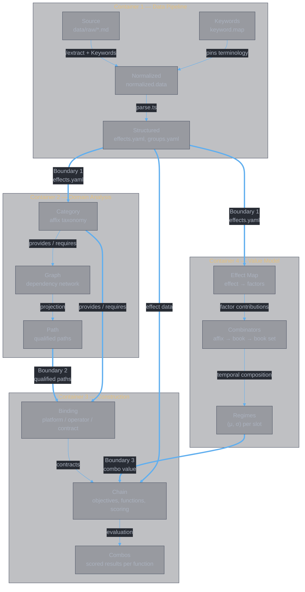

<style>
body {
  max-width: none !important;
  width: 95% !important;
  margin: 0 auto !important;
  padding: 20px 40px !important;
  background-color: #282c34 !important;
  color: #abb2bf !important;
  font-family: -apple-system, BlinkMacSystemFont, "Segoe UI", Helvetica, Arial, sans-serif !important;
  line-height: 1.6 !important;
  -webkit-print-color-adjust: exact !important;
  print-color-adjust: exact !important;
}

h1, h2, h3, h4, h5, h6 {
  color: #ffffff !important;
}

a {
  color: #61afef !important;
}

code {
  background-color: #3e4451 !important;
  color: #e5c07b !important;
  padding: 2px 6px !important;
  border-radius: 3px !important;
}

pre {
  background-color: #2c313a !important;
  border: 1px solid #4b5263 !important;
  border-radius: 6px !important;
  padding: 16px !important;
  overflow-x: auto !important;
}

pre code {
  background-color: transparent !important;
  color: #abb2bf !important;
  padding: 0 !important;
  border-radius: 0 !important;
  font-size: 13px !important;
  line-height: 1.5 !important;
}

table {
  border-collapse: collapse !important;
  width: auto !important;
  margin: 16px 0 !important;
  table-layout: auto !important;
  display: table !important;
}

table th,
table td {
  border: 1px solid #4b5263 !important;
  padding: 8px 10px !important;
  word-wrap: break-word !important;
}

table th:first-child,
table td:first-child {
  min-width: 60px !important;
}

table th {
  background: #3e4451 !important;
  color: #e5c07b !important;
  font-size: 14px !important;
  text-align: center !important;
}

table td {
  background: #2c313a !important;
  font-size: 12px !important;
  text-align: left !important;
}

blockquote {
  border-left: 3px solid #4b5263 !important;
  padding-left: 10px !important;
  color: #5c6370 !important;
  background-color: #2c313a !important;
}

strong {
  color: #e5c07b !important;
}
</style>

# System Design

**Authors:** Z. Zhang & Claude Opus 4.6 (Anthropic)

> **Architectural design of the Divine Book analysis system.** Four containers — Data Pipeline, Domain Analysis, Construction, Value Model — each with distinct components, boundaries, and invariants. This document defines the structure, explains how containers and components relate, and records key design decisions.

---

## 1. Problem

The Divine Book (灵書) system comprises 28 skill books across four schools, each with main skills, affixes, and scaling tiers. The combat engine needs deterministic structured data; the source of truth is volatile Chinese prose (`data/raw/*.md`). Three properties make hand-curation impractical:

1. **Volatility.** Source files change frequently as the game is balanced.
2. **Scale.** Hundreds of effects across 28 books, 16 universal affixes, 17 school affixes, 28 exclusive affixes — each with multiple `data_state` tiers.
3. **Prose ambiguity.** Chinese natural language with inconsistent formatting, implicit conventions, and compound effect descriptions.

The system exists to transform this volatile prose into typed, schema-validated data and then reason over it for construction and combat.

---

## 2. Container Architecture



Four containers, three boundaries:

- **Boundary 1** (`effects.yaml` / `groups.yaml`): separates data production from data interpretation. C1 produces correct structured data; C2, C3, and C4 consume it.
- **Boundary 2** (qualified paths + provides/requires): separates classification from construction. C2 discovers what combinations are structurally valid; C3 evaluates which are strategically useful.
- **Boundary 3** (regime parameters / factor contributions): separates value assessment from construction. C4 maps effects to model parameters and computes combo value; C3 uses these values to score and rank combos.

---

## 3. Container 1 — Data Pipeline

Transforms volatile Chinese prose into schema-validated YAML.

### Components

| Component | Artifacts | Role |
|:----------|:----------|:-----|
| **Source** | `data/raw/*.md` | Human-authored Chinese prose — the authoritative content |
| **Keywords** | `data/keyword/keyword.map.cn.md`, `.md` | Pattern-to-type mappings. Generated from the TypeScript Registry; the type system for the entire pipeline |
| **Normalized** | `data/normalized/normalized.data.cn.md`, `.md` | Strict markdown tables — one row per effect per `data_state` tier. Verbatim transcription, no inference |
| **Structured** | `data/yaml/effects.yaml`, `groups.yaml` | Parser output. Validated by Zod schemas; consumed by all downstream containers |

### Internal Flow

```
Source + Keywords  →  /extract (LLM)  →  Normalized
                                            ↓
                      /verify-schema  ←  Normalized  →  /verify-coverage
                                            ↓
                        human review  →  parse.ts  →  Structured
```

### Key Invariants

- Keywords must be current before extraction.
- Normalized captures verbatim values — no logical inference or semantic merging.
- The parser is trivial (~100 LOC) *because* Normalized is strict in format.
- Zero warnings/errors required before committing Structured output.

### Design Decisions

**Why markdown tables, not YAML.** The primary quality gate is a human reviewing the diff of Normalized. Markdown table diffs are line-oriented: each row is one effect at one tier, and a change to any value shows as a single changed line. YAML diffs are structurally ambiguous — indentation changes can alter meaning silently. Additionally, LLMs produce flat tabular data more reliably than deeply nested structures; structural errors (missing pipes, misaligned columns) are immediately visible. The code parser that consumes Normalized is ~100 LOC: split by `|`, split by `,`, split by `=`. No YAML parser needed.

**Why keyword.map exists.** Without pinned terminology, the extraction agent invents inconsistent names across runs (`damage_boost` vs `attack_bonus`). The keyword map prescribes exact effect type names, field names, and units — eliminating this variance. It also serves as the schema for automated verification: the schema agent compares Normalized against keyword.map rather than against hardcoded type definitions.

**Why two verification agents.** Schema correctness (valid types, valid fields) and source faithfulness (correct numbers, complete coverage) are orthogonal. A table can be schema-perfect with wrong numbers, or faithful but using undefined types. Separating them gives clear failure categorization — "wrong structure" vs "wrong data" — and enables parallel execution. The schema agent's checks are largely mechanical; the coverage agent requires LLM judgment about prose fidelity.

**Why `> 原文:` blockquotes.** Every table section is preceded by verbatim Chinese source text. This gives traceability (every value traceable to exact source), verification support (coverage agent checks blockquotes against source), and review quality (reviewer sees original prose above extracted table).

**Why `key=value` format.** A single parsing rule — split by `,`, then by `=` — handles both the `fields` and `data_state` columns. No quoting rules needed for the value types (integers, decimals, short strings). Immediately legible without documentation.

**Why `parent=` flattening.** Nested effects (counter debuffs with sub-effects, random buffs with options) must be represented in flat tables. `parent=X` in the fields column links child rows to their parent by name. The parser reconstructs the tree in a single-pass grouping operation. No implicit nesting from row ordering.

**Why bilingual (`.cn.md` + `.md`).** Chinese is the primary working language (matches source); English is the code-consumer language (effect types are English identifiers). `> 原文:` blockquotes stay Chinese in both versions to preserve traceability.

**Why exclude shared mechanics.** Fusion damage, enlightenment damage, and cooldown follow identical formulas across all schools. They don't vary by book — including them would add repetitive rows without distinguishing information.

---

## 4. Container 2 — Domain Analysis

Classifies the 61 affixes by what they provide and require, models their dependencies as a graph, and projects the graph into qualified paths.

### Components

| Component | Artifact | Role |
|:----------|:---------|:-----|
| **Category** | `domain.category.md` | Affix taxonomy — each of 61 affixes with its effect types, provides, and requires |
| **Graph** | `domain.graph.md` | Dependency network — terminals, connectors, ports, loops modeled from provides/requires |
| **Path** | `domain.path.md` | Qualified paths — legal affix chains projected from the graph |

### Internal Flow

```
effects.yaml  →  Category (classify affixes)
                      ↓ provides / requires
                  Graph (dependency network)
                      ↓ projection
                  Path (qualified chains)
```

### Key Invariants

- Category consumes Structured output from C1 — never raw source.
- Graph is derived from Category's provides/requires — no ad hoc edges.
- Paths are structurally valid combinations; strategic value is assessed in C3.

### Design Decisions

**Why target categories (T1–T10).** Affixes don't directly reference each other — they reference *categories* of effects. 咒书 doesn't require "天哀灵涸's debuff"; it requires *any* debuff (T2). This abstraction makes the dependency graph tractable: 10 categories rather than 80+ effect types.

**Why derived provides.** An affix's `provides` is mechanically derived from its `outputs` via the `EFFECT_PROVIDES` mapping (`lib/domain/bindings.ts`). Never hand-curated. This ensures that what an affix claims to provide always matches what it actually outputs.

**Why hand-curated requires.** Requirements are about *external conditions* — what must exist for an affix to function — not about what the affix itself produces. This is a design judgment that cannot be derived from effect type metadata alone.

---

## 5. Container 3 — Construction

Consumes qualified paths and binding contracts to evaluate book set construction against specific objectives.

### Components

| Component | Artifact | Role |
|:----------|:---------|:-----|
| **Binding** | `model.binding.md` | Platform/operator/contract model — the `Binding` interface, target categories, `EFFECT_PROVIDES` mapping |
| **Chain** | `chain.md` | Construction methodology — objectives (O1–O6), functions (F_burst, F_dr_remove, …), scoring model |
| **Combos** | `function.combos.md` | Scored combo tables — per-function results from chain evaluation |

### Internal Flow

```
qualified paths + provides/requires  →  Binding (typed contracts)
                                             ↓
effects.yaml + Binding contracts     →  Chain (objectives → functions → scoring)
                                             ↓
                                         Combos (scored results)
```

### Key Invariants

- Binding's `requires` determines which combinations are *legal* (satisfiable).
- Binding's `outputs` and `provides` determine which combinations are *useful*.
- Chain consumes both constraints: legality from binding, utility from effect data.
- Combos are reproducible given the same Chain methodology and effect data.

### Design Decisions

**Why platform/operator separation.** A 灵書 is built from three skill books: one main (platform) and two auxiliary (operators). The platform defines *what variables exist* — base damage, skill mechanics, innate effects. Operators *transform* those variables. This two-layer model maps directly to the game's construction rules and makes slot assignment a composable operation.

**Why typed contracts.** Without `Binding`, construction would require checking every affix against every other affix for compatibility. The contract abstraction reduces this to category-level checks: does the combination satisfy all `requires`? The `EFFECT_PROVIDES` derivation guarantees contract accuracy.

**Why objectives before functions.** Construction starts from *what you want to achieve* (O1: strong opponent, O2: weak opponent, …), not from *what affixes are available*. Objectives select relevant functions; functions select qualifying operators and platforms. This top-down flow prevents the combinatorial explosion of bottom-up enumeration.

---

## 6. Container 4 — Value Model

Maps game effects to model parameters (factors), then composes them through three combinators to produce regime-level $(\mu, \sigma)$ values. This is what makes combo scoring quantitative rather than heuristic.

### Components

| Component | Artifacts | Role |
|:----------|:----------|:-----|
| **Effect Map** | `model.yaml` (stored), `combat.md` §2 (spec) | Maps each effect type to factor contributions in the damage formula zones |
| **Combinators** | `lib/schemas/affix.model.ts`, `book.model.ts`, `bookset.model.ts` | Three composition levels: effects → affix vector → book vector → regime sequence |
| **Regimes** | `BookSetModel` (computed) | Ordered sequence of $(\mu_A, \sigma_A, \mu_B, \sigma_B)$ per time interval |

### Internal Flow

```
effects.yaml + groups.yaml  →  Effect Map (type → factors)
                                      ↓ model.yaml
                                Combinator 1 (effects → affix vector)
                                      ↓
                                Combinator 2 (affixes → book vector, evaluate damage chain)
                                      ↓
                                Combinator 3 (books → regime sequence, temporal composition)
                                      ↓
                                Regime parameters (μ, σ) → combo scoring
```

### The Factor Space

Every effect contributes to one or more factors in the multiplicative damage chain:

$$D_{skill} = (D_{base} \times S_{coeff} + D_{flat}) \times (1 + M_{dmg}) \times (1 + M_{skill}) \times (1 + M_{final}) \times M_{synchro}$$

Plus 灵力 damage ($D_{res}$: 会心 — a parallel attack line targeting 灵力, not a 气血 multiplier), orthogonal channels ($D_{ortho}$: %maxHP, lost-HP, DoT), defensive factors ($DR_A$, $S_A$), healing ($H_A$), and healing reduction ($H_{red}$). The factor space has 14 dimensions (see `FactorsSchema` in `lib/schemas/effect.model.ts`).

### Key Invariants

- Only the effect level is stored (`model.yaml`); higher levels are computed by combinators.
- Zone scarcity determines marginal value: contributing to a scarce zone ($M_{final}$) yields higher returns than a crowded zone ($M_{dmg}$).
- Two effects in different zones are multiplicative; same zone is additive (diminishing returns).
- Temporal propagation (buffs/debuffs crossing slot boundaries) is handled by Combinator 3 using coverage formulas.

### Design Decisions

**Why a four-level pipeline.** A single "effect → score" mapping would conflate zone interactions, temporal propagation, and cross-affix amplification. The four levels separate concerns: the Map handles per-type semantics, Combinator 1 handles within-affix aggregation (meta-modifiers like `buff_strength`), Combinator 2 evaluates the multiplicative chain, and Combinator 3 handles temporal composition across slots.

**Why store only model.yaml.** The effect-level map is the atomic representation — it changes only when effect types or their semantics change. Higher levels are derived and change whenever affix composition changes. Storing only the atoms avoids stale derived data.

**Why zone-based scoring.** The chain.md scoring model (S_same, S_cross, S_feed) is built on zone relationships: two operators in different zones are multiplicative (high score), same zone is additive (low score). This directly reflects the damage formula structure and makes scoring a structural property of the factor space, not a heuristic judgment.

---

## 7. Component–Container Relationships

### Within containers

Components are **ordered**: each component's output feeds the next. No component references a later component within the same container.

| Container | Flow | Ordering principle |
|:----------|:-----|:-------------------|
| C1 Data Pipeline | Source → Keywords → Normalized → Structured | Increasing structure, decreasing ambiguity |
| C2 Domain Analysis | Category → Graph → Path | Increasing abstraction, decreasing granularity |
| C3 Construction | Binding → Chain → Combos | Increasing specificity, decreasing optionality |
| C4 Value Model | Effect Map → Combinators → Regimes | Increasing aggregation, decreasing dimensionality |

### Across containers

Containers communicate through **boundary artifacts** — typed, stable outputs that the downstream container treats as input:

| Boundary | Artifact | Producer | Consumer | Stability |
|:---------|:---------|:---------|:---------|:----------|
| B1 | `effects.yaml`, `groups.yaml` | C1 Structured | C2 Category, C3 Chain, C4 Effect Map | Schema-validated, Zod-typed |
| B2 | Qualified paths + provides/requires | C2 Path + Category | C3 Binding | Derived from graph projection |
| B3 | Factor contributions, regime parameters | C4 Regimes | C3 Chain (scoring) | Computed from model.yaml |

**No reverse dependencies.** Information flows: C1 → {C2, C4} → C3. C1 never reads downstream output. C2 and C4 are independent of each other — both consume C1's output but have no mutual dependency. C3 consumes from all three upstream containers.

### Documentation

Each container has associated docs in `docs/data/`:

| Container | Docs |
|:----------|:-----|
| C1 Data Pipeline | `docs/data/`: `note.data.md`, `usage.parser.md`, `impl.parser.md` |
| C2 Domain Analysis | `docs/data/`: `usage.domain.md`, `domain.category.md`, `domain.graph.md`, `domain.path.md` |
| C3 Construction | `docs/data/`: `model.binding.md`, `chain.md`, `function.combos.md` |
| C4 Value Model | `docs/model/`: `combat.md` (spec), `impl.combat.md` (implementation), `combat.qualitative.md` (qualitative) |

---

## 7. Consistency Model

The pipeline's primary consistency challenge is LLM variance in C1's extraction step. Mitigations, in order of decreasing leverage:

1. **keyword.map** — prescribes exact terminology, constraining the space of valid outputs. Extending patterns is the first-line response to observed variance.
2. **Inference flags** — mark genuinely ambiguous areas. Variance in flagged areas is expected; variance elsewhere indicates a keyword map deficiency.
3. **Verification agents** — catch variance that survives keyword constraints. Schema agent catches structural errors; coverage agent catches content errors.
4. **Human diff review** — final gate before Normalized reaches the parser.

C2, C3, and C4 have no LLM variance — they are fully deterministic given their inputs.

---

## Document History

| Version | Date | Changes |
|---------|------|---------|
| 1.0 | 2026-03-06 | Full rewrite — container architecture, component relationships, preserved design rationale |
