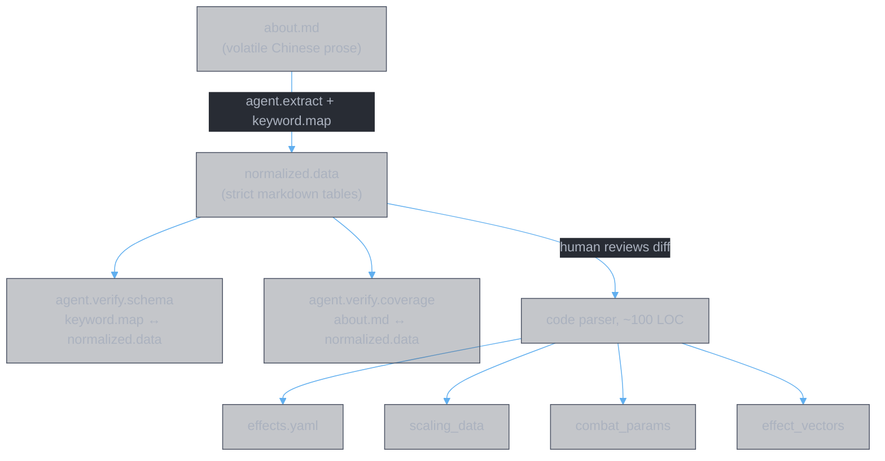

# Design: Divine Book Data Pipeline

**Authors:** Z. Zhang & Claude Opus 4.6 (Anthropic)

> **Design rationale document.** Explains the architectural decisions behind the Divine Book data pipeline: why we extract structured data from prose via LLM agents, why the intermediate representation uses markdown tables rather than YAML, why verification is split into two independent agents, and how each design choice addresses a specific failure mode observed during earlier iterations. This document is intended for contributors who need to understand not just *what* the pipeline does, but *why* it is structured the way it is.

---

## Problem

The Divine Book system (灵书) comprises 28 skill books across four cultivation schools, each with main skills, primary affixes, exclusive affixes, and shared affix pools. The game's combat engine requires this data in structured form: effect vectors, scaling tables, combat parameters. The sole source of truth for all of this data is `data/raw/about.md` — a volatile document written in Chinese prose.

Three properties of this situation make hand-curation impractical:

1. **Volatility.** `about.md` changes frequently as the game is balanced. Any structured representation that is maintained by hand will inevitably fall out of sync with the source.

2. **Scale.** The document describes hundreds of distinct effects across 28 books, 16 universal affixes, and 17 school affixes. Each effect may have multiple data_state tiers (enlightenment levels, fusion levels). A full extraction produces several hundred table rows. Manual transcription at this scale is error-prone.

3. **Prose ambiguity.** The source text is natural-language Chinese. Effect descriptions use inconsistent formatting, implicit conventions (e.g., unlabeled values default to the school's maximum enlightenment tier), and compound sentences that pack multiple effects into a single paragraph.

The pipeline exists to solve these problems: automated extraction from prose, with machine-verifiable intermediate outputs, producing a clean checkpoint that both humans and code can consume.

---

## Pipeline Architecture

The pipeline has three stages:

**Stage 1: Extraction.** The extraction agent (`agent.extract`) reads `about.md` and `keyword.map`, and produces `normalized.data.cn.md` (Chinese headers) and `normalized.data.md` (English headers). The keyword map pins all terminology — effect type names, field names, units, data_state vocabulary — so that the LLM's output is deterministic in its structure even when the source prose is ambiguous.

**Stage 2: Verification.** Two independent verification agents run against the extraction output. The schema agent (`agent.verify.schema`) checks that `normalized.data` conforms to the type system defined in `keyword.map`: valid effect types, valid field names for each type, correct value types, well-formed data_state expressions. The coverage agent (`agent.verify.coverage`) checks that `normalized.data` faithfully and completely represents `about.md`: all books present, all effects captured, all numeric values verbatim, all data_state tiers covered. These agents have no dependency on each other and can run in parallel.

**Stage 3: Code parsing.** A deterministic code parser (approximately 100 lines) reads the markdown tables and produces the structured outputs that the combat engine consumes. Because `normalized.data` is strict in format — pipe-delimited columns, `key=value` fields, well-defined data_state vocabulary — this parser is trivial.

A human review checkpoint sits between stages 2 and 3. The human examines the diff between the previous and current `normalized.data`, reads the verification reports, and approves or rejects the extraction before it reaches the code parser.

---

## Design Decisions

### Why markdown tables, not YAML

The intermediate representation (`normalized.data`) uses markdown tables rather than YAML, JSON, or any other structured format. This is a deliberate choice driven by four considerations:

**Human reviewability.** The primary quality gate in the pipeline is a human reviewing the diff between old and new `normalized.data`. Markdown table diffs are line-oriented and visually clear: each row is one effect at one data_state tier, and a change to any value shows up as a single changed line. YAML diffs, by contrast, are structurally ambiguous — a changed indentation level can alter meaning silently, and deeply nested structures make it difficult to see what actually changed.

**Source text traceability.** Each table section is preceded by a `> 原文:` blockquote containing the verbatim Chinese source text. The human reviewer sees the original prose directly above the extracted table and can judge extraction quality at a glance. This juxtaposition is natural in markdown and would be awkward in a data serialization format.

**LLM extraction reliability.** Large language models produce flat tabular data more reliably than deeply nested structures. A markdown table with `key=value` pairs in the fields column is a flat structure — one row per effect per data_state tier, no nesting, no indentation sensitivity. When the extraction agent produces output, structural errors (missing pipes, misaligned columns) are immediately visible and mechanically detectable. Nested YAML, by contrast, is sensitive to indentation errors that are both easy to produce and hard to detect.

**Parsing simplicity.** The code parser that consumes `normalized.data` is approximately 100 lines: split by `|` to get columns, split the fields column by `,` to get key-value pairs, split each pair by `=` to get key and value. No YAML parsing library is needed. No schema validation library is needed. The parser is so simple that its correctness can be verified by inspection.

### Why keyword.map exists

The `keyword.map` document serves as the type system for the entire pipeline. It maps Chinese keyword patterns in `about.md` to canonical effect type names and field structures. It contains no numeric values — it is purely a parsing specification.

**Reducing LLM variance.** Without a keyword map, the extraction agent must independently decide what to call each effect type, what fields to extract, and what units to use. Different runs would produce different names for the same concept (e.g., `damage_boost` vs `damage_increase` vs `attack_bonus`). The keyword map eliminates this variance by prescribing exact names: the agent looks up the Chinese pattern, finds the canonical effect type, and uses the prescribed field names and units.

**Reproducibility.** Because the keyword map pins all terminology, two independent runs of the extraction agent on the same `about.md` should produce structurally identical output. Differences, if any, are confined to ambiguous areas explicitly marked with inference flags in the keyword map.

**Type system documentation.** The keyword map serves double duty as documentation of the effect type system. A developer reading `keyword.map` learns every effect type the system recognizes, what fields each type carries, and what units those fields use. This is the authoritative reference for the type system, not a secondary document derived from code.

**Enabling automated schema verification.** The schema verification agent works by comparing `normalized.data` against `keyword.map`. If the keyword map did not exist as a formal document, the schema agent would need the type system hardcoded into its instructions — a maintenance burden and a source of drift.

### Why two separate verification agents

Verification is split into two agents with distinct responsibilities: the schema agent checks structural conformance (`keyword.map` against `normalized.data`), and the coverage agent checks source faithfulness (`about.md` against `normalized.data`).

**Separation of concerns.** Schema correctness and source faithfulness are orthogonal properties. A table can be perfectly schema-conformant (all effect types valid, all fields correctly typed) while containing entirely wrong numbers. Conversely, a table can faithfully capture every value from `about.md` while using undefined effect type names or malformed data_state expressions. Combining these checks into a single agent would conflate two failure modes that require different remediation.

**Parallel execution.** The two agents share only `normalized.data` as input and have no dependency on each other's output. They can run simultaneously, halving the wall-clock time of the verification stage.

**Automation gradient.** The schema agent's checks are largely mechanical: string matching of effect type names against a known set, regex validation of data_state expressions, type checking of numeric fields. This agent could, in principle, be replaced by a deterministic script. The coverage agent's checks, by contrast, require judgment: determining whether a Chinese prose description is "fully captured" by a set of `key=value` pairs is an inherently fuzzy task. Separating the agents makes it clear which verification is automatable and which requires LLM-level reasoning.

**Clear failure categorization.** When verification fails, the failure report clearly indicates whether the problem is "wrong structure" (schema agent) or "wrong/missing data" (coverage agent). This distinction directly informs the remediation: schema failures mean the extraction agent misapplied the keyword map; coverage failures mean it misread or skipped source text.

### Why source blockquotes (`> 原文:`)

Every table section in `normalized.data` is preceded by a `> 原文:` blockquote containing the verbatim Chinese text from `about.md` that the table was extracted from.

**Traceability.** Every extracted value can be traced to the exact Chinese text it was derived from. This is the fundamental requirement for auditability: if a combat parameter looks wrong, a developer can find the corresponding `> 原文:` block, read the original prose, and determine whether the extraction was faithful.

**Verification support.** The coverage agent's first check is source traceability: it verifies that every `> 原文:` blockquote in `normalized.data` can be found verbatim in `about.md`. If the extraction agent fabricates or paraphrases source text, this check catches it.

**Human review quality.** During the human review checkpoint, the reader sees the original Chinese text immediately above the extracted table. This juxtaposition allows the reviewer to judge extraction quality without switching between documents.

### Why key=value format everywhere

Both the `fields` column and the `data_state` column in `normalized.data` use `key=value` format: `damage=15, duration=8` for fields, `enlightenment=3` or `[enlightenment=1, fusion=20]` for data_state.

**Uniformity.** A single parsing rule — split by `,`, then split by `=` — handles both columns. The code parser does not need to distinguish between field syntax and data_state syntax at the lexical level.

**Trivial parsing.** No quoting rules are needed for the value types that appear in the data: integers, decimals, and short identifier strings. The `=` delimiter is unambiguous because neither keys nor values contain `=`. The `,` delimiter is unambiguous because values do not contain commas (array notation uses `[v1, v2]` brackets to disambiguate).

**Readability.** The `key=value` format is immediately legible to anyone familiar with configuration files or query strings. No documentation is needed to understand that `damage=15, duration=8` means "damage is 15 and duration is 8."

### Why parent= flattening

The Divine Book system contains nested effects: a counter debuff may have sub-effects (DoT, stat reduction), and a random buff affix may offer multiple options. These hierarchical relationships must be represented in a flat table.

The pipeline uses `parent=X` in the fields column to express hierarchy. The parent effect gets its own row (e.g., `counter_debuff | name=罗天魔咒, duration=8, on_attacked_chance=30`). Each sub-effect gets a separate row with `parent=罗天魔咒` in its fields (e.g., `dot | name=噬心魔咒, parent=罗天魔咒, damage=5, duration=6`).

**Flat table preservation.** Nesting tables within tables is not a markdown construct. Any attempt to represent hierarchy through visual nesting (indentation, sub-tables) would break the uniform row structure that the code parser depends on.

**Parseable hierarchy.** The code parser reconstructs the tree by grouping rows on the `parent` field. Rows without `parent` are top-level effects; rows with `parent=X` are children of the row named X. This reconstruction is a single-pass grouping operation.

**Explicit relationships.** The `parent=X` field makes the relationship machine-readable and unambiguous. There is no implicit nesting based on row ordering or visual proximity — the hierarchy is stated declaratively.

### Why exclude shared mechanics

The `normalized.data` extraction explicitly excludes fusion damage, enlightenment damage, and cooldown (cast gap). These are shared mechanics of the skill book system (功法书), not Divine Book-specific effects.

**Structural uniformity.** Fusion damage, enlightenment damage, and cooldown follow an identical formula across all schools (with the exception of spell enlightenment values, which are school-specific but still part of the base system). They do not vary by book within a school. Including them in `normalized.data` would add rows that are structurally repetitive and informationally redundant.

**Scope clarity.** The Divine Book data pipeline extracts Divine Book effects — the unique behaviors that differentiate one book from another. Shared mechanics belong to the skill book system and should be maintained separately, alongside other skill book parameters like base damage formulas and casting mechanics.

**Noise reduction.** Including shared mechanics would inflate the row count without adding information that distinguishes books from each other. The verification agents would need to validate these rows despite their uniform structure, and the human reviewer would need to scroll past them during diff review. Excluding them keeps `normalized.data` focused on the data that actually varies.

### Why bilingual docs (`.cn.md` + `.md`)

Each document in the pipeline exists in two versions: a Chinese version (`.cn.md`) with Chinese table headers and section names, and an English version (`.md`) with English table headers and section names. Source text blockquotes (`> 原文:`) are preserved in Chinese in both versions.

**Chinese as primary working language.** The source material (`about.md`) is Chinese. The Chinese version of `normalized.data` uses the same language as the source, making it the natural version for extraction and verification work. Chinese table headers align with the Chinese keyword patterns in `keyword.map`, reducing cognitive switching during review.

**English as default for code consumers.** The code parser and downstream systems operate in English. Effect type names (`stat_buff`, `dot`, `counter_debuff`) are English identifiers. The English version of `normalized.data` is the one that code consumers read, and it is the default (the file without a language suffix).

**Traceability preservation.** The `> 原文:` blockquotes remain in Chinese in both versions because they are verbatim copies of `about.md` text. Translating them would destroy traceability — the coverage agent would be unable to verify them against the source.

---

## Consistency Considerations

The pipeline's primary consistency challenge is LLM variance: the extraction agent is a language model, and language models are non-deterministic. Different runs on the same input may produce different output. The pipeline addresses this through several mechanisms, listed in order of decreasing leverage.

**keyword.map as the consistency lever.** The keyword map is the single most important tool for reducing extraction variance. By prescribing exact effect type names, exact field names, exact units, and exact data_state vocabulary, it constrains the space of valid outputs. The more specific the keyword patterns, the less room the LLM has to improvise. Extending the keyword map with additional patterns is the first-line response to observed variance.

**Inference flags for acknowledged ambiguity.** The keyword map marks certain areas with inference flags, indicating that the source text is genuinely ambiguous and some degree of LLM judgment is required. These flags set expectations: variance in flagged areas is expected and acceptable, while variance in unflagged areas indicates a deficiency in the keyword map that should be corrected.

**High-variance extraction tasks.** Two tasks account for the majority of observed extraction variance:

- *Compound affix splitting.* When a single affix description contains multiple effects, the extraction agent must identify the boundaries between effects and assign each to the correct effect type. The order and grouping of effects in the output table may vary across runs, even when the content is identical.

- *parent= assignment.* When nested effects are present, the agent must decide which effects are parents and which are children. In straightforward cases (named debuffs with explicit sub-effects) this is unambiguous. In edge cases (implicit hierarchies, effects that reference other effects), the assignment may vary.

**Verification as a safety net.** The two verification agents catch most variance that matters. The schema agent catches wrong effect type names, wrong field names, and malformed data_state values — the structural errors that would cause the code parser to fail. The coverage agent catches wrong numeric values, missing effects, and missing data_state tiers — the content errors that would cause incorrect game behavior. Together, they ensure that variance which survives the keyword map's constraints is detected before it reaches the code parser.

---

## Document History

| Version | Date | Changes |
|---------|------|---------|
| 1.0 | 2026-02-25 | Initial design rationale document |

