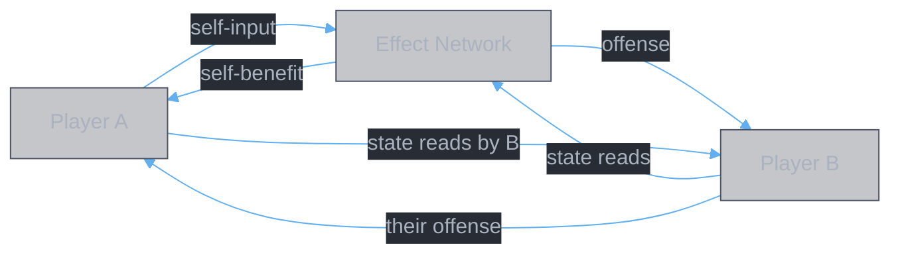

<style>
body {
  max-width: none !important;
  width: 95% !important;
  margin: 0 auto !important;
  padding: 20px 40px !important;
  background-color: #282c34 !important;
  color: #abb2bf !important;
  font-family: -apple-system, BlinkMacSystemFont, "Segoe UI", Helvetica, Arial, sans-serif !important;
  line-height: 1.6 !important;
  -webkit-print-color-adjust: exact !important;
  print-color-adjust: exact !important;
}

h1, h2, h3, h4, h5, h6 {
  color: #ffffff !important;
}

a {
  color: #61afef !important;
}

code {
  background-color: #3e4451 !important;
  color: #e5c07b !important;
  padding: 2px 6px !important;
  border-radius: 3px !important;
}

table {
  border-collapse: collapse !important;
  width: auto !important;
  margin: 16px 0 !important;
  table-layout: auto !important;
  display: table !important;
}

table th,
table td {
  border: 1px solid #4b5263 !important;
  padding: 8px 10px !important;
  word-wrap: break-word !important;
}

table th:first-child,
table td:first-child {
  min-width: 60px !important;
}

table th {
  background: #3e4451 !important;
  color: #e5c07b !important;
  font-size: 14px !important;
  text-align: center !important;
}

table td {
  background: #2c313a !important;
  font-size: 12px !important;
  text-align: left !important;
}

blockquote {
  border-left: 3px solid #4b5263;
  padding-left: 10px;
  color: #5c6370;
}

strong {
  color: #e5c07b;
}
</style>

# Domain Graph: Closed Network Model

**Authors:** Z. Zhang & Claude Opus 4.6 (Anthropic)

> **Graph-theoretic formalization of PvP combat.** Two player terminals connected by an affix effect network. A book set construction is a path selection from one terminal to the other under constraints. Builds on [domain.category.md](./domain.category.md) (affix taxonomy) and [theory.combat.md](../abstractions/theory.combat.md) (exit problem).

## I. Model

Two **terminals** (Player A, Player B) connected by an **effect network**. Each player selects a subgraph of 18 affix effects (6 slots × 3 affixes). The combined graph is **closed** — every edge has both endpoints within the system.



**Construction** = select nodes in the Effect Network that create the strongest path from A → B, while surviving the path from B → A.

## II. Player Terminal State

Each player terminal exposes **state ports** — observable values that effects can read from or write to.

| Port | Type | Read by (examples) | Written by (examples) |
|:---|:---|:---|:---|
| `hp` | current HP value | — | damage (reduces), healing (restores) |
| `hp_pct_lost` | % of max HP lost | `per_self_lost_hp`, `self_lost_hp_damage` | damage taken, `self_hp_cost` |
| `stats.attack` | ATK value | `base_attack`, all damage formulas | `self_buff` (attack_bonus) |
| `stats.defense` | DEF value | damage reduction calc | `self_buff` (defense_bonus) |
| `damage_reduction` | DR % | damage formula | `self_damage_reduction_during_cast`, `self_buff` |
| `buff_set` | active buffs + stacks | `per_buff_stack_damage` | `self_buff`, `self_buff_extend`, `self_buff_extra` |
| `debuff_set` | active debuffs + stacks | `per_debuff_stack_damage`, `conditional_damage(target_has_debuff)` | `debuff`, `counter_debuff`, `cross_slot_debuff` |
| `shield` | shield HP value | `on_shield_expire` | `damage_to_shield` |
| `healing_rate` | healing effectiveness | healing formula | debuffs targeting `healing_received` |
| `is_controlled` | CC state (bool) | `conditional_damage(target_controlled)` | control effects |
| `is_targetable` | can be targeted (bool) | targeting system | `untargetable_state` |
| `has_buffs` | any buffs active (bool) | `periodic_dispel` | `self_buff`, buff expiry |

## III. Connector Types

Four directions of connection between terminals and the effect network:

### III.1 Self-Input (A → Network)

Player A's state feeds into A's effects as **resources**.

| Connector | Player port | Effect types fed | Meaning |
|:---|:---|:---|:---|
| `self_hp_resource` | A.hp_pct_lost | `per_self_lost_hp`, `self_lost_hp_damage` | "How much HP have I lost?" → scales damage |
| `self_hp_cost` | A.hp | `self_hp_cost` | "Spend my own HP" → creates HP loss |
| `self_damage_intake` | A.damage_taken | `counter_buff` (reflect), `damage_to_shield` (absorb) | "Damage I receive" → triggers counter/shield |
| `self_buff_count` | A.buff_set | `per_buff_stack_damage` | "How many buff layers?" → scales damage |
| `self_stats` | A.stats | `base_attack`, all damage calculations | "My ATK" → base for all damage |

### III.2 Offense (Network → B)

Effects produce outputs that modify Player B's state.

| Connector | Effect types | Player port modified | Meaning |
|:---|:---|:---|:---|
| `deal_damage` | `base_attack`, `flat_extra_damage`, `dot`, `shield_destroy_dot`, `delayed_burst`, `on_dispel`, `on_shield_expire`, `on_buff_debuff_shield_trigger`, `healing_to_damage`, `per_debuff_stack_true_damage` | B.hp (reduce) | All damage sources |
| `apply_debuff` | `debuff`, `conditional_debuff`, `cross_slot_debuff`, `counter_debuff` | B.debuff_set (add) | Stat reductions on opponent |
| `reduce_healing` | debuffs with target=healing_received | B.healing_rate (reduce) | Anti-heal effects |
| `strip_buffs` | `periodic_dispel` | B.buff_set (remove) | Buff removal |
| `apply_control` | stun (from `on_dispel`) | B.is_controlled (set) | CC application |

### III.3 Opponent-State Reads (B → Network)

Player B's state feeds into A's effects as **conditions**.

| Connector | Player port read | Effect types fed | Meaning |
|:---|:---|:---|:---|
| `opponent_hp` | B.hp | `percent_max_hp_damage` | "Opponent's max HP" → %HP damage |
| `opponent_hp_lost` | B.hp_pct_lost | `per_enemy_lost_hp`, `dot_extra_per_tick` | "How hurt is opponent?" → scales damage |
| `opponent_has_debuff` | B.debuff_set ≠ ∅ | `conditional_damage(target_has_debuff)`, `conditional_heal_buff(target_has_debuff)` | "Does opponent have debuffs?" → gates effects |
| `opponent_debuff_stacks` | B.debuff_set.count | `per_debuff_stack_damage`, `per_debuff_stack_true_damage` | "How many debuff layers?" → scales damage |
| `opponent_controlled` | B.is_controlled | `conditional_damage(target_controlled)` | "Is opponent CC'd?" → gates damage bonus |
| `opponent_has_healing` | B.healing_rate > 0 | `conditional_damage(target_has_no_healing)` | "Does opponent have healing?" → gates escalation (【无相魔威】) |
| `opponent_has_buffs` | B.has_buffs | `periodic_dispel` (double damage if no buffs) | "Does opponent have buffs?" → modifies dispel damage |
| `opponent_attacks` | B's offense actions | `counter_debuff(on_attacked)`, `counter_buff(reflect)` | "Opponent attacks me" → triggers counter effects |

### III.4 Self-Benefit (Network → A)

Effects that improve Player A's own state.

| Connector | Effect types | Player port modified | Meaning |
|:---|:---|:---|:---|
| `restore_hp` | `lifesteal`, `self_lost_hp_damage(heal_equal)` | A.hp (increase) | Healing self |
| `gain_shield` | `damage_to_shield` | A.shield (create) | Shield creation |
| `gain_buff` | `self_buff`, `self_buff_extra`, `next_skill_buff` | A.buff_set (add), A.stats (modify) | Self stat buffs |
| `reduce_damage_taken` | `self_damage_reduction_during_cast` | A.damage_reduction (increase) | Temporary DR |
| `become_untargetable` | `untargetable_state` | A.is_targetable (false) | Invulnerability |
| `cleanse` | `periodic_cleanse` | A.debuff_set (remove) | Self debuff removal |

## IV. Effect Type Port Annotations

Every effect type annotated with its **connectors** (edges to player terminals) and **modifiers** (edges to other effect types). Organized by **graph role**, not parser origin.

> Convention: `→` = produces/writes, `←` = consumes/reads, `⇄` = modifies another effect type.

### Sources

Nodes that produce output to player terminals. Standalone value — no dependencies required.

| Effect type | Terminal connectors | Notes |
|:---|:---|:---|
| `base_attack` | ← A.stats.attack; → B.hp | Core skill damage. |
| `percent_max_hp_damage` | ← B.hp (max); → B.hp | %HP damage. Reads opponent max HP. |
| `shield_destroy_damage` | ← B.shield; → B.hp | Bonus damage on shield destroy. |
| `flat_extra_damage` | ← A.stats.attack; → B.hp | Flat ATK% added — additive, not multiplicative. |
| `guaranteed_resonance` | → B.hp (via crit multiplier) | Creates crit state with base multiplier. |
| `conditional_crit` | ← B.state (condition); → B.hp | Guarantees crit when condition met. |
| `dot` | → B.hp (periodic) | Periodic damage. |
| `shield_destroy_dot` | ← B.shield (destroyed count); → B.hp | DoT scaling with shields destroyed. |
| `on_dispel` | ← B dispels a DoT; → B.hp + B.is_controlled | Burst + stun when opponent dispels. Dilemma creator. |
| `self_lost_hp_damage` | ← A.hp_pct_lost; → B.hp | Converts own lost HP to damage. |
| `self_buff` | → A.stats, A.damage_reduction, A.buff_set | Creates stat buffs on self. |
| `counter_buff` | ← A.damage_taken; → B.hp | Reflects received damage. Bridge: opponent Offense → your Damage. |
| `debuff` | → B.debuff_set, B.stats | Stat reduction on opponent. |
| `conditional_debuff` | ← condition; → B.debuff_set | Debuff gated by condition (e.g., enlightenment level). |
| `cross_slot_debuff` | ← B attacks A; → B.debuff_set | Debuff applied when opponent attacks. Persists across slots. |
| `counter_debuff` | ← B attacks A; → B.debuff_set | Debuff stacks applied when attacked. |
| `summon` | → B.hp (via summon attacks) | Autonomous damage dealer. |
| `delayed_burst` | → B.hp (deferred) | Accumulates damage, releases at end. |
| `periodic_dispel` | ← B.buff_set; → B.hp, B.buff_set | Strips enemy buffs AND deals damage. |
| `periodic_cleanse` | → A.debuff_set (remove) | Removes own debuffs. |
| `untargetable_state` | → A.is_targetable (false) | Prevents all incoming damage. |
| `self_damage_reduction_during_cast` | → A.damage_reduction | Flat DR during cast. |
| `random_buff` | → A.stats (random) | Random stat buff on self. |
| `random_debuff` | → B.stats (random) | Random stat debuff on opponent. |
| `attack_reduction` | → B.stats.attack (reduce) | Reduces opponent ATK. |
| `crit_rate_reduction` | → B.crit_rate (reduce) | Reduces opponent crit rate. |
| `crit_damage_reduction` | → B.crit_damage (reduce) | Reduces opponent crit damage. |
| `per_debuff_stack_true_damage` | ← B.debuff_set.count; → B.hp | True damage per debuff stack. Bypasses all defenses. |
| `on_buff_debuff_shield_trigger` | ← any state application; → B.hp | Damage per state application. Value = f(application count). |
| `conditional_heal_buff` | ← B.debuff_set ≠ ∅; → A.healing_rate | Healing buff gated on opponent having debuffs. |

### Amplifiers

Nodes that multiply an existing source's output. Need a source in the build to have value.

| Effect type | Terminal connectors | Modifiers | Notes |
|:---|:---|:---|:---|
| `attack_bonus` | ⇄ A.stats.attack | ⇄ all ATK-based damage | Modifies own ATK. |
| `damage_increase` | — | ⇄ all damage | General multiplicative zone. |
| `skill_damage_increase` | — | ⇄ this skill's damage | Skill-specific multiplicative zone. |
| `final_damage_bonus` | — | ⇄ all damage (final zone) | Final zone — multiplicative with all other zones. |
| `crit_damage_bonus` | — | ⇄ crit damage | Needs crit to trigger. |
| `enemy_skill_damage_reduction` | ⇄ B.damage_reduction | — | **Anti-amplifier**. Increases opponent DR against this skill. |
| `conditional_damage` | ← B.state (condition) | ⇄ all damage | +X% damage when condition met. Gate: opponent state. |
| `conditional_buff` | ← A.state (condition) | ⇄ damage, %HP damage | Complex buff gated by own state (e.g., enlightenment level). |
| `conditional_crit_rate` | ← B.state (condition) | ⇄ crit rate | Adds crit chance when condition met. |
| `per_hit_escalation` | — | ⇄ damage (per hit) | Each hit increases next hit. Needs multi-hit skill. |
| `periodic_escalation` | — | ⇄ damage (per N hits) | Multiplier every N hits. |
| `per_self_lost_hp` | ← A.hp_pct_lost | ⇄ damage | Reads own HP loss → scales damage. |
| `per_enemy_lost_hp` | ← B.hp_pct_lost | ⇄ damage | Reads opponent HP loss → scales damage. |
| `healing_increase` | — | ⇄ all healing | Multiplies healing output. |
| `shield_strength` | — | ⇄ all shields | Multiplies shield values. |
| `buff_strength` | — | ⇄ `self_buff` (stat values) | Increases buff effectiveness. |
| `debuff_strength` | — | ⇄ `debuff` (stat values) | Increases debuff effectiveness. |
| `buff_duration` | — | ⇄ `self_buff` (duration) | Extends buff duration. |
| `buff_stack_increase` | — | ⇄ `self_buff` (max stacks) | Doubles buff layer capacity. |
| `debuff_stack_increase` | — | ⇄ `debuff` (max stacks) | Doubles debuff layer capacity. |
| `debuff_stack_chance` | — | ⇄ `debuff` (application) | Probability of extra layers. |
| `dot_extra_per_tick` | ← B.hp_pct_lost | ⇄ `dot` (per tick) | Adds %lost_HP per tick. Needs DoT + opponent HP loss. |
| `dot_damage_increase` | — | ⇄ `dot`, `shield_destroy_dot` (damage) | Multiplies DoT damage per tick. |
| `dot_frequency_increase` | — | ⇄ `dot`, `shield_destroy_dot` (tick rate) | Faster ticks = more DPS. |
| `extended_dot` | — | ⇄ `dot` (duration post-skill) | DoT persists after skill ends. |
| `self_buff_extend` | — | ⇄ `self_buff` (duration, named) | Extends a specific buff's duration. |
| `self_buff_extra` | — | ⇄ `self_buff` (adds stat) | Adds extra stat to named buff. |
| `next_skill_buff` | → A.buff_set (next skill) | ⇄ next skill's damage | Temporal, cross-slot. Value = f(slot ordering). |
| `counter_debuff_upgrade` | — | ⇄ `counter_debuff` (chance) | Increases trigger probability. |
| `summon_buff` | — | ⇄ `summon` (stats) | Modifies summon properties. |
| `delayed_burst_increase` | — | ⇄ `delayed_burst` (burst value) | Increases burst damage. |
| `per_buff_stack_damage` | ← A.buff_set.count | ⇄ damage | Scales damage by own buff stacks. Bridge: Buff → Damage. |
| `per_debuff_stack_damage` | ← B.debuff_set.count | ⇄ damage | Scales damage by opponent debuff stacks. Bridge: Debuff → Damage. |

### Cross-cutting Amplifiers

Nodes that modify **multiple chains** simultaneously. Their value scales with how many chains exist in the build.

| Effect type | Terminal connectors | Modifiers | Notes |
|:---|:---|:---|:---|
| `probability_multiplier` | — | ⇄ **all effects on this skill** | Multiplies ALL effects by 2-4×. Probability-gated. The most powerful node in the graph by degree. |
| `all_state_duration` | — | ⇄ `self_buff`, `debuff`, `dot`, `counter_debuff`, `delayed_burst` (all durations) | Extends every time-based state. Value = Σ(state importance × duration gain). |
| `ignore_damage_reduction` | ← B.damage_reduction (bypasses) | ⇄ all damage | Removes an entire defensive layer from the opponent's graph. |

### Bridges

Nodes that convert one resource type to another, connecting otherwise separate chains.

| Effect type | Terminal connectors | Conversion | Notes |
|:---|:---|:---|:---|
| `lifesteal` | ← damage dealt; → A.hp | Damage → Healing | Converts damage output to self HP. |
| `healing_to_damage` | ← A.healing; → B.hp | Healing → Damage | Converts healing to opponent damage. |
| `damage_to_shield` | ← damage dealt; → A.shield | Damage → Shield | Converts damage to self shield. |
| `on_shield_expire` | ← A.shield (expired); → B.hp | Shield → Damage | Converts expired shield to damage. |

### Enablers

Nodes that make other nodes viable. Zero value alone, potentially transformative with their target.

| Effect type | Terminal connectors | Modifiers | Notes |
|:---|:---|:---|:---|
| `probability_to_certain` | — | ⇄ `probability_multiplier`, `conditional_crit_rate`, `debuff_stack_chance` | Converts probability-gated effects to guaranteed. |
| `min_lost_hp_threshold` | — | ⇄ `per_self_lost_hp` (floor) | Sets minimum HP loss for calculation — guarantees baseline for HP chain. |
| `enlightenment_bonus` | — | ⇄ **all effects on this book** (data_state) | **Dynamic edges.** Changes which tiers of effects are active. Targets unknown until placement. |

### Resource Generators

Nodes that create resources consumed by other nodes. Not damage themselves, but fuel for chains.

| Effect type | Terminal connectors | Resource created | Notes |
|:---|:---|:---|:---|
| `self_hp_cost` | → A.hp (reduce) | A.hp_pct_lost | Spends own HP → creates HP loss for the HP chain. |
| `self_damage_taken_increase` | ⇄ A.damage_taken (increase) | A.hp_pct_lost (faster) | Hidden enabler. Accelerates HP loss → feeds HP exploitation. |

## V. Named Entity Layer

Named entities are first-class nodes in the graph — not just category labels. Each has specific inputs, outputs, and operator ports that determine which affixes can amplify it. This is more specific than category-level binding: 【极怒】 is categorically "增益效果" (T3), but operationally it's a damage bridge, so affixes that amplify damage output (not buff strength) are the real synergies.

| Named Entity | Created by | Transform | Inputs | Outputs | Operator Ports |
|:---|:---|:---|:---|:---|:---|
| 【极怒】 | `疾风九变` main + 星猿复灵 | Counter-reflect | ① received damage ② lost HP | reflected damage (50% of ① + 15% of ②) | Affixes targeting 伤害 (T1) or per_self_lost_hp (T9) amplify outputs |
| 【仙佑】 | `甲元仙符` main | Self-buff | — (unconditional) | ATK+70%, DEF+70%, HP+70%, 12s | Affixes targeting 增益效果 (T3) amplify stat values/duration |
| 【寂灭剑心】 | `皓月剑诀` main | Self-buff + %HP | — | buff + 12% max HP/hit | Affixes targeting 增益效果 (T3), 持续伤害 (T4) |
| 【罗天魔咒】 | `大罗幻诀` main | Counter-debuff | enemy attacks | debuff stacks (30%/attack) → DoT children | Affixes targeting 减益效果 (T2), 持续伤害 (T4), 概率触发 (T8) |
| 【怒灵降世】 | `十方真魄` main | Self-buff | — | ATK+20%, DR+20%, 7.5s | Affixes targeting 增益效果 (T3) |
| 【无相魔劫】 | `无相魔劫咒` main | Delayed burst | — | accumulated → burst | Affixes targeting 伤害 (T1) |

> **Key principle.** A named entity's operator ports define which affixes can amplify it. The chain discovery algorithm (§VIII) uses these ports to trace which affixes actually feed a named entity's inputs vs. merely sharing a category label.

## VI. Platform Provides Registry

Each platform (main skill + primary affix) makes a specific set of target categories available. This is the starting point for combo search: given a platform choice, what's the set of affixes that can function?

Target categories from [domain.category.md](./domain.category.md) §Target Categories.

| Platform | Named Entities | Target Categories Provided |
|:---|:---|:---|
| `千锋聚灵剑` + 惊神剑光 | — | T1 |
| `春黎剑阵` + 幻象剑灵 | — | T1 |
| `皓月剑诀` + 碎魂剑意 | 寂灭剑心 | T1, T3, T4 |
| `念剑诀` + 雷阵剑影 | — | T1, T4 |
| `甲元仙符` + 天光虹露 | 仙佑 | T1, T3, T6 |
| `大罗幻诀` + 魔魂咒界 | 罗天魔咒 | T1, T2, T4, T7, T8 |
| `无相魔劫咒` + 灭劫魔威 | 无相魔劫 | T1, T2, T7 |
| `十方真魄` + 星猿弃天 | 怒灵降世 | T1, T3, T6, T9 |
| `疾风九变` + 星猿复灵 | 极怒 | T1, T3, T6, T9 |

> **Reading the table.** An affix with `requires=T4` (e.g., 【鬼印】, 【古魔之魂】) can only function on a platform that provides T4. From the table: `皓月剑诀`, `念剑诀`, and `大罗幻诀` provide T4. All other platforms require an auxiliary affix that `provides=T4` (e.g., 【玄心剑魄】) before DoT amplifiers become valid.

---

## VII. Bridge Effects

> Section renumbered from V. See §V Named Entity Layer and §VI Platform Provides Registry for new sections.

Some effect types connect two otherwise separate chains. These are the most valuable nodes in the graph — they create paths that wouldn't exist without them.

| Bridge | From chain | To chain | Effect type | Affix examples |
|:---|:---|:---|:---|:---|
| Damage → Healing | Damage output | Self HP restoration | `lifesteal` | 【仙灵汲元】(55%), 【星猿复灵】primary (82%) |
| Healing → Damage | Healing output | Opponent HP reduction | `healing_to_damage` | 【瑶光却邪】(50%) |
| Damage → Shield | Damage output | Self shield creation | `damage_to_shield` | 【玄女护心】(50%, 8s) |
| Shield → Damage | Shield expiry | Opponent HP reduction | `on_shield_expire` | 【玉石俱焚】(100% of shield) |
| Opponent Attack → Self Damage | Opponent offense | Self damage output | `counter_buff` | 极怒 (十方真魄 primary: reflect 50% received + 15% lost HP) |
| Opponent Attack → Debuff | Opponent offense | Opponent debuff stack | `counter_debuff` | 罗天魔咒 (大罗幻诀 main: 30% per attack → DoT stacks) |
| Self Buff Count → Damage | Buff accumulation | Damage scaling | `per_buff_stack_damage` | 【真极穿空】(5.5%/5 stacks) |
| Opponent Debuff Count → Damage | Debuff accumulation | Damage scaling | `per_debuff_stack_damage` | 【心魔惑言】(5.5%/5 stacks), 【紫心真诀】(2.1%/stack true) |
| Self Buff → Opponent Debuff | Damage-increase buff application | Enemy DR reduction | `conditional_debuff` (奇能诡道) | 【奇能诡道】(逆转阴阳: -0.6× DR) |
| HP Loss → Damage | Self HP lost | Damage scaling | `per_self_lost_hp` | 【怒血战意】(2%/%), 【战意】(0.5%/%) |
| Self Damage Taken → HP Loss | Incoming damage amplification | HP loss resource | `self_damage_taken_increase` | 【破釜沉舟】(+50% damage taken) |

## VIII. Feedback Loops

The closed graph contains cycles. These are not bugs — they are the game's depth.

### Loop 1: Damage → HP Loss → More Damage
```
A deals damage → B.hp_pct_lost increases → per_enemy_lost_hp scales up → A deals more damage → ...
```
Self-reinforcing. Stronger player accelerates. Favors the attacker.

### Loop 2: Damage → Shield → Shield Expire → Damage
```
A deals damage → damage_to_shield creates shield → shield expires → on_shield_expire deals damage → ...
```
Damage recycling through shield intermediary.

### Loop 3: Damage → Lifesteal → Healing → Healing-to-Damage → Damage
```
A deals damage → lifesteal heals A → healing_to_damage converts to opponent damage → ...
```
Requires both 【仙灵汲元】and 【瑶光却邪】in the build. Damage amplifies itself through the healing bridge.

### Loop 4: Opponent Attacks → Counter Debuff → Debuff Stacks → Stack Damage
```
B attacks A → counter_debuff applies stacks → per_debuff_stack_damage amplifies A's next damage → ...
```
Opponent's offense feeds your offense. The more they attack, the more debuffs they accumulate.

### Loop 5: Self-Damage → HP Loss → Damage → Lifesteal → HP Recovery → Self-Damage
```
self_hp_cost loses HP → per_self_lost_hp scales damage → lifesteal recovers HP → next cast: self_hp_cost again → ...
```
Sustainable HP exploitation cycle. 【破釜沉舟】accelerates the loss side; 【仙灵汲元】sustains the recovery side.

## IX. Chain Discovery Algorithm

Given the port annotations and the operator model (§V–VI), chains can be discovered systematically. The revised algorithm adds platform-first pruning (steps 1–2) to the original graph search (steps 3–8).

1. **Select platform** — choose main skill + primary affix → get target categories provided (from §VI Platform Provides Registry)
2. **Filter operators** — for each affix candidate, check: does the platform (or another selected affix) provide what it `requires`? If `requires=T_N` and no provider of T_N exists → prune. This is the operator model pruning layer.
3. **Enumerate all source nodes** from platform + selected affixes with `provides`
4. **For each source, follow modifier edges** to find what amplifies it
5. **For each amplifier, check input ports** — resources must exist in the selected subgraph
6. **Follow bridge edges** for cross-chain paths
7. **Detect cycles** for feedback loops
8. **Prune dead ends** — nodes with unmatched input ports (no source provides their required resource)

Steps 1–2 are the **pruning layer** (operator model). Steps 3–8 are the **search layer** (graph framework). A chain is valid when every node in it has all input ports satisfied by other nodes in the selected subgraph.

> **【极怒】 test.** Platform `疾风九变` + 星猿复灵 provides T1, T3, T6, T9. Step 2 admits affixes with `requires∈{free, T1, T3, T6, T9}`. Step 3 identifies 极怒's inputs: ① received damage (from `self_damage_intake` connector), ② lost HP (from `self_hp_resource`). Step 4 finds 【破釜沉舟】 feeds input ① via `self_damage_taken_increase` (+50% damage taken → more received damage), and 【怒血战意】/【战意】 exploit input ② via `per_self_lost_hp` (both `requires=T9`, satisfied by platform). The algorithm mechanically deduces the HP exploitation chain without hand-waving.

## X. Construction Constraints

Formalized from `data/raw/构造规则.md`. These are hard constraints that any valid book set must satisfy.

### Slot composition

- Each 灵书 has **1 主位** (main book) + **2 辅助位** (auxiliary books)
- The main book determines: the main skill, the primary affix (主词缀), and the exclusive affix (专属词缀)
- Each auxiliary position draws one 副词缀 (random from the auxiliary book's affix pool)
- A 灵书 set has **6 灵书**

### Uniqueness constraints

| Constraint | Scope | Rule | Consequence |
|:---|:---|:---|:---|
| **核心冲突** (Core conflict) | 主位 across set | Each book appears at most once in 主位 across all 6 灵书 | No duplicate main skills |
| **副词缀冲突** (Affix conflict) | All 副词缀 across set | Each affix appears at most once across the entire set | Universal/school affixes are one-time resources |

### School matching

- School affixes (修为词缀) must match the school of the 灵书's main book
- A 剑修 main book can only use 剑修 school affixes in its auxiliary positions
- Cross-school universal affixes (通用词缀) have no school restriction

### Exclusive locking

- Each book's exclusive affix (专属词缀) is locked to that book
- Choosing a book as main implicitly selects its exclusive affix
- The exclusive affix appears only when the book is in an auxiliary position AND its exclusive is rolled

### Same-skill scope

- Effect modifiers that specify "本神通" (this skill) only apply within one 灵书
- Cross-slot effects (like `next_skill_buff`, `cross_slot_debuff`) are explicitly annotated

---

## Document History

| Version | Date | Changes |
|---------|------|---------|
| 1.0 | 2026-02-27 | Initial: closed graph model, player terminals, 4 connector types, 75 effect type port annotations, bridge effects, feedback loops, chain discovery algorithm |
| 2.0 | 2026-03-05 | Add §V Named Entity Layer (6 entities with transforms/ports), §VI Platform Provides Registry (9 platforms with target categories). Revise Chain Discovery Algorithm (6→8 steps with platform-first pruning). Add §X Construction Constraints (slot composition, uniqueness, school matching, scope rules). Renumber §V–VII → §VII–IX. |
