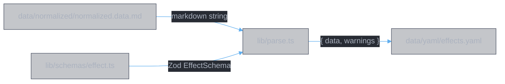
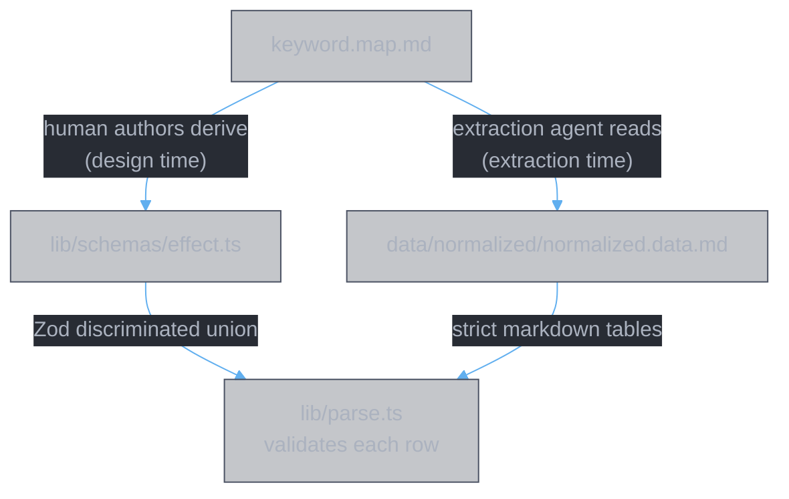
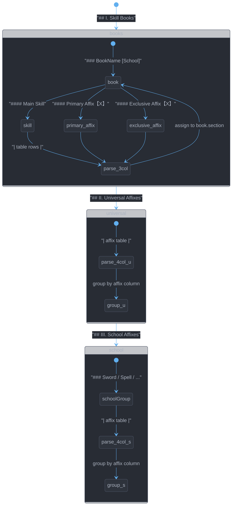
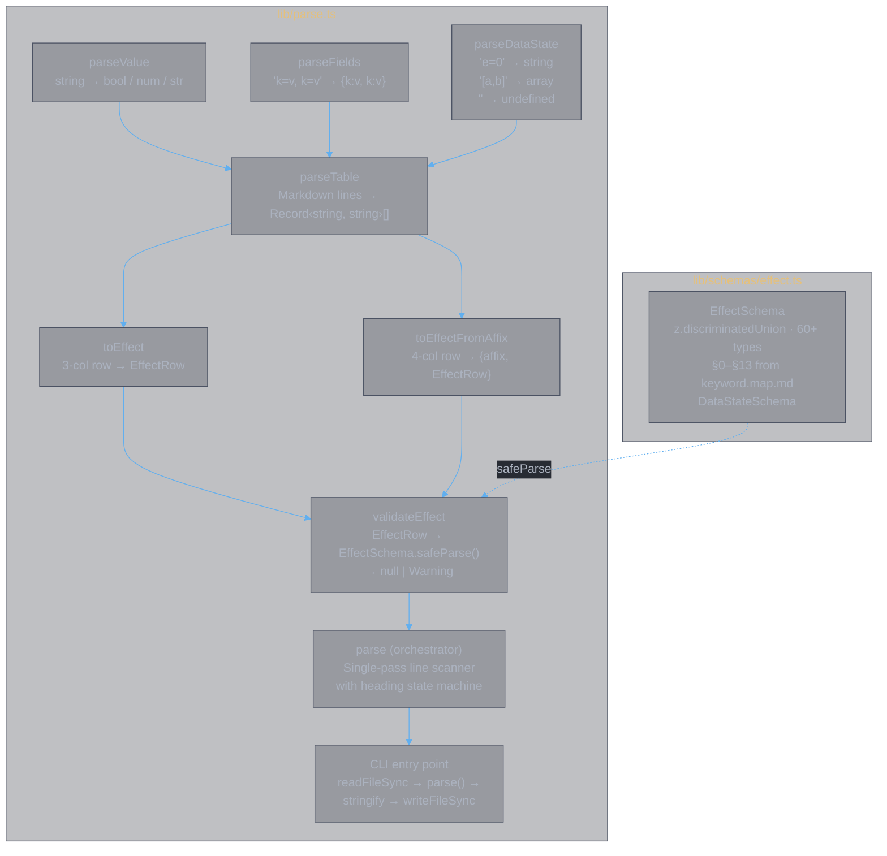
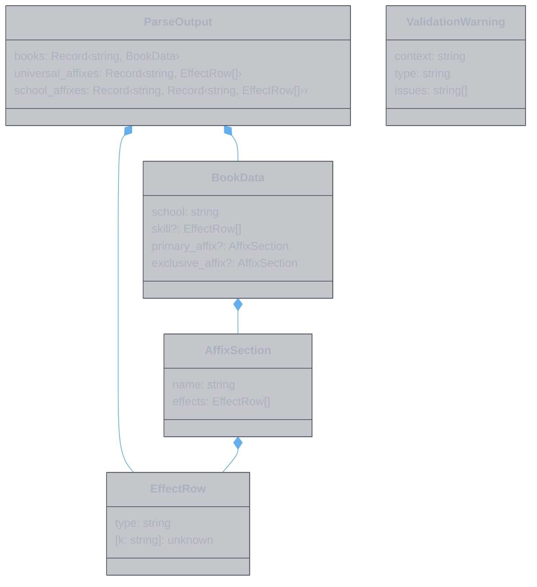

<style>
body {
  max-width: none !important;
  width: 95% !important;
  margin: 0 auto !important;
  padding: 20px 40px !important;
  background-color: #282c34 !important;
  color: #abb2bf !important;
  font-family: -apple-system, BlinkMacSystemFont, "Segoe UI", Helvetica, Arial, sans-serif !important;
  line-height: 1.6 !important;
  -webkit-print-color-adjust: exact !important;
  print-color-adjust: exact !important;
}

h1, h2, h3, h4, h5, h6 {
  color: #ffffff !important;
}

a {
  color: #61afef !important;
}

code {
  background-color: #3e4451 !important;
  color: #e5c07b !important;
  padding: 2px 6px !important;
  border-radius: 3px !important;
}

pre {
  background-color: #2c313a !important;
  border: 1px solid #4b5263 !important;
  border-radius: 6px !important;
  padding: 16px !important;
  overflow-x: auto !important;
}

pre code {
  background-color: transparent !important;
  color: #abb2bf !important;
  padding: 0 !important;
  border-radius: 0 !important;
  font-size: 13px !important;
  line-height: 1.5 !important;
}

table {
  border-collapse: collapse !important;
  width: auto !important;
  margin: 16px 0 !important;
  table-layout: auto !important;
  display: table !important;
}

table th,
table td {
  border: 1px solid #4b5263 !important;
  padding: 8px 10px !important;
  word-wrap: break-word !important;
}

table th:first-child,
table td:first-child {
  min-width: 60px !important;
}

table th {
  background: #3e4451 !important;
  color: #e5c07b !important;
  font-size: 14px !important;
  text-align: center !important;
}

table td {
  background: #2c313a !important;
  font-size: 12px !important;
  text-align: left !important;
}

blockquote {
  border-left: 3px solid #4b5263 !important;
  padding-left: 10px !important;
  color: #5c6370 !important;
  background-color: #2c313a !important;
}

strong {
  color: #e5c07b !important;
}
</style>

# Implementation: Parser

**Authors:** Z. Zhang & Claude Opus 4.6 (Anthropic)

> **Implementation document for the code parser** — Stage 3 of the Divine Book data pipeline. Describes the logical flow from normalized markdown tables to structured YAML, how `keyword.map.md` informs the parser indirectly through the Zod schema, how each component maps to a parsing responsibility, and what the unit tests verify and why.

---

## 1. Logical Flow

### Input and Output



**Input**: `data/normalized/normalized.data.md` — strict markdown tables produced by the extraction agent. The parser reads this file as a UTF-8 string. No other data file is read at parse time.

**Output**: `data/yaml/effects.yaml` — structured YAML grouping all effects by book, section, and affix. Every effect row in the output has been validated against the Zod schema.

**Invocation**: `bun app/parse.ts` (aliased as `bun run parse`).

### How keyword.map.md gets used

The parser does not read `keyword.map.md` at runtime. The relationship is indirect and operates at two stages:



1. **keyword.map.md → effect.ts** (design time). The keyword map defines the complete effect type vocabulary: every effect type name, its field names, field types, and units. The Zod schemas in `effect.ts` are a direct transcription of this vocabulary into code. Each schema section (§0–§13) mirrors a section of keyword.map.md. Every `z.number().describe("unit:X")` annotation traces back to a unit definition in the keyword map.

2. **keyword.map.md → normalized.data.md** (extraction time). The extraction agent reads keyword.map.md to decide what effect type name to assign to each prose description, what fields to extract, and what values to use. The agent's output — normalized.data.md — is therefore constrained by the keyword map.

3. **effect.ts + normalized.data.md → parse.ts** (parse time). The parser reads normalized.data.md as markdown, converts each table row into a JS object, and validates it against `EffectSchema` from effect.ts. If a row uses an effect type name not in the schema, or has fields that don't match the schema's expectations, validation reports a warning.

The keyword map is the single source of truth. The schema and the normalized data are both downstream artifacts of it. The parser closes the loop by checking that these two artifacts agree.

### Parse flow, step by step

The parser makes a single pass over the markdown, line by line. The heading structure of normalized.data.md serves as a state machine:



For each table encountered, the parser:

1. **Splits by `|`** to extract cell values (using `slice(1, -1)` to drop leading/trailing empty strings from the pipe delimiter, preserving empty middle cells).
2. **Splits by `,`** to separate key-value pairs in the `fields` column (with a regex that respects bracket notation for array values).
3. **Splits by `=`** to separate each key from its value.
4. **Coerces values**: `"true"`/`"false"` → boolean, numeric strings → number, everything else → string.
5. **Parses data_state**: empty → `undefined`, `[a, b]` → `["a", "b"]`, otherwise → string as-is.
6. **Validates** the resulting object against `EffectSchema`.
7. **Assigns** the effect to the correct location in the output tree based on the current heading context.

### Output YAML structure

```yaml
books:
  <book_name>:
    school: <School>
    skill:                    # array of EffectRow
      - { type: ..., ... }
    primary_affix:            # present if the book has detailed data
      name: <affix_name>
      effects:
        - { type: ..., ... }
    exclusive_affix:          # present on all 28 books
      name: <affix_name>
      effects:
        - { type: ..., ... }

universal_affixes:
  <affix_name>:               # array of EffectRow
    - { type: ..., ... }

school_affixes:
  <School>:
    <affix_name>:             # array of EffectRow
      - { type: ..., ... }
```

Each `EffectRow` contains `type` (the effect type discriminator), all `key=value` fields as typed properties, and optionally `data_state` (string or string array). Nested effects are flattened with `parent=<name>` — the hierarchy is expressed declaratively in the data, not structurally in the YAML.

---

## 2. Components

### File map

| File | Role |
|:---|:---|
| `lib/parse.ts` | Parser module + CLI entry point |
| `lib/schemas/effect.ts` | Zod schema (derived from keyword.map.md) |
| `lib/parse.test.ts` | Unit and integration tests |
| `data/normalized/normalized.data.md` | Input (read at parse time) |
| `data/yaml/effects.yaml` | Output (written at parse time) |

### Component diagram



### Component responsibilities

**`parseValue`** — Atomic type coercion. Determines whether a raw string from a `key=value` pair is a boolean, number, or string. This is the only place where type decisions are made. The rules are strict and unambiguous: `"true"`/`"false"` are booleans; anything `Number()` can parse without `NaN` is a number; everything else is a string. The string `"same_as_trigger"` is a notable case — it stays a string, which is correct because the Zod schema for `conditional_debuff.duration` accepts `z.union([z.number(), z.literal("same_as_trigger")])`.

**`parseFields`** — Field-level splitting. Takes the `fields` column string (e.g., `"name=灵涸, target=healing_received, value=-31"`) and produces a typed JS object. Comma-splitting uses a regex lookahead to avoid splitting inside bracket notation (`[v1, v2]`), though the current data does not use brackets in the fields column. Each pair is split on the first `=` character, which is unambiguous because neither keys nor values contain `=`.

**`parseFields` handles the empty-fields case** — rows like `| ignore_damage_reduction | | |` have an empty fields column. `parseFields("")` returns `{}`, so the resulting EffectRow has only `type` and no other fields. This is valid for effect types that carry no data (e.g., `ignore_damage_reduction`, `probability_to_certain`).

**`parseDataState`** — State column parsing. The data_state column has three forms: empty (→ `undefined`, meaning "default for this school"), single token (→ string, e.g., `"enlightenment=0"`, `"max_fusion"`, `"locked"`), or array notation (→ string array, e.g., `["enlightenment=1", "fusion=20"]`). The parser handles all three forms.

**`parseTable`** — Structural table extraction. Takes the markdown lines and a start index (pointing at the header row), and returns an array of raw `Record<string, string>` objects plus the end index. Uses `slice(1, -1)` after splitting by `|` to drop the leading and trailing empty strings produced by the pipe delimiter, which correctly preserves empty middle cells. This is a critical design choice — an earlier version used `filter(Boolean)`, which silently dropped empty cells and caused the `locked` data_state to be misassigned to the wrong column.

**`toEffect`** — Constructs a typed `EffectRow` from a 3-column table row (book tables: `effect_type | fields | data_state`). Composes `parseFields` and `parseDataState`.

**`toEffectFromAffix`** — Constructs a typed `EffectRow` from a 4-column table row (affix tables: `affix | effect_type | fields | data_state`). Additionally strips lenticular brackets (`【】`) from the affix name and returns it alongside the effect.

**`validateEffect`** — Passes an `EffectRow` through `EffectSchema.safeParse()`. Returns `null` on success or a structured `ValidationWarning` on failure. The warning includes the context string (e.g., `"千锋聚灵剑/skill"`, `"universal/灵威"`) and the list of Zod issue messages. Validation is non-blocking: the parser collects all warnings and still produces output even if some rows fail validation. The CLI then exits with code 1 if any warnings were emitted.

**`parse`** — The orchestrator. Takes the full markdown string, runs a single-pass line scanner with heading-driven state transitions, and builds the `ParseOutput` tree. The state machine tracks five variables: `mode` (which top-level section), `book` (current book name), `school` (current school), `section` (skill / primary_affix / exclusive_affix), and `affixName` (current affix name). When a table header line is encountered, the scanner calls `parseTable`, maps rows through `toEffect` or `toEffectFromAffix`, validates each, and assigns the results to the correct node in the output tree. Returns both the output data and the collected validation warnings.

**CLI entry point** — Guarded by `import.meta.main` so that `parse.ts` can be imported as a module without side effects. Reads the input file, calls `parse()`, serializes to YAML with `lineWidth: 0` (no line wrapping), and writes the output file.

### Type hierarchy



`EffectRow` is intentionally loosely typed (`[k: string]: unknown`) because the parser handles all 60+ effect types uniformly. Type safety comes from `EffectSchema.safeParse()` at validation time, not from the parser's own types. This keeps the parser simple — it does not need to know what fields each effect type expects.

---

## 3. Unit Tests

**Test file**: `lib/parse.test.ts` — 37 tests, 78 assertions.

**Runner**: `bun test` (Bun's built-in test runner).

### Test structure

The tests are organized in seven `describe` blocks that mirror the component hierarchy: five blocks for individual functions, one block for validation, and one integration block that parses the real `normalized.data.md`.

### What gets tested and why

#### `parseValue` (5 tests)

| Test | What it verifies | Why it matters |
|:---|:---|:---|
| integers | `"42"` → `42`, `"-31"` → `-31` | Numeric values must be numbers, not strings, for Zod schema validation to pass |
| decimals | `"42.5"` → `42.5`, `"-40.8"` → `-40.8` | Fractional values appear throughout (probabilities, percentages) |
| booleans | `"true"` → `true`, `"false"` → `false` | Fields like `dispellable`, `on_last_hit`, `dot_half` are boolean |
| strings | `"healing_received"` → `"healing_received"`, `"灵涸"` → `"灵涸"` | Enum values and Chinese names must remain strings |
| empty string | `""` → `""` | Edge case: empty value after `=` should not become `0` or `NaN` |

The `same_as_trigger` case is tested here and in `parseFields` because it exercises a critical boundary: it looks like it could be an identifier that `Number()` should reject, and it must remain a string so the Zod union `z.number() | z.literal("same_as_trigger")` resolves correctly.

#### `parseFields` (6 tests)

| Test | What it verifies | Why it matters |
|:---|:---|:---|
| empty string | `""` → `{}` | Effect types with no fields (e.g., `ignore_damage_reduction`) produce empty objects |
| single field | `"value=20"` → `{value: 20}` | Simplest non-trivial case |
| multiple fields | `"hits=6, total=20265"` → `{hits:6, total:20265}` | Comma splitting works correctly |
| mixed types | `"name=灵涸, target=healing_received, value=-31, duration=8, dispellable=false"` | A single fields string can contain strings, numbers, negatives, and booleans |
| string with underscores | `"stat=skill_damage_increase, value=50"` | Underscore-separated identifiers must not be misinterpreted |
| same_as_trigger | `"duration=same_as_trigger"` → `{duration: "same_as_trigger"}` | Non-numeric duration value must stay string |

#### `parseDataState` (3 tests)

| Test | What it verifies | Why it matters |
|:---|:---|:---|
| empty string | `""` → `undefined` | Default data_state (unlabeled rows) must map to absence, not empty string |
| single token | `"enlightenment=0"`, `"max_fusion"`, `"locked"`, `"fusion=54"` → string | The four forms of single-token data_state |
| array notation | `"[enlightenment=1, fusion=20]"` → `["enlightenment=1", "fusion=20"]` | Multi-value data_state becomes an array for YAML serialization |

#### `parseTable` (3 tests)

| Test | What it verifies | Why it matters |
|:---|:---|:---|
| 3-column table | Correct header extraction, cell values, row count, end index | Book-level tables use 3 columns: `effect_type \| fields \| data_state` |
| 4-column table | Affix column included, correct mapping | Affix tables use 4 columns: `affix \| effect_type \| fields \| data_state` |
| empty cells preserved | `\| base_attack \| \| locked \|` maps correctly | **Regression test**: an earlier implementation using `filter(Boolean)` dropped empty middle cells, causing the `locked` data_state to land in the `fields` column. `slice(1, -1)` preserves empty cells. |

The empty-cell test is the most important in this group. Without it, the parser silently corrupts rows where `fields` is empty — which includes `locked` feature states and field-less effect types. This was an actual bug that was caught and fixed.

#### `toEffect` (3 tests)

| Test | What it verifies | Why it matters |
|:---|:---|:---|
| basic row | Raw table row → typed EffectRow with correct fields and data_state | End-to-end cell-to-object conversion |
| empty fields and data_state | `{effect_type: "ignore_damage_reduction", fields: "", data_state: ""}` → `{type: "ignore_damage_reduction"}` | No phantom `data_state: undefined` or empty object spread |
| array data_state | data_state string `"[enlightenment=1, fusion=20]"` becomes a JS array | YAML serializer needs arrays to emit `[a, b]` format |

#### `toEffectFromAffix` (1 test)

| Test | What it verifies | Why it matters |
|:---|:---|:---|
| strips brackets | `"【咒书】"` → affix name `"咒书"` | Lenticular brackets are a display convention in the tables; YAML keys should be bare names |

#### `validateEffect` (2 tests)

| Test | What it verifies | Why it matters |
|:---|:---|:---|
| valid effect returns null | `{type: "base_attack", hits: 6, total: 1500}` passes | Confirms the Zod schema accepts well-formed effects |
| invalid type returns warning | `{type: "nonexistent_type"}` fails with structured warning | Confirms unknown effect types are caught, and the warning object has the expected shape |

These tests verify the validation interface, not the schema's exhaustive rules (the schema is tested implicitly by the integration tests).

#### Integration: `parse normalized.data.md` (14 tests)

These tests parse the real `normalized.data.md` file and verify structural properties of the output. They serve as a contract between the parser and the normalized data — if either changes in a way that breaks the contract, these tests fail.

| Test | What it verifies | Why it matters |
|:---|:---|:---|
| zero validation warnings | Every row in normalized.data.md passes EffectSchema | **The most important test.** If this fails, either the normalized data has a schema violation or the schema is wrong. |
| 28 books | All books are present | Detects missing book headings or heading format changes |
| 16 universal affixes | All universal affixes are present | Detects missing affix rows or grouping errors |
| 4 school groups | Sword, Spell, Demon, Body in order | Detects missing or renamed school headings |
| 17 school affixes total | 4 + 4 + 4 + 5 school affixes | Detects missing school affix rows |
| 28 books have skill data | All 28 books have `skill` arrays | Detects false positives or false negatives in skill section parsing |
| all 28 books have exclusive_affix | Every book has at least an exclusive affix | Detects books where the exclusive affix heading wasn't matched |
| school assignment | 千锋聚灵剑→Sword, 甲元仙符→Spell, 大罗幻诀→Demon, 十方真魄→Body | Spot-check that heading parsing extracts the school correctly |
| multi-tier data_state | 千锋聚灵剑 skill rows have `enlightenment=0`, `[enlightenment=1, fusion=20]`, `[enlightenment=10, fusion=51]` at expected indices | Verifies data_state parsing across single and array forms |
| locked data_state | 甲元仙符 skill[0] has `data_state: "locked"` | Regression guard for the empty-cell bug |
| parent= preserved | 大罗幻诀 skill has 2 children with `parent: "罗天魔咒"` | Verifies that nested effect flattening works end-to-end |
| negative debuff values (Rule 7) | 祸星无妄 children all have `value < 0` | Enforces the convention that reduction effects use negative numbers |
| same_as_trigger duration | 周天星元 conditional_debuff has `duration: "same_as_trigger"` | Verifies that non-numeric special values survive the parse pipeline |
| stat=skill_damage_increase | 灵威 and 天威煌煌 both use `skill_damage_increase` | Regression guard: an earlier version used the wrong name `skill_damage_bonus` |

### Quality gates

| Command | What it runs |
|:---|:---|
| `bun run check` | `tsc --noEmit` (TypeScript strict mode) + `biome check lib/` (lint + format) |
| `bun run test` | `bun test` (37 unit + integration tests) |

Both gates must pass clean (zero errors, zero warnings) before any change to `lib/` is considered complete.

---

## Document History

| Version | Date | Changes |
|---------|------|---------|
| 1.0 | 2026-02-25 | Initial implementation document |
| 1.1 | 2026-03-09 | Fixed invocation path (lib/ → app/). Updated book counts: 9 → 28 detailed books with skill data. |
