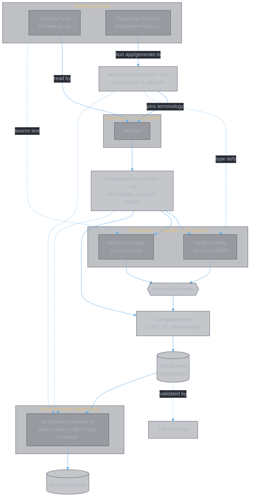

<style>
body {
  max-width: none !important;
  width: 95% !important;
  margin: 0 auto !important;
  padding: 20px 40px !important;
  background-color: #282c34 !important;
  color: #abb2bf !important;
  font-family: -apple-system, BlinkMacSystemFont, "Segoe UI", Helvetica, Arial, sans-serif !important;
  line-height: 1.6 !important;
  -webkit-print-color-adjust: exact !important;
  print-color-adjust: exact !important;
}

h1, h2, h3, h4, h5, h6 {
  color: #ffffff !important;
}

a {
  color: #61afef !important;
}

code {
  background-color: #3e4451 !important;
  color: #e5c07b !important;
  padding: 2px 6px !important;
  border-radius: 3px !important;
}

pre {
  background-color: #2c313a !important;
  border: 1px solid #4b5263 !important;
  border-radius: 6px !important;
  padding: 16px !important;
  overflow-x: auto !important;
}

pre code {
  background-color: transparent !important;
  color: #abb2bf !important;
  padding: 0 !important;
  border-radius: 0 !important;
  font-size: 13px !important;
  line-height: 1.5 !important;
}

table {
  border-collapse: collapse !important;
  width: auto !important;
  margin: 16px 0 !important;
  table-layout: auto !important;
  display: table !important;
}

table th,
table td {
  border: 1px solid #4b5263 !important;
  padding: 8px 10px !important;
  word-wrap: break-word !important;
}

table th:first-child,
table td:first-child {
  min-width: 60px !important;
}

table th {
  background: #3e4451 !important;
  color: #e5c07b !important;
  font-size: 14px !important;
  text-align: center !important;
}

table td {
  background: #2c313a !important;
  font-size: 12px !important;
  text-align: left !important;
}

blockquote {
  border-left: 3px solid #4b5263 !important;
  padding-left: 10px !important;
  color: #5c6370 !important;
  background-color: #2c313a !important;
}

strong {
  color: #e5c07b !important;
}
</style>

# Data Pipeline Notes

**Authors:** Z. Zhang

> Quick reference for the data pipeline: what each layer does, why it exists, how to run it, and how to verify the output. For architectural rationale, see `docs/data/design.md`. For parser policies, see `docs/data/usage.parser.md`.

---

## 1. Pipeline Layers

The pipeline exists because the game's sole source of truth is volatile Chinese prose, while the combat engine needs deterministic structured data. Each layer solves a specific problem in that transformation.

### Source (`data/raw/*.md`)

Human-authored Chinese prose describing game rules, skills, and affixes. This is the authoritative content — everything downstream derives from it.

**Why it exists:** the game designers write and update rules in natural language. The pipeline must accept this format as-is.

### Keywords (`docs/data/keyword.map.cn.md`, `keyword.map.md`)

Pattern-to-type mappings: Chinese phrases to canonical effect types and field names. Generated from the TypeScript `Registry` (`bun app/generate.ts`); human-editable to refine extraction accuracy.

**Why it exists:** without pinned terminology, the extraction agent would invent inconsistent names across runs (`damage_boost` vs `attack_bonus`). The keyword map eliminates this variance by prescribing exact names, fields, and units. It is the type system for the entire pipeline.

- `keyword.map.cn.md` is the **primary spec** — Chinese patterns matching the Chinese source.
- `keyword.map.md` is the English translation consumed by the code parser.

### Normalized Data (`docs/data/normalized.data.cn.md`, `normalized.data.md`)

Strict markdown tables — one row per effect per `data_state` tier. Produced by the extraction step; reviewable and manually editable.

**Why it exists:** free-form prose is too volatile and ambiguous for direct machine parsing. Normalized data is a faithful, low-interpretation transcription: it captures **verbatim** numeric and phrase values, structures them into deterministic table rows, and deliberately avoids logical inference or semantic merging. This makes it diff-reviewable by humans and trivially parseable by code. Higher-level logic belongs in the `Registry` and the derived Structured YAML.

### Structured Data (`data/yaml/effects.yaml`, `groups.yaml`)

Parser output from Normalized. Validated by Zod schemas; consumed by downstream code and analysis.

**Why it exists:** the combat engine, candidates query, and analysis tools need typed, schema-validated data — not markdown tables. The parser is trivial (~100 LOC) precisely because Normalized is strict in format.

---

## 2. Data Flow



**Change propagation:**
- **Registry changes** -> regenerate Keywords (`bun app/generate.ts`) -> re-extract -> re-parse.
- **Source changes** -> re-extract (with current Keywords) -> re-parse.

### Invariants

- `keyword.map.cn.md` must be current before extraction.
- `Source` and `Registry` are the primary authoring inputs; Keywords bridge code and content.
- Prefer running the extractor over editing Normalized manually.

---

## 3. Commands

**Generate** registry-derived artifacts (keyword maps, groups):

```sh
bun app/generate.ts
```

**Parse** normalized data into YAML:

```sh
bun app/parse.ts docs/data/normalized.data.md data/yaml
```

The parser prints validation warnings and exits non-zero on failures — see `docs/data/usage.parser.md` for policies.

**Sync style** — inject the canonical `<style>` block into all docs under `data/raw/` and `docs/data/`:

```sh
bun run sync-style
```

---

## 4. Agent Commands

Three LLM agent tasks are defined as Claude Code slash commands (`.claude/commands/*.md`). They are not shell scripts — invoke them from within a Claude Code session.

| Command | Purpose | Spec |
|---|---|---|
| `/extract` | Reads `data/raw/*.md` + `keyword.map.cn.md` and produces both `normalized.data.cn.md` and `normalized.data.md`. This is the primary extraction step that decodes Source using Keywords. | `.claude/commands/extract.md` |
| `/verify-schema` | Validates that `normalized.data` conforms to the type system in `keyword.map` — effect types, field names, units, data_state vocabulary. Structural correctness only; does not check source faithfulness. | `.claude/commands/verify-schema.md` |
| `/verify-coverage` | Validates that `normalized.data` faithfully and completely represents the source files — book completeness, numeric accuracy, data_state tier coverage, source traceability via `> 原文:` blockquotes. | `.claude/commands/verify-coverage.md` |

The two verification agents are independent and can run in parallel. Together they catch both structural errors (wrong types/fields) and content errors (wrong numbers/missing effects).

---

## 5. Programmatic Verification

### verify-pipeline.ts

`scripts/verify-pipeline.ts` runs the parser, computes output checksums, and checks three coverage dimensions:

1. **Book coverage** — raw table book names present in `normalized.data.md`.
2. **Token coverage** — backtick tokens in normalized data vs `keyword.map.md`.
3. **Effect-type coverage** — normalized effect types vs keyword map types.

Output: `tmp-verify-output/verify-report.json`.

### Convenience script

Runs the full cycle (generate -> parse -> test -> verify):

```sh
bash scripts/run-verify.sh
```

### CI

`.github/workflows/verify.yml` runs the convenience script on PRs and branch pushes.

---

## 6. Workflow: Adding or Updating Books

1. **Edit source** — modify `data/raw/主书.md` (add rows, adjust parameters).
2. **Regenerate keywords** (if registry or vocabulary changed):
   ```sh
   bun app/generate.ts
   ```
   Outputs both `keyword.map.md` and `keyword.map.cn.md`.
3. **Extract** — run the extraction agent (or update normalized files manually). The extractor reads `data/raw/*.md` + `keyword.map.cn.md` and writes both normalized files.
4. **Parse and validate**:
   ```sh
   bun app/parse.ts docs/data/normalized.data.md data/yaml
   ```
5. **Verify**:
   ```sh
   bash scripts/run-verify.sh
   ```
6. **Inspect** `tmp-verify-output/verify-report.json` for:
   - `missingBooks` — raw books absent from normalized data.
   - `rawTokensMissingInKeyword` — tokens to add to the keyword map.
   - `effectTypesMissingInKeyword` — effect types not covered by the keyword map.
   - Parser exit code and SHA diffs for `effects.yaml` / `groups.yaml`.

---

## 7. Conventions

- Add Chinese patterns to `keyword.map.cn.md` **before** running extraction to improve deterministic results.
- **Zero warnings/errors** required before committing changes to `lib/` or `data/yaml` (see `docs/data/usage.parser.md`).
