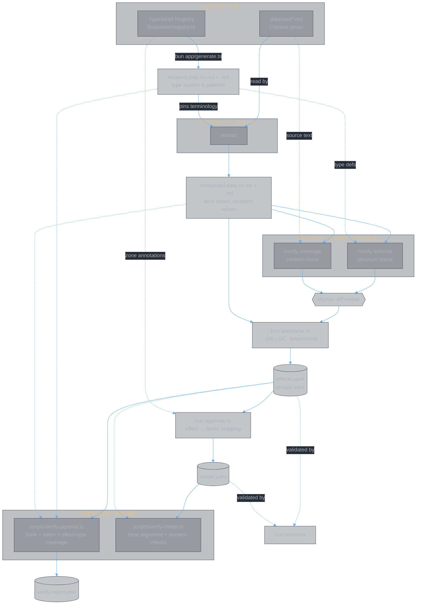
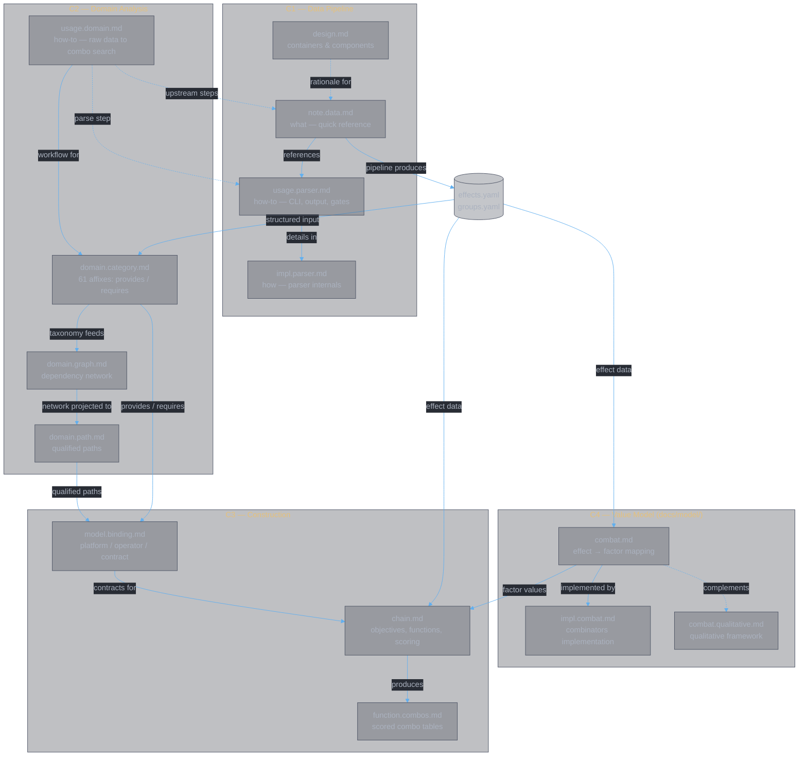

<style>
body {
  max-width: none !important;
  width: 95% !important;
  margin: 0 auto !important;
  padding: 20px 40px !important;
  background-color: #282c34 !important;
  color: #abb2bf !important;
  font-family: -apple-system, BlinkMacSystemFont, "Segoe UI", Helvetica, Arial, sans-serif !important;
  line-height: 1.6 !important;
  -webkit-print-color-adjust: exact !important;
  print-color-adjust: exact !important;
}

h1, h2, h3, h4, h5, h6 {
  color: #ffffff !important;
}

a {
  color: #61afef !important;
}

code {
  background-color: #3e4451 !important;
  color: #e5c07b !important;
  padding: 2px 6px !important;
  border-radius: 3px !important;
}

pre {
  background-color: #2c313a !important;
  border: 1px solid #4b5263 !important;
  border-radius: 6px !important;
  padding: 16px !important;
  overflow-x: auto !important;
}

pre code {
  background-color: transparent !important;
  color: #abb2bf !important;
  padding: 0 !important;
  border-radius: 0 !important;
  font-size: 13px !important;
  line-height: 1.5 !important;
}

table {
  border-collapse: collapse !important;
  width: auto !important;
  margin: 16px 0 !important;
  table-layout: auto !important;
  display: table !important;
}

table th,
table td {
  border: 1px solid #4b5263 !important;
  padding: 8px 10px !important;
  word-wrap: break-word !important;
}

table th:first-child,
table td:first-child {
  min-width: 60px !important;
}

table th {
  background: #3e4451 !important;
  color: #e5c07b !important;
  font-size: 14px !important;
  text-align: center !important;
}

table td {
  background: #2c313a !important;
  font-size: 12px !important;
  text-align: left !important;
}

blockquote {
  border-left: 3px solid #4b5263 !important;
  padding-left: 10px !important;
  color: #5c6370 !important;
  background-color: #2c313a !important;
}

strong {
  color: #e5c07b !important;
}
</style>

# Data Pipeline Notes

**Authors:** Z. Zhang

> Quick reference for the data pipeline: what each layer does, why it exists, how to run it, and how to verify the output. For system design (containers, components, boundaries), see `docs/data/design.md`. For parser policies, see `docs/data/usage.parser.md`.

---

## 1. Pipeline Layers

The pipeline exists because the game's sole source of truth is volatile Chinese prose, while the combat engine needs deterministic structured data. Each layer solves a specific problem in that transformation.

### Source (`data/raw/*.md`)

Human-authored Chinese prose describing game rules, skills, and affixes. This is the authoritative content — everything downstream derives from it.

**Why it exists:** the game designers write and update rules in natural language. The pipeline must accept this format as-is.

### Keywords (`data/keyword/keyword.map.cn.md`, `data/keyword/keyword.map.md`)

Pattern-to-type mappings: Chinese phrases to canonical effect types and field names. Generated from the TypeScript `Registry` (`bun app/generate.ts`); human-editable to refine extraction accuracy.

**Why it exists:** without pinned terminology, the extraction agent would invent inconsistent names across runs (`damage_boost` vs `attack_bonus`). The keyword map eliminates this variance by prescribing exact names, fields, and units. It is the type system for the entire pipeline.

- `keyword.map.cn.md` is the **primary spec** — Chinese patterns matching the Chinese source.
- `keyword.map.md` is the English translation consumed by the code parser.

### Normalized Data (`data/normalized/normalized.data.cn.md`, `data/normalized/normalized.data.md`)

Strict markdown tables — one row per effect per `data_state` tier. Produced by the extraction step; reviewable and manually editable.

**Why it exists:** free-form prose is too volatile and ambiguous for direct machine parsing. Normalized data is a faithful, low-interpretation transcription: it captures **verbatim** numeric and phrase values, structures them into deterministic table rows, and deliberately avoids logical inference or semantic merging. This makes it diff-reviewable by humans and trivially parseable by code. Higher-level logic belongs in the `Registry` and the derived Structured YAML.

### Structured Data (`data/yaml/effects.yaml`, `groups.yaml`)

Parser output from Normalized. Validated by Zod schemas; consumed by downstream code and analysis.

**Why it exists:** the combat engine, candidates query, and analysis tools need typed, schema-validated data — not markdown tables. The parser is trivial (~100 LOC) precisely because Normalized is strict in format.

---

## 2. Data Flow



**Change propagation:**
- **Registry changes** -> regenerate Keywords (`bun app/generate.ts`) -> re-extract -> re-parse -> re-map.
- **Source changes** -> re-extract (with current Keywords) -> re-parse -> re-map.

### Invariants

- `keyword.map.cn.md` must be current before extraction.
- `Source` and `Registry` are the primary authoring inputs; Keywords bridge code and content.
- Prefer running the extractor over editing Normalized manually.
- `model.yaml` must be regenerated after any change to `effects.yaml` or registry zone annotations.

---

## 3. Operational Workflow

The pipeline runs as a numbered sequence. Each step consumes the output of the previous one.

### Step 1 — Generate keywords

Regenerate keyword maps from the TypeScript registry. Required whenever registry types, fields, or patterns change.

```sh
bun app/generate.ts
```

Outputs `data/keyword/keyword.map.cn.md` and `data/keyword/keyword.map.md`.

### Step 2 — Extract normalized data

Run the LLM extraction agent. It reads `data/raw/*.md` + `keyword.map.cn.md` and produces both `normalized.data.cn.md` and `normalized.data.md`.

```
/extract
```

This is a Claude Code slash command (`.claude/commands/extract.md`), not a shell script.

### Step 3 — Verify extraction

Two independent LLM agents check the extraction output. Run in parallel.

```
/verify-schema        # structure: types, fields, units vs keyword.map
/verify-coverage      # content: numbers, completeness vs source
```

Review the diff, fix issues, re-extract if needed.

### Step 4 — Parse

Deterministic parser: normalized markdown tables → YAML.

```sh
bun app/parse.ts data/normalized/normalized.data.md data/yaml
```

Produces `effects.yaml` and `groups.yaml`. Prints validation warnings; exits non-zero on failures — see `docs/data/usage.parser.md` for policies.

### Step 5 — Map

Map effects to model factor contributions using registry zone annotations and `combat.md` §2 rules.

```sh
bun app/map.ts
```

Produces `model.yaml`. Validates output against `ModelYamlSchema`; exits non-zero on failures.

### Step 6 — Verify

Programmatic checks across the full pipeline.

```sh
bash scripts/run-verify.sh
```

This runs: generate → parse → test → verify-pipeline → verify-domain → verify-model.

### Step 7 — Inspect

Check `tmp-verify-output/verify-report.json` for:
   - `missingBooks` — raw books absent from normalized data.
   - `rawTokensMissingInKeyword` — tokens to add to the keyword map.
   - `effectTypesMissingInKeyword` — effect types not covered by the keyword map.
   - Parser exit code and SHA diffs for `effects.yaml` / `groups.yaml`.

---

## 4. Verification Scripts

Three programmatic verification scripts check different layers:

| Script | Checks | Command |
|---|---|---|
| `scripts/verify-pipeline.ts` | Book coverage, token coverage, effect-type coverage (normalized ↔ keyword map) | `bash scripts/run-verify.sh` |
| `scripts/verify-domain.ts` | Binding accuracy, platform coverage, named entities, provider claims (docs ↔ TypeScript) | `bun run verify-domain` |
| `scripts/verify-model.ts` | Zone–factor alignment, unmapped detection, numeric spot-checks, temporal metadata, structural completeness (model.yaml ↔ effects.yaml ↔ registry) | `bun scripts/verify-model.ts` |

The convenience script `bash scripts/run-verify.sh` runs the full cycle. CI (`.github/workflows/verify.yml`) runs it on PRs and branch pushes.

---

## 5. Documentation Map

The docs span four containers connected by boundary artifacts. See `design.md` for the full architecture.



| Container | Docs | Scope |
|---|---|---|
| **C1 Data Pipeline** | design, note.data, impl.parser, usage.parser | Source prose → keyword maps → normalized tables → YAML |
| **C2 Domain Analysis** | usage.domain, domain.category, domain.graph, domain.path | YAML → affix taxonomy → graph model → qualified paths |
| **C4 Value Model** | combat, impl.combat, combat.qualitative (`docs/model/`) | Effects → factor contributions → affix/book/book-set combinators → regime parameters |
| **C3 Construction** | model.binding, chain, function.combos | Binding contracts + factor values → objectives → functions → scored combos |

Three boundaries: B1 (`effects.yaml`) separates data production from interpretation; B2 (qualified paths) separates classification from construction; B3 (factor contributions) separates value assessment from scoring.

---

## 6. Conventions

- Add Chinese patterns to `keyword.map.cn.md` **before** running extraction to improve deterministic results.
- **Zero warnings/errors** required before committing changes to `lib/` or `data/yaml` (see `docs/data/usage.parser.md`).
- Run `bun run sync-style` after adding new docs to inject the canonical `<style>` block.
