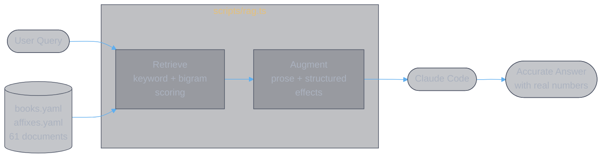
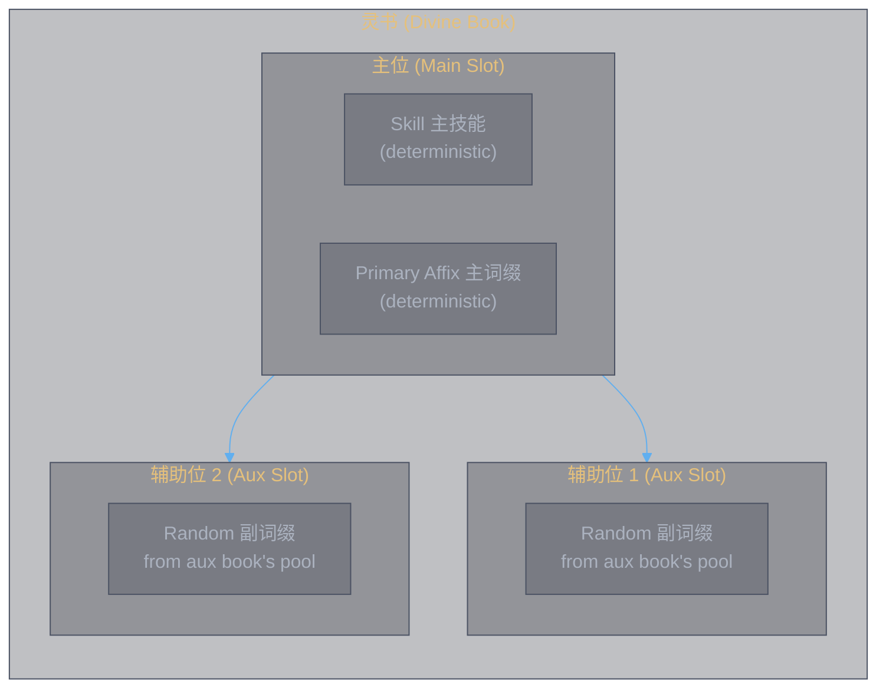
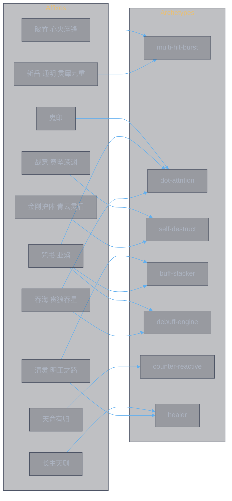
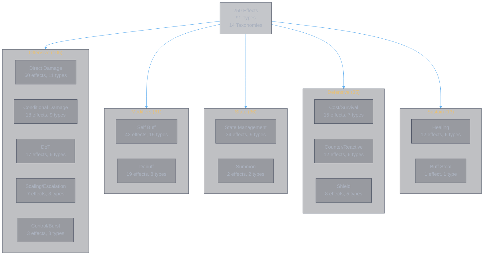

<style>
body {
  max-width: none !important;
  width: 95% !important;
  margin: 0 auto !important;
  padding: 20px 40px !important;
  background-color: #282c34 !important;
  color: #abb2bf !important;
  font-family: -apple-system, BlinkMacSystemFont, "Segoe UI", Helvetica, Arial, sans-serif !important;
  line-height: 1.6 !important;
  -webkit-print-color-adjust: exact !important;
  print-color-adjust: exact !important;
}

h1, h2, h3, h4, h5, h6 {
  color: #ffffff !important;
}

a {
  color: #61afef !important;
}

code {
  background-color: #3e4451 !important;
  color: #e5c07b !important;
  padding: 2px 6px !important;
  border-radius: 3px !important;
}

pre {
  background-color: #2c313a !important;
  border: 1px solid #4b5263 !important;
  border-radius: 6px !important;
  padding: 16px !important;
  overflow-x: auto !important;
}

pre code {
  background-color: transparent !important;
  color: #abb2bf !important;
  padding: 0 !important;
  border-radius: 0 !important;
  font-size: 13px !important;
  line-height: 1.5 !important;
}

table {
  border-collapse: collapse !important;
  width: auto !important;
  margin: 16px 0 !important;
  table-layout: auto !important;
  display: table !important;
}

table th,
table td {
  border: 1px solid #4b5263 !important;
  padding: 8px 10px !important;
  word-wrap: break-word !important;
}

table th:first-child,
table td:first-child {
  min-width: 60px !important;
}

table th {
  background: #3e4451 !important;
  color: #e5c07b !important;
  font-size: 14px !important;
  text-align: center !important;
}

table td {
  background: #2c313a !important;
  font-size: 12px !important;
  text-align: left !important;
}

blockquote {
  border-left: 3px solid #4b5263 !important;
  padding-left: 10px !important;
  color: #5c6370 !important;
  background-color: #2c313a !important;
}

strong {
  color: #e5c07b !important;
}
</style>

# RAG System & Effect Taxonomy

**Authors:** Z. Zhang & Claude Opus 4.6 (Anthropic)

> This document covers three topics: (1) how the general RAG pipeline works, (2) the divine book construction RAG built on top of it, and (3) the complete effect taxonomy extracted from the parsed YAML data.

---

## 1. General RAG Architecture

RAG (Retrieval-Augmented Generation) grounds LLM answers in structured data so it doesn't hallucinate numbers. The YAML files are the knowledge base.

### Two layers in the YAML

Each YAML entry has two layers serving different roles:

- **Prose** (Chinese natural language) is what the user's query matches against — this is the **Retrieval** target.
- **Structure** (typed effect objects) is what the LLM reads to answer accurately — this is the **Augmentation** context.

```yaml
千锋聚灵剑:
  skill_text: |                          # prose (R) — semantic search target
    剑破天地，造成六段共计x%攻击力的灵法伤害...
  skill:                                 # structure (A) — LLM ground truth
    - type: base_attack
      hits: 6
      total: 20265
```

### Pipeline



### Why not embeddings?

61 documents. A keyword index in memory is sufficient. Chinese game terminology (气血, 悟境, 减益) is domain-specific — generic embedding models may not capture it well. Keyword + bigram matching is deterministic, zero-cost, and debuggable.

### Usage

```bash
# Step 1: retrieve context (output lands in Claude Code conversation)
! bun run rag "天魔降临咒的结魂锁链怎么算伤害"

# Step 2: ask the question — Claude sees the retrieved context above
```

The script is at `scripts/rag.ts`. It:
1. Loads `books.yaml` + `affixes.yaml` into an in-memory index
2. Scores each document against the query (name match, keyword match, bigram overlap)
3. Returns top-k documents with both prose and structured effects

---

## 2. Divine Book Construction RAG

The construction RAG extends the general RAG with build-specific knowledge: archetypes, affix categories, and synergy mappings.

### Construction model

Each 灵书 (divine book) is constructed from **3 功法书** (skill books): 1 in the **主位** (main slot) and 2 in **辅助位** (aux slots). A player equips **6 灵书** total — so 18 skill books are used, with no source conflicts.



**Main slot** (deterministic):
- Contributes the **skill** (damage, hits, unique mechanics) and **主词缀** (primary affix)
- The book's progression (融合, 悟境, 修炼) determines skill power

**Each aux slot** (random roll):
- Randomly rolls **one 副词缀** from the aux book's pool each time you construct
- Pool probability: **通用** (common, most likely) > **修为** (school, medium) > **专属** (exclusive, rarest)
- Each 功法书 has: 16 universal + 4-5 school + 1 exclusive affix in its pool
- You re-roll until you get the desired combination

**Conflict rules:**
- **核心冲突**: No two 灵书 can share the same main 功法书
- **副词缀冲突**: No two 灵书 can use the same 功法书 as an affix source

**The build question** is always: given a main book, which 2 aux books maximize your chance of rolling strong 副词缀 (ideally their 专属)?

### Book archetypes

Every book is classified into one or more archetypes based on its skill effects:

| Archetype | Rule | Examples |
|-----------|------|---------|
| **multi-hit-burst** | hits >= 6 | 千锋聚灵剑(6), 念剑诀(8), 皓月剑诀(10) |
| **hp-shred** | has %maxHP or %curHP damage | 千锋聚灵剑, 玉书天戈符, 天轮魔经 |
| **self-destruct** | has self_hp_cost + self_lost_hp_damage | all 7 体修 books |
| **dot-attrition** | has dot effects | 大罗幻诀, 梵圣真魔咒, 天魔降临咒 |
| **buff-stacker** | has self_buff with max_stacks | 元磁神光, 浩然星灵诀 |
| **counter-reactive** | has counter_buff or counter_debuff | 天刹真魔, 疾风九变, 大罗幻诀 |
| **debuff-engine** | has debuff, buff_steal, or per_debuff_stack_damage | 天魔降临咒, 天轮魔经, 解体化形 |
| **delayed-burst** | has delayed_burst | 无相魔劫咒 |
| **summon** | has summon | 春黎剑阵 |
| **healer** | has 2+ self_heal effects | 周天星元 |
| **shield-builder** | has shield | 煞影千幻 |

A book can have multiple archetypes (e.g., 大罗幻诀 is both `dot-attrition` and `counter-reactive`).

### Affix categories

Each affix is categorized by what it does:

| Category | Effect types | Example affixes |
|----------|-------------|-----------------|
| **伤害增幅** | damage_increase, flat_extra_damage, attack_bonus, triple_bonus | 斩岳, 摧山, 破碎无双 |
| **条件增伤** | conditional on control/debuff/HP/lost-HP | 击瑕, 怒目, 战意, 吞海 |
| **递增/暴击** | per_hit_escalation, guaranteed_resonance, random_buff | 破竹, 通明, 灵犀九重 |
| **状态强化** | buff/debuff strength, duration, stack manipulation | 咒书, 清灵, 业焰, 灵威 |
| **持续伤害** | dot_extra_per_tick, dot_damage/frequency_increase | 鬼印 |
| **生存防御** | damage_reduction, shield_value, healing_increase | 金汤, 灵盾, 金刚护体 |
| **治疗压制** | heal_reduction, healing_to_damage | 瑶光却邪 |
| **驱散/穿透** | periodic_dispel, ignore_damage_reduction | (book exclusives only) |

### Synergy map



When the query names a specific book + "配什么/词缀/搭配", the RAG enters **construction mode**: shows the book as main slot, then recommends aux books ranked by how well their 专属 affix synergizes with the main book's archetypes.

### Construction query examples

```bash
# Construction mode: 十方真魄 as main → which aux books to pair?
# Shows main (skill + primary affix) + ranked aux candidates (by exclusive synergy)
! bun run rag "十方真魄配什么词缀"

# General mode: which 体修 books for burst builds?
# Shows all Body books + synergy affixes
! bun run rag "体修高爆发怎么搭"

# General mode: search by mechanic
! bun run rag "哪些书有持续伤害"
```

---

## 3. Effect Taxonomy

250 effects across 91 distinct types, organized into 14 taxonomies. Data from `books.yaml` (28 books) + `affixes.yaml` (33 affixes).

### Taxonomy overview



### 3.1 Direct Damage (60 effects, 11 types)

The primary damage delivery layer. Every book has at least `base_attack`.

| Type | Count | Description | Example books |
|------|-------|-------------|---------------|
| `base_attack` | 35 | N段共x%攻击力伤害 | all 28 books |
| `self_lost_hp_damage` | 8 | 自身已损气血值的伤害 | 7 体修 books |
| `percent_max_hp_damage` | 5 | 目标/自身最大气血值的伤害 | 千锋聚灵剑, 玉书天戈符, 天轮魔经 |
| `flat_extra_damage` | 3 | 额外x%攻击力伤害 (affix) | 斩岳, 破灭天光 |
| `heal_echo_damage` | 2 | 恢复气血值的等额伤害 | 周天星元 |
| `percent_max_hp_boost` | 2 | 附加最大气血伤害提高y% | 皓月剑诀 exclusive |
| `percent_current_hp_damage` | 1 | 目标当前气血值的伤害 | 无极御剑诀 |
| `percent_max_hp_affix` | 1 | 最大气血值伤害 (affix) | 惊蜇化龙 primary |
| `shield_destroy_damage` | 1 | 湮灭护盾造成伤害 | 皓月剑诀 |
| `no_shield_double_damage` | 1 | 无盾双倍伤害 | 皓月剑诀 |
| `echo_damage` | 1 | 当次伤害的y%回声 | 星元化岳 |

### 3.2 Self Buff (42 effects, 15 types)

Stat increases applied to self during or after casting.

| Type | Count | Description |
|------|-------|-------------|
| `self_buff` | 15 | Generic stat buff (attack, damage, crit, heal, defense, HP) |
| `damage_increase` | 8 | 造成的伤害提升x% |
| `attack_bonus` | 4 | 攻击力提升x% |
| `guaranteed_resonance` | 2 | 必定会心x倍，y%概率提升至z倍 |
| `buff_strength` | 2 | 增益效果强度提升x% |
| `random_buff` | 2 | 随机1个加成 (攻击/致命/伤害) |
| `self_buff_extra` | 1 | 天人五衰 rotating debuff on attacker |
| `self_buff_extend` | 1 | 延长增益状态持续时间 |
| `crit_dmg_bonus` | 1 | 暴击伤害提高x% |
| `final_dmg_bonus` | 1 | 最终伤害加深x% |
| `buff_duration` | 1 | 增益状态持续时间延长x% |
| `triple_bonus` | 1 | 攻击力+伤害+暴击伤害各x% |
| `enlightenment_bonus` | 1 | 悟境等级加N（最高不超过M级） |
| `probability_to_certain` | 1 | 概率触发变必定触发 |
| `skill_damage_increase_affix` | 1 | 神通伤害提升x% |

### 3.3 State Management (34 effects, 9 types)

Creating, referencing, and manipulating named states (buffs/debuffs).

| Type | Count | Description |
|------|-------|-------------|
| `state_ref` | 11 | Reference a named state (may carry duration, max_stacks, trigger) |
| `state_add` | 10 | Add N layers of a named state (may be permanent, undispellable) |
| `next_skill_buff` | 5 | 下一个神通额外获得x%伤害加深 |
| `all_state_duration` | 2 | 所有状态持续时间延长x% |
| `periodic_dispel` | 2 | 每秒驱散敌方N个增益 |
| `self_cleanse` | 1 | 驱散自身N个负面状态 |
| `periodic_cleanse` | 1 | 每秒y%概率驱散自身控制状态 |
| `buff_stack_increase` | 1 | 增益状态层数增加x% |
| `per_buff_stack_damage` | 1 | 每N层增益状态提升y%伤害 |

### 3.4 Debuff (19 effects, 8 types)

Negative effects applied to the enemy.

| Type | Count | Description |
|------|-------|-------------|
| `debuff` | 7 | Generic named debuff on target |
| `cross_slot_debuff` | 4 | Debuff that works across book slots (逆转阴阳, 命损) |
| `debuff_strength` | 2 | 减益效果强度提升x% |
| `debuff_stack_chance` | 2 | x%概率额外多附加1层减益状态 |
| `debuff_stack_increase` | 1 | 减益状态层数增加x% |
| `random_debuff` | 1 | 随机1个减益 (攻击/暴击率/暴击伤害) |
| `per_stolen_buff_debuff` | 1 | 每偷取1个增益附加减益 |
| `per_debuff_damage_upgrade` | 1 | 提升减益伤害上限 |

### 3.5 Conditional Damage (18 effects, 9 types)

Damage bonuses gated by conditions.

| Type | Count | Condition |
|------|-------|-----------|
| `conditional_damage_controlled` | 3 | 敌方处于控制效果 |
| `per_debuff_stack_damage` | 3 | 敌方每有N层减益 |
| `execute_conditional` | 2 | 敌方气血值低于N% |
| `per_self_lost_hp` | 2 | 自身每多损失1%气血 |
| `per_enemy_lost_hp` | 2 | 敌方每多损失1%气血 |
| `conditional_damage` | 2 | Mixed conditions (cleanse excess, enemy HP loss) |
| `conditional_stat_scaling` | 2 | 每拥有x%某属性，附加y%伤害 |
| `per_debuff_stack_true_damage` | 1 | 每层减益造成真实伤害 |
| `conditional_damage_debuff` | 1 | 敌方有减益时伤害提升 |

### 3.6 DoT (17 effects, 6 types)

Damage over time and DoT modifiers.

| Type | Count | Description |
|------|-------|-------------|
| `dot` | 8 | Periodic damage (%currentHP, %lostHP, or flat per tick) |
| `dot_extra_per_tick` | 5 | DoT触发时额外造成x%已损气血伤害 |
| `dot_permanent_max_hp` | 1 | 永久每秒x%最大气血值伤害 |
| `dot_damage_increase` | 1 | 持续伤害上升x% |
| `dot_frequency_increase` | 1 | 持续伤害触发间隙缩短x% |
| `extended_dot` | 1 | 技能结束后额外持续N秒 |

### 3.7 Cost/Survival (15 effects, 7 types)

HP costs, damage mitigation, and survival mechanics.

| Type | Count | Description |
|------|-------|-------------|
| `self_hp_cost` | 7 | 消耗自身x%当前气血值 |
| `self_damage_taken_increase` | 2 | 自身受到伤害提高x% |
| `damage_reduction_during_cast` | 2 | 施放期间伤害减免x% |
| `self_hp_floor` | 1 | 气血不会降至x%以下 |
| `ignore_damage_reduction` | 1 | 无视敌方伤害减免 |
| `min_lost_hp_threshold` | 1 | 已损气血至少按x%计算 |
| `chance` | 1 | y%概率不消耗气血 |

### 3.8 Counter/Reactive (12 effects, 6 types)

Effects triggered by being attacked or by state changes.

| Type | Count | Description |
|------|-------|-------------|
| `counter_debuff` | 4 | 受到伤害时N%概率对攻击方添加减益 |
| `counter_buff` | 2 | 受到伤害时触发效果 (heal/reflect) |
| `counter_debuff_upgrade` | 2 | 提升反击概率 |
| `on_dispel` | 2 | 被驱散时触发伤害+眩晕 |
| `on_buff_debuff_shield` | 1 | 施加增益/减益/护盾时触发伤害 |
| `on_shield_expire` | 1 | 护盾消失时造成护盾值x%伤害 |

### 3.9 Healing (12 effects, 6 types)

| Type | Count | Description |
|------|-------|-------------|
| `self_heal` | 4 | 恢复x%最大气血值 (instant or per-tick) |
| `lifesteal` | 2 | 造成伤害时获得x%吸血 |
| `healing_increase` | 2 | 治疗效果提升x% |
| `heal_reduction` | 2 | 治疗量降低x% |
| `lifesteal_with_parent` | 1 | 恢复某状态造成伤害x%的气血 |
| `healing_to_damage` | 1 | 治疗效果转化为x%伤害 |

### 3.10 Shield (8 effects, 5 types)

| Type | Count | Description |
|------|-------|-------------|
| `shield` | 3 | 添加x%最大气血值护盾 |
| `shield_value_increase` | 2 | 护盾值提升x% |
| `shield_strength` | 1 | 护盾提升至x%最大气血值 |
| `shield_destroy_dot` | 1 | 湮灭护盾数量 * x%攻击力的持续伤害 |
| `damage_to_shield` | 1 | 造成伤害后获得伤害值x%的护盾 |

### 3.11 Scaling/Escalation (7 effects, 4 types)

Multiplicative damage scaling mechanics.

| Type | Count | Description |
|------|-------|-------------|
| `per_hit_escalation` | 4 | 每造成1段伤害，剩余段数伤害提升x% |
| `guaranteed_resonance` | 2 | 必定会心x倍，y%概率提升至z倍 |
| `probability_multiplier` | 2 | x%概率效果提升N倍 |
| `periodic_escalation` | 1 | 每N次伤害，接下来伤害提升y倍 |

### 3.12 Control (3 effects, 3 types)

| Type | Count | Description |
|------|-------|-------------|
| `delayed_burst` | 1 | 状态结束时爆发累积伤害 |
| `delayed_burst_increase` | 1 | 爆发伤害提升x% |
| `untargetable` | 1 | N秒内不可被选中 |

### 3.13 Summon (2 effects, 2 types)

| Type | Count | Description |
|------|-------|-------------|
| `summon` | 1 | 创建分身，继承x%属性 |
| `summon_buff` | 1 | 分身受伤降低，伤害增加 |

### 3.14 Buff Steal (1 effect, 1 type)

| Type | Count | Description |
|------|-------|-------------|
| `buff_steal` | 1 | 偷取目标N个增益状态 |

### School fingerprints

Each school has a distinct effect distribution:

**[Open radar chart](school-radar.html)** — 11-axis radar per school + overlay, normalized to max across all schools.

Each school has a clear identity defined by what it has AND what it lacks:

- **Sword 剑修** (Burst Assassin) — 17 direct damage, 3 escalation. Zero healing, zero HP cost.
- **Spell 法修** (Buff Healer) — 14 self buff, 7 healing, 11 state mgmt. Zero DoT, zero HP cost.
- **Demon 魔修** (Attrition Engine) — 9 DoT, 9 debuff, 7 counter. Zero healing, zero shields.
- **Body 体修** (Berserker) — 16 direct damage, 10 HP cost, 8 lost-HP→damage. Zero DoT, zero debuff.

| Taxonomy | Sword | Spell | Demon | Body |
|----------|-------|-------|-------|------|
| Direct Damage | 17 | 15 | 9 | 16 |
| Self Buff | 7 | 14 | 4 | 6 |
| State Management | 4 | 11 | 6 | 10 |
| Debuff | 3 | 4 | 9 | 1 |
| Conditional Damage | 1 | 3 | 4 | 3 |
| DoT | 5 | 0 | 9 | 0 |
| Cost/Survival | 2 | 0 | 0 | 10 |
| Counter/Reactive | 2 | 1 | 7 | 2 |
| Healing | 1 | 7 | 0 | 1 |
| Shield | 1 | 2 | 0 | 2 |
| Scaling/Escalation | 3 | 0 | 2 | 0 |

- **Sword**: Damage-heavy, escalation mechanics, low sustain
- **Spell**: Buff/heal-heavy, state-rich, zero DoT or HP cost
- **Demon**: DoT + debuff + counter, zero healing
- **Body**: HP-cost + lost-HP damage, high cost/survival, zero DoT

---

## Document History

| Version | Date | Changes |
|---------|------|---------|
| 1.0 | 2026-03-28 | Initial: RAG architecture, construction RAG, effect taxonomy (250 effects, 91 types, 14 taxonomies) |
