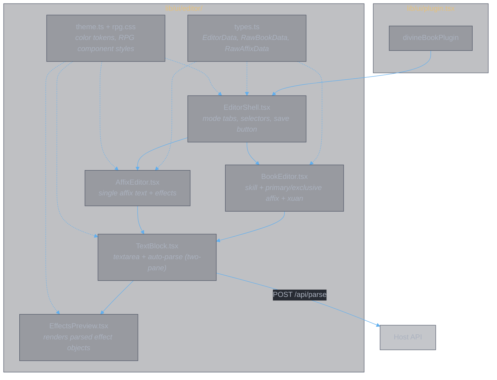
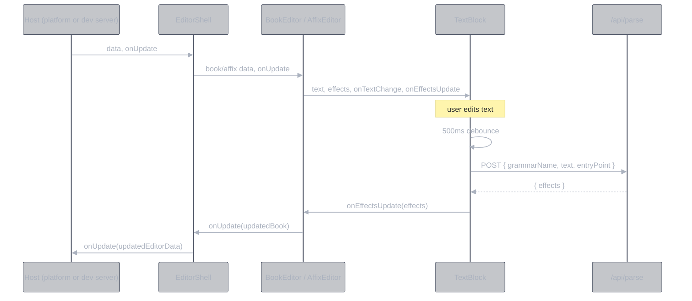

# Divine Book Editor Plugin

## Contract

Exported from `@divine-book/lib/plugin` (`lib/ui/plugin.tsx`):

```ts
export const divineBookPlugin = {
  id: "divine-book",
  name: "灵書",
  icon: "📖",
  description: "Skill books, affixes, and 通玄 data editor",
  Editor: DivineBookEditor,
};
```

### Data types

Defined in `lib/ui/editor/types.ts`, exported through `plugin.tsx`:

```ts
interface EditorData {
  version: number;
  books: Record<string, RawBookData>;
  affixes: {
    universal: Record<string, RawAffixData>;
    school: Record<string, Record<string, RawAffixData>>;
  };
}

interface RawBookData {
  school: string;
  skill: { text: string; effects: object[] };
  primaryAffix?: { name: string; text: string; effects: object[] };
  exclusiveAffix?: { name: string; text: string; effects: object[] };
  xuan?: { text: string; effects: object[] };
}

interface RawAffixData {
  text: string;
  effects: object[];
}
```

### Editor component props

```ts
// Required — provided by platform or standalone dev server
data: EditorData;
onUpdate: (data: EditorData) => void;

// Optional — platform save UX integration
dirty?: boolean;
saveStatus?: "idle" | "saving" | "saved";
onSave?: () => void;
```

### Server API requirements

The plugin's `TextBlock` component calls `/api/parse` for live parsing. The host (platform or dev server) must implement:

| Route | Method | Request body | Response |
|-------|--------|-------------|----------|
| `/api/parse` | POST | `{ grammarName, text, entryPoint }` | `{ effects, error? }` |

Data persistence routes (`/api/data`, `/api/save`, `/api/gen-yaml`) are host responsibilities — the plugin does not call them directly.

### Package exports

```json
{
  "name": "@divine-book/lib",
  "exports": {
    "./plugin": "./ui/plugin.tsx"
  }
}
```

## Internal structure



## Data flow



## Standalone dev server

`app/editor/` wraps the plugin for independent development:

- `src/App.tsx` — loads data via `fetch("/api/data")`, tracks dirty/save state, renders `EditorShell`
- `src/{BookEditor,AffixEditor,TextBlock,EffectsPreview,theme}.tsx` — re-export from `lib/ui/editor/`
- `serve.ts` — Bun server: implements `/api/parse`, `/api/data`, `/api/save`, `/api/gen-yaml` + static file serving

Run with `bun run editor` (port 3002).
