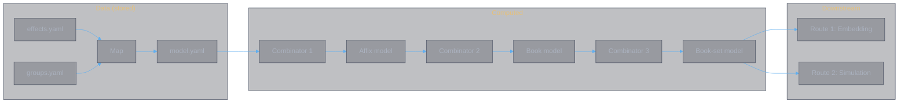

# Divine Book Combat Model

**Authors:** Z. Zhang & Claude Opus 4.6 (Anthropic)

> **Layer 2 — Effect-to-factor mapping.** This document specifies how game effects connect to the model parameters $(\mu, \sigma)$ defined in [theory.combat.md](../abstractions/theory.combat.md). The specification is organized as a four-level compositional pipeline: effect → affix → book → book set. Each level has its own model representation; only the effect level is stored (`model.yaml`), the rest are computed by combinators.

---

## Table of Contents

| Section | Content |
|:--------|:--------|
| **1. Architecture** | Four-level pipeline, stored vs computed representations |
| **2. Effect-Level Map** | The core mapping: each effect type → factor contribution |
| **3. Affix-Level Combinator** | Aggregate effect contributions within an affix |
| **4. Book-Level Combinator** | Combine primary, exclusive, and universal affixes |
| **5. Book-Set-Level Combinator** | Temporal composition across 6 slots → regime parameters |
| **6. Downstream Routes** | Embedding analysis and combat simulation |

---

## 1. Architecture

The mapping from game effects to model parameters is not a single transformation — it is a **four-level compositional pipeline**, where each level has its own model representation:

| Level | Representation | Operation | Stored? |
|:------|:---------------|:----------|:--------|
| **Effect** | Factor contribution per effect | Map (effect type → factors via group) | Yes (`model.yaml`) |
| **Affix** | Factor vector per affix | Combinator 1: aggregate effects | Computed |
| **Book** | Factor vector per book | Combinator 2: combine affixes | Computed |
| **Book set** | Regime parameters $(\mu, \sigma)$ | Combinator 3: temporal composition | Computed |

Only the effect-level model representation is persisted as data. The higher levels are derived by combinators — store the atomic level, compute the rest.

### 1.1 The Factor Space

The drift equation from [theory.combat.md §3.1](../abstractions/theory.combat.md#31-the-drift-equation):

$$\mu_A = -D_B \cdot (1 - DR_A) + H_A \cdot (1 - H_{red,A}) + S_A$$

Every effect ultimately contributes to one or more of these factors:

| Factor | Symbol | Role in drift |
|:-------|:-------|:--------------|
| Damage dealt (气血) | $D_B$ | Opponent's 气血 loss rate |
| Damage reduction | $DR_A$ | Fraction of incoming damage absorbed |
| Healing | $H_A$ | Self HP recovery rate |
| Healing reduction | $H_{red}$ | Suppression of opponent's healing |
| Shield | $S_A$ | Piecewise damage absorption (generated from 灵力) |
| Resonance damage (灵力) | $D_{res}$ | 会心 — damage to opponent's 灵力, drains shield generation capacity |
| Synchrony multiplier | $M_{synchro}$ | 心逐 expected value (outer wrapper on all factors) |
| Resonance variance | $\sigma_R$ | Stochastic variance from resonance system |
| Volatility | $\sigma$ | Total stochastic variance |

> **Two combat resources.** Characters have 气血 (HP) and 灵力 (spiritual power). 灵力 is consumed to generate 护盾 (shields) that block incoming damage. 攻击 damages 气血; 会心 (resonance) damages 灵力. These are **parallel attack lines** — see [战斗属性](../../data/属性/战斗属性.md). Draining 灵力 removes the opponent's ability to generate shields, leaving 气血 unprotected.

### 1.2 Groups as Map Domain

The 14 effect groups from `groups.yaml` organize the mapping. Each group feeds specific factors:

| Group | Primary factor | Role |
|:------|:---------------|:-----|
| Shared Mechanics | $D_B$ | Flat damage additions from fusion/mastery |
| Base Damage | $D_B$ | Primary damage events + orthogonal channels |
| Damage Multiplier Zones | $D_B$ | Multiplicative scaling of damage events |
| Resonance System | $D_{res}$, $\sigma$ | 会心 — parallel attack on opponent's 灵力 |
| Synchrony System | All factors | Outer multiplier on all effects (心逐) |
| Standard Crit | $D_B$, $\sigma$ | Rate-based crit system (暴击) |
| Conditional Triggers | $D_B$, $DR_A$ | State-dependent damage/buffs, DR nullification |
| Per-Hit Escalation | $D_B$ | Within-cast temporal ramp |
| HP-Based Calculations | $D_B$, $\mu_A$ | Orthogonal damage + self-HP cost |
| Healing and Survival | $H_A$, $DR_A$ | Self-healing, damage reduction |
| Shield System | $S_A$ | Piecewise absorption (regime switches) |
| State Modifiers | Meta | Amplifies other groups' contributions |
| Damage over Time | $D_B$ | Sustained drift on independent timeline |
| Self Buffs | Temporal | Cross-slot propagation of $D_B$ amplifiers |
| Debuffs | $H_{red}$, opponent $DR$ | Opponent's healing suppression, DR reduction |
| Special Mechanics | Partial / unmapped | Extensions required |

53 of 67 effect types (79%) map cleanly. The 14 Special Mechanics types require model extensions.

---

## 2. Effect-Level Map

The core of the pipeline: for each effect type, what factor(s) does it contribute to, and how? This section specifies the mapping rules that produce `model.yaml` from `effects.yaml`.

### 2.1 The Multiplicative Damage Chain (气血)

A single skill cast produces damage to 气血 through a chain of multiplicative zones:

$$D_{skill} = (D_{base} \times S_{coeff} + D_{flat}) \times (1 + M_{dmg}) \times (1 + M_{skill}) \times (1 + M_{final}) \times M_{synchro}$$

Where $M_{synchro}$ is the synchrony zone (心逐, applied to ALL output factors as an outer wrapper). 会心 (resonance) is **not** part of this chain — it is a separate attack line targeting 灵力 (see §2.4).

Each zone is fed by specific effect types:

| Zone | Notation | Groups | Effect types | Formula |
|:-----|:---------|:-------|:-------------|:--------|
| Base damage | $D_{base}$ | Shared Mechanics, Base Damage | `base_attack`, `fusion_flat_damage`, `mastery_extra_damage`, `enlightenment_damage` | `total` field (Base Damage) + sum of `value` fields (Shared Mechanics) |
| Flat extra | $D_{flat}$ | Multiplier Zones | `flat_extra_damage` | `value` field, additive |
| Damage zone | $M_{dmg}$ | Multiplier Zones, Conditional Triggers | `damage_increase`, `conditional_damage` | Sum of `value` fields; conditional types weighted by $P(\text{condition})$ |
| Skill zone | $M_{skill}$ | Multiplier Zones, Self Buffs | `skill_damage_increase`, `next_skill_buff` | Sum of `value` fields |
| Final zone | $M_{final}$ | Multiplier Zones | `final_damage_bonus` | `value` field |
| Synchrony zone | $M_{synchro}$ | Synchrony System | `probability_multiplier` | See §2.5 |
| ATK scaling | $S_{coeff}$ | Multiplier Zones | `attack_bonus` | $1 + \text{value}/100$ |

**Zone scarcity determines marginal value.** [Theory.combat.md §3.3](../abstractions/theory.combat.md#33-structural-properties-of-the-drift) predicts that contributing to a zone where existing multipliers are small yields higher marginal returns. The data confirms:

| Zone | Crowding | Marginal value |
|:-----|:---------|:---------------|
| $M_{dmg}$ | Crowded — many affixes contribute | Low |
| $M_{skill}$ | Scarce — few sources | High |
| $M_{final}$ | Very scarce — 1–2 sources | Very high |

### 2.2 Orthogonal Channels

Three damage channels bypass the multiplicative chain entirely, adding to $D_B$ independently:

| Channel | Group | Effect types | Formula | Why orthogonal |
|:--------|:------|:-------------|:--------|:---------------|
| %maxHP | Base Damage | `percent_max_hp_damage` | `value` × `hits` (from `base_attack`) per cast | Scales with target HP, not ATK |
| Lost-HP | HP-Based Calculations | `per_enemy_lost_hp`, `per_self_lost_hp`, `self_lost_hp_damage` | `per_percent` × $\%HP_{lost}$ | Grows as HP approaches barrier |
| DoT | Damage over Time | `dot`, `shield_destroy_dot`, `extended_dot` | `damage_per_tick` / `tick_interval` | Independent timeline |

These are **additive** to $\mu_B$, not multiplicative through $D_{skill}$:

$$\mu_B = -D_{skill} \cdot (1 - DR_B) - D_{ortho}$$

where $D_{ortho} = D_{\%maxHP} + D_{lostHP} + D_{DoT}$.

### 2.3 Per-Hit Escalation

Escalation modifies the *temporal shape* of damage within a single cast. Each hit $k$ of an $n$-hit skill receives a cumulative bonus:

| Type | Formula per hit $k$ | Total contribution |
|:-----|:--------------------|:-------------------|
| `per_hit_escalation` (stat=`skill_bonus`) | $M_{skill,k} = M_{skill} + k \cdot \text{value}$ | $\sum_{k=0}^{n-1} k \cdot \text{value} = \frac{n(n-1)}{2} \cdot \text{value}$ |
| `per_hit_escalation` (stat=`damage`) | $M_{dmg,k} = M_{dmg} + \min(k \cdot \text{value}, \text{max})$ | Capped sum |
| `periodic_escalation` | Every $m$ hits: geometric multiplier | Geometric growth capped at `max_stacks` |

Escalation means damage is **back-loaded** within a cast. For the model, the average per-hit contribution is used for $\mu_B$; the variance between early and late hits contributes to $\sigma_B$.

### 2.4 Resonance System (会心) — 灵力 Attack Line

会心 (resonance) is a **separate attack line targeting 灵力**, not a multiplier on 气血 damage. 灵力 is consumed to generate 护盾 (shields); draining it removes the opponent's shield generation capacity.

| Type | Contribution to $D_{res}$ | Contribution to $\sigma_R$ |
|:-----|:---------------------------|:-------------------------|
| `guaranteed_resonance` | Deterministic: `base_mult` (always) or `enhanced_mult` (with `enhanced_chance`) | $\sigma_R^2 = p(1-p)(m_{enh} - m_{base})^2$ |

> **Mechanic**: 会心 always applies `base_mult` as a damage floor on 灵力, with `enhanced_chance` probability of upgrading to `enhanced_mult`. No interaction with 暴击率/暴击伤害 (standard crit system) or the 气血 damage chain.

**Strategic significance**: Once 灵力 is depleted, the opponent cannot generate shields. All subsequent 气血 damage (from $D_{skill}$ and orthogonal channels) lands unmitigated. This makes 会心 one of the highest-value attack vectors — it doesn't just deal damage, it removes a defense layer for the entire rotation.

### 2.5 Synchrony System (心逐)

The synchrony zone $M_{synchro}$ is an **outer wrapper** that multiplies ALL skill effects (damage, healing, debuffs), not just the damage chain.

| Type | Contribution to $M_{synchro}$ | Contribution to $\sigma$ |
|:-----|:-------------------------------|:-------------------------|
| `probability_multiplier` | Stochastic: $E[M] = \sum_i p_i \cdot m_i$ per tier | $\sigma^2 = \sum_i p_i(m_i - E[M])^2$ |

**The variance-drift tradeoff.** `probability_multiplier` contributes to both $\mu$ (through $E[M]$) and $\sigma$ (through $\text{Var}[M]$). The companion type `probability_to_certain` (Conditional Triggers group) collapses the stochastic multiplier to its maximum tier, eliminating $\sigma$ while raising $\mu$. This pair implements the strategic choice described in [theory.combat.md §3.4](../abstractions/theory.combat.md#34-structural-properties-of-the-diffusion): accept variance for efficiency (one slot) or invest a second slot to eliminate it (pure drift).

> **Note**: 心逐 amplifies ALL effects including 会心's 灵力 damage. E.g., 灵犀九重 E[会心]=3.22 × 心逐 E[心逐]=3.40 yields ×10.95 total 灵力 damage — devastating to opponent's shield generation.

### 2.6 Standard Crit (暴击)

The standard crit system scales with 暴击率 (crit rate) and 暴击伤害 (crit damage) stats. It is a separate multiplier zone from resonance.

| Type | Role | Contribution to $\sigma$ |
|:-----|:-----|:-------------------------|
| `conditional_crit` | Guarantees crit under condition | Collapses crit $\sigma \to 0$ for that condition |
| `conditional_crit_rate` | Increases crit probability under condition | Reduces crit $\sigma$ |
| `crit_damage_bonus` (§2) | Additive to crit damage stat | Increases crit multiplier ceiling |

### 2.7 Conditional Triggers

Conditional effects gate their contribution on game state:

| Type | Gated factor | Formula |
|:-----|:-------------|:--------|
| `conditional_damage` | $M_{dmg}$ | `value` × $P(\text{condition})$ |
| `conditional_buff` | Various ($D_B$, orthogonal) | Stat bonuses active only when condition met |
| `probability_to_certain` | $M_{synchro}$ | Collapses `probability_multiplier` to max tier |
| `ignore_damage_reduction` | $DR_B$ | Sets opponent's $DR_B = 0$ for this skill |

`ignore_damage_reduction` is a **parameter nullification**: it doesn't modify $D_B$ but removes the opponent's $DR_B$ from the drift equation entirely. In the model, this means the $(1 - DR_B)$ term becomes 1 for the duration of the skill — a regime switch.

### 2.8 DoT Subsystem

DoT effects create sustained drift on their own timeline, independent of skill casts:

$$D_{DoT} = \frac{\text{damage\_per\_tick}}{\text{tick\_interval}} \times (1 + M_{dot})$$

| Type | Role in DoT |
|:-----|:------------|
| `dot` | Base DoT: defines tick rate, duration, damage per tick |
| `dot_damage_increase` | $M_{dot}$: multiplier on DoT damage |
| `dot_frequency_increase` | Reduces `tick_interval` → higher tick rate |
| `dot_extra_per_tick` | Additive per-tick bonus scaling with lost HP (orthogonal) |
| `extended_dot` | Increases duration → more ticks |
| `shield_destroy_dot` | DoT conditional on shield state |
| `on_dispel` | Triggered damage when DoT is removed |

### 2.9 HP-Based Calculations

This group contributes to $D_B$ orthogonally AND modifies $\mu_A$ (self-cost):

| Type | Factor | Formula |
|:-----|:-------|:--------|
| `per_enemy_lost_hp` | $D_B$ orthogonal | `per_percent` × enemy $\%HP_{lost}$ — accelerates near barrier |
| `per_self_lost_hp` | $D_B$ orthogonal | `per_percent` × self $\%HP_{lost}$ — risk-reward |
| `self_lost_hp_damage` | $D_B$ orthogonal | `value` × self $\%HP_{lost}$ — on last hit |
| `self_hp_cost` | $\mu_A$ negative | `value` × current HP — direct self-damage |
| `self_damage_taken_increase` | $DR_A$ negative | Reduces own DR — takes more damage |
| `min_lost_hp_threshold` | Gate | Minimum lost-HP % required to trigger scaling effects |

`self_hp_cost` and `self_damage_taken_increase` are the only effect types that *decrease* $\mu_A$ deliberately — they implement a risk-reward tradeoff (sacrifice survivability for damage).

### 2.10 Healing and Survival

| Type | Factor | Formula |
|:-----|:-------|:--------|
| `lifesteal` | $H_A$ | $H_A = \text{value} \times D_A$ — healing proportional to damage dealt |
| `healing_increase` | $H_A$ multiplier | Scales all healing by $(1 + \text{value}/100)$ |
| `healing_to_damage` | $H_A \to D_B$ | Converts `value`% of healing into damage — dual factor |
| `self_damage_reduction_during_cast` | $DR_A$ | $DR_A = \text{value}/100$ during cast — regime switch |

`healing_to_damage` is a **cross-factor** effect: it subtracts from $H_A$ and adds to $D_B$. The net effect on $\mu_A$ depends on the relative magnitudes. In the model:

$$\Delta\mu_A = -\text{value} \cdot H_A, \qquad \Delta\mu_B = -\text{value} \cdot H_A$$

### 2.11 Shield System

Shields create **regime switches** ([theory.combat.md §3.3](../abstractions/theory.combat.md#33-structural-properties-of-the-drift)). While a shield is active, incoming damage is absorbed:

| Type | Role |
|:-----|:-----|
| `shield_strength` | $S_A$: shield HP pool. While shield HP > 0, effective $D_B \to 0$ for entity A |
| `damage_to_shield` | Converts `value`% of damage dealt into shield HP for `duration` seconds |
| `on_shield_expire` | Triggered damage when shield breaks — adds to $D_B$ |

In the regime model: shield activation starts a new regime where $\mu_A$ increases by $D_B(1-DR_A)$ (incoming damage absorbed). Shield depletion ends the regime. The shield's HP determines the regime duration as a state-dependent event ([theory.combat.scenario.md §1.3](../abstractions/theory.combat.scenario.md#13-regime-transitions)).

### 2.12 Debuffs

Debuffs modify the *opponent's* drift equation — they are the offensive counterpart to Healing/Survival and Shield System.

| Type | Target factor | Formula |
|:-----|:-------------|:--------|
| `debuff` (target=`healing_received`) | $H_{red}$ | $H_{red} = \|\text{value}\|/100$ — suppresses opponent healing |
| `debuff` (target=`damage_reduction`) | Opponent $DR$ | Reduces opponent's $DR$ by `value` |
| `debuff` (target=`final_damage_reduction`) | $M_{final}$ of opponent | Equivalent to adding to own $M_{final}$ |
| `conditional_debuff` | Same as `debuff`, gated on condition | Weighted by $P(\text{condition})$ |
| `cross_slot_debuff` | Same as `debuff`, but applied during a different skill | Temporal: requires trigger (e.g., `on_attacked`) |
| `counter_debuff` | Reactive debuff application | Applied when attacked — reactive coupling |
| `counter_debuff_upgrade` | Increases counter_debuff trigger probability | Meta-modifier on Debuffs group |

$H_{red}$ is the most strategically significant debuff target. [Theory.combat.md §3.2](../abstractions/theory.combat.md#32-sensitivity-analysis) shows that $\partial P(\text{win}) / \partial H_{red}$ scales with the opponent's healing rate $H_B$ — anti-healing is most valuable against well-geared opponents.

### 2.13 State Modifiers (Meta)

| Type | What it amplifies | Formula |
|:-----|:------------------|:--------|
| `buff_strength` | All buff `value` fields | $\text{effective\_value} = \text{value} \times (1 + \text{buff\_strength}/100)$ |
| `debuff_strength` | All debuff `value` fields | Same scaling for debuffs |
| `buff_duration` | All buff durations | $\text{effective\_duration} = \text{duration} \times (1 + \text{buff\_duration}/100)$ |
| `all_state_duration` | All buff + debuff durations | Same, applies to both |
| `buff_stack_increase` | Stack counts on stacking buffs | More stacks → higher effective value |
| `debuff_stack_increase` | Stack counts on stacking debuffs | More stacks → higher effective debuff |
| `debuff_stack_chance` | Probability of debuff stack application | Higher chance → faster stacking |

These are **second-order effects**: they modify the *magnitude* of first-order effects from other groups. In the model, they must be applied *before* computing factor contributions — they change the input values, not the factors directly.

### 2.14 Self Buffs (Temporal)

Self buffs create **temporal effects** that propagate across skill slots. At the effect level, each self-buff maps to a factor contribution *plus* temporal metadata (duration, coverage):

| Type | Temporal behavior | Factor affected |
|:-----|:------------------|:----------------|
| `self_buff` | Duration-based: persists for `duration` seconds | Various stats: `attack_bonus` → $S_{coeff}$, `damage_reduction` → $DR_A$, `healing_bonus` → $H_A$ |
| `self_buff_extend` | Extends a named buff's duration | More covered slots → higher total value |
| `self_buff_extra` | Adds stats to an existing buff | Increases the buff's per-slot contribution |
| `counter_buff` | Reactive: triggers when attacked | Duration-based, but activation is stochastic |
| `next_skill_buff` | Single-shot: applies to exactly the next skill | Fixed coverage = 1 slot |
| `enlightenment_bonus` | Permanent: stacks up to max | Modifies base damage |

The temporal metadata is consumed by Combinator 3 (§5), not at the effect level. The effect-level map records the factor contribution and the propagation parameters.

### 2.15 Special Mechanics (Partial)

14 effect types resist clean mapping to the factor space. They cluster into six categories:

| Category | Types | Why unmapped |
|:---------|:------|:-------------|
| **Multi-entity** | `summon`, `summon_buff` | Summons add a third HP process to the two-entity SDE |
| **Stack-based damage** | `per_buff_stack_damage`, `per_debuff_stack_damage`, `per_debuff_stack_true_damage` | Requires discrete counting state absent from continuous SDE |
| **Event triggers** | `on_buff_debuff_shield_trigger`, `periodic_dispel`, `periodic_cleanse` | Requires event-callback model |
| **Delayed burst** | `delayed_burst`, `delayed_burst_increase` | Accumulation over time with deferred release |
| **Random effects** | `random_buff`, `random_debuff`, `attack_reduction`, `crit_rate_reduction`, `crit_damage_reduction` | Stochastic selection among discrete outcomes |
| **Immunity** | `untargetable_state`, `conditional_heal_buff` | Parameter nullification / state gating |

These represent 21% of effect types. For Route 1 (embedding), they can be handled heuristically — e.g., `summon` contributes an estimated $D_B$ based on `inherit_stats` and `duration`. For Route 2 (simulation), they require model extensions.

---

## 3. Affix-Level Combinator

An affix consists of multiple effects. Combinator 1 aggregates their individual factor contributions into a single **affix factor vector**.

### 3.1 Aggregation Rules

Effects within an affix combine according to their factor type:

| Factor | Aggregation | Rationale |
|:-------|:------------|:----------|
| $D_{base}$, $D_{flat}$ | Additive sum | Flat damage sources stack |
| $M_{dmg}$, $M_{skill}$, $M_{final}$ | Additive sum (within zone) | Multiplier zones are additive internally, multiplicative across zones |
| $D_{res}$ | Expected value: $E[D_{res}] = p \cdot m_{enh} + (1-p) \cdot m_{base}$ | Resonance 灵力 damage reduces to its mean |
| $M_{synchro}$ | Expected value: $E[M_{synchro}] = \sum_i p_i \cdot m_i$ | Synchrony multiplier reduces to its mean |
| $D_{ortho}$ | Additive sum per channel | Orthogonal channels stack independently |
| $H_A$, $DR_A$, $S_A$ | Additive sum | Defensive stats stack |
| $H_{red}$ | Additive sum | Healing reduction stacks |
| $\sigma_R$ | Root sum of squares: $\sigma_R = \sqrt{\sum \sigma_i^2}$ | Independent resonance/synchrony variance sources |

### 3.2 Meta-Modifier Application

State Modifiers (§2.11) are **second-order**: they must be applied *before* aggregation. They modify the input values of other effects, not the aggregated result:

$$\text{effective\_value}(e) = e.\text{value} \times (1 + \text{buff\_strength}/100)$$

$$\text{effective\_duration}(e) = e.\text{duration} \times (1 + \text{buff\_duration}/100)$$

### 3.3 Output

The affix factor vector $\mathbf{f}_a$ is a tuple:

$$\mathbf{f}_a = (D_{base}, D_{flat}, M_{dmg}, M_{skill}, M_{final}, S_{coeff}, D_{res}, \sigma_R, M_{synchro}, D_{ortho}, H_A, DR_A, S_A, H_{red}, \text{temporal}[])$$

where `temporal[]` carries forward the propagation metadata from Self Buffs and Debuffs for consumption by Combinator 3.

---

## 4. Book-Level Combinator

A book consists of one primary affix, one exclusive affix, and one or more universal affixes. Combinator 2 combines their affix factor vectors into a single **book factor vector**.

### 4.1 Affix Types in a Book

From `effects.yaml`, each book has:

| Affix type | Source | Count |
|:-----------|:-------|:------|
| `primary_affix` | The book's main skill affixes | 1 |
| `exclusive_affix` | School-specific affixes | 1 |
| `universal_affixes` | Shared across all schools | 1–3 |

### 4.2 Combination Rules

The book factor vector is the **component-wise aggregation** of its affix vectors, following the same rules as §3.1:

$$\mathbf{f}_{book} = \bigoplus_{a \in \text{affixes}(book)} \mathbf{f}_a$$

where $\oplus$ denotes the per-factor aggregation (additive for most, root-sum-of-squares for $\sigma$).

### 4.3 The Damage Chain at Book Level

The full multiplicative chain can now be evaluated from the book factor vector:

$$D_{skill} = (D_{base} \times S_{coeff} + D_{flat}) \times (1 + M_{dmg}) \times (1 + M_{skill}) \times (1 + M_{final}) \times M_{synchro}$$

This collapses the book's contribution to 气血 damage ($D_B$) into a single scalar. The 灵力 damage ($D_{res}$) is carried separately as a parallel attack line. Together with $D_{ortho}$, $D_{res}$, $H_A$, $DR_A$, $S_A$, $H_{red}$, and $\sigma_R$, the book factor vector is now ready for temporal composition.

### 4.4 Output

The book model is a reduced vector:

$$\mathbf{b}_k = (D_{skill,k}, D_{res,k}, D_{ortho,k}, H_{A,k}, DR_{A,k}, S_{A,k}, H_{red,k}, \sigma_{R,k}, \text{temporal}[])$$

where $k$ is the slot position (1–6) and `temporal[]` carries forward propagation metadata.

---

## 5. Book-Set-Level Combinator

A book set is 6 books in ordered slots, released sequentially with gap $T_{gap} \approx 6\text{s}$. Combinator 3 handles **temporal composition** — effects from earlier slots propagating to later ones — and produces the final regime parameters.

### 5.1 Temporal Propagation

The state available at slot $k$ combines the book's own contributions with inherited temporal effects:

$$\mathbf{b}_k^{eff} = \mathbf{b}_k + \sum_{j < k} \mathbf{b}_j^{temporal} \cdot \mathbb{1}\!\left[d_j > (k - j) \times T_{gap}\right]$$

The coverage formula determines how far a temporal effect from slot $k$ propagates:

$$\text{coverage}(k) = \min\!\left(\left\lfloor \frac{d}{T_{gap}} \right\rfloor, \; 6 - k\right)$$

where $d$ is the effective duration (after State Modifier adjustments). A buff in slot 1 with duration 12s covers slots 2 and 3. The same buff in slot 5 covers only slot 6.

### 5.2 Regime Construction

Each slot $k$ defines a **regime** ([theory.combat.scenario.md §1.1](../abstractions/theory.combat.scenario.md#11-regime-definition)) with constant parameters. From the effective book vector $\mathbf{b}_k^{eff}$:

$$\mu_B^{(k)} = -D_{skill,k} \cdot (1 - DR_B^{(k)}) - D_{ortho,k}$$

$$\mu_{灵,B}^{(k)} = -D_{res,k}$$

$$\mu_A^{(k)} = -D_B^{(k)} \cdot (1 - DR_A^{(k)}) + H_A^{(k)} \cdot (1 - H_{red,A}^{(k)}) + S_A^{(k)}$$

$$\sigma_B^{(k)} = D_{skill,k} \cdot (1 - DR_B^{(k)}) \cdot \sqrt{\text{Var}[M_{synchro,k}]}$$

> **Two drift processes.** $\mu_B^{(k)}$ tracks opponent's 气血 loss rate. $\mu_{灵,B}^{(k)}$ tracks opponent's 灵力 loss rate from 会心. When 灵力 is depleted, $S_B$ (shield generation) drops to zero, removing the shield absorption term from $\mu_B$ — a regime switch that exposes 气血 to full damage.

Regime boundaries occur at:
- Skill cast start/end (every $T_{gap}$)
- Buff/debuff activation or expiry (within a slot)
- Shield activation or depletion
- CC application or expiry

### 5.3 Temporal Precedence

[Theory.combat.md §3.3](../abstractions/theory.combat.md#33-structural-properties-of-the-drift) establishes that multiplicative amplifiers have higher value when they precede the damage events they amplify. In terms of slots:

- A buff in slot $k$ with coverage $c$ amplifies slots $k+1$ through $k+c$
- Placing damage-dealing skills in those covered slots maximizes the product
- Single-shot forward transfers (`next_skill_buff`) have fixed coverage = 1

This creates an **ordering constraint**: buff/debuff skills should precede burst skills.

### 5.4 Output

The book-set model is the sequence of regime parameters:

$$\mathcal{R} = \left\{ \left( t_k, \; \mu_A^{(k)}, \sigma_A^{(k)}, \mu_B^{(k)}, \sigma_B^{(k)} \right) \right\}_{k=1}^{N}$$

where $N \geq 6$ (additional regimes arise from mid-slot boundary events).

---

## 6. Downstream Routes

Once the book-set model $\mathcal{R}$ is computed:

- **Route 1 — Embedding.** The parameter vectors $(\mu_A^{(k)}, \sigma_A^{(k)}, \mu_B^{(k)}, \sigma_B^{(k)})$ across all regimes form the configuration's representation in model space. Work directly in this space for similarity search, clustering, and optimization without simulation.
- **Route 2 — Simulation.** The regime sequence feeds [theory.combat.scenario.md §1](../abstractions/theory.combat.scenario.md#1-simulation-framework) directly.

---

## Document History

| Version | Date | Changes |
|---------|------|---------|
| 1.0 | 2026-02-25 | Initial: concrete mapping from archived combat.md |
| 2.0 | 2026-02-25 | Restructured as Layer 2 (effect-to-factor mapping). Organized around the mapping problem |
| 2.1 | 2026-02-25 | Updated references: book.combat.md → theory.combat.md |
| 2.2 | 2026-02-25 | Updated L1 section references for theory.combat.md v3.0 restructure |
| 3.0 | 2026-02-25 | Complete redesign around 14 effect groups from groups.yaml |
| 3.1 | 2026-02-25 | Replaced keyword.map §N notation with group names |
| 4.0 | 2026-02-25 | Four-level compositional architecture: effect → affix → book → book-set. Effect-level map (§2) with 13 subsections covering all groups. Three explicit combinators (§3–§5). Separated doc-domain spec from data-domain impl |
| 5.0 | 2026-03-03 | Split "Critical System" into Resonance (§2.4), Synchrony (§2.5), Standard Crit (§2.6). Renamed C_mult→M_res, sigma_C→sigma_R, added M_synchro. Fixed damage chain: D_chain × M_synchro. Renumbered §2.7–§2.15. |
| 6.0 | 2026-03-07 | **Breaking**: 会心 (resonance) is NOT a multiplier in the 气血 damage chain — it is a separate attack line targeting 灵力 (spiritual power). Renamed M_res→D_res. Removed M_res from damage chain formula. Added 灵力 drift process to regime construction. Two combat resources (气血/灵力) documented per 战斗属性. |
