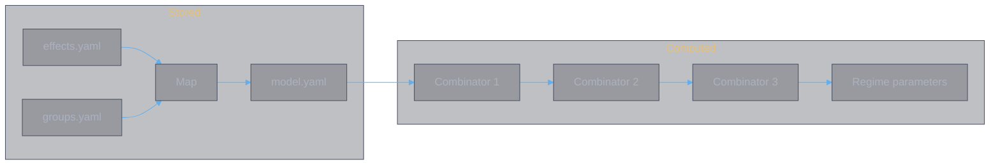

<style>
body {
  max-width: none !important;
  width: 95% !important;
  margin: 0 auto !important;
  padding: 20px 40px !important;
  background-color: #282c34 !important;
  color: #abb2bf !important;
  font-family: -apple-system, BlinkMacSystemFont, "Segoe UI", Helvetica, Arial, sans-serif !important;
  line-height: 1.6 !important;
  -webkit-print-color-adjust: exact !important;
  print-color-adjust: exact !important;
}

h1, h2, h3, h4, h5, h6 {
  color: #ffffff !important;
}

a {
  color: #61afef !important;
}

code {
  background-color: #3e4451 !important;
  color: #e5c07b !important;
  padding: 2px 6px !important;
  border-radius: 3px !important;
}

table {
  border-collapse: collapse !important;
  width: auto !important;
  margin: 16px 0 !important;
  table-layout: auto !important;
  display: table !important;
}

table th,
table td {
  border: 1px solid #4b5263 !important;
  padding: 8px 10px !important;
  word-wrap: break-word !important;
}

table th:first-child,
table td:first-child {
  min-width: 60px !important;
}

table th {
  background: #3e4451 !important;
  color: #e5c07b !important;
  font-size: 14px !important;
  text-align: center !important;
}

table td {
  background: #2c313a !important;
  font-size: 12px !important;
  text-align: left !important;
}

blockquote {
  border-left: 3px solid #4b5263;
  padding-left: 10px;
  color: #5c6370;
}

strong {
  color: #e5c07b;
}
</style>

# Implementation: Combat Model

**Authors:** Z. Zhang & Claude Opus 4.6 (Anthropic)

> **Data-domain implementation of the combat model.** This document specifies how to compute model representations from effect data. It applies the mapping rules defined in [combat.md](combat.md) to concrete YAML. Two fundamental operations: a **map** that transforms each effect into a factor contribution, and three **combinators** that compose these contributions at increasing levels of aggregation.

---

## Table of Contents

| Section | Content |
|:--------|:--------|
| **1. Overview** | Data flow, inputs, outputs, stored vs computed |
| **2. The Map** | effects.yaml + groups.yaml → model.yaml |
| **3. Combinator 1: Effects → Affix** | Aggregate effect contributions within an affix |
| **4. Combinator 2: Affixes → Book** | Combine primary, exclusive, and universal affixes |
| **5. Combinator 3: Books → Book Set** | Temporal composition across 6 slots → regime parameters |

---

## 1. Overview

### Data Flow



### Inputs

| File | Role |
|:-----|:-----|
| `data/yaml/effects.yaml` | Effect data: 28 books, 16 universal affixes, 17 school affixes |
| `data/yaml/groups.yaml` | Group classification: 14 groups, each with a list of effect type ids |

### Outputs

| Artifact | Stored? | Content |
|:---------|:--------|:--------|
| `data/yaml/model.yaml` | Yes | Per-effect factor contributions |
| Affix model | No | Aggregated factor vectors per affix |
| Book model | No | Combined factor vectors per book |
| Book-set model | No | Regime parameter sequence $(\mu, \sigma)$ |

Only `model.yaml` is persisted. The affix, book, and book-set models are computed on demand by the combinators.

### Relationship to combat.md

[combat.md](combat.md) defines the mapping rules in the doc domain — which effect types feed which factors, and how. This document applies those rules to concrete data:

| combat.md section | This document |
|:------------------|:--------------|
| §2 Effect-Level Map | §2 The Map |
| §3 Affix-Level Combinator | §3 Combinator 1 |
| §4 Book-Level Combinator | §4 Combinator 2 |
| §5 Book-Set-Level Combinator | §5 Combinator 3 |

---

## 2. The Map

The map transforms each effect in `effects.yaml` into a **factor contribution** — a record of which model factors it feeds and by how much. The output is `model.yaml`.

### 2.1 Group Lookup

For each effect, look up its `type` in `groups.yaml` to determine which group it belongs to. The group determines the mapping rule to apply (per [combat.md §2](combat.md#2-effect-level-map)).

```
effect.type  →  groups.yaml lookup  →  group id  →  mapping rule  →  factor contribution
```

### 2.2 Factor Contribution

Each effect maps to one or more entries in the factor vector. The factors, from [combat.md §1.1](combat.md#11-the-factor-space):

| Factor | Key in model.yaml | Type |
|:-------|:-------------------|:-----|
| Base damage | `D_base` | number |
| Flat extra damage | `D_flat` | number |
| Damage zone multiplier | `M_dmg` | number |
| Skill zone multiplier | `M_skill` | number |
| Final zone multiplier | `M_final` | number |
| ATK scaling coefficient | `S_coeff` | number |
| Crit multiplier (expected) | `C_mult` | number |
| Crit variance | `sigma_C` | number |
| Orthogonal damage | `D_ortho` | number |
| Healing | `H_A` | number |
| Damage reduction | `DR_A` | number |
| Shield | `S_A` | number |
| Healing reduction | `H_red` | number |
| Temporal metadata | `temporal` | object (duration, coverage type) |

An effect contributes to a subset of these. Unaffected factors are absent from its entry (not zero — absent).

### 2.3 Mapping Rules by Group

Each group has a distinct mapping rule. The rules are derived from [combat.md §2.1–§2.13](combat.md#2-effect-level-map):

| Group | Effect type | Factor(s) | Rule |
|:------|:-----------|:----------|:-----|
| Shared Mechanics | `fusion_flat_damage` | `D_base` | `value` field |
| Shared Mechanics | `mastery_extra_damage` | `D_base` | `value` field |
| Shared Mechanics | `enlightenment_damage` | `D_base` | `value` field |
| Shared Mechanics | `cooldown` | — | Temporal only: modifies $T_{gap}$ |
| Base Damage | `base_attack` | `D_base` | `total` field |
| Base Damage | `percent_max_hp_damage` | `D_ortho` | `value` × `hits` (from skill's `base_attack`) |
| Base Damage | `shield_destroy_damage` | `D_ortho` | Conditional on shield state |
| Multiplier Zones | `attack_bonus` | `S_coeff` | $1 + \text{value}/100$ |
| Multiplier Zones | `damage_increase` | `M_dmg` | `value` field |
| Multiplier Zones | `skill_damage_increase` | `M_skill` | `value` field |
| Multiplier Zones | `enemy_skill_damage_reduction` | `M_skill` | Opponent's perspective |
| Multiplier Zones | `final_damage_bonus` | `M_final` | `value` field |
| Multiplier Zones | `crit_damage_bonus` | `C_mult` | Additive to crit multiplier |
| Multiplier Zones | `flat_extra_damage` | `D_flat` | `value` field |
| Critical System | `guaranteed_crit` | `C_mult`, `sigma_C` | $E[C]$, $\text{Var}[C]$ from tier probabilities |
| Critical System | `probability_multiplier` | `C_mult`, `sigma_C` | $E[C] = \sum p_i m_i$, $\sigma^2 = \sum p_i(m_i - E)^2$ |
| Critical System | `conditional_crit` | `C_mult`, `sigma_C` | Collapses variance under condition |
| Critical System | `conditional_crit_rate` | `sigma_C` | Reduces variance |
| Conditional Triggers | `conditional_damage` | `M_dmg` | `value` × $P(\text{condition})$ |
| Conditional Triggers | `conditional_buff` | Various | Stat bonuses gated on condition |
| Conditional Triggers | `probability_to_certain` | `C_mult`, `sigma_C` | Max tier, zero variance |
| Conditional Triggers | `ignore_damage_reduction` | — | Regime switch: nullifies opponent $DR$ |
| Per-Hit Escalation | `per_hit_escalation` | `M_dmg` or `M_skill` | Average over $n$ hits |
| Per-Hit Escalation | `periodic_escalation` | `C_mult` | Geometric mean over hits |
| HP-Based Calculations | `per_enemy_lost_hp` | `D_ortho` | `per_percent` × expected $\%HP_{lost}$ |
| HP-Based Calculations | `per_self_lost_hp` | `D_ortho` | `per_percent` × expected $\%HP_{lost}$ |
| HP-Based Calculations | `self_lost_hp_damage` | `D_ortho` | `value` × expected $\%HP_{lost}$ |
| HP-Based Calculations | `self_hp_cost` | `H_A` (negative) | Self-damage: $-\text{value}$ |
| HP-Based Calculations | `self_damage_taken_increase` | `DR_A` (negative) | Reduces own DR |
| HP-Based Calculations | `min_lost_hp_threshold` | — | Gate: enables other HP-based effects |
| Healing and Survival | `lifesteal` | `H_A` | `value` × $D_A$ (requires book-level $D$) |
| Healing and Survival | `healing_increase` | `H_A` | Multiplier: $(1 + \text{value}/100)$ |
| Healing and Survival | `healing_to_damage` | `H_A`, `D_ortho` | Cross-factor: subtracts from $H_A$, adds to $D$ |
| Healing and Survival | `self_damage_reduction_during_cast` | `DR_A` | `value`$/100$, with temporal (cast duration) |
| Shield System | `shield_strength` | `S_A` | `value` field |
| Shield System | `damage_to_shield` | `S_A` | `value`% of damage dealt, with temporal |
| Shield System | `on_shield_expire` | `D_ortho` | Triggered on shield break |
| Damage over Time | `dot` | `D_ortho` | `damage_per_tick` / `tick_interval` |
| Damage over Time | `dot_damage_increase` | `D_ortho` | Multiplier on DoT |
| Damage over Time | `dot_frequency_increase` | `D_ortho` | Reduces tick interval |
| Damage over Time | `dot_extra_per_tick` | `D_ortho` | Additive per-tick bonus |
| Damage over Time | `extended_dot` | — | Temporal: increases DoT duration |
| Damage over Time | `shield_destroy_dot` | `D_ortho` | DoT conditional on shield state |
| Damage over Time | `on_dispel` | `D_ortho` | Triggered on DoT removal |
| State Modifiers | `buff_strength` | — | Meta: scales buff `value` fields by $(1 + v/100)$ |
| State Modifiers | `debuff_strength` | — | Meta: scales debuff `value` fields by $(1 + v/100)$ |
| State Modifiers | `buff_duration` | — | Meta: scales buff `duration` fields by $(1 + v/100)$ |
| State Modifiers | `all_state_duration` | — | Meta: scales all state durations |
| State Modifiers | `buff_stack_increase` | — | Meta: scales buff stack counts |
| State Modifiers | `debuff_stack_increase` | — | Meta: scales debuff stack counts |
| State Modifiers | `debuff_stack_chance` | — | Meta: scales debuff stack probability |
| Self Buffs | `self_buff` | Various | Factor from `stat` field, with temporal |
| Self Buffs | `self_buff_extend` | — | Temporal: extends named buff duration |
| Self Buffs | `self_buff_extra` | Various | Adds to existing buff's factor contribution |
| Self Buffs | `counter_buff` | Various | Factor from `stat`, stochastic temporal |
| Self Buffs | `next_skill_buff` | Various | Factor from `stat`, coverage = 1 slot |
| Self Buffs | `enlightenment_bonus` | `D_base` | Permanent: modifies base damage |
| Debuffs | `debuff` | `H_red` or opponent `DR` | From `target` field |
| Debuffs | `conditional_debuff` | `H_red` or opponent `DR` | Gated on condition |
| Debuffs | `cross_slot_debuff` | `H_red` or opponent `DR` | With temporal |
| Debuffs | `counter_debuff` | `H_red` or opponent `DR` | Reactive, stochastic temporal |
| Debuffs | `counter_debuff_upgrade` | — | Meta: scales counter_debuff probability |
| Special Mechanics | (14 types) | Partial | Heuristic mapping or unmapped |

### 2.4 Meta-Modifier Resolution Order

State Modifiers (buff_strength, debuff_strength, buff_duration, etc.) do not produce factor contributions themselves. They modify the *input values* of other effects. Resolution order:

1. Collect all State Modifier effects
2. For each non-meta effect, apply applicable modifiers to its `value` and `duration` fields
3. Then compute the factor contribution from the modified values

This ensures meta-modifiers are resolved before the map, not after.

### 2.5 model.yaml Structure

```yaml
effects:
  <book_name>:
    skill:
      - type: base_attack
        factors:
          D_base: 20265
      - type: percent_max_hp_damage
        factors:
          D_ortho: 27
    primary_affix:
      <affix_name>:
        - type: damage_increase
          factors:
            M_dmg: 40
        - type: self_buff
          factors:
            S_coeff: 30
          temporal:
            duration: 12
            coverage_type: duration_based
    exclusive_affix:
      <affix_name>:
        - type: guaranteed_crit
          factors:
            C_mult: 2.5
            sigma_C: 0.3

universal_affixes:
  <affix_name>:
    - type: skill_damage_increase
      factors:
        M_skill: 118
      temporal:
        duration: 0
        coverage_type: next_skill

school_affixes:
  <school>:
    <affix_name>:
      - type: debuff
        factors:
          H_red: 31
        temporal:
          duration: 8
          coverage_type: duration_based
```

Each entry preserves the original `type` for traceability, plus a `factors` record with only the non-zero contributions, and optionally `temporal` metadata for effects that propagate across slots.

---

## 3. Combinator 1: Effects → Affix

Aggregates the effect-level factor contributions within a single affix into an **affix factor vector**.

### 3.1 Input

A list of effect entries from model.yaml belonging to one affix.

### 3.2 Aggregation

Per-factor aggregation rules (from [combat.md §3.1](combat.md#31-aggregation-rules)):

| Factor | Operation | Notes |
|:-------|:----------|:------|
| `D_base` | $\sum$ | Flat damage sources stack |
| `D_flat` | $\sum$ | Flat extra damage stacks |
| `M_dmg` | $\sum$ | Additive within zone |
| `M_skill` | $\sum$ | Additive within zone |
| `M_final` | $\sum$ | Additive within zone |
| `S_coeff` | $\sum$ | ATK scaling stacks |
| `C_mult` | $E[C]$ | Expected value of stochastic multiplier |
| `sigma_C` | $\sqrt{\sum \sigma_i^2}$ | Independent variance sources |
| `D_ortho` | $\sum$ per channel | Orthogonal channels stack |
| `H_A` | $\sum$ | Healing stacks |
| `DR_A` | $\sum$ | DR stacks |
| `S_A` | $\sum$ | Shield stacks |
| `H_red` | $\sum$ | Healing reduction stacks |
| `temporal` | collect | Forward to Combinator 3 |

### 3.3 Output

An affix factor vector: a single record with all aggregated factors plus collected temporal metadata.

---

## 4. Combinator 2: Affixes → Book

Combines the affix factor vectors of a book's primary, exclusive, and universal affixes into a **book factor vector**.

### 4.1 Input

For each book:
- Primary affix vector (from model.yaml → Combinator 1)
- Exclusive affix vector (from model.yaml → Combinator 1)
- Universal affix vectors (looked up by name from model.yaml → Combinator 1)

The universal affixes used by a book are a configuration choice — which universals are equipped. This is a parameter of Combinator 2, not stored in effects.yaml.

### 4.2 Combination

Same aggregation rules as Combinator 1 (§3.2), applied across affix vectors instead of across effects.

$$\mathbf{f}_{book} = \bigoplus_{a \in \text{affixes}(book)} \mathbf{f}_a$$

### 4.3 Damage Chain Evaluation

After combination, the multiplicative damage chain can be evaluated:

$$D_{skill} = (D_{base} \times S_{coeff} + D_{flat}) \times (1 + M_{dmg}) \times (1 + M_{skill}) \times (1 + M_{final}) \times C_{mult}$$

This collapses the book's offensive contribution into a single scalar $D_{skill}$. The book model is:

$$\mathbf{b} = (D_{skill}, D_{ortho}, H_A, DR_A, S_A, H_{red}, \sigma, \text{temporal}[])$$

---

## 5. Combinator 3: Books → Book Set

Composes 6 book models in ordered slots with **temporal propagation** to produce the final regime parameter sequence.

### 5.1 Input

An ordered sequence of 6 book models $(\mathbf{b}_1, \ldots, \mathbf{b}_6)$ in slot order.

### 5.2 Temporal Propagation

For each slot $k$, the effective book model includes inherited temporal effects:

$$\mathbf{b}_k^{eff} = \mathbf{b}_k + \sum_{j < k} \mathbf{t}_j \cdot \mathbb{1}\!\left[d_j > (k - j) \times T_{gap}\right]$$

where $\mathbf{t}_j$ is the temporal contribution from slot $j$ and $T_{gap} \approx 6\text{s}$.

Coverage:

$$\text{coverage}(k) = \min\!\left(\left\lfloor \frac{d}{T_{gap}} \right\rfloor, \; 6 - k\right)$$

### 5.3 Regime Construction

Each slot produces a regime with constant parameters:

$$\mu_B^{(k)} = -D_{skill,k} \cdot (1 - DR_B^{(k)}) - D_{ortho,k}$$

$$\mu_A^{(k)} = -D_B^{(k)} \cdot (1 - DR_A^{(k)}) + H_A^{(k)} \cdot (1 - H_{red,A}^{(k)}) + S_A^{(k)}$$

$$\sigma_B^{(k)} = D_{skill,k} \cdot (1 - DR_B^{(k)}) \cdot \sigma_{C,k}$$

Additional regime boundaries arise from mid-slot events (buff expiry, shield depletion).

### 5.4 Output

The regime parameter sequence:

$$\mathcal{R} = \left\{ \left( t_k, \; \mu_A^{(k)}, \sigma_A^{(k)}, \mu_B^{(k)}, \sigma_B^{(k)} \right) \right\}_{k=1}^{N}$$

This feeds directly into:
- **Route 1 (Embedding):** $\mathcal{R}$ as a vector in model parameter space
- **Route 2 (Simulation):** $\mathcal{R}$ as input to [theory.combat.scenario.md §1](../abstractions/theory.combat.scenario.md#1-simulation-framework)

---

## Document History

| Version | Date | Changes |
|---------|------|---------|
| 1.0 | 2026-02-25 | Initial: map + three combinators specification |
