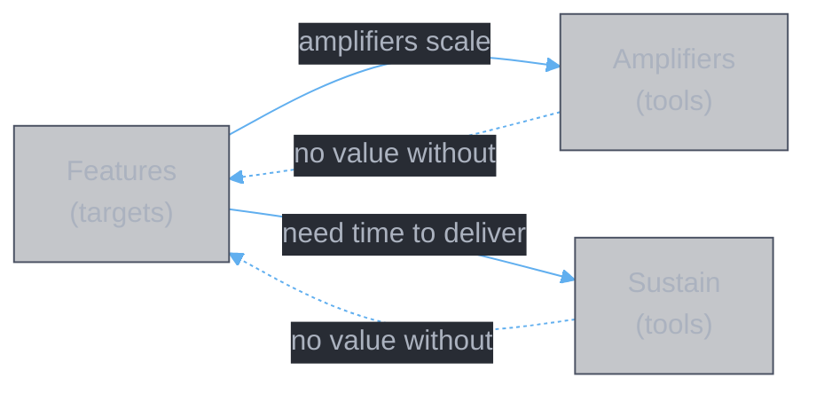

# Weapon Support Taxonomy

**Authors:** Z. Zhang & Claude Opus 4.6 (Anthropic)

When the 灵書 set's primary route is **weapon support** (Route 2), the build's components divide into three layers: **features**, **amplifiers**, and **sustain**. Features are the targets — what the set must deliver. Amplifiers and sustain are tools that enhance feature value or buy time for features to work.

This taxonomy sits above the [function catalog](function.themes.md). Functions tell you *what effects exist*; this taxonomy tells you *what role each effect plays* in a weapon-support build.

---

## Layer 1: Features

Features are what the weapon system needs from the 灵書 set. Each feature directly enables or increases weapon damage output. Features are the **targets** — slot objectives should map to features.

| Feature | What it provides to weapons | Function mapping |
|:--------|:---------------------------|:-----------------|
| **Buff (增益)** | Stat increases that weapon hits scale from (e.g. +280% atk) | F_buff |
| **Debuff (减益)** | Enemy takes more damage from all sources (e.g. 结魂锁链) | Part of F_burst (native debuff platforms) |
| **Anti-defense (破防)** | Remove shields/mitigation blocking weapon hits | F_exploit |
| **Reduction shred (减免破除)** | Negate enemy damage reduction (e.g. 命損 -100%) | F_dr_remove |
| **Weapon interface (武器联动)** | Direct interaction with weapon procs/mechanics (e.g. 奇能诡道) | Not in function catalog — emerges from specific aux affixes |
| **Clone/doubling (分身)** | Duplicate the weapon system itself (e.g. 春黎 clone 16s) | Part of F_burst (春黎 native) |
| **Heal suppression (治疗压制)** | Prevent enemy from outhealing weapon damage | F_antiheal |

### Feature characteristics

- Each feature has a **temporal window** — when it's active and which weapon hits it covers
- Features are **composable** — buff + debuff + anti-defense can stack on the same weapon hit
- A slot's objective should name 1-2 features, not more
- Features without amplifiers still work; amplifiers without features do nothing

---

## Layer 2: Amplifiers

Amplifiers make features stronger. They do not provide value on their own — they multiply the value of existing features.

| Amplifier | What it does | How it serves features |
|:----------|:-------------|:----------------------|
| **Damage amp (伤害加深)** | Multiplicative scaling on all damage output (e.g. 魔劫 +205%) | Scales every feature's damage contribution |
| **Duration extension (延续)** | Stretch feature windows to cover more weapon hits (e.g. 真言不灭 +55%) | More weapon hits benefit from the feature |
| **Stack multiplication (叠层)** | Duplicate debuff/buff stacks (e.g. 心魔惑言 x2) | More stacks for per-stack features (结魂锁链, 索心真诀) |

---

## Layer 3: Sustain

Sustain buys time for features and weapons to deliver their value.

| Sustain type | What it does | Function mapping |
|:-------------|:-------------|:-----------------|
| **Defense (防御)** | Stat-based mitigation, counter-heal (e.g. 不灭魔体 8%) | F_survive |
| **Healing (治疗)** | Active HP recovery (e.g. 天光虹露 +190% healing) | F_sustain |
| **Disruption (干扰)** | Stat shred on enemy, reduce incoming pressure (e.g. 天人五衰 -50% crit) | Part of debuff feature, dual-purpose |

### Sustain characteristics

- Even in high-offense builds, some sustain is needed — a dead player's weapons stop firing
- Disruption is dual-purpose: it weakens the enemy (feature-like) while reducing incoming pressure (sustain-like)
- Classification follows the **primary purpose** in context

---

## Layer Interactions

- Features without amplifiers still work; amplifiers without features do nothing
- Features without sustain may not have time to deliver; sustain without features delivers nothing
- Some components serve dual roles — classification follows primary purpose in context

---

## Relationship to Other Models

| Model | Relationship |
|:------|:------------|
| [Function catalog](function.themes.md) | Functions are the atomic units; features are composed from functions |
| [Combat model](combat.qualitative.md) | Damage chain and factor zones; features map to specific zones in the chain |
| [Time-series model](impl.time.series.md) | Temporal factor vectors; features have active windows that must align with weapon peaks |
| [Binding quality](impl.binding.quality.md) | Aux pair scoring; amplifier value depends on which feature they're scaling |
