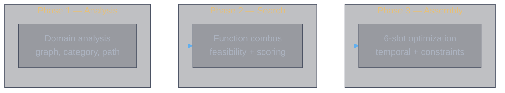
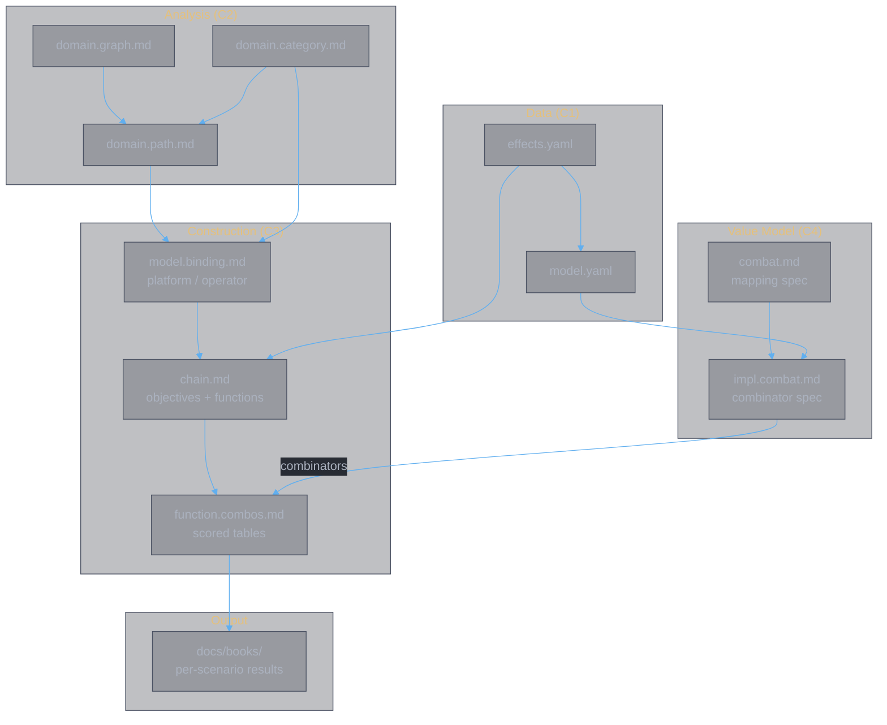

<style>
body {
  max-width: none !important;
  width: 95% !important;
  margin: 0 auto !important;
  padding: 20px 40px !important;
  background-color: #282c34 !important;
  color: #abb2bf !important;
  font-family: -apple-system, BlinkMacSystemFont, "Segoe UI", Helvetica, Arial, sans-serif !important;
  line-height: 1.6 !important;
  -webkit-print-color-adjust: exact !important;
  print-color-adjust: exact !important;
}

h1, h2, h3, h4, h5, h6 {
  color: #ffffff !important;
}

a {
  color: #61afef !important;
}

code {
  background-color: #3e4451 !important;
  color: #e5c07b !important;
  padding: 2px 6px !important;
  border-radius: 3px !important;
}

pre {
  background-color: #2c313a !important;
  border: 1px solid #4b5263 !important;
  border-radius: 6px !important;
  padding: 16px !important;
  overflow-x: auto !important;
}

pre code {
  background-color: transparent !important;
  color: #abb2bf !important;
  padding: 0 !important;
  border-radius: 0 !important;
  font-size: 13px !important;
  line-height: 1.5 !important;
}

table {
  border-collapse: collapse !important;
  width: auto !important;
  margin: 16px 0 !important;
  table-layout: auto !important;
  display: table !important;
}

table th,
table td {
  border: 1px solid #4b5263 !important;
  padding: 8px 10px !important;
  word-wrap: break-word !important;
}

table th:first-child,
table td:first-child {
  min-width: 60px !important;
}

table th {
  background: #3e4451 !important;
  color: #e5c07b !important;
  font-size: 14px !important;
  text-align: center !important;
}

table td {
  background: #2c313a !important;
  font-size: 12px !important;
  text-align: left !important;
}

blockquote {
  border-left: 3px solid #4b5263 !important;
  padding-left: 10px !important;
  color: #5c6370 !important;
  background-color: #2c313a !important;
}

strong {
  color: #e5c07b !important;
}
</style>

# Book Construction Notes

**Authors:** Z. Zhang

> Quick reference for the book construction process: how to go from game data to optimized 6-slot book sets. For data pipeline operations, see [`docs/data/note.data.md`](data/note.data.md). For system design, see [`docs/data/design.md`](data/design.md).

---

## 1. Overview

A **book set** is 6 ordered skill slots. Each slot is a 灵書 constructed from a main book (platform) plus two auxiliary affixes. The goal: given a scenario, find the 6-slot composition that maximizes win probability.

The process has three phases:



| Phase | Question | Tools | Output |
|:------|:---------|:------|:-------|
| **Analysis** | What connects to what? | Domain docs + `verify-domain` | Qualified paths, provides/requires |
| **Search** | Which operator pairs work per slot? | `function-combos.ts` + combinators | Scored combo tables |
| **Assembly** | Which 6 combos maximize the full set? | Combinator 3 + constraints | Book set composition |

---

## 2. Prerequisites

The data pipeline must be complete before construction. See [`note.data.md` §3](data/note.data.md) for the full workflow.

| Artifact | Produced by | Required for |
|:---------|:------------|:-------------|
| `effects.yaml` | `bun app/parse.ts` | Combo search, factor mapping |
| `model.yaml` | `bun app/map.ts` | Scoring (combinators) |
| `groups.yaml` | `bun app/parse.ts` | Group classification |

Verify with `bash scripts/run-verify.sh` — zero errors required.

---

## 3. Phase 1 — Domain Analysis

Domain analysis is scenario-independent. It maps the structural relationships between effect types, affixes, and platforms. Done once; updated only when game data changes.

### Step 1 — Graph

Read all effect types and formalize their dependency network: terminals (player A/B), connectors (effect types), ports (input/output), bridges (resource conversion), feedback loops.

**Doc:** [`domain.graph.md`](data/domain.graph.md)

### Step 2 — Category

Classify all 61 affixes by provides/requires bindings. Each affix declares what target categories it provides (T1–T10) and what it requires from the platform or other affixes.

**Doc:** [`domain.category.md`](data/domain.category.md) | **Code:** `lib/domain/bindings.ts`

### Step 3 — Qualified paths

Project the graph into book space. Enumerate every valid chain — a path through the dependency network where all nodes have their inputs satisfied by concrete affixes on concrete platforms.

**Doc:** [`domain.path.md`](data/domain.path.md)

### Verification

```sh
bun run verify-domain
```

Checks binding accuracy, platform coverage, named entities, and provider claims against TypeScript source of truth.

---

## 4. Phase 2 — Combo Search

For each platform, find the best operator pairs (auxiliary affixes) that serve a given function.

### Step 4 — Define objectives

A scenario determines what the 6 slots must accomplish. Each slot gets an **objective** (what to achieve) mapped to a **function** (how to achieve it).

**Doc:** [`chain.md` §C–§D](data/chain.md)

10 functions are defined:

| Function | Purpose | Platforms |
|:---------|:--------|:----------|
| `F_burst` | Maximize single-slot damage | All 9 |
| `F_dr_remove` | Remove/bypass enemy DR | All |
| `F_buff` | Persistent team stat buff | 甲元仙符, 十方真魄 |
| `F_hp_exploit` | Convert own HP loss → damage | All |
| `F_antiheal` | Suppress enemy healing | All |
| `F_survive` | CC cleanse + damage reduction | 十方真魄 |
| `F_truedmg` | True damage from debuff stacks | All |
| `F_exploit` | Secondary %maxHP damage | 千锋聚灵剑, 皓月剑诀 |
| `F_dot` | Sustained DoT damage | All |
| `F_counter` | Reflect enemy attacks | 疾风九变 |
| `F_sustain` | Lifesteal + heal amplification | All |

**Code:** `lib/domain/functions.ts`

### Step 5 — Enumerate combos

For each function × platform, enumerate all feasible operator pairs. Feasibility = provides/requires satisfied + correct school constraints.

```sh
bun app/function-combos.ts --fn F_burst --platform 千锋聚灵剑 --top 20
bun app/function-combos.ts --list                   # list all functions
bun app/function-combos.ts                           # all functions × all platforms
```

Scoring: D_skill from the value model (Combinators 1–2), with zone count as tiebreaker.

**Code:** `lib/domain/functions.ts`, `lib/domain/amplifiers.ts`, `lib/domain/chains.ts`

### Step 6 — Score combos

For each combo, compute $D_{skill}$ via the value model:

1. **Combinator 1** — aggregate effect factors per affix (`model.yaml` → affix vector)
2. **Combinator 2** — combine platform + operator affixes → book factor vector → evaluate damage chain

This produces a scalar $D_{skill}$ per combo, enabling direct numeric comparison.

**Code:** `lib/model/combinators.ts`, `lib/model/model-data.ts` | **Spec:** [`impl.combat.md` §3–§4](model/impl.combat.md)

---

## 5. Phase 3 — Assembly

Compose 6 scored books into an optimized book set.

### Step 7 — Temporal composition

Cross-slot effects (buffs, debuffs with duration) propagate forward. A buff cast in slot 1 may still be active in slot 2. Combinator 3 handles this:

$$\mathbf{b}_k^{eff} = \mathbf{b}_k + \sum_{j < k} \mathbf{t}_j \cdot \mathbb{1}\!\left[d_j > (k - j) \times T_{gap}\right]$$

**Spec:** [`impl.combat.md` §5](model/impl.combat.md) | **Schema:** `lib/schemas/bookset.model.ts`

### Step 8 — Construction constraints

Validate against game rules (`data/raw/构造规则.md`):

- Each main book used at most once across the 6 slots
- School affixes must match the aux book's school
- Aux affixes scale with the aux book's 融合重数 (not the main's)
- Main affix requires main book's 悟境 — locked without it

**Code:** `lib/domain/constraints.ts`

### Step 9 — Optimize

Search over slot assignments to maximize the regime parameter sequence:

$$\mathcal{R} = \left\{ \left( t_k, \mu_A^{(k)}, \sigma_A^{(k)}, \mu_B^{(k)}, \sigma_B^{(k)} \right) \right\}_{k=1}^{6}$$

This feeds into win probability via [theory.combat.md](abstractions/theory.combat.md).

---

## 6. Current Status

| Component | Status | Location |
|:----------|:-------|:---------|
| Domain analysis (graph, category, path) | Done | `docs/data/domain.*.md` |
| Binding model (provides/requires) | Done | `lib/domain/bindings.ts` |
| Function definitions | Done | `lib/domain/functions.ts` |
| Combo enumeration (feasibility) | Done | `app/function-combos.ts` |
| Zone-count scoring (heuristic) | Done | `lib/domain/amplifiers.ts` |
| Effect → factor map | Done | `app/map.ts` → `model.yaml` |
| Combinator 1 (effects → affix) | Done | `lib/model/combinators.ts` |
| Combinator 2 (affixes → book) | Done | `lib/model/combinators.ts` |
| Combinator 3 (books → book-set) | **TODO** | spec: `impl.combat.md` §5 |
| Construction constraints | Done | `lib/domain/constraints.ts` |
| 6-slot optimizer | **TODO** | — |

**Next:** Construct a book using the scored combos. Combinator 3 (temporal composition) and 6-slot optimizer follow.

---

## 7. Document Map



| Doc | Container | Role |
|:----|:----------|:-----|
| [`note.data.md`](data/note.data.md) | C1 | Data pipeline operations |
| [`domain.graph.md`](data/domain.graph.md) | C2 | Effect type dependency network |
| [`domain.category.md`](data/domain.category.md) | C2 | Affix taxonomy (61 affixes, provides/requires) |
| [`domain.path.md`](data/domain.path.md) | C2 | Qualified paths through the network |
| [`model.binding.md`](data/model.binding.md) | C3 | Platform + operator binding contracts |
| [`chain.md`](data/chain.md) | C3 | Objectives, functions, scoring framework |
| [`function.combos.md`](data/function.combos.md) | C3 | Per-function × per-platform combo tables |
| [`combat.md`](model/combat.md) | C4 | Effect → factor mapping rules |
| [`impl.combat.md`](model/impl.combat.md) | C4 | Map + combinator implementation spec |
| [`guide.chain.md`](books/guide.chain.md) | — | How-to guide for the 4-stage analytical process |
