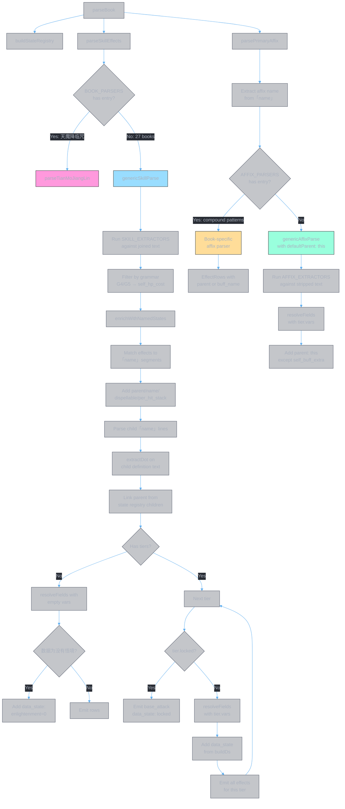

>Note: 天魔降临咒 is the only book still using a hand-written skill parser. Its skill has a unique dual-target pattern (结魂锁链 acts as both self_buff and debuff simultaneously) that the extractors don't handle.

>See [note.exclusive.md](note.exclusive.md) for the full generic affix pipeline walkthrough and override inventory.