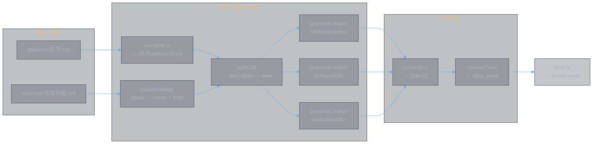
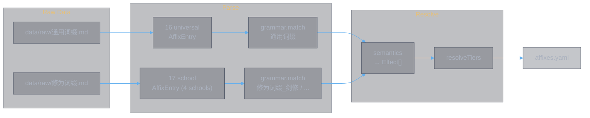
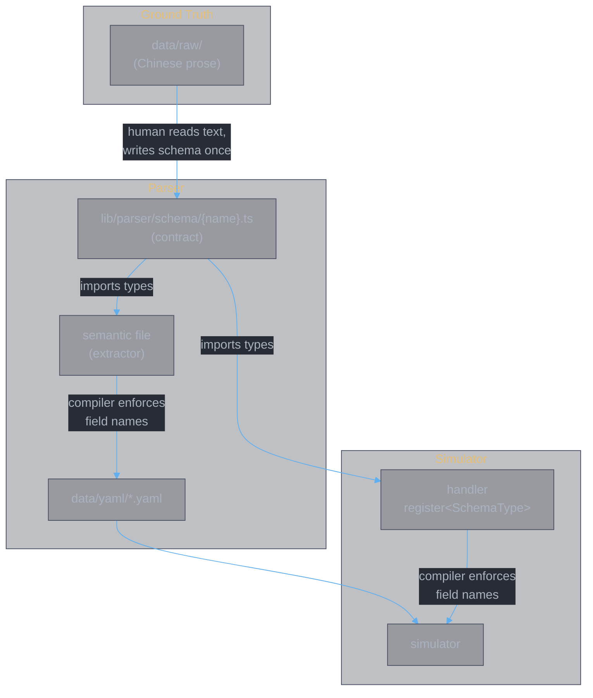
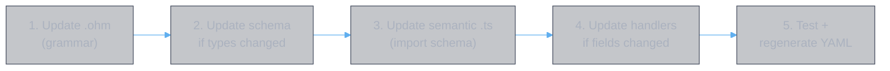

<style>
body {
  max-width: none !important;
  width: 95% !important;
  margin: 0 auto !important;
  padding: 20px 40px !important;
  background-color: #282c34 !important;
  color: #abb2bf !important;
  font-family: -apple-system, BlinkMacSystemFont, "Segoe UI", Helvetica, Arial, sans-serif !important;
  line-height: 1.6 !important;
  -webkit-print-color-adjust: exact !important;
  print-color-adjust: exact !important;
}

h1, h2, h3, h4, h5, h6 {
  color: #ffffff !important;
}

a {
  color: #61afef !important;
}

code {
  background-color: #3e4451 !important;
  color: #e5c07b !important;
  padding: 2px 6px !important;
  border-radius: 3px !important;
}

pre {
  background-color: #2c313a !important;
  border: 1px solid #4b5263 !important;
  border-radius: 6px !important;
  padding: 16px !important;
  overflow-x: auto !important;
}

pre code {
  background-color: transparent !important;
  color: #abb2bf !important;
  padding: 0 !important;
  border-radius: 0 !important;
  font-size: 13px !important;
  line-height: 1.5 !important;
}

table {
  border-collapse: collapse !important;
  width: auto !important;
  margin: 16px 0 !important;
  table-layout: auto !important;
  display: table !important;
}

table th,
table td {
  border: 1px solid #4b5263 !important;
  padding: 8px 10px !important;
  word-wrap: break-word !important;
}

table th:first-child,
table td:first-child {
  min-width: 60px !important;
}

table th {
  background: #3e4451 !important;
  color: #e5c07b !important;
  font-size: 14px !important;
  text-align: center !important;
}

table td {
  background: #2c313a !important;
  font-size: 12px !important;
  text-align: left !important;
}

blockquote {
  border-left: 3px solid #4b5263 !important;
  padding-left: 10px !important;
  color: #5c6370 !important;
  background-color: #2c313a !important;
}

strong {
  color: #e5c07b !important;
}
</style>

# Parser Workflow — From Raw Data to Simulator

---

## §1 Generate YAML

Two commands produce the two YAML files the simulator consumes:

```bash
# Books: skill effects + primary affixes + exclusive affixes (28 books)
bun app/parse-main-skills.ts -o data/yaml/books.yaml

# Affixes: common (16) + school (17) affixes
bun app/parse-affixes.ts -o data/yaml/affixes.yaml
```

Both read from `data/raw/` and write to `data/yaml/`. The simulator loads these at runtime.

---

## §2 Pipeline: books.yaml



**Text cleaning** (before grammar match):
- Strip backticks (raw data uses `` `增益` `` for emphasis)
- Strip `【name】：` prefix from affix text
- Strip editorial notes: `（最高不超过N级）`, `（N层达到最大...）`, `（数据为没有悟境的情况）`
- Unescape `\*` → `*`
- Book name dash: `新-青元剑诀` → lookup as `新青元剑诀`

**Tier resolution**:
- Each tier line like `悟0境：x=1500, y=11` defines variable values
- Effects with string vars (`total: "x"`) get resolved (`total: 1500`)
- Each resolved effect gets `data_state: "enlightenment=0"` or `data_state: ["enlightenment=10", "fusion=51"]`

---

## §3 Pipeline: affixes.yaml



School name mapping: `Sword→剑修, Spell→法修, Demon→魔修, Body→体修`

---

## §4 Schema — The Shared Contract



33 schema files in `lib/parser/schema/` (28 books + 5 affixes). Each defines:
- One TypeScript interface per effect type the book/affix produces
- Field names derived from the raw Chinese text meaning
- `type V = string | number` — string before tier resolution, number after
- JSDoc with the raw Chinese phrase each field maps to
- Aggregate types: `SkillEffect`, `PrimaryAffixEffect`, `ExclusiveAffixEffect`, `Effect`

### How it works

1. **Semantic file** imports schema types and uses typed `const effect: SchemaType = { ... }` — wrong field names are compile errors
2. **Handler** uses `register<SchemaType>("type_name", (effect) => { ... })` — field access is type-checked
3. **Both sides** reference the same interfaces — a mismatch between extractor and handler is impossible

### Shared types across books

Many books share effect types (e.g., `BaseAttack` appears in all 28). When multiple books use the same type with the same fields, they import from the first schema that defined it:

```typescript
// lib/parser/schema/春黎剑阵.ts
export { BaseAttack } from "./千锋聚灵剑.js";
```

If a book uses a variation with different fields, it defines a new interface.

---

## §5 Verify

After regeneration, verify the YAML:

```bash
# Check books.yaml
bun -e "
const yaml=require('yaml');
const fs=require('fs');
const d=yaml.parse(fs.readFileSync('data/yaml/books.yaml','utf-8'));
const books=Object.keys(d.books);
console.log(books.length, 'books');
for(const [n,b] of Object.entries(d.books)){
  const sk=(b as any).skill?.length??0;
  const pa=(b as any).primary_affix?.effects?.length??0;
  const ea=(b as any).exclusive_affix?.effects?.length??0;
  if(sk===0) console.log('  WARNING: no skill effects for', n);
}
"

# Check affixes.yaml
bun -e "
const yaml=require('yaml');
const fs=require('fs');
const d=yaml.parse(fs.readFileSync('data/yaml/affixes.yaml','utf-8'));
console.log(Object.keys(d.universal).length, 'universal affixes');
let s=0;
for(const v of Object.values(d.school)) s+=Object.keys(v as any).length;
console.log(s, 'school affixes');
"
```

---

## §6 Run Simulator

The simulator reads both YAML files:

```typescript
// lib/sim/config.ts
loadBooksYaml("data/yaml/books.yaml")     // → BooksYaml
loadAffixesYaml("data/yaml/affixes.yaml") // → AffixesYaml
```

---

## §7 Full Rebuild

When raw data changes:

```bash
# 1. Regenerate YAML
bun app/parse-main-skills.ts -o data/yaml/books.yaml
bun app/parse-affixes.ts -o data/yaml/affixes.yaml

# 2. Verify
bun test lib/parser/grammars/   # 122 grammar + semantic tests
bun run check                   # typecheck + lint

# 3. Run simulator tests
bun test lib/sim/
```

---

## §8 When to Update

### Raw text changes for an existing book



### Adding a new book

```mermaid
%%{init: {'theme': 'base', 'themeVariables': {'primaryColor': '#3e44514D', 'primaryTextColor': '#abb2bf', 'primaryBorderColor': '#4b5263', 'lineColor': '#61afef', 'secondaryColor': '#2c313a4D', 'secondaryTextColor': '#abb2bf', 'secondaryBorderColor': '#4b5263', 'tertiaryColor': '#282c344D', 'mainBkg': '#3e44514D', 'nodeBorder': '#4b5263', 'clusterBkg': '#2c313a4D', 'clusterBorder': '#4b5263', 'titleColor': '#e5c07b', 'edgeLabelBackground': '#282c34', 'textColor': '#abb2bf', 'background': '#282c34'}}}%%
flowchart LR
    A["1. Read<br/>raw data"] --> B["2. Write schema<br/>schema/{name}.ts"]
    B --> C["3. Write grammar<br/>.ohm file"]
    C --> D["4. Write semantic<br/>(import schema)"]
    D --> E["5. Write handler<br/>register&lt;Schema&gt;"]
    E --> F["6. Test +<br/>YAML"]
```



### Adding a new effect type

1. Define the interface in the relevant schema file
2. Add JSDoc with the raw Chinese phrase
3. Update the semantic file to produce it
4. Write a handler with `register<SchemaType>`
5. The compiler ensures both sides agree on field names
