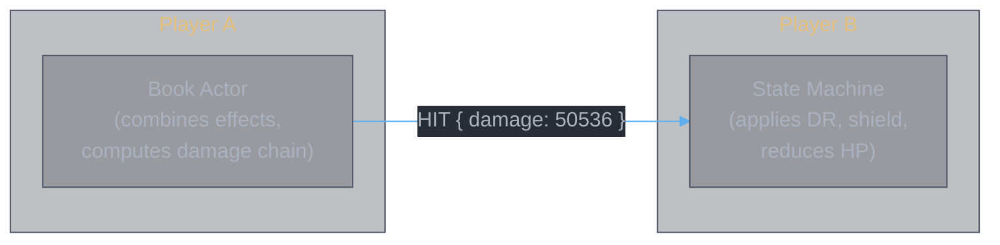
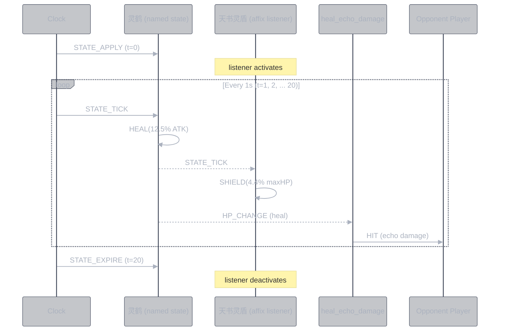
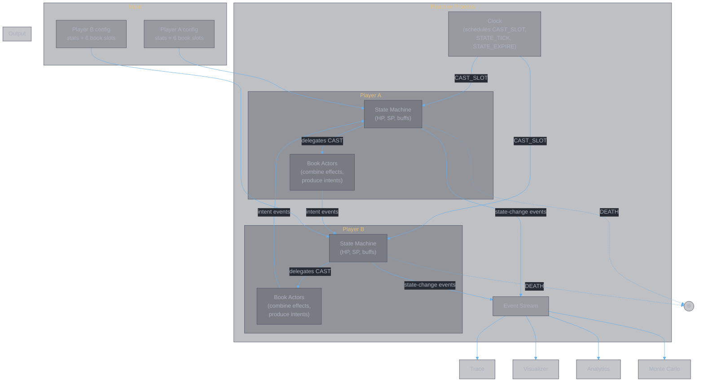

<style>
body {
  max-width: none !important;
  width: 95% !important;
  margin: 0 auto !important;
  padding: 20px 40px !important;
  background-color: #282c34 !important;
  color: #abb2bf !important;
  font-family: -apple-system, BlinkMacSystemFont, "Segoe UI", Helvetica, Arial, sans-serif !important;
  line-height: 1.6 !important;
  -webkit-print-color-adjust: exact !important;
  print-color-adjust: exact !important;
}

h1, h2, h3, h4, h5, h6 {
  color: #ffffff !important;
}

a {
  color: #61afef !important;
}

code {
  background-color: #3e4451 !important;
  color: #e5c07b !important;
  padding: 2px 6px !important;
  border-radius: 3px !important;
}

pre {
  background-color: #2c313a !important;
  border: 1px solid #4b5263 !important;
  border-radius: 6px !important;
  padding: 16px !important;
  overflow-x: auto !important;
}

pre code {
  background-color: transparent !important;
  color: #abb2bf !important;
  padding: 0 !important;
  border-radius: 0 !important;
  font-size: 13px !important;
  line-height: 1.5 !important;
}

table {
  border-collapse: collapse !important;
  width: auto !important;
  margin: 16px 0 !important;
  table-layout: auto !important;
  display: table !important;
}

table th,
table td {
  border: 1px solid #4b5263 !important;
  padding: 8px 10px !important;
  word-wrap: break-word !important;
}

table th:first-child,
table td:first-child {
  min-width: 60px !important;
}

table th {
  background: #3e4451 !important;
  color: #e5c07b !important;
  font-size: 14px !important;
  text-align: center !important;
}

table td {
  background: #2c313a !important;
  font-size: 12px !important;
  text-align: left !important;
}

blockquote {
  border-left: 3px solid #4b5263 !important;
  padding-left: 10px !important;
  color: #5c6370 !important;
  background-color: #2c313a !important;
}

strong {
  color: #e5c07b !important;
}
</style>

# Reactive Design Principles

**Authors:** Z. Zhang & Claude Opus 4.6 (Anthropic)

> **This document is invariant.** It defines what the combat simulator is, how it is structured, and how it behaves. Two prior attempts failed because imperative thinking was applied to a fundamentally reactive problem. This document exists to prevent that from happening again.

---

## 1. What the Simulator Is

The simulator is a **player-state-event generator**.

$$f(\text{PlayerConfig} \times \text{PlayerConfig} \times \text{BookSets} \times \text{Schedule}) \to \text{EventStream}$$

**Input:** Two players, each with base attributes (HP, ATK, SP, DEF), progression (悟境, 融合), and a book set (six divine books, each combining a platform with auxiliary affixes).

**Output:** An ordered stream of state-change events describing how both players' combat states mutate over time, from the first cast to the absorbing boundary (DEATH) or the end of the schedule.

The simulator produces **only** this event stream. Winner, damage breakdown, trace, win rate — all derived by subscribers. The simulator does not compute results. It generates the process.

---

## 2. Two Levels

The simulator has two levels with distinct responsibilities. Confusing them is the source of every architectural mistake in this project.

### Player: State Machine

The player is a **state machine**. It manages combat state: HP, SP, shield, buffs, debuffs, named states. It resolves incoming intent events against its own state. It emits state-change events. It reaches the absorbing boundary when HP ≤ 0.

The player does not know about damage chains, multiplicative zones, effect combination, or book data. It receives intents and reacts.

### Book: Actor

Each divine book is an **actor** owned by the player. A divine book combines effects from all its sources — main skill, primary affix, exclusive affix, and auxiliary affixes — into intent events.

The book actor does not manage combat state. It reads its effect data, computes the damage chain (zones, escalation, resonance), and produces intent events. It sends these intents directly to the opponent's player state machine.

```
Player State Machine (manages HP, SP, buffs — resolves intents)
  ├── Book Actor slot 1 (combines effects — produces intents)
  ├── Book Actor slot 2
  ├── ...
  └── Book Actor slot 6

Book Actor → sends intent events → Opponent's Player State Machine
```

The player resolves intents. The book produces intents. These are separate levels. The player never touches the damage chain. The book never touches combat state.

---

## 3. Intent Events

An intent event is a message from a book actor to the opponent's player state machine. It carries **what the source wants to do**, computed entirely from the source's own state. The source never reads the target's state.

The target resolves the intent against its own state (DR, shield, HP). The source never knows the result.



If an effect depends on the target's state (like %maxHP damage depending on target's maxHp), the intent carries the **formula parameter** (the percentage). The target computes the final value from its own state.

---

## 4. State-Change Events

When the player state machine resolves an intent and mutates its own state, it emits a **state-change event**. These events flow to all subscribers — internal (reactive affix listeners, death detection) and external (trace formatter, visualizer, analytics).

Every state mutation produces an event. If a mutation is silent, it does not exist.

State-change events are the simulator's output. External apps subscribe to them. The same event stream drives the visualization, the trace log, the Monte Carlo aggregator.

---

## 5. Named States as Event Emitters

A named state (灵鹤, 罗天魔咒, 寂灭剑心) is not a flag. It is an **event emitter**. During its lifetime it emits:

| Event | When |
|:------|:-----|
| STATE_APPLY | Created on the player |
| STATE_TICK | Periodic interval (per_tick) |
| STATE_TRIGGERED | Reactive condition (on_attacked, on_cast) |
| STATE_EXPIRE | Duration ends or removed |

Book actors register **reactive listeners** on named states via the `parent` field. When a named state emits an event, the listener reacts by producing new intent events.



The cascade emerges from the subscriptions. No component orchestrates it.

---

## 6. DEATH: The Absorbing Boundary

DEATH is the **absorbing boundary** of the event process — the `final` state of the player's state machine.

Death is **deferred** to ensure simultaneous fairness: both players at the same time step must complete their casts before either can die. HP may reach zero during hit resolution, but the player continues processing events until `CHECK_DEATH` is received (sent by the arena after each time step). On `CHECK_DEATH`, if HP ≤ 0, the player transitions to the `dead` final state — no further events are produced or consumed.

This prevents first-mover advantage: if both players' hits arrive at the same time, both resolve fully before either dies.

---

## 7. Time as Events

There is no game loop. The virtual clock is a priority queue of timed events. When the clock advances, events fire in time order. Each event triggers reactions that may schedule further events.

The cast schedule, state expiry, DoT ticks, SP regeneration — all are timed events on the clock. The fight emerges from event cascades, not from step-by-step iteration.

---

## 8. How a Book Actor Produces Intents

When the player state machine receives CAST_SLOT, it delegates to the book actor for that slot. The book actor:

1. **Gathers** all effects from its sources (skill, primary affix, exclusive affix, aux affixes)
2. **Selects tiers** per source based on the player's progression — effects of the same type from different sources are independent, never deduped across sources
3. **Separates** direct effects (`parent: "this"`) from reactive effects (`parent: "<state_name>"`)
4. **Runs handlers** on direct effects → collects zone contributions (S_coeff, M_dmg, M_skill, M_final, M_synchro), per-hit escalation, resonance SP damage, per-hit effects, and non-damage intents
5. **Computes the damage chain**: `D_base × (1 + S_coeff) × (1 + M_dmg) × (1 + M_skill) × (1 + M_final) × M_synchro + D_flat` → produces one HIT intent per hit. $D_{flat}$ is additive (x% of player ATK, not scaled by zones).
6. **Sends** each intent directly to the opponent's player state machine
7. **Registers** reactive listeners for parent-based effects on its own player state machine

The book actor sends intents directly. It does not store them, return them, or pass them through the player.

---

## 9. How the Player State Machine Resolves a HIT

When a HIT intent arrives at the player state machine:

1. **DR** — `baseDR = DEF / (DEF + K)` + buff-based DR
2. **Mitigate** — `mitigated = damage × (1 - totalDR)`
3. **SP → shield** — `spConsumed = min(SP, mitigated / sp_shield_ratio)`, `shield = spConsumed × sp_shield_ratio`, `SP -= spConsumed`
4. **HP** — `hp -= mitigated - shield` → emit HP_CHANGE
5. **Resonance** — `sp -= spDamage` → emit SP_CHANGE
6. **Per-hit effects** — resolve each (e.g., PERCENT_MAX_HP_HIT: `damage = percent% × own maxHp` → apply DR → SP shield → HP)
7. **Triggers** — fire on_attacked listeners → may produce new intent events

Each step is a reaction. Each reaction may emit state-change events. Each state-change event may trigger further reactions. The chain continues until no more reactions fire. Death is deferred — see §6.

---

## 10. Anti-Patterns

These patterns killed the prior attempts. Each represents an imperative instinct and its reactive correction:

| Imperative instinct | Reactive correction |
|:---------------------|:-------------------|
| "The book is a function called by the player" | The book is an actor. It reacts to CAST by producing intents via sendTo. The player delegates, not calls. |
| "The player computes the damage chain" | The book actor computes the damage chain. The player only resolves intents (DR, shield, HP). |
| "Store pendingHits for the arena to deliver" | Book actors send intents directly to the opponent's player state machine. No storing, no intermediary. |
| "The player resolves an intent: step 1, step 2, step 3" | Each step is a reaction. HIT → DR reacts → SP reacts → shield reacts → HP reacts → triggers react. |
| "After reducing HP, check if the player is dead" | DEATH is deferred to CHECK_DEATH (sent per time step). Both players at the same time must finish before either dies. |
| "Named state active = true/false" | Named state emits lifecycle events. Listeners subscribe. Presence is expressed through events, not flags. |
| "The arena manages the fight" | The arena is a clock. It schedules CAST_SLOT. Players and books handle everything else. |
| "The simulator computes the winner" | The simulator produces an event stream. A subscriber observes DEATH and derives the winner. |

---

## Summary



Configuration enters from the top. The clock schedules cast events. Players delegate to their book actors. Book actors produce intents and send them to the opponent's state machine. State machines resolve intents and emit state-change events into the output stream. Subscribers derive whatever they need. When either player reaches the absorbing boundary, the process terminates.

---

## Document History

| Version | Date | Changes |
|---------|------|---------|
| 1.0 | 2026-03-16 | Initial draft |
| 2.0 | 2026-03-16 | Added SP system, per-hit model, reactive affixes, event model |
| 3.0 | 2026-03-16 | Rewrote §2 (two levels), §5 (player + book), anti-patterns |
| 4.0 | 2026-03-17 | **Full rewrite from scratch.** Clean 10-section structure. Two levels: player state machine + book actor. No patches — written from corrected understanding. |
| 4.1 | 2026-03-18 | D_flat formula corrected: additive after zones, not inside base. |
| 4.2 | 2026-03-18 | §6 DEATH rewritten: deferred via CHECK_DEATH per time step for simultaneous fairness. §9 hit resolution updated with consumable SP model. Anti-pattern updated. |
