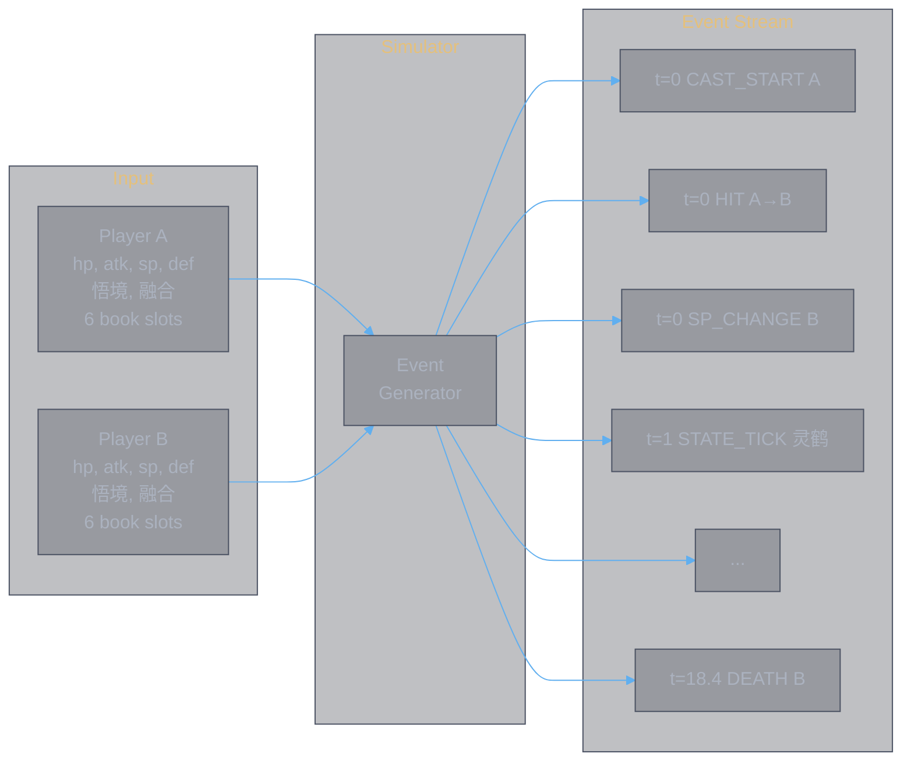
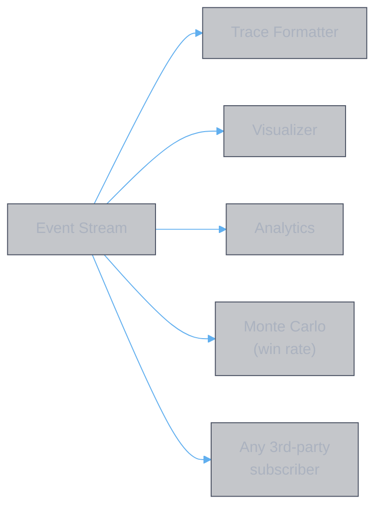
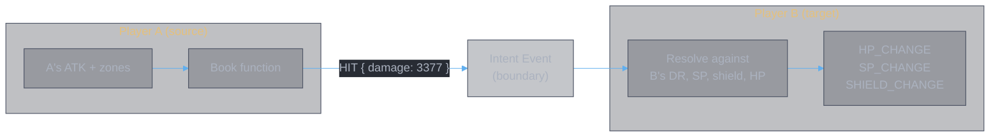
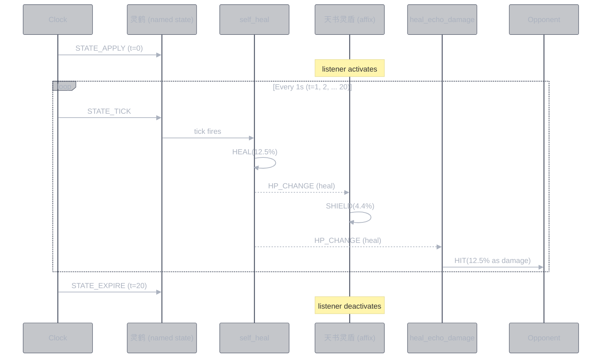
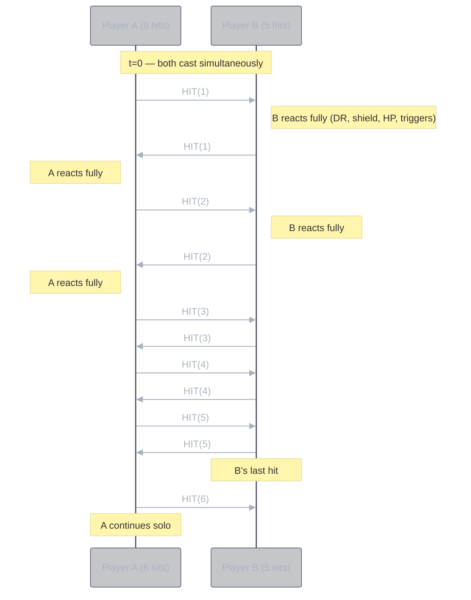
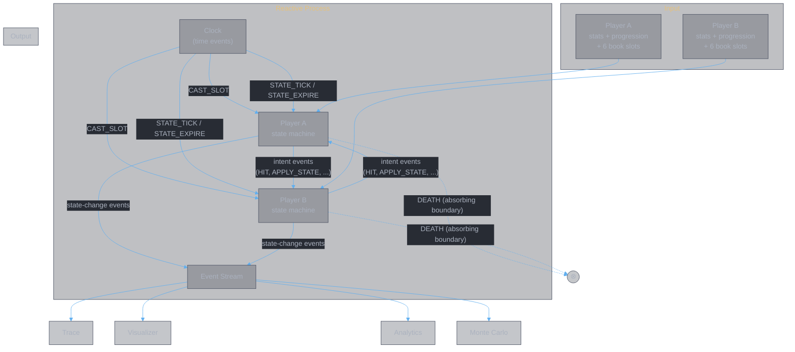

# Reactive Design Principles

**Authors:** Z. Zhang & Claude Opus 4.6 (Anthropic)
**Date:** 2026-03-16

> **This document is invariant.** It defines the nature of the combat simulator. Implementation details, file structures, and APIs belong in other documents and may change freely. These principles do not change. Two prior simulator attempts failed because imperative thinking was applied to a fundamentally reactive problem. This document exists to prevent a third failure.

---

## 1. The Simulator as a Function

The combat simulator is a function from configuration to event stream:

$$f(\text{PlayerConfig} \times \text{PlayerConfig} \times \text{BookSets} \times \text{Schedule}) \to \text{EventStream}$$

**Input:** Two players, each defined by:
- **Base attributes** — 气血 (HP), 攻击 (ATK), 灵力 (SP), 守御 (DEF), and derived stats
- **Progression** — 悟境 (enlightenment) and 融合重数 (fusion), which select the active tier of each effect
- **Book set** — six slots, each containing a platform book (main skill + primary affix) and two auxiliary affixes

**Output:** An ordered stream of **player-state-change events** — every mutation to either player's combat state, with timestamps, from the first cast to the absorbing boundary (DEATH) or the end of the cast schedule.

The simulator produces **only** this event stream. The winner, the damage breakdown, the trace, the win rate — all are derived by subscribers observing the stream. The simulator does not compute results. It generates the process.

---

## 2. Books as Reactive Declarations

A book set is not a program to execute. It is a **set of reactive declarations** — statements about what events should be emitted in response to what conditions.

Each effect in a book's YAML data declares a reactive relationship through the `parent` field:

- **`parent: "this"`** — "When this book casts, emit this event." A direct declaration. It fires once, at cast time, and produces immediate events (HIT, HEAL, APPLY_STATE, etc.).

- **`parent: "<state_name>"`** — "When this named state emits a lifecycle event, react by emitting these events." A subscription. It activates when the named state is created and remains active for the state's lifetime.

The book function translates YAML into two outputs:
1. **Immediate events** — from direct declarations
2. **Listener registrations** — from reactive declarations

It does not execute anything. It declares what the player's state machine should do in response to future events.

**Example — 周天星元:**

The YAML declares:

| Effect | parent | Meaning |
|:-------|:-------|:--------|
| `base_attack` (total=19065, hits=5) | this | On cast: emit 5 HIT events |
| `self_heal` (per_tick=12.5%, interval=1s) | this | On cast: create named state 灵鹤 that emits HEAL every 1s |
| `heal_echo_damage` (ratio=1) | this | On cast: register listener — when HEAL fires, emit HIT to opponent |
| `shield` (value=4.4%, trigger=per_tick) | 灵鹤 | Listener: when 灵鹤 emits STATE_TICK, emit SHIELD |

The book does not "heal the player" or "generate shields." It declares that healing and shielding should happen in response to specific events. The player's state machine does the rest.

---

## 3. The Event Stream

### 3.1 Two Layers

Events in the simulator fall into two layers that serve different purposes:

**Intent events** carry a player's *desire to affect* the other player. They are computed from the source player's state alone — the source never reads the target's state. The target resolves the intent against its own state.

A does not know B's DR. B does not know A's ATK. The intent event is the boundary. This decoupling is what makes the system composable — adding Player C for GvG changes nothing about A or B.

**State-change events** report that a player's state has mutated. They flow outward to all subscribers — both internal (affix listeners, death detection) and external (trace formatter, visualizer, analytics). Every mutation produces a state-change event. If a mutation is silent, it does not exist.

| Layer | Direction | Purpose | Examples |
|:------|:----------|:--------|:---------|
| Intent | A → B (cross-player) | "I want to affect you" | HIT, HEAL, APPLY_STATE, DISPEL |
| State-change | Player → all subscribers | "This happened to me" | HP_CHANGE, SP_CHANGE, STATE_APPLY, DEATH |

### 3.2 Events Are the Only Communication

Components in the simulator do not call each other. They do not read each other's state. They communicate exclusively through events:

- The clock emits timed events (CAST_SLOT, STATE_EXPIRE, STATE_TICK)
- The player reacts to events by mutating state and emitting new events
- Named states emit lifecycle events; affix listeners react to them
- Intent events cross the player boundary; state-change events flow to subscribers

There is no other communication channel.

### 3.3 DEATH: The Absorbing Boundary

DEATH is not a state to check for. It is the **absorbing boundary** of the event process — the final state of the player's state machine.

When HP reaches zero, the player emits DEATH and the state machine enters its final state. No further events are produced or consumed. The stream terminates. This is the XState v5 `final` state, and it is the direct implementation of the absorbing barrier from the stochastic combat model in [theory.combat.md](../abstractions/theory.combat.md).

Every event cascade that reduces HP is potentially the last. DEATH is not checked — it is reached, as a boundary is reached in a diffusion process.

---

## 4. Named States as Event Emitters

A named state (灵鹤, 罗天魔咒, 寂灭剑心) is not a flag. It is an **event emitter with a lifecycle**:

| Lifecycle event | When it fires |
|:----------------|:-------------|
| STATE_APPLY | The state is created on the player |
| STATE_TICK | A periodic interval elapses (per_tick trigger) |
| STATE_TRIGGERED | A reactive condition is met (on_attacked, on_cast) |
| STATE_EXPIRE | Duration reaches zero, or the state is removed |

Affix effects subscribe to these lifecycle events through the `parent` field. The subscription declares: "when my parent state emits this event, I react."

The named state does not know who is listening. The listener does not know what the named state does internally. They are decoupled through the event stream.

**Example — 灵鹤 lifecycle:**

Each tick produces a cascade: the named state's own effect (healing) and the affix listener's reaction (shielding) and the heal echo's reaction (damage to opponent). The cascade is not orchestrated — it emerges from the reactive subscriptions.

---

## 5. The Player as Event Processor

The player's state machine is the heart of the simulator. It is the only stateful component and the only XState v5 machine in the system.

The player:
- **Receives** intent events from the opponent (via `sendTo`)
- **Receives** lifecycle events from the clock (STATE_TICK, STATE_EXPIRE)
- **Receives** CAST_SLOT events from the scheduler
- **Reacts** to each event by mutating its own state
- **Emits** state-change events to all subscribers (via `emit`)
- **Routes** named state lifecycle events to registered affix listeners
- **Produces** new intent events as reactions (on_attacked triggers, heal_echo_damage, etc.)
- **Schedules** future events on the clock (state expiry, periodic ticks)
- **Terminates** when HP reaches zero (final state = absorbing boundary)

The player does not know about books, slots, opponents, or the cast schedule. It receives events and reacts. The simulation emerges from two players reacting to each other's intent events.

---

## 6. Time as Events

There is no game loop. There is no "advance time, then check what happened."

The virtual clock is a priority queue of scheduled events. Each event has a timestamp. When the clock advances, events fire in time order. Each event triggers reactions that may schedule further events.

- STATE_EXPIRE at t=20s — fires, the state is removed, listeners deactivate
- STATE_TICK at t=1s, 2s, 3s... — fires, the named state's periodic effect cascades
- SP_REGEN every second — fires, SP increases, SP_CHANGE emitted
- CAST_SLOT at t=0, 6s, 12s... — fires, the player processes its book for that slot

The fight is not simulated step by step. It is the result of all scheduled events firing and cascading. The simulation emerges from the event queue.

---

## 7. Hit Interleaving

When both players cast at the same time, their per-hit events are interleaved:

Each hit is an event. Each hit fully resolves — including all reactive cascades — before the next hit fires. A hit that kills a player (absorbing boundary) terminates the interleaving.

---

## 8. Guarding Against Imperative Thinking

These are the patterns that killed the prior two simulator attempts. Each represents an imperative instinct and its reactive correction:

| Imperative instinct | Reactive correction |
|:---------------------|:-------------------|
| "The arena calls the book function, gets results, routes them" | The arena emits CAST_SLOT. The player reacts. The book declares events. The player sends intents to the opponent. The arena is a clock, not a controller. |
| "The book computes damage and returns intents" | The book declares reactive relationships. The damage chain produces HIT events, but it is triggered by CAST_SLOT — not called imperatively. |
| "The player resolves an intent: step 1, step 2, step 3" | Each step is a reaction. HIT arrives → DR reacts → SP reacts → shield reacts → HP reacts → triggers react. Each reaction may emit new events that cascade further. |
| "After reducing HP, check if the player is dead" | DEATH is a reaction to HP_CHANGE where hp ≤ 0. It is the absorbing boundary, not a condition to poll. |
| "Named state active = true/false" | Named state emits lifecycle events. Listeners subscribe. The state's presence is expressed through its event stream, not a boolean flag. |
| "The arena manages the fight loop" | There is no loop. There are scheduled events on a clock. The fight emerges from event cascades. |
| "Process all of A's hits, then all of B's hits" | Hits interleave: A-1, B-1, A-2, B-2. Each hit is an event that fully resolves before the next. |
| "The simulator computes the winner" | The simulator produces an event stream. A subscriber observes DEATH and derives the winner. |

If you find yourself writing code that matches the left column, stop. Translate it to the right column before proceeding.

---

## Summary

The diagram above is the complete system. Configuration enters from the top. Two player state machines exchange intent events across the boundary. State-change events flow downward into the output stream. Subscribers derive whatever they need from that stream. When either player reaches the absorbing boundary, the process terminates and the stream is complete.
