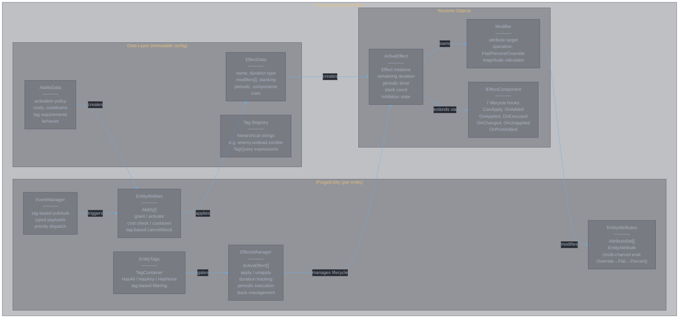
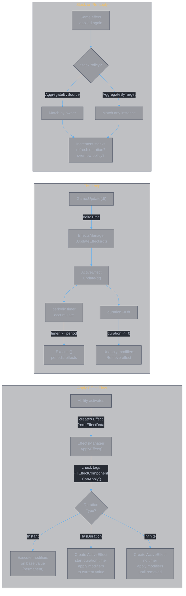
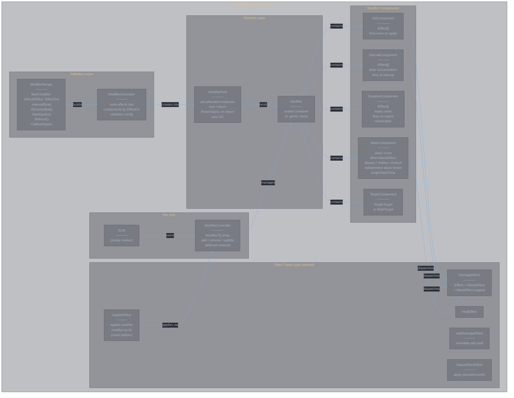
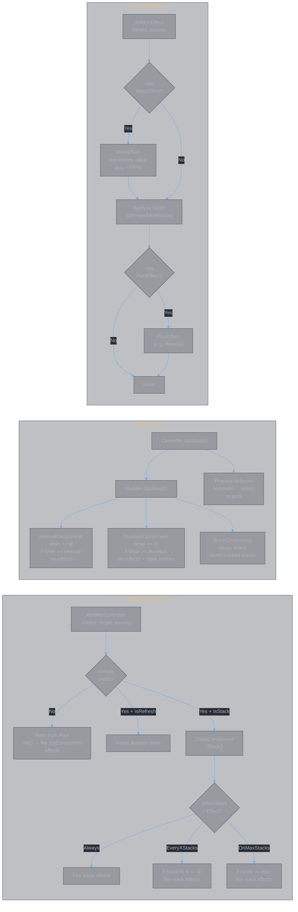

<style>
body {
  max-width: none !important;
  width: 95% !important;
  margin: 0 auto !important;
  padding: 20px 40px !important;
  background-color: #282c34 !important;
  color: #abb2bf !important;
  font-family: -apple-system, BlinkMacSystemFont, "Segoe UI", Helvetica, Arial, sans-serif !important;
  line-height: 1.6 !important;
  -webkit-print-color-adjust: exact !important;
  print-color-adjust: exact !important;
}

h1, h2, h3, h4, h5, h6 {
  color: #ffffff !important;
}

a {
  color: #61afef !important;
}

code {
  background-color: #3e4451 !important;
  color: #e5c07b !important;
  padding: 2px 6px !important;
  border-radius: 3px !important;
}

pre {
  background-color: #2c313a !important;
  border: 1px solid #4b5263 !important;
  border-radius: 6px !important;
  padding: 16px !important;
  overflow-x: auto !important;
}

pre code {
  background-color: transparent !important;
  color: #abb2bf !important;
  padding: 0 !important;
  border-radius: 0 !important;
  font-size: 13px !important;
  line-height: 1.5 !important;
}

table {
  border-collapse: collapse !important;
  width: auto !important;
  margin: 16px 0 !important;
  table-layout: auto !important;
  display: table !important;
}

table th,
table td {
  border: 1px solid #4b5263 !important;
  padding: 8px 10px !important;
  word-wrap: break-word !important;
}

table th:first-child,
table td:first-child {
  min-width: 60px !important;
}

table th {
  background: #3e4451 !important;
  color: #e5c07b !important;
  font-size: 14px !important;
  text-align: center !important;
}

table td {
  background: #2c313a !important;
  font-size: 12px !important;
  text-align: left !important;
}

blockquote {
  border-left: 3px solid #4b5263 !important;
  padding-left: 10px !important;
  color: #5c6370 !important;
  background-color: #2c313a !important;
}

strong {
  color: #e5c07b !important;
}
</style>

# Forge vs ModiBuff: Deep Comparison for Combat Simulator Design

## 1. Library Profiles

### Forge (Gamesmiths Guild)
- **Repo**: github.com/gamesmiths-guild/forge
- **Language**: C# (.NET Standard 2.1 / .NET 8)
- **Pattern**: GAS clone (Unreal Gameplay Ability System for C#)
- **Scope**: Full gameplay framework (attributes, effects, abilities, tags, events, cues, statescript)
- **Engine support**: Engine-agnostic core + Godot plugin (forge-godot)
- **Status**: Early development, NuGet package available

### ModiBuff (Chillu1)
- **Repo**: github.com/Chillu1/ModiBuff
- **Language**: C# (.NET Standard 1.1+)
- **Pattern**: Specialized buff/debuff library with object pooling
- **Scope**: Modifier lifecycle only (no attribute system, no ability framework)
- **Engine support**: Engine-agnostic core + Godot extension
- **Status**: Active, zero-dependency, performance-focused

---

## 2. Architecture Overview

### Forge Architecture

```
IForgeEntity
  ├── EntityAttributes    → AttributeSet[] → EntityAttribute (with channels)
  ├── EntityTags          → TagContainer (hierarchical tags)
  ├── EffectsManager      → ActiveEffect[] (owns lifecycle)
  ├── EntityAbilities     → Ability[] (grant/activate/cooldown)
  ├── EventManager        → tag-based pub/sub with typed payloads
  └── SharedVariables     → cross-ability communication
```

**Data flow**: `EffectData` (immutable config) → `Effect` (runtime instance with level/ownership) → `ActiveEffect` (managed lifecycle with duration/stacking/periodic) → modifies `EntityAttribute` via `Modifier`.

**Key design**: Separation between data definition (`EffectData`, `AbilityData`) and runtime state (`ActiveEffect`, `Ability`). Effects carry `EffectOwnership` (owner + instigator). The `IEffectComponent` interface provides lifecycle hooks for extensibility.

### ModiBuff Architecture

```
IUnit (marker interface)
  └── implements IModifierOwner → ModifierController
       └── Modifier[] (array with swap-removal)
            ├── InitComponent
            ├── IntervalComponent (tick timer)
            ├── DurationComponent (expiry timer)
            ├── StackComponent
            ├── IEffect[] (init/interval/duration/stack/callback effects)
            └── SingleTargetComponent | MultiTargetComponent
```

**Data flow**: `ModifierRecipe` (fluent builder) → `ModifierGenerator` → `ModifierPool` (object pool) → `Modifier` (rented from pool, stateful) → calls `IEffect.Effect(target, source)`.

**Key design**: Recipe/pool/modifier triad. Recipes define modifier blueprints. Pool pre-allocates and recycles modifier instances (zero GC). Modifiers are self-contained state machines with init/interval/duration/stack components.

---

## 3. Core Abstractions Compared

### 3.1 Entity Model

| Aspect | Forge | ModiBuff |
|--------|-------|----------|
| Entity interface | `IForgeEntity` (6 required properties) | `IUnit` (empty marker interface) |
| Attribute storage | `EntityAttributes` → `AttributeSet` → `EntityAttribute` | None built-in; user implements on unit |
| Tag storage | `EntityTags` with `TagContainer` | None built-in; user implements |
| Effect management | `EffectsManager` per entity | `ModifierController` per unit |
| Event system | `EventManager` per entity (tag-based pub/sub) | Callback registration on units |
| Ability system | `EntityAbilities` per entity | None built-in |

**Analysis**: Forge mandates a rich entity contract. ModiBuff is unopinionated — `IUnit` is empty, you bring your own stats/tags. This makes ModiBuff trivially embeddable but requires more user code for a complete system.

### 3.2 Attribute System

| Aspect | Forge | ModiBuff |
|--------|-------|----------|
| Definition | `AttributeSet` subclass with `InitializeAttribute()` | User-defined (e.g., `float Health` on unit) |
| Value type | `int` only | User-defined (typically `float`) |
| Modifier channels | Multi-channel: each attribute has N channels evaluated in order | N/A |
| Channel evaluation | Per channel: `Override` → `(base + Flat) * Percent` | N/A |
| Min/Max clamping | Built-in on `EntityAttribute` | User responsibility |
| Change tracking | `OnValueChanged` event, `PendingValueChange` batching | User responsibility |
| Snapshot support | Attribute-based magnitudes can snapshot values at apply time | N/A |

**Forge channel model in detail**: Each `EntityAttribute` has an array of `ChannelData` structs. Evaluation walks channels 0..N: for each channel, if Override is set, use it; otherwise compute `(currentValue + FlatModifier) * PercentModifier`. This enables layered modification (e.g., channel 0 = base buffs, channel 1 = final multipliers). This is a direct UE GAS concept.

### 3.3 Effect / Modifier Model

**Forge**:
- `EffectData` (immutable record struct): name, duration, modifiers[], stacking, periodic, components[], cues
- `Effect`: runtime wrapper with level, ownership, DataTag (SetByCaller magnitudes)
- `ActiveEffect` (internal): manages lifecycle — apply/unapply modifiers, track duration, execute periodic, manage stacks
- `Modifier` (record struct): targets one attribute with one operation (Flat/Percent/Override) and one magnitude calculator

**ModiBuff**:
- `ModifierRecipe`: fluent builder defining modifier blueprint
- `Modifier`: self-contained runtime object with optional components:
  - `InitComponent`: fires effects on first application
  - `IntervalComponent`: periodic tick (fires `IEffect[]`)
  - `DurationComponent`: expiry timer (fires `IEffect[]` on expire)
  - `StackComponent`: manages stacks with configurable triggers
- `IEffect`: simple `void Effect(IUnit target, IUnit source)` — user implements concrete effects

**Key difference**: Forge effects declaratively modify named attributes via structured `Modifier` operations. ModiBuff effects are imperative — `IEffect.Effect()` can do anything (damage, heal, apply status, chain modifiers). Forge's approach is more analyzable/serializable; ModiBuff's is more flexible.

### 3.4 Duration / Lifecycle

| Duration Type | Forge | ModiBuff |
|---------------|-------|----------|
| Instant | `DurationType.Instant` — executes modifiers on base value immediately | `InitComponent` fires effects once; no Remove() = permanent |
| Timed | `DurationType.HasDuration` — auto-removes after duration | `Remove(float)` on recipe — separate DurationComponent tracks expiry |
| Infinite | `DurationType.Infinite` — stays until programmatically removed | No Remove() and no Duration — stays until explicitly removed |
| Periodic/Tick | `PeriodicData` on effect — ticks at interval within duration | `Interval(float)` on recipe — IntervalComponent fires effects at interval |
| Periodic + Duration | Periodic ticks within HasDuration envelope | Interval + Remove = DoT pattern |
| Execute on apply | `PeriodicData.ExecuteOnApplication` | InitComponent effects fire separately from IntervalComponent |

**Forge periodic detail**: `ActiveEffect.Update(deltaTime)` advances `_internalTime`, fires `Execute()` each time `_internalTime >= NextPeriodicTick`. Handles edge cases: inhibition, stack expiration draining multiple stacks per frame, period reset on stack application.

**ModiBuff periodic detail**: `IntervalComponent.Update(deltaTime)` accumulates `_timer`, fires effects when `_timer >= interval`, then `_timer -= interval`. Simple and predictable.

### 3.5 Stacking

| Aspect | Forge | ModiBuff |
|--------|-------|----------|
| Stack identity | By EffectData + StackPolicy (source vs target) + StackLevelPolicy | By modifier ID; instance-stackable flag for multiple instances |
| Aggregation | `StackPolicy`: AggregateBySource / AggregateByTarget | Single stack counter per modifier; or instance-stackable (separate modifier objects) |
| Stack limit | `ScalableInt` (level-dependent) | Optional `maxStacks` parameter |
| Magnitude scaling | `StackMagnitudePolicy`: DontStack / Sum | `IStackEffect.StackEffect(stacks, target, source)` — user-defined |
| Overflow | `StackOverflowPolicy`: AllowApplication / DenyApplication | Silently caps at maxStacks |
| Expiration | `StackExpirationPolicy`: ClearEntireStack / RemoveSingleStackAndRefreshDuration | Stack timers: single timer (resets all) or independent per-stack timers |
| Refresh on apply | `StackApplicationRefreshPolicy` | `.Refresh()` on recipe |
| Owner management | `StackOwnerDenialPolicy`, `StackOwnerOverridePolicy` | Not built-in |
| Level interaction | `StackLevelPolicy`, level denial/override policies | Not applicable (no level concept) |
| When to trigger | Always (on every new stack application) | `WhenStackEffect`: Always, OnMaxStacks, EveryXStacks |

**Analysis**: Forge's stacking is dramatically more configurable, mirroring UE GAS's 10+ stacking policy enums. ModiBuff's stacking is simpler but has unique features like independent per-stack timers and configurable trigger points (EveryXStacks).

### 3.6 Magnitude Calculation

| Type | Forge | ModiBuff |
|------|-------|----------|
| Static value | `ScalableFloat` (level-scaled via curve) | Hardcoded in effect constructor |
| Attribute-based | `AttributeBasedFloat` (capture source/target attribute, snapshot option) | User implements in IEffect |
| Custom calculator | `CustomModifierMagnitudeCalculator` / `CustomExecution` | Meta-effects (`IMetaEffect`) wrap and transform values |
| Runtime value | `SetByCallerFloat` (tag-keyed dictionary, snapshot option) | `IData` interface for passing runtime data |

**Forge magnitude detail**: `ModifierMagnitude` is a discriminated union of 4 calculation types. `AttributeBasedFloat` can capture attributes from source or target, snapshot at apply time, and compute via configurable `AttributeCalculationType`. This enables data-driven effects like "damage = 50% of caster's attack".

**ModiBuff magnitude detail**: Values are baked into effect instances. Meta-effects (`IMetaEffectOwner`) transform damage before application (e.g., `StatPercentMetaEffect` scales by health%). Post-effects (`IPostEffectOwner`) trigger after application (e.g., lifesteal). This is a pipeline pattern rather than a calculation pattern.

### 3.7 Cross-Entity Effects

| Pattern | Forge | ModiBuff |
|---------|-------|----------|
| Self-buff | Apply effect to self: `self.EffectsManager.ApplyEffect(effect)` | `Targeting.SourceTarget` — source applies to self |
| Debuff opponent | Apply to target: `target.EffectsManager.ApplyEffect(effect)` | `Targeting.TargetSource` — modifier on target with source reference |
| Ownership tracking | `EffectOwnership(owner, instigator)` on every Effect | `source` parameter on every `IEffect.Effect()` call |
| Aura (AoE) | Not built-in (use IEffectComponent) | Built-in `Aura()` on recipe + `IAuraOwner` interface |
| Chain application | IEffectComponent can apply secondary effects | `ApplierEffect` applies other modifiers by ID |

**ModiBuff applier pattern**: `ApplierEffect("OtherModifier", Targeting.SourceTarget)` applies another modifier when the current one triggers. This enables chains like "on 5th hit, apply Rupture; on 2nd Rupture stack, apply Disarm".

**Forge component pattern**: `GrantAbilityEffectComponent` grants abilities when effects are applied. Custom `IEffectComponent` implementations can chain any behavior.

### 3.8 Reactive Triggers / Callbacks

| Aspect | Forge | ModiBuff |
|--------|-------|----------|
| Entity events | `EventManager.Raise(EventData)` / `Subscribe(tag, handler)` | `ICallbackRegistrable<T>` interfaces on unit |
| Event typing | Generic: `EventData<TPayload>` with type-safe subscribe/raise | `CallbackType` enum: CurrentHealthChanged, DamageChanged, etc. |
| Priority | Integer priority on subscriptions | Implicit (registration order) |
| Ability triggers | `AbilityTriggerData`: on tag added, on tag present, on event | N/A |
| Effect-level callbacks | `IEffectComponent` lifecycle hooks (7 methods) | `CallbackEffect` on recipe — wraps delegate + IEffect |
| Inhibition | Tag-based: `TargetTagRequirementsEffectComponent` can inhibit active effects | Not built-in |

**Forge event model**: Per-entity `EventManager` with tag-filtered dispatch. Both non-generic and generic (typed payload) subscriptions. Abilities can auto-activate on tag changes or events. This is the closest equivalent to XState's event-driven model.

**ModiBuff callback model**: Units implement callback interfaces (`ICallbackRegistrable<HealthChangedEvent>`, etc.). Modifiers register delegates during Init. The `CallbackStateContext<T>` pattern allows callbacks to accumulate state (e.g., "after 10 total damage taken, trigger effect").

### 3.9 Tag / Classification System

| Aspect | Forge | ModiBuff |
|--------|-------|----------|
| Tag structure | Hierarchical strings: "enemy.undead.zombie" | Flat `TagType` flags enum |
| Tag hierarchy | "enemy.undead".MatchesTag("enemy") = true | No hierarchy |
| Tag container | `TagContainer` with set operations (HasAll, HasAny, HasNone) | `TagType` bitfield with `HasTag()` |
| Tag queries | `TagQuery` with complex expressions (All/Any/None) | Not built-in |
| Net serialization | Built-in: `Tag.NetSerialize()` / `NetDeserialize()` | Not built-in |
| Tag-based filtering | Effects, abilities, events all use tag requirements | Recipe tags for modifier identification |

**Analysis**: Forge's tag system is a first-class subsystem with hierarchical matching, query expressions, and network support. ModiBuff's tags are minimal bitflags for internal modifier state tracking (IsInit, IsRefresh, IsStack, IsInstanceStackable).

### 3.10 Ability System

| Aspect | Forge | ModiBuff |
|--------|-------|----------|
| Ability definition | `AbilityData` record struct with full config | Not built-in |
| Activation | `EntityAbilities.TryActivateAbility()` with validation chain | User code |
| Costs | `CostEffect` (instant effect checked before activation) | `CostCheck` on recipe (mana/health cost) |
| Cooldowns | `CooldownEffects[]` (duration effects with modifier tags) | `CooldownCheck` / `ChargesCooldownCheck` on recipe |
| Behavior | `IAbilityBehavior.OnStarted(context)` / `OnEnded(context)` | N/A |
| Instancing | PerEntity / PerActivation / None | N/A |
| Tag interaction | Cancel/Block other abilities by tag, activation requires/blocks tags | N/A |
| Grant via effect | `GrantAbilityEffectComponent` | N/A |

### 3.11 Update / Tick Loop

**Forge**:
```
game loop → entity.EffectsManager.UpdateEffects(deltaTime)
  → for each ActiveEffect:
      → effect.Update(deltaTime)
        → RemainingDuration -= deltaTime
        → ExecutePeriodicEffects(deltaTime)
          → while (_internalTime >= NextPeriodicTick): Execute()
      → if IsExpired: RemoveActiveEffect()
  → ApplyPendingValueChanges()
```

**ModiBuff**:
```
game loop → unit.ModifierController.Update(delta)
  → for each Modifier:
      → modifier.Update(delta)
        → IntervalComponent.Update(delta) → fire effects if timer >= interval
        → DurationComponent.Update(delta) → fire effects + mark for removal if timer >= duration
        → StackComponent.Update(delta) → decrement stacks if timers expire
  → process deferred removals
```

Both are explicit tick-driven. Neither is frame-rate independent by default (both accumulate float timers). Forge batches attribute change notifications; ModiBuff does not.

---

## 4. Comparison Table

| Dimension | Forge | ModiBuff |
|-----------|-------|----------|
| **Architecture** | OOP, GAS-pattern, rich entity contract | OOP, component-based modifier, minimal entity contract |
| **Attribute model** | Built-in: int-typed, multi-channel, min/max, overflow tracking | None: user-defined |
| **Effect lifecycle** | Instant / HasDuration / Infinite (3 types) | Init + optional Interval + optional Duration + optional Remove |
| **Stacking model** | 10+ policy enums (source/target aggregation, overflow, expiration, owner, level) | Simple counter + WhenStackEffect enum + optional per-stack timers |
| **Temporal model** | PeriodicData within duration envelope, inhibition policies | Separate IntervalComponent + DurationComponent, refreshable |
| **Cross-entity** | Effect.Ownership(owner, instigator), apply to any entity's EffectsManager | source/target on every IEffect call, Targeting enum, Aura support |
| **Reactive triggers** | EventManager (tag-based pub/sub), ability auto-triggers | Callback interfaces on units, CallbackEffect on recipes |
| **Tag system** | Hierarchical strings, queries, net serialization | Flat bitfield enum |
| **Composability** | IEffectComponent lifecycle hooks, CustomCalculator, CustomExecution | Meta-effects, Post-effects, ApplierEffect chains, Callback pipelines |
| **Testability** | Standard xUnit tests; entities need TagsManager + CuesManager setup | Benchmarks included; recipes need IdManager + Pool setup |
| **Memory model** | Standard GC allocation | Zero-alloc via full object pooling |
| **Serialization** | Not yet (network replication planned) | Built-in save/load with System.Text.Json |
| **Extension points** | IEffectComponent (7 hooks), CustomCalculator, IAbilityBehavior, Statescript | IEffect, IStackEffect, IMetaEffect, IPostEffect, ICheck, callbacks |
| **Data-driven** | Strongly: EffectData/AbilityData are serializable config structs | Partially: recipes are code-defined builders |
| **Maturity** | Early development | More mature, benchmarked, Godot asset library |

---

## 5. Relevance to XState Combat Simulator

### What our simulator needs (from MEMORY.md context):
1. Attribute mutations: HP, ATK, SP (shield), DEF across two entities
2. Effect types from affix taxonomy: passive multipliers, conditional multipliers, flat damage adds, DoTs/debuffs/shields, cross-skill bonuses, reactive triggers, state-referencing mechanics
3. Temporal model: permanent buffs, duration buffs, periodic ticks, cooldowns
4. Cross-entity: self-buffs and opponent debuffs
5. State machine: XState for combat phases, skill rotations, decision points

### Forge alignment:
- **Strong fit**: Attribute system maps directly to our 4 fundamental attributes. Tag system could model named states (寂灭剑心, etc.). Effect duration types match our permanent/temporal/instant classification. Ability system could model skill activation with costs/cooldowns. Event system is close to XState's event model.
- **Weak fit**: Integer-only attributes (we may need float). Heavy entity contract. No TypeScript version — would need to be ported or used as design reference only.
- **Key insight**: Forge's `IEffectComponent` lifecycle hooks map well to our affix taxonomy categories. The channel-based attribute evaluation could model our multi-layer modifier stacking.

### ModiBuff alignment:
- **Strong fit**: Minimal entity interface = easy to adapt. ApplierEffect chains model our cross-skill effects (category 5). Callback system models reactive triggers (category 6). Per-stack independent timers model DoTs with individual durations. Zero-alloc is irrelevant for simulation but the pooling pattern is good architecture.
- **Weak fit**: No built-in attribute system. No ability framework. Flat tags cannot model our hierarchical effect types. Recipe pattern is code-only (our effects are data-driven YAML).
- **Key insight**: ModiBuff's meta-effect pipeline (pre-transform value → apply → post-process) maps to our conditional multiplier chain. The `WhenStackEffect.EveryXStacks` pattern models accumulation-triggered effects.

### Recommendation for our simulator:
Neither library should be directly adopted (both are C#, we need TypeScript for XState integration). However:

1. **Borrow from Forge**: The attribute channel model, the 3-type duration system (Instant/HasDuration/Infinite), the `IEffectComponent` lifecycle pattern, and the hierarchical tag system. These provide the structural framework for our combat state representation.

2. **Borrow from ModiBuff**: The meta/post-effect pipeline for damage transformation chains, the ApplierEffect pattern for cross-skill modifier application, the callback-with-mutable-state pattern for reactive triggers (e.g., "after N damage taken, trigger effect").

3. **Key abstractions to implement in our XState simulator**:
   - `CombatEntity` with typed attributes (HP, ATK, SP, DEF) — Forge-style but simpler
   - `Effect` as XState events with: trigger condition, attribute mutations, duration/periodic config
   - `EffectStack` with configurable policies (at minimum: aggregate mode, max stacks, expiration)
   - `ModifierPipeline` for pre/post processing (conditional multipliers, lifesteal, etc.)
   - XState context holds entity state; events model effect application/removal/tick
   - Named states as XState parallel states or context flags (not Forge tags — too heavy)

4. **What neither library solves well for us**:
   - Skill rotation modeling (combat phase sequencing) — this is XState's strength
   - Multi-book interaction (our 6-book slot system) — domain-specific
   - The `parent=` cross-reference mechanism between affixes — domain-specific

---

## 6. C4 Architecture Diagrams

### 6.1 Forge — Container Diagram (C4 Level 2)



### 6.2 Forge — Component Diagram (C4 Level 3: Effect Lifecycle)



### 6.3 ModiBuff — Container Diagram (C4 Level 2)



### 6.4 ModiBuff — Component Diagram (C4 Level 3: Modifier Lifecycle)



### 6.5 Side-by-Side Comparison (C4 Context Level)

```mermaid
%%{init: {'theme': 'base', 'themeVariables': {'primaryColor': '#3e44514D', 'primaryTextColor': '#abb2bf', 'primaryBorderColor': '#4b5263', 'lineColor': '#61afef', 'secondaryColor': '#2c313a4D', 'secondaryTextColor': '#abb2bf', 'secondaryBorderColor': '#4b5263', 'tertiaryColor': '#282c344D', 'mainBkg': '#3e44514D', 'nodeBorder': '#4b5263', 'clusterBkg': '#2c313a4D', 'clusterBorder': '#4b5263', 'titleColor': '#e5c07b', 'edgeLabelBackground': '#282c34', 'textColor': '#abb2bf', 'background': '#282c34'}}}%%
graph TB
    subgraph "Forge (GAS Pattern)"
        F_ATTR["Attribute System\n═══════════\nMulti-channel eval\nint-typed, clamped\nchange events"]
        F_EFF["Effect System\n═══════════\nInstant / Duration / Infinite\nperiodic ticking\n10+ stacking policies\nIEffectComponent hooks"]
        F_ABIL["Ability System\n═══════════\nactivation / costs\ncooldowns\ntag requirements\ninstancing policies"]
        F_TAG["Tag System\n═══════════\nhierarchical strings\nTagQuery expressions\nnet serializable"]
        F_EVT["Event System\n═══════════\ntag-based pub/sub\ntyped payloads\npriority dispatch"]
    end

    subgraph "ModiBuff (Modifier Pattern)"
        M_REC["Recipe Builder\n═══════════\nfluent API\nEffectOn flags\nvalidation"]
        M_POOL["Object Pool\n═══════════\npre-allocated\nrent / return\nzero GC"]
        M_MOD["Modifier Runtime\n═══════════\nInit / Interval / Duration\nStack components\nTarget resolution"]
        M_EFF2["Effect Pipeline\n═══════════\nIEffect (apply)\nIMetaEffect (transform)\nIPostEffect (react)\nApplierEffect (chain)"]
        M_CB["Callback System\n═══════════\nunit event hooks\nstateful callbacks\nCallbackEffect"]
    end

    F_ABIL -->|"applies"| F_EFF
    F_EFF -->|"modifies"| F_ATTR
    F_TAG -->|"gates"| F_EFF
    F_TAG -->|"gates"| F_ABIL
    F_EVT -->|"triggers"| F_ABIL

    M_REC -->|"generates into"| M_POOL
    M_POOL -->|"provides"| M_MOD
    M_MOD -->|"dispatches"| M_EFF2
    M_CB -->|"triggers"| M_MOD
    M_EFF2 -->|"chains via\nApplierEffect"| M_MOD
```


