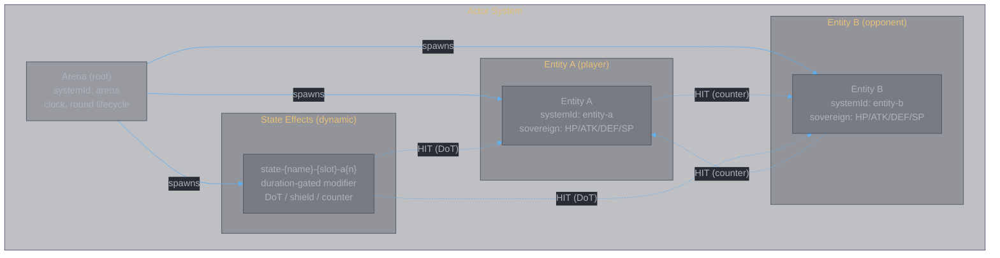
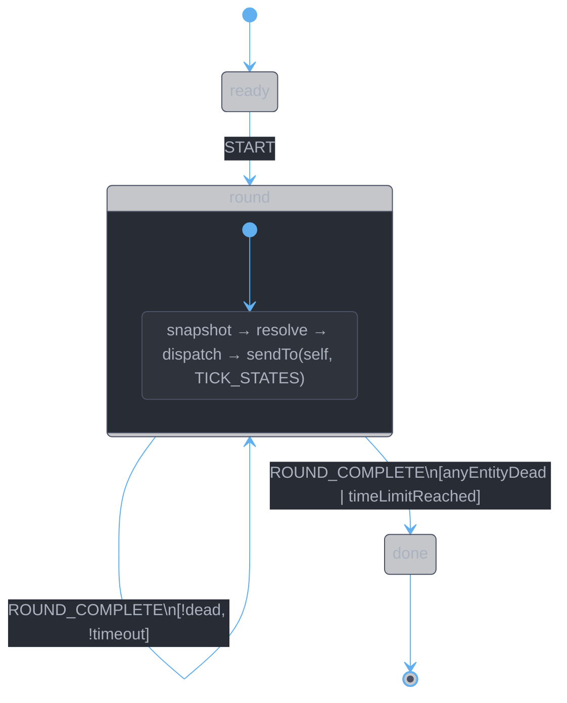
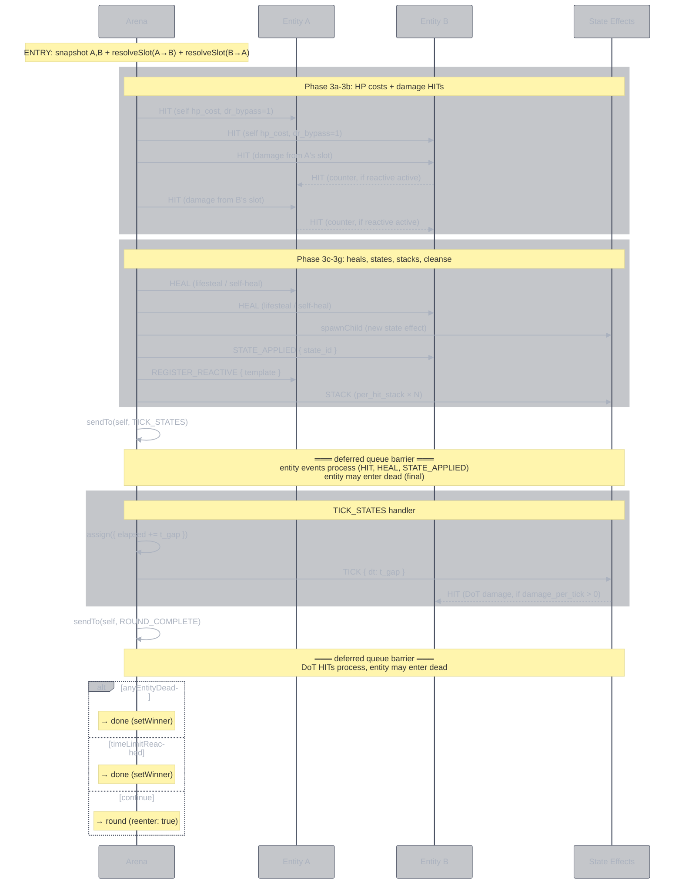

<style>
body {
  max-width: none !important;
  width: 95% !important;
  margin: 0 auto !important;
  padding: 20px 40px !important;
  background-color: #282c34 !important;
  color: #abb2bf !important;
  font-family: -apple-system, BlinkMacSystemFont, "Segoe UI", Helvetica, Arial, sans-serif !important;
  line-height: 1.6 !important;
  -webkit-print-color-adjust: exact !important;
  print-color-adjust: exact !important;
}

h1, h2, h3, h4, h5, h6 {
  color: #ffffff !important;
}

a {
  color: #61afef !important;
}

code {
  background-color: #3e4451 !important;
  color: #e5c07b !important;
  padding: 2px 6px !important;
  border-radius: 3px !important;
}

pre {
  background-color: #2c313a !important;
  border: 1px solid #4b5263 !important;
  border-radius: 6px !important;
  padding: 16px !important;
  overflow-x: auto !important;
}

pre code {
  background-color: transparent !important;
  color: #abb2bf !important;
  padding: 0 !important;
  border-radius: 0 !important;
  font-size: 13px !important;
  line-height: 1.5 !important;
}

table {
  border-collapse: collapse !important;
  width: auto !important;
  margin: 16px 0 !important;
  table-layout: auto !important;
  display: table !important;
}

table th,
table td {
  border: 1px solid #4b5263 !important;
  padding: 8px 10px !important;
  word-wrap: break-word !important;
}

table th:first-child,
table td:first-child {
  min-width: 60px !important;
}

table th {
  background: #3e4451 !important;
  color: #e5c07b !important;
  font-size: 14px !important;
  text-align: center !important;
}

table td {
  background: #2c313a !important;
  font-size: 12px !important;
  text-align: left !important;
}

blockquote {
  border-left: 3px solid #4b5263 !important;
  padding-left: 10px !important;
  color: #5c6370 !important;
  background-color: #2c313a !important;
}

strong {
  color: #e5c07b !important;
}
</style>

# Actor Behavioral Models

**Date:** 2026-03-14
**Status:** Design — formal models for implementation

This document defines the behavioral model for each actor in the combat simulator. Every state, transition, guard, and action is specified precisely enough to implement directly in XState v5.

The contracts doc (`contract.main.md`) defines **what** crosses entity boundaries. This doc defines **how** each actor processes what it receives.

---

## 1. Actor System Overview



Three actor types, not four. The old slot actor is gone — slot resolution is a pure function (`resolveSlot()`) called by the arena's round entry action. The arena dispatches the resulting events.

| Actor | Instances | systemId | Role |
|-------|-----------|----------|------|
| Arena | 1 | `arena` | Clock, round lifecycle, event dispatch |
| Entity | 2 | `entity-a`, `entity-b` | HP sovereign, defense evaluation, reactive triggers |
| State Effect | dynamic | `state-{name}-{slot}-a{n}` | Duration-gated modifier, DoT, shield, counter |

---

## 2. Arena

### 2.1 State Diagram



Three states: `ready`, `round`, `done`. The round state re-enters itself (`reenter: true`) for each new round. Death is detected by the `anyEntityDead` guard on ROUND_COMPLETE — the entity SM entering its terminal `dead` state is sufficient. No death event needed.

### 2.2 Context

```typescript
context: {
  current_round: number;
  num_slots: number;
  max_time: number;           // seconds
  elapsed: number;            // seconds
  t_gap: number;              // seconds between rounds
  entity_a: ActorRefFrom<typeof entityMachine>;
  entity_b: ActorRefFrom<typeof entityMachine>;
  books_a: SlotDef[];
  books_b: SlotDef[];
  activations: Map<string, number>;  // per-slot activation counter
  state_registry: string[];          // all state effect systemIds
  winner: string | null;
}
```

### 2.3 Events Received

| Event | Source | Handler |
|-------|--------|---------|
| `START` | external | transition ready → round |
| `STATE_CREATED { state_id, target_entity }` | Entity (reactive spawn) | register + notify |
| `TICK_STATES` | self (deferred) | tick all state effects, then send ROUND_COMPLETE |
| `ROUND_COMPLETE` | self (deferred) | guard-based: next round or done |

No ENTITY_DIED event. Death is a terminal state on the entity SM — the arena detects it by checking entity snapshot status at round boundaries via the `anyEntityDead` guard.

### 2.4 Events Sent

| Event | Target | When |
|-------|--------|------|
| `HIT { damage, source, dr_bypass, healing }` | Entity | round entry — from resolveSlot() results |
| `HEAL { amount, source }` | Entity | round entry — lifesteal, self-heal |
| `STATE_APPLIED { state_id }` | Entity | round entry — after spawning state effect |
| `REGISTER_REACTIVE { template }` | Entity | round entry — for on_attacked states |
| `TICK { dt }` | State Effect | TICK_STATES handler |
| `STACK` | State Effect | round entry — per_hit_stack states |
| `TICK_STATES` | self | round entry — deferred, after entity events process |
| `ROUND_COMPLETE` | self | TICK_STATES handler — deferred, after tick events process |
| `DISPEL` | State Effect | round entry — self_cleanse / buff_steal |

### 2.5 Round Entry — The Core Orchestration

The round's `entry` action is `enqueueActions`. It is the heart of the simulator. Every event is enqueued in a precise order through the deferred queue.

```
ENTRY ACTION (enqueueActions):

  Phase 1: SNAPSHOT
    snapA ← takeEntitySnapshot(system, "entity-a")
    snapB ← takeEntitySnapshot(system, "entity-b")

  Phase 2: RESOLVE (pure computation — no side effects)
    resultA ← resolveSlot(books_a[round], snapA, snapB, activation_a)
    resultB ← resolveSlot(books_b[round], snapB, snapA, activation_b)

  Phase 3: DISPATCH (enqueue events to deferred queue, in order)

    3a. Self HP costs
        for each self_hit in [resultA, resultB]:
          enqueue.sendTo(target_entity, HIT { dr_bypass: 1.0 })

    3b. Damage HITs
        for each hit in [resultA, resultB]:
          enqueue.sendTo(target_entity, HIT { damage, source, dr_bypass })

    3c. Heals
        for each heal in [resultA, resultB]:
          enqueue.sendTo(target_entity, HEAL { amount })

    3d. State effects — spawn + register
        for each state in [resultA, resultB]:
          if state.trigger == "on_attacked":
            enqueue.sendTo(owner_entity, REGISTER_REACTIVE { template })
          else:
            enqueue(spawnChild(stateEffectMachine, { input, systemId }))
            enqueue.sendTo(target_entity, STATE_APPLIED { state_id })

    3e. Per-hit stacks
        for each stack in [resultA, resultB]:
          for i in 0..count:
            enqueue.sendTo(state_actor, STACK)

    3f. Cleanse (self_cleanse_count)
        for each slot with self_cleanse_count > 0:
          pick N dispellable opponent-targeting states on owner
          enqueue.sendTo(state_actor, DISPEL) for each

    3g. Buff steal (buff_steal_count)
        for each slot with buff_steal_count > 0:
          pick N buff states on opponent
          enqueue.sendTo(state_actor, DISPEL) for each
          (stolen buff re-creation: spawn equivalent state on self)

  Phase 4: BOOKKEEPING
    enqueue.assign({ activations, state_registry, current_round })

  Phase 5: SELF-ADVANCE
    enqueue.sendTo(self, TICK_STATES)
```

**Why sendTo(self) for TICK_STATES and ROUND_COMPLETE:**

`sendTo(self)` puts these events into the deferred queue — the same queue that entity and state-effect responses go through. This ensures all entity events (HIT processing, counter responses, reactive spawns) complete before TICK_STATES fires, and all TICK consequences (DoT damage, state expiry) complete before ROUND_COMPLETE fires.

The arena does NOT need to detect death mid-round. It checks `anyEntityDead` on ROUND_COMPLETE — if an entity's HP hit 0 at any point during the round, its snapshot reflects that. Death is a state, not an event.

### 2.6 TICK_STATES Handler

```
on TICK_STATES:
  actions: enqueueActions(({ context, enqueue, system }) => {
    enqueue.assign({ elapsed: elapsed + t_gap })

    for stateId of state_registry:
      actor ← system.get(stateId)
      if actor exists:
        enqueue.sendTo(actor, TICK { dt: t_gap })

    enqueue.sendTo(self, ROUND_COMPLETE)    // deferred — after TICK consequences
  })
```

### 2.7 ROUND_COMPLETE Handler

Guarded transition array — first matching guard wins:

```
on ROUND_COMPLETE: [
  { guard: anyEntityDead,   target: "done", actions: setWinner },
  { guard: timeLimitReached, target: "done", actions: setWinner },
  { target: "round", reenter: true }
]
```

### 2.8 Guards

```typescript
anyEntityDead: ({ context }) => {
  // Safe read — handles stopped actors
  return safeReadHp(context.entity_a) <= 0
      || safeReadHp(context.entity_b) <= 0;
}

timeLimitReached: ({ context }) => {
  return context.elapsed >= context.max_time;
}
```

### 2.9 Context Factory — Spawning

The arena's context factory spawns entities and initial SP shields:

```
context: ({ input, spawn }) => {
  entityA ← spawn(entityMachine, { systemId: "entity-a", input: entity_a_def })
  entityB ← spawn(entityMachine, { systemId: "entity-b", input: entity_b_def })

  for each entity:
    if sp > 0:
      shield ← spawn(stateEffectMachine, {
        systemId: "shield-sp-{entity.id}",
        input: { shield_hp: sp × sp_shield_ratio, duration: 999, ... }
      })
      state_registry.push(shield.systemId)
      entity.send(STATE_APPLIED { state_id: shield.systemId })

  return { entityA, entityB, books_a, books_b, state_registry, ... }
}
```

---

## 3. Entity

### 3.1 State Diagram

```mermaid
%%{init: {'theme': 'base', 'themeVariables': {'primaryColor': '#3e44514D', 'primaryTextColor': '#abb2bf', 'primaryBorderColor': '#4b5263', 'lineColor': '#61afef', 'secondaryColor': '#2c313a4D', 'secondaryTextColor': '#abb2bf', 'secondaryBorderColor': '#4b5263', 'tertiaryColor': '#282c344D', 'mainBkg': '#3e44514D', 'nodeBorder': '#4b5263', 'clusterBkg': '#2c313a4D', 'clusterBorder': '#4b5263', 'titleColor': '#e5c07b', 'edgeLabelBackground': '#282c34', 'textColor': '#abb2bf', 'background': '#282c34'}}}%%
stateDiagram-v2
    [*] --> alive
    alive --> receiving_hit : HIT\n(shield→DR→HP→counter→reactive)
    alive --> alive : HEAL
    alive --> alive : STATE_APPLIED
    alive --> alive : REGISTER_REACTIVE
    receiving_hit --> alive : [hp > 0]
    receiving_hit --> dead : [hp ≤ 0]
    dead --> [*]

    note right of receiving_hit : transient state\nalways transitions\nsubscribers never see it
    note right of dead : type: final\nno entry actions\nsnapshot remains readable
```

`receiving_hit` is a transient state — XState evaluates the `always` guards immediately. Subscribers never see it. Its purpose is to gate the dead/alive transition on the hp guard.

### 3.2 Context

```typescript
context: {
  id: string;
  hp: number;
  max_hp: number;
  atk: number;
  sp: number;
  def: number;
  dr_constant: number;            // K in DR = def / (def + K)
  active_states: string[];        // systemIds of all active state effects
  reactive_templates: StateDef[]; // trigger=on_attacked templates
  reactive_counter: number;       // unique ID counter for reactive spawns
  damage_log: DamageEntry[];

  // Derived stats — cached, recomputed on every event
  effective_atk: number;
  effective_def: number;
  effective_dr: number;
  heal_reduction: number;
}
```

### 3.3 Events Received

| Event | Source | Notes |
|-------|--------|-------|
| `HIT { damage, source, is_crit, hit_index, dr_bypass, healing }` | Arena (slot resolution), State Effect (DoT), Entity (counter) | The central event |
| `HEAL { amount, source }` | Arena (slot resolution) | Lifesteal, self-heal |
| `STATE_APPLIED { state_id }` | Arena | Add state to active_states |
| `REGISTER_REACTIVE { template }` | Arena | Add to reactive_templates |

### 3.4 Events Sent

| Event | Target | When |
|-------|--------|------|
| `HIT { damage, source }` | Entity (attacker) | reactive counter fires |
| `STATE_CREATED { state_id, target_entity }` | Arena | reactive template spawns state |

The entity does NOT send ENTITY_DIED. Death = entering the `dead` final state. The arena reads entity status at round boundaries.

### 3.5 HIT Processing — The Cascade Model

This is the most complex behavior in the system. The entity's HIT handler is an `enqueueActions` that performs a defined sequence:

```
on HIT (in state: alive):
  target: "receiving_hit"
  actions: enqueueActions(({ context, event, enqueue, system }) => {

    ── Step 1: RECOMPUTE DERIVED STATS ──────────────────────
    derived ← computeDerivedStats(active_states, atk, def, dr_constant, system)
    //  Reads all active state effects via system.get()
    //  Sums: atk_modifier, def_modifier, dr_modifier, healing_modifier, modifiers
    //  Computes: effective_atk, effective_def, effective_dr

    ── Step 2: DR BYPASS ────────────────────────────────────
    effective_dr ← derived.effective_dr × (1 - event.dr_bypass)

    ── Step 3: SHIELD ABSORPTION ────────────────────────────
    remaining_damage ← event.damage
    for stateId of active_states:
      if remaining_damage ≤ 0: break
      actor ← system.get(stateId)
      snap ← actor.getSnapshot()
      if snap.value == "on" AND snap.context.shield_hp > 0:
        absorbed ← min(snap.context.shield_hp, remaining_damage)
        remaining_damage -= absorbed
        enqueue.sendTo(actor, ABSORB { amount: absorbed })

    ── Step 4: APPLY DR ─────────────────────────────────────
    effective_damage ← remaining_damage × (1 - effective_dr)
    new_hp ← max(0, hp - effective_damage)

    ── Step 5: UPDATE CONTEXT ───────────────────────────────
    enqueue.assign({ hp: new_hp, damage_log: [...log, entry], ...derived })

    ── Step 6: REACTIVE COUNTERS ────────────────────────────
    if event.source ≠ "dot":     // DoTs don't trigger counters
      for stateId of active_states:
        actor ← system.get(stateId)
        snap ← actor.getSnapshot()
        if snap.value == "on" AND snap.context.counter_damage > 0:
          source_actor ← system.get(event.source)
          if source_actor:
            enqueue.sendTo(source_actor, HIT {
              damage: snap.context.counter_damage,
              source: context.id,
              dr_bypass: 0
            })

    ── Step 7: REACTIVE TEMPLATES ───────────────────────────
    if event.source ≠ "dot" AND reactive_templates.length > 0:
      for template of reactive_templates:
        if template.chance < 100:
          roll ← random(0, 100)
          if roll ≥ template.chance: continue   // failed

        stateSystemId ← "state-reactive-{template.id}-{entity.id}-{counter++}"
        target_entity ← template.target == "self" ? entity.id : event.source

        enqueue(spawnChild(stateEffectMachine, {
          systemId: stateSystemId,
          input: { ...template fields..., target_entity, owner_entity: entity.id }
        }))

        enqueue.sendTo(arena, STATE_CREATED {
          state_id: stateSystemId,
          target_entity
        })
  })
```

**Cascade depth**: The counter in step 6 sends a HIT to the attacker. That attacker's entity processes it through the same HIT handler. If the attacker also has a counter, it fires back. XState handles this naturally through the deferred event queue — each HIT is a separate event processed in order. **Termination**: counters fire on `event.source ≠ "dot"`. Counter HITs have `source: context.id` (not "dot"), so they CAN trigger counter-counters. In practice, the game's counter effects are finite-duration states that expire, so infinite loops don't occur. If needed, add a `hit_depth` field to HIT events and cap at 3.

### 3.6 HEAL Processing

```
on HEAL (in state: alive):
  actions: enqueueActions(({ context, event, enqueue, system }) => {
    derived ← computeDerivedStats(active_states, ...)
    effective_heal ← max(0, event.amount × (1 - derived.heal_reduction))
    enqueue.assign({
      hp: min(max_hp, hp + effective_heal),
      ...derived
    })
  })
```

### 3.7 STATE_APPLIED Processing

```
on STATE_APPLIED (in state: alive):
  actions: enqueueActions(({ context, event, enqueue, system }) => {
    newStates ← [...active_states, event.state_id]
    derived ← computeDerivedStats(newStates, ...)
    enqueue.assign({
      active_states: newStates,
      ...derived
    })
  })
```

### 3.8 Transient State: receiving_hit

```
receiving_hit:
  always: [
    { guard: ({ context }) => context.hp ≤ 0, target: "dead" },
    { target: "alive" }
  ]
```

No entry/exit actions. Pure routing based on HP.

### 3.9 Final State: dead

```
dead:
  type: "final"
```

No entry actions. The entity simply stops accepting events. Its snapshot remains readable (`status: "done"`, context preserved with final HP = 0). The arena detects this state via `anyEntityDead` guard — checking `safeReadHp(entity) ≤ 0`.

---

## 4. State Effect

### 4.1 State Diagram

```mermaid
%%{init: {'theme': 'base', 'themeVariables': {'primaryColor': '#3e44514D', 'primaryTextColor': '#abb2bf', 'primaryBorderColor': '#4b5263', 'lineColor': '#61afef', 'secondaryColor': '#2c313a4D', 'secondaryTextColor': '#abb2bf', 'secondaryBorderColor': '#4b5263', 'tertiaryColor': '#282c344D', 'mainBkg': '#3e44514D', 'nodeBorder': '#4b5263', 'clusterBkg': '#2c313a4D', 'clusterBorder': '#4b5263', 'titleColor': '#e5c07b', 'edgeLabelBackground': '#282c34', 'textColor': '#abb2bf', 'background': '#282c34'}}}%%
stateDiagram-v2
    [*] --> on
    on --> off : TICK [remaining - dt ≤ 0]\n(fire final DoT/burst)
    on --> on : TICK [remaining - dt > 0]\n(decrement, fire DoT)
    on --> off : DISPEL [dispellable]\n(fire on_dispel_damage)
    on --> on : DISPEL [!dispellable]\n(no-op)
    on --> on : STACK\n(increment stacks, refresh duration)
    on --> off : ABSORB [shield depleted]
    on --> on : ABSORB [shield remains]\n(decrement shield_hp)
    off --> [*]

    note right of on : passive + queryable\nconsumers read context fields\nDoT fires HIT on TICK
    note right of off : type: final
```

One active state (`on`), one terminal state (`off`). All behavior is determined by context fields, not by state topology.

### 4.2 Context

```typescript
context: {
  id: string;                    // state name (e.g., "仙佑", "命損")
  remaining: number;             // seconds until expiry
  stacks: number;                // current stack count (≥ 1)
  initial_duration: number;      // for STACK refresh
  damage_increase: number;          // % bonus to damage dealt (e.g., 70 = +70%)
  dr_modifier: number;          // DR delta (read by entity on HIT)
  healing_modifier: number;     // heal reduction (read by entity on HEAL)
  damage_per_tick: number;      // > 0 → DoT: raw % of owner ATK
  shield_hp: number;            // > 0 → shield
  counter_damage: number;       // > 0 → reactive counter
  atk_modifier: number;         // +ATK% (read by computeDerivedStats)
  def_modifier: number;         // +DEF% (read by computeDerivedStats)
  target_entity: string;        // who to HIT (DoT) or who this affects
  owner_entity: string;         // who owns this (for ATK lookup on DoT)
  max_stacks: number;           // 0 = unlimited
  dispellable: boolean;         // false → DISPEL is ignored
}
```

### 4.3 Events Received

| Event | Source | Notes |
|-------|--------|-------|
| `TICK { dt }` | Arena | Decrement remaining, fire DoT HIT if applicable |
| `DISPEL` | Arena (cleanse/buff_steal) | Transition to off if dispellable |
| `STACK` | Arena (per_hit_stack) | Increment stacks, refresh duration |
| `ABSORB { amount }` | Entity (shield absorption) | Decrement shield_hp |

### 4.4 Events Sent

| Event | Target | When |
|-------|--------|------|
| `HIT { damage, source: "dot" }` | Entity (target_entity) | TICK handler, if damage_per_tick > 0 |

### 4.5 TICK Handler

The TICK handler is a guarded transition array:

```
on TICK: [
  ── Guard 1: expiry ──
  {
    guard: remaining - dt ≤ 0,
    target: "off",
    actions: enqueueActions(({ context, enqueue, system, event }) => {
      // Fire final DoT tick before expiring
      if damage_per_tick > 0:
        ownerAtk ← readOwnerEffectiveAtk(system, owner_entity)
        dotDmg ← (damage_per_tick / 100) × ownerAtk × stacks
        target ← system.get(target_entity)
        enqueue.sendTo(target, HIT { damage: dotDmg, source: "dot" })

      // Fire burst damage on expiry (delayed_burst)
      if burst_damage > 0:
        target ← system.get(target_entity)
        enqueue.sendTo(target, HIT { damage: burst_damage, source: "dot" })

      // Fire on_dispel_damage on natural expiry? NO — only on DISPEL.

      enqueue.assign({ remaining: 0 })
    })
  },

  ── Guard 2: continue (default) ──
  {
    actions: enqueueActions(({ context, enqueue, system, event }) => {
      enqueue.assign({ remaining: remaining - dt })

      // DoT tick
      if damage_per_tick > 0:
        ownerAtk ← readOwnerEffectiveAtk(system, owner_entity)
        dotDmg ← (damage_per_tick / 100) × ownerAtk × stacks
        target ← system.get(target_entity)
        enqueue.sendTo(target, HIT { damage: dotDmg, source: "dot" })
    })
  }
]
```

**DoT ATK scaling**: The DoT reads the owner entity's `effective_atk` at tick time via `system.get(owner_entity).getSnapshot().context.effective_atk`. This means DoT damage scales with the owner's current buffs — if the owner has 仙佑 (+70% ATK), the DoT hits harder while the buff is active.

### 4.6 DISPEL Handler

```
on DISPEL: [
  {
    guard: ({ context }) => context.dispellable,
    target: "off",
    actions: enqueueActions(({ context, enqueue, system }) => {
      // on_dispel_damage: punish the dispeller
      if on_dispel_damage > 0:
        target ← system.get(target_entity)
        enqueue.sendTo(target, HIT { damage: on_dispel_damage, source: "dot" })
    })
  },
  {
    // !dispellable → no-op, stay on
  }
]
```

### 4.7 STACK Handler

```
on STACK:
  actions: assign(({ context }) => ({
    stacks: (max_stacks > 0 && stacks >= max_stacks)
      ? stacks        // capped
      : stacks + 1,   // increment
    remaining: initial_duration   // refresh duration on stack
  }))
```

Stacking always refreshes duration. Stack count is capped by `max_stacks` (0 = unlimited).

### 4.8 ABSORB Handler

```
on ABSORB: [
  {
    guard: ({ context, event }) => shield_hp - event.amount ≤ 0,
    target: "off",
    actions: assign({ shield_hp: 0 })
  },
  {
    actions: assign({
      shield_hp: ({ context, event }) => shield_hp - event.amount
    })
  }
]
```

### 4.9 Roles (determined by context fields, not by state topology)

| Role | Identifying fields | Read by | Example |
|------|-------------------|---------|---------|
| ATK/DEF buff | `atk_modifier: 0.7` | computeDerivedStats | 仙佑 |
| DR debuff | `dr_modifier: -1.0` | computeDerivedStats | 命損 |
| Heal reduction | `healing_modifier: 0.5` | entity HEAL handler | 惧意 |
| DoT | `damage_per_tick: 550` | self (TICK handler fires HIT) | 噬心 |
| Shield | `shield_hp: 50000` | entity HIT handler (ABSORB) | 护体 |
| Counter | `counter_damage: 8000` | entity HIT handler (fires HIT back) | 极怒 |
| Delayed burst | `burst_damage: 50000` | self (TICK expiry fires HIT) | 无相魔劫 |

A single state effect can combine roles (e.g., a buff that also grants a shield). The consumers read only the fields they care about.

---

## 5. Pure Functions (not actors)

These are called by actors but live outside the actor system.

### 5.1 simulateBook(effects, owner) → Intent[]

The two-pass combinator from `impl.main.md`. Consumes parser output directly — no factor vector decomposition.

```
Input:
  effects: EffectRow[]     — from BookData (skill + primary_affix effects)
  owner: OwnerStats        — { id, atk, effective_atk, hp, max_hp, def, sp }

Output:
  Intent[] — discriminated union of all contract types

Algorithm:
  Pass 1: PRODUCERS — emit intents
    for each effect where isProducer(effect.type):
      intents.push(...simulate(effect, owner))

  Pass 2: MODIFIERS — transform producer intents
    for each effect where isModifier(effect.type):
      applyModifier(effect, intents, owner)

  return intents
```

Producer → intent mapping (from `contract.main.md`):

| Producer | Intent | Computation |
|----------|--------|-------------|
| `base_attack { hits, total }` | `ATK_DAMAGE { amount_per_hit, hits }` | `(total / 100) × effective_atk / hits` |
| `self_hp_cost { value }` | `HP_COST { amount }` | `(value / 100) × hp` |
| `self_buff { attack_bonus, ... }` | `SELF_BUFF { atk_percent, duration }` | direct mapping |
| `shield { value, duration }` | `SHIELD { amount, duration }` | `(value / 100) × max_hp` |
| `self_heal { value }` | `HEAL { amount }` | `(value / 100) × max_hp` |
| `debuff { name, value, duration }` | `APPLY_DEBUFF { id, stat, value, duration }` | direct mapping |
| `dot { name, percent, duration }` | `APPLY_DOT { id, percent, basis, duration }` | direct mapping |
| `percent_max_hp_damage { value }` | `HP_DAMAGE { percent, basis: "max" }` | operator — target evaluates |
| `counter_buff { name, ... }` | `COUNTER_STATE { on_hit }` | register reactive |
| `counter_debuff { name, ... }` | `COUNTER_STATE { on_hit }` | register reactive, children nested |
| `delayed_burst { name, ... }` | `DELAYED_BURST { duration, burst_base }` | target tracks accumulated damage |
| `summon { inherit_percent }` | `SUMMON { inherit_percent, duration }` | spawn clone actor |

Modifier → target mapping:

| Modifier | Targets | Transform |
|----------|---------|-----------|
| `per_hit_escalation` | `ATK_DAMAGE` | hit N: `amount × (1 + N × value/100)` |
| `self_lost_hp_damage` | `ATK_DAMAGE` | `+= (value/100) × lost_hp` |
| `shield_strength` | `SHIELD` | replaces amount |
| `self_buff_extra` | `SELF_BUFF` | adds fields to matching buff |
| `counter_debuff_upgrade` | `COUNTER_STATE` | increases chance |
| `delayed_burst_increase` | `DELAYED_BURST` | `burst_base × (1 + value/100)` |
| `conditional_damage` | `ATK_DAMAGE` | attach operator: target evaluates |
| `per_enemy_lost_hp` | `ATK_DAMAGE` | attach operator: target evaluates |
| `per_debuff_stack_damage` | `ATK_DAMAGE` | attach operator: target evaluates |

### 5.2 resolveSlot(book, owner, target, activation) → SlotResult

Orchestrates `simulateBook()` and routes intents to events for the arena to dispatch.

```
Input:
  book: BookData           — parser output (effects + states)
  owner: EntitySnapshot    — attacker state at round start
  target: EntitySnapshot   — defender state at round start
  activation: number       — activation counter for unique IDs

Output:
  SlotResult {
    hits: [{ target, HitEvent }]
    heals: [{ target, HealEvent }]
    self_hits: [{ target, HitEvent }]
    states: [{ id, input, target_entity }]
    stacks: [{ state_base_id, count }]
  }

Algorithm:
  1. Collect effects = book.skill + book.primary_affix.effects
  2. Build OwnerStats from owner snapshot
  3. intents ← simulateBook(effects, ownerStats)
  4. Route each intent:

     HP_COST      → self_hits (HIT with dr_bypass=1 to owner)
     ATK_DAMAGE   → hits (N × HIT events to target, per-hit amounts)
     HP_DAMAGE    → hits (compute % of target snapshot HP)
     SHIELD       → states (spawn state effect with shield_hp)
     SELF_BUFF    → states (spawn state effect with atk/def_modifier)
     APPLY_DEBUFF → states (spawn state effect with dr_modifier etc.)
     APPLY_DOT    → states (spawn state effect with damage_per_tick)
     HEAL         → heals
     COUNTER_STATE → states (register reactive template on owner)
     DELAYED_BURST → states (spawn with burst_damage)
     LIFESTEAL    → heals (% of total damage dealt)
     SUMMON       → states (spawn clone actor)

  5. Per-hit stacking for debuffs with per_hit_stack
  6. Return SlotResult
```

### 5.3 takeEntitySnapshot(system, entityId) → EntitySnapshot

Reads an entity's current state into an immutable snapshot for simultaneous resolution.

```
Input:
  system: actor system reference
  entityId: "entity-a" | "entity-b"

Output:
  EntitySnapshot {
    id, hp, max_hp, effective_atk, effective_dr,
    has_debuff, debuff_count, buff_count
  }

Algorithm:
  1. entity ← system.get(entityId).getSnapshot().context
  2. For each stateId in entity.active_states:
     a. state ← system.get(stateId).getSnapshot()
     b. If state.value ≠ "on": skip (expired)
     c. Classify: negative dr_modifier or damage_per_tick → debuff
     d. Count stacks for debuff_count / buff_count
  3. Return snapshot with cached derived stats from entity context
```

### 5.4 computeDerivedStats(activeStates, atk, def, drConstant, system) → DerivedStats

Aggregates all active state effects into entity-level derived stats.

```
Input:
  activeStates: string[]    — systemIds
  atk, def, drConstant      — base entity stats
  system                    — for reading state effect snapshots

Output:
  DerivedStats {
    effective_atk, effective_def, effective_dr, heal_reduction
  }

Algorithm:
  atkBonus = defBonus = drMod = healMod = 0

  for stateId of activeStates:
    snap ← system.get(stateId).getSnapshot()
    if snap.value ≠ "on": skip
    ctx ← snap.context

    atkBonus += ctx.atk_modifier
    defBonus += ctx.def_modifier
    drMod += ctx.dr_modifier
    healMod += ctx.healing_modifier

  effectiveDef = def × (1 + defBonus)
  baseDR = effectiveDef / (effectiveDef + drConstant)

  return {
    effective_atk: atk × (1 + atkBonus),
    effective_def: effectiveDef,
    effective_dr: clamp(0, 1, baseDR + drMod),
    heal_reduction: healMod
  }
```

---

## 6. Event Flow: One Complete Round



---

## 7. Cascade Rules

### 7.1 Counter-Counter Depth

When entity B has a counter and receives HIT from A:
1. B sends HIT(counter_damage) to A
2. If A also has a counter, A sends HIT(counter_damage) to B
3. B's counter fires again → HIT to A
4. ...

**Termination**: Counters are time-limited states. They expire via TICK between rounds. Within a single round, counters fire on every HIT received, which could theoretically create an infinite loop if both sides have counters. However:

- Counter HIT source is the entity ID (not "dot"), so counters CAN trigger counters
- In practice, counter damage is finite and HP depletes → entity dies → loop ends
- Safety valve: add `hit_depth` to HIT event, cap at configurable limit (default 3)

**Recommendation**: Add `hit_depth: number` (default 0) to HitEvent. Entity increments it before forwarding counter HITs. Suppress counters when `hit_depth ≥ MAX_COUNTER_DEPTH`.

### 7.2 DoT → Death → Cascade Termination

A DoT TICK fires HIT with `source: "dot"`. The entity's HIT handler checks `source ≠ "dot"` before firing counters and reactive templates. So DoTs cannot trigger counters. This is correct — DoTs are not "attacks" in the game model.

If a DoT kills an entity:
1. Entity enters `dead` (final state) — stops accepting further events
2. Remaining TICK and HIT events targeting this entity are dropped (dead actor ignores events)
3. ROUND_COMPLETE fires at end of round — `anyEntityDead` guard detects hp ≤ 0 → arena transitions to `done`

### 7.3 Simultaneous Death

Both entities can die in the same round. The arena's `setWinner` action on ROUND_COMPLETE reads both entities' HP:

```
if hp_a ≤ 0 AND hp_b ≤ 0 → winner: null (draw)
if hp_a ≤ 0 → winner: "entity-b"
if hp_b ≤ 0 → winner: "entity-a"
```

Since death is checked at round boundary (not mid-round), both entities' final HP is available. No race condition.

### 7.4 Event Ordering Guarantees

Within a single round, events are dispatched in this order:

```
1. Self HP costs     (self-damage, dr_bypass=1)
2. Damage HITs       (slot resolution results)
3. HEALs             (lifesteal, self-heal)
4. State spawns      (spawnChild + STATE_APPLIED)
5. REGISTER_REACTIVE (on_attacked templates)
6. STACK events      (per_hit_stack)
7. TICK_STATES       (deferred — after all above)
8. TICK events       (to state effects, from TICK_STATES handler)
9. ROUND_COMPLETE    (deferred — after all ticks)
```

This is enforced by the `enqueueActions` call order in the round entry action plus `sendTo(self)` for phases 7 and 9.

---

## 8. Contract Coverage

Mapping each contract from `contract.main.md` to its actor model implementation:

| Contract | Actor | Mechanism | Status |
|----------|-------|-----------|--------|
| ATK_DAMAGE | simulateBook → resolveSlot → Arena dispatches HIT | `base_attack` producer → amount_per_hit | **needs rewrite** — currently uses factor vector |
| HP_DAMAGE | simulateBook → resolveSlot → Arena dispatches HIT | `percent_max_hp_damage` producer → operator on target | **needs impl** |
| APPLY_DEBUFF | Arena spawns StateEffect, sends STATE_APPLIED | dr_modifier, healing_modifier fields | **done** (actor works) |
| APPLY_DOT | Arena spawns StateEffect (damage_per_tick > 0) | TICK handler fires HIT | **done** (actor works) |
| DELAYED_BURST | Arena spawns StateEffect (burst_damage > 0) | TICK expiry fires HIT | **needs impl** |
| DISPEL | Arena sends DISPEL to state effects | DISPEL handler (guard: dispellable) | **done** (actor works) |
| BUFF_STEAL | Arena sends DISPEL + spawns copy on self | Two-step: remove + recreate | **needs impl** |
| SHIELD_DESTROY | resolveSlot emits bonus HIT per destroyed shield | operator — target evaluates own shields | **needs impl** |
| COUNTER_DAMAGE | Entity reads counter_damage, sends HIT back | HIT handler step 6 | **done** (actor works) |
| COUNTER_DEBUFF | Entity spawns reactive state, notifies arena | HIT handler step 7 + REGISTER_REACTIVE | **done** (actor works) |
| COUNTER_HEAL | Entity heals self on HIT received | Entity HIT handler: heal % of damage taken | **needs impl** |

### Mechanics not yet modeled

| Mechanic | Contract | What's needed |
|----------|----------|---------------|
| HP_DAMAGE (% target HP) | HP_DAMAGE | `percent_max_hp_damage` producer in simulateBook |
| SHIELD_DESTROY | SHIELD_DESTROY | `shield_destroy_damage` producer — target evaluates own shields |
| UNTARGETABLE | — | Entity state: `untargetable`. HIT handler checks → drops event if active |
| HP_FLOOR | — | Entity HIT handler: `new_hp = max(hp_floor, new_hp)` |
| SELF_DAMAGE_INCREASE | — | State effect with `damage_taken_modifier` field, entity reads on HIT |
| SELF_BUFF_EXTEND | — | Arena sends custom event to matching state effect to add duration |
| SUMMON | SUMMON | Spawn clone entity actor with inherit_percent of owner stats |
| COUNTER_HEAL | COUNTER_HEAL | Entity HIT handler: after damage, heal self by % of damage taken |

---

## 9. Design Decisions

### 9.1 Resolved: Operator vs Snapshot

**Decision: Snapshot.** The arena takes snapshots at round start. resolveSlot reads target HP from the snapshot to compute HP-based damage. The entity does not need to evaluate operators.

**Rationale**: Simultaneous resolution already requires snapshots. The target's HP at round start is the correct basis for HP_DAMAGE calculation. No additional mechanism needed.

**Lifesteal interaction**: simulateBook computes ATK_DAMAGE amounts (pre-DR). Lifesteal heals based on this pre-DR amount. This is approximate (doesn't account for shields/DR), but correct enough — the attacker can't know the defender's effective DR at resolution time.

### 9.2 Resolved: Self-effect ordering

**Decision: Fixed order within resolveSlot.** HP_COST first (increases lost HP for subsequent calculations), then damage hits, then heals. The dispatch order in the arena's round entry action enforces this.

### 9.3 Resolved: DoT ticking

**Decision: Arena sends TICK.** The arena is the clock. It sends TICK { dt } to all registered state effects between rounds. State effects decrement their own `remaining` and fire DoT HITs. Entity sovereignty is preserved — the DoT fires HIT, the entity evaluates damage against its own state.

### 9.4 Resolved: State classification

**Decision: No classification.** A state effect is a bag of fields. The consumer reads what it needs. `dr_modifier < 0` is a debuff. `atk_modifier > 0` is a buff. `damage_per_tick > 0` is a DoT. `shield_hp > 0` is a shield. One machine definition, one state topology, many roles.
