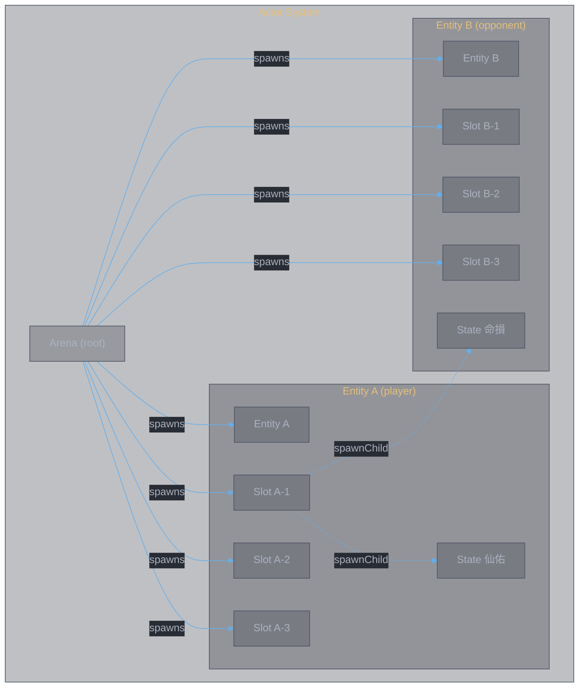
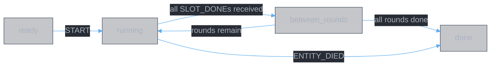
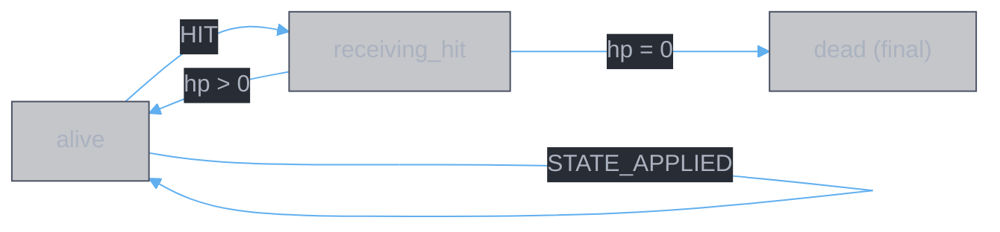
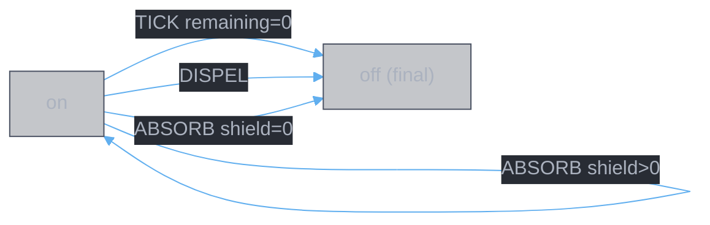
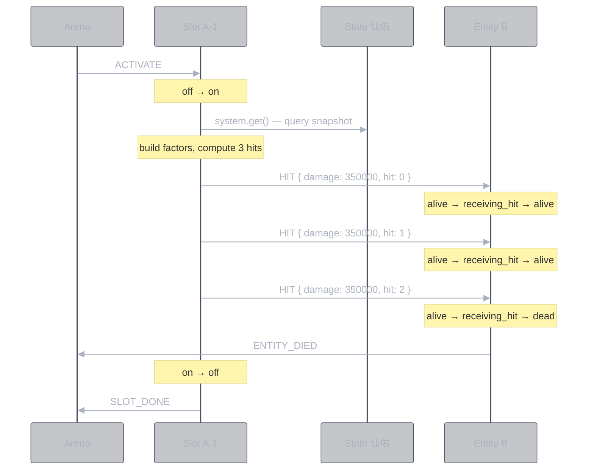
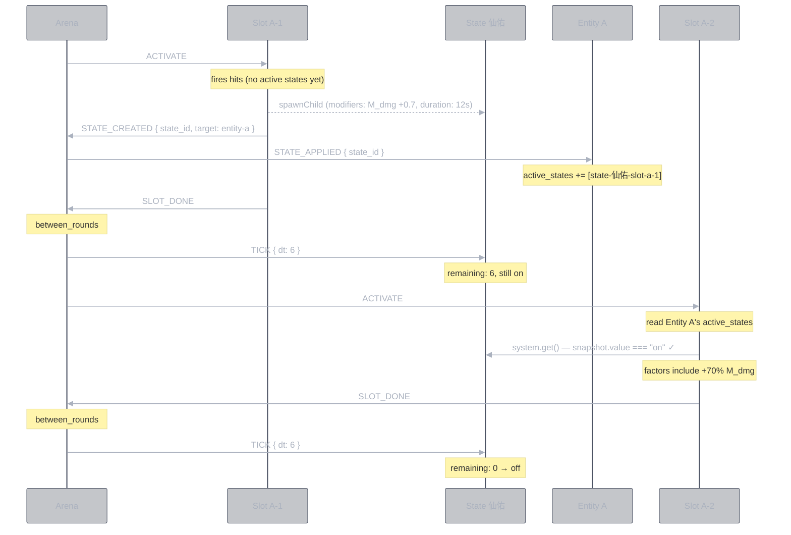
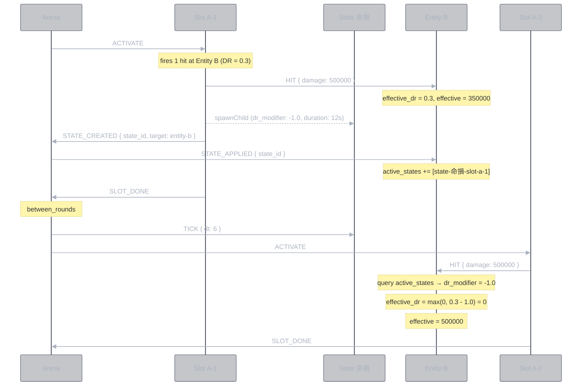
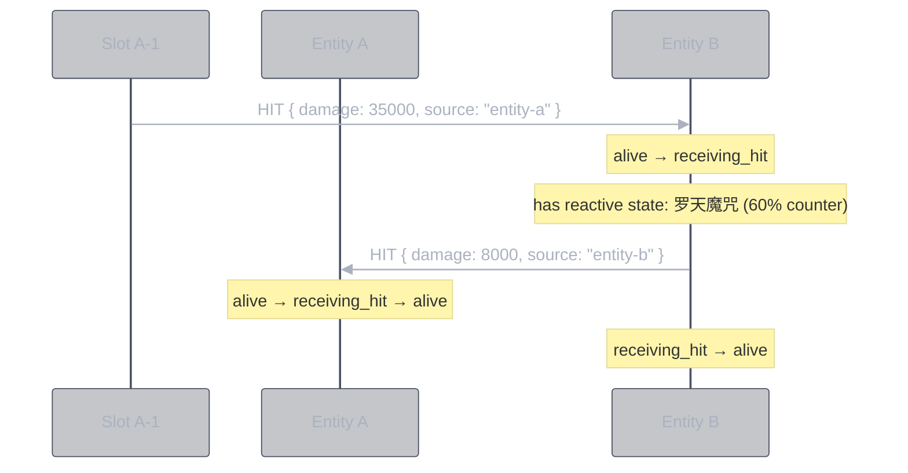

<style>
body {
  max-width: none !important;
  width: 95% !important;
  margin: 0 auto !important;
  padding: 20px 40px !important;
  background-color: #282c34 !important;
  color: #abb2bf !important;
  font-family: -apple-system, BlinkMacSystemFont, "Segoe UI", Helvetica, Arial, sans-serif !important;
  line-height: 1.6 !important;
  -webkit-print-color-adjust: exact !important;
  print-color-adjust: exact !important;
}

h1, h2, h3, h4, h5, h6 {
  color: #ffffff !important;
}

a {
  color: #61afef !important;
}

code {
  background-color: #3e4451 !important;
  color: #e5c07b !important;
  padding: 2px 6px !important;
  border-radius: 3px !important;
}

pre {
  background-color: #2c313a !important;
  border: 1px solid #4b5263 !important;
  border-radius: 6px !important;
  padding: 16px !important;
  overflow-x: auto !important;
}

pre code {
  background-color: transparent !important;
  color: #abb2bf !important;
  padding: 0 !important;
  border-radius: 0 !important;
  font-size: 13px !important;
  line-height: 1.5 !important;
}

table {
  border-collapse: collapse !important;
  width: auto !important;
  margin: 16px 0 !important;
  table-layout: auto !important;
  display: table !important;
}

table th,
table td {
  border: 1px solid #4b5263 !important;
  padding: 8px 10px !important;
  word-wrap: break-word !important;
}

table th:first-child,
table td:first-child {
  min-width: 60px !important;
}

table th {
  background: #3e4451 !important;
  color: #e5c07b !important;
  font-size: 14px !important;
  text-align: center !important;
}

table td {
  background: #2c313a !important;
  font-size: 12px !important;
  text-align: left !important;
}

blockquote {
  border-left: 3px solid #4b5263 !important;
  padding-left: 10px !important;
  color: #5c6370 !important;
  background-color: #2c313a !important;
}

strong {
  color: #e5c07b !important;
}
</style>

# Combat Simulator: Actor Architecture

**Date:** 2026-03-11
**Status:** Design v1.0 — implemented, 28 tests passing

---

## 1. Actor Inventory

Four actor types. Each is an independent state machine communicating via events.

| Actor | systemId pattern | Instances | States | Purpose |
|:------|:----------------|:----------|:-------|:--------|
| **Arena** | `arena` | 1 | `ready → running ↔ between_rounds → done` | Root actor. Spawns all others. Owns the clock. |
| **Entity** | `entity-a`, `entity-b` | 2 | `alive → receiving_hit → alive/dead` | HP owner. Receives damage, applies DR. One machine definition, two instances. |
| **Slot** | `slot-a-1` … `slot-b-6` | 12 | `off → on → off` | Fires hits on activation. Pure trigger. |
| **State Effect** | `state-仙佑-slot-a-1` | dynamic | `on → off` | Duration-gated effect. Queryable state. Covers buffs, debuffs, DoTs — one machine. |

> **Key principle:** Entity is one machine definition instantiated twice with different parameters (HP, ATK, DR). State Effect is one machine definition — no buff/debuff split. The consumer reads whatever fields are relevant.



**One machine, two instances.** Entity A and Entity B run the same `entityMachine` code — only the input parameters differ (HP, ATK, SP, DEF). This mirrors how real games model symmetric opponents. Precedent: [XState Rock Paper Scissors](https://github.com/statelyai/xstate/tree/main/examples) uses one `playerMachine` spawned twice.

---

## 2. Actor State Diagrams

### 2.1 Arena



The arena is **just a clock + scheduler**. It does not compute damage or manage HP. It:
- Sends `ACTIVATE` to current round's slots (both sides fire simultaneously)
- Tracks `slots_done` / `slots_expected` — waits for all slots in a round before transitioning
- Sends `TICK` to all registered state effects between rounds
- Routes `STATE_CREATED` events to affected entities
- Spawns SP shields at combat start (`sp × sp_shield_ratio` per entity)
- Ends combat on `ENTITY_DIED` or when all rounds are done

### 2.2 Entity



The entity owns its HP, parametric DR (`def / (def + K)`), and a single `active_states: string[]` list. On `HIT`:

1. Compute base DR: `def / (def + dr_constant)`
2. Query own `active_states` for DR modifiers — sum all `dr_modifier` fields from active state effects
3. Clamp effective DR to `[0, 1]`
4. Check active states for shields — send `ABSORB` to absorb damage before DR
5. Apply DR to remaining damage: `effective = remaining × (1 - effective_dr)`
6. Reduce HP
7. Check active states for reactive counters (`counter_damage > 0`) — fire `HIT` back to source
8. Guards route to `alive` or `dead`

On `STATE_APPLIED`: add the state effect's systemId to `active_states`. No classification needed — the entity doesn't care whether it's a "buff" or "debuff". It just has a list of active state references.

**Context:**
```typescript
context: {
  id: string;
  hp: number;
  max_hp: number;
  atk: number;
  sp: number;                  // 灵力
  def: number;                 // 守御 (raw value)
  dr_constant: number;         // K in DR = def / (def + K)
  active_states: string[];     // systemIds of all active state effects on this entity
  damage_log: DamageEntry[];
}
```

### 2.3 Slot


On entry to `on`:
1. Read owner entity's `active_states` via `system.get()`
2. For each active state: query its snapshot for `modifiers` (factor vector deltas)
3. Build combined `FactorVector` (base + sum of active modifier deltas)
4. Compute N hits via `resolveHit()` (pure function)
5. `sendTo` target entity: N × `HIT` events
6. `spawnChild` any state effects defined in the slot
7. `sendTo` arena: `STATE_CREATED` (for each spawned state, so arena can route to affected entity)
8. `sendTo` arena: `SLOT_DONE`

The slot is **stateless between activations**. It doesn't hold results — it fires events and goes back to `off`.

### 2.4 State Effect



A state effect is **passive and queryable** by default. DoTs (`damage_per_tick > 0`) also send `HIT` events on each TICK. Other actors read its snapshot to check:
- Is it `on`?
- What are its `modifiers`? (factor vector deltas — M_dmg, M_skill, etc.)
- What is its `dr_modifier`? (DR delta — positive = more defense, negative = DR reduction)
- What is its `healing_modifier`? (healing delta)

**One machine, many roles.** The same `stateEffectMachine` handles:

| Role | `modifiers` | `dr_modifier` | `damage_per_tick` | `shield_hp` | Example |
|:-----|:-----------|:-------------|:-----------------|:-----------|:--------|
| Self-buff | `{ M_dmg: 0.7 }` | `0` | `0` | `0` | 仙佑 (+70% dmg) |
| DR debuff | `{}` | `-1.0` | `0` | `0` | 命損 (-100% DR) |
| DoT | `{}` | `0` | `5000` | `0` | 噬心 (damage/tick) |
| Shield | `{}` | `0` | `0` | `50000` | 护体 (absorb) |
| Counter | `{}` | `0` | `0` | `0` | 罗天魔咒 (`counter_damage: 8000`) |
| Mixed | `{ M_dmg: 0.3 }` | `-0.2` | `0` | `0` | (hypothetical) |

The consumer decides what to read:
- **Slot** reads `modifiers` from owner's active states → builds factor vector
- **Entity** reads `dr_modifier` from own active states → adjusts effective DR on HIT
- Nobody classifies a state as "buff" or "debuff" — the fields speak for themselves

**Context:**
```typescript
context: {
  id: string;
  remaining: number;          // seconds until expiry
  stacks: number;             // stack count (1 = single application)
  initial_duration: number;   // for STACK refresh
  modifiers: Partial<FactorVector>;  // factor deltas (may be empty)
  dr_modifier: number;        // DR delta (0 = no effect)
  healing_modifier: number;   // healing delta (0 = no effect)
  damage_per_tick: number;    // > 0 makes this a DoT (raw % of ATK)
  shield_hp: number;          // > 0 makes this a shield
  counter_damage: number;     // > 0 makes this a reactive trigger
  target_entity: string;      // who to HIT (for DoT/counter)
  owner_entity: string;       // who owns this (for ATK lookup on DoT ticks)
}
```

**Events:**
```typescript
| TICK { dt }    | decrement remaining, fire HIT if DoT |
| DISPEL         | transition to off                     |
| STACK          | increment stacks, optionally refresh  |
| ABSORB { amt } | decrement shield_hp, off if depleted  |
```

---

## 3. Component Contracts (Event Interfaces)

### 3.1 Events by Actor

| Actor | Receives | Sends |
|:------|:---------|:------|
| **Arena** | `ENTITY_DIED`, `SLOT_DONE`, `STATE_CREATED` | `START`, `ACTIVATE` (to slots), `TICK` (to state effects), `STATE_APPLIED` (to entities) |
| **Entity** | `HIT`, `STATE_APPLIED` | `ENTITY_DIED` (to arena) |
| **Slot** | `ACTIVATE` | `HIT` (to target entity), `SLOT_DONE` (to arena), `STATE_CREATED` (to arena), `spawnChild` (state effects) |
| **State Effect** | `TICK`, `DISPEL`, `STACK`, `ABSORB` | `HIT` (to target, if DoT) — otherwise passive/queryable |

### 3.2 Event Schemas

```typescript
// Arena → Slot
type ACTIVATE = { type: "ACTIVATE" }

// Slot → Entity (target)
type HIT = {
  type: "HIT";
  damage: number;          // pre-computed raw damage (before DR)
  source: string;          // systemId of attacker entity
  is_crit: boolean;
  hit_index: number;       // which hit in the sequence
}

// Arena → State Effects
type TICK = {
  type: "TICK";
  dt: number;              // seconds elapsed
}

// Slot → Arena
type SLOT_DONE = {
  type: "SLOT_DONE";
  slot_id: string;
}

// Slot → Arena (for routing to affected entity)
type STATE_CREATED = {
  type: "STATE_CREATED";
  state_id: string;        // systemId of spawned state effect
  target_entity: string;   // systemId of entity that should track this state
}

// Arena → Entity (routed from STATE_CREATED)
type STATE_APPLIED = {
  type: "STATE_APPLIED";
  state_id: string;        // systemId of state effect to add to active_states
}

// Entity → Arena
type ENTITY_DIED = {
  type: "ENTITY_DIED";
  entity_id: string;
}

// State Effect events
type DISPEL = { type: "DISPEL" }
type STACK = { type: "STACK" }
type ABSORB = { type: "ABSORB"; amount: number }
```

Note: `STATE_APPLIED` has no `kind` field. The entity just adds the state_id to its flat `active_states` list. When it needs DR modifiers, it queries each state and reads `dr_modifier`. When a slot needs factor modifiers, it queries each state and reads `modifiers`. No classification needed.

### 3.3 Contract: Who computes damage?

**The slot computes raw damage. The entity applies its own defenses.**

```
Slot (attacker side)              Entity (defender side)
─────────────────────             ─────────────────────
1. read owner entity's            1. receive HIT { damage }
   active_states                  2. read own active_states
2. query each state for              for dr_modifier
   .modifiers (factor deltas)     3. effective_dr = base_dr
3. build FactorVector                + sum(dr_modifiers)
   (base + buff deltas)           4. clamp to [0, 1]
4. resolve raw hit damage         5. effective = damage × (1-DR)
   (pure function)                6. update HP
5. sendTo target: HIT             7. guard: alive or dead?
```

This split is correct because:
- The **attacker** knows their ATK, active state modifiers — they determine raw output
- The **defender** knows their DR, active state DR modifiers — they determine how much gets through
- Neither needs to read the other's internal state

### 3.4 Arena routing: how state effects reach the right entity

The slot knows which entity should be affected (from `StateDef.target`):
- `target: "self"` → route to `slot.owner_entity`
- `target: "opponent"` → route to `slot.target_entity`

The slot resolves this at spawn time and tells the arena via `STATE_CREATED { target_entity }`. The arena then forwards `STATE_APPLIED { state_id }` to that entity. The state effect machine itself has no `target` field — routing is external, handled by the slot + arena.

---

## 4. Logical Flows

### 4.1 Single Slot Activation (happy path)



### 4.2 State Effect Cross-Slot (self buff amplifies next slot)



### 4.3 State Effect Cross-Slot (opponent debuff reduces DR)



### 4.4 Reactive Trigger (counter on being hit)



---

## 5. Design Decisions

### 5.1 One machine definition, two instances (Entity)

Player and opponent run the same `entityMachine` — only input parameters differ. This is the standard XState pattern for symmetric game actors.

```typescript
// Arena context factory
context: ({ input, spawn }) => ({
  entity_a: spawn(entityMachine, { systemId: "entity-a", input: input.entity_a }),
  entity_b: spawn(entityMachine, { systemId: "entity-b", input: input.entity_b }),
  // same machine, different params
})
```

### 5.2 Unified state effects (no buff/debuff split)

State effects have optional fields: `modifiers`, `dr_modifier`, `healing_modifier`. The entity stores a single `active_states` list — no `buff_ids` / `debuff_ids` split.

**Why not separate types?**
- The machine behavior is identical: on/off with duration, queryable context
- Classification is the consumer's job, not the state's job
- A "buff" with `{ M_dmg: 0.7, dr_modifier: 0 }` and a "debuff" with `{ modifiers: {}, dr_modifier: -1.0 }` are structurally the same — duration-gated optional fields
- Adding new field types (e.g., `crit_modifier`) requires zero architectural changes

**Who reads what:**
- Slot → reads `modifiers` from owner entity's active states (for factor amplification)
- Entity → reads `dr_modifier` from own active states (for DR computation on HIT)

### 5.3 Slot computes all hits at once (enqueueActions), not one-at-a-time

The slot sends N `HIT` events via `enqueueActions`. Each HIT is a separate event processed as its own macrostep by the entity. But the slot computes all hit damages up front.

**Why not one-at-a-time?** Per-hit escalation (+5%/hit) depends only on hit index, not on defender state. The slot knows hit 1 = base, hit 2 = base × 1.05, etc. No need to wait for entity response.

**Exception:** If we later need "stop hitting if target dies mid-sequence" — the entity transitions to `dead` and ignores further HITs. The slot doesn't need to know.

### 5.4 State effects are pull (query), not push (event)

State effects don't broadcast "I'm active!" to all consumers. Slots and entities query state effect snapshots when they need values. This avoids N×M event spam and keeps state effects simple (just on/off + fields).

**XState mechanism:** `system.get('state-仙佑-slot-a-1').getSnapshot()` — read `.value` (on/off) and `.context.modifiers`.

### 5.5 Arena as event router

State effects are spawned by slots but need to be tracked by entities. The routing flow:

1. Slot spawns state effect via `spawnChild` with a `systemId`
2. Slot tells arena: `STATE_CREATED { state_id, target_entity }`
3. Arena tells target entity: `STATE_APPLIED { state_id }`
4. Entity adds `state_id` to its `active_states`

The arena is the only actor that needs to know the mapping. The state effect itself doesn't know which entity it belongs to — it's just a timer with fields.

### 5.6 Dead entities ignore further events

When entity transitions to `dead` (final state), XState stops the actor. Any queued HITs from remaining slot hits are simply dropped. No special "check if alive before hitting" logic needed.

### 5.7 DoT is a state effect with `damage_per_tick`

A DoT is the same state effect machine. When `damage_per_tick > 0`, the state effect sends `HIT` to its target on each `TICK`. When `damage_per_tick === 0`, it's passive (queryable only). Same on/off lifecycle, same duration tracking. The arena TICK drives it — no separate clock.

```typescript
// State effect context — DoT just has damage_per_tick > 0
context: {
  remaining: 12,
  modifiers: {},           // empty for pure DoT
  dr_modifier: 0,
  damage_per_tick: 550,    // raw % of ATK: (550/100) × ATK per tick
  target_entity: "entity-b", // who to HIT
  owner_entity: "entity-a",  // ATK source for damage computation
}
```

On TICK: `if (damage_per_tick > 0) sendTo(target_entity, { type: "HIT", damage: (damage_per_tick / 100) * owner_atk })`. The `damage_per_tick` is a raw percentage of ATK (e.g., 550 = 5.5× ATK). The owner's ATK is read dynamically via `system.get(owner_entity)` at tick time (§5.11 dynamic mode).

### 5.8 Stacking is a STACK event

When the same state effect is applied again to an entity that already has it, the arena sends `STACK` to the existing state effect actor instead of spawning a new one.

```
State effect receives STACK →
  assign({ stacks: context.stacks + 1 })
  optionally refresh duration (assign({ remaining: initial_duration }))
```

The `stacks` count can scale effect magnitude: `effective_modifier = base_modifier × stacks`. This is just context math, no architectural change.

### 5.9 Reactive triggers are part of HIT processing

When entity receives `HIT`, it checks its `active_states` for any with `counter_damage > 0`. If found, it sends `HIT` back to `event.source`. This is just additional logic in the entity's HIT action — no new actor type.

```
Entity receives HIT →
  1. apply DR (existing)
  2. reduce HP (existing)
  3. for each active state with counter_damage > 0:
     sendTo(event.source, { type: "HIT", damage: counter_damage })
```

### 5.10 Shields are state effects with `shield_hp`

A shield state effect has `shield_hp > 0`. When entity receives HIT, it checks active states for shields and sends `ABSORB { amount }` to the shield actor. The shield decrements its HP and transitions to `off` when depleted.

```
Entity receives HIT →
  1. check active states for shields
  2. sendTo(shield, { type: "ABSORB", amount: damage })
  3. shield responds: remaining_hp -= amount, if <= 0 → off
  4. entity applies remaining damage after absorption

Shield state effect receives ABSORB →
  absorbed = min(shield_hp, event.amount)
  shield_hp -= absorbed
  if shield_hp <= 0 → transition to off
```

### 5.11 Snapshot vs dynamic is per-effect configuration

When a DoT is spawned, it either:
- **Snapshots**: stores `damage_per_tick` computed at spawn time from current attacker stats (locked in)
- **Dynamic**: stores `owner_entity` and queries live ATK/buffs on each TICK

This is a configuration flag on `StateDef`, not an architectural choice. Most effects snapshot (simpler, matches game behavior). Dynamic is available for effects that explicitly need live stats.

---

## 6. Affix → Attribute → Combat Outcome

Every affix, regardless of its behavioral category (§9), ultimately mutates one of the **4 combat attributes** defined in `data/属性/战斗属性.md`. These attributes determine the player's state: alive or dead, strong or weak.

### 6.1 The 4 Attributes and What They Determine

| Attribute | 中文 | What it determines |
|:----------|:-----|:-------------------|
| **HP** (气血) | 气血 | **Alive or dead.** HP=0 → dead. The only lose condition. |
| **ATK** (攻击) | 攻击 | **How much damage you deal.** Every damage formula scales with ATK. |
| **SP** (灵力) | 灵力 | **How much damage you absorb.** SP is consumed to generate shields when hit. SP=0 → no more shields, you take full damage. |
| **DEF** (守御) | 守御 | **How much damage you resist.** DR = DEF/(DEF+K). At 99.9% DR, you take 0.1% of raw damage. |

Combat outcome is determined by the drift of these 4 values over time. The question is: **how does each affix change these drifts?**

### 6.2 The 7 Ways Affixes Mutate Attributes

Every affix, no matter how complex, does one (or more) of these 7 things:

```
┌───────────────────────────────────────────────────────────────────┐
│                    OPPONENT'S ATTRIBUTES                          │
│                                                                   │
│  ① Reduce opponent.HP     ← the kill path                        │
│     D_base, D_flat, D_ortho, DoT, true damage                    │
│     amplified by: M_dmg, M_skill, M_final, M_crit, sigma_R       │
│                                                                   │
│  ② Reduce opponent.SP     ← destroy shield capacity              │
│     D_res (灵力攻击/resonance damage)                              │
│     when SP=0, opponent loses all shield generation               │
│                                                                   │
│  ③ Weaken opponent.DEF    ← make opponent take more damage        │
│     DR_A debuff (reduce DEF effectiveness)                        │
│     D_res bypass (ignore % of DR)                                 │
│     神威冲云 (ignore ALL DR)                                       │
│                                                                   │
│  ④ Suppress opponent.HP recovery ← prevent healing                │
│     H_red (灵涸/灵枯/魔劫 — healing reduction debuff)              │
│                                                                   │
├───────────────────────────────────────────────────────────────────┤
│                    SELF ATTRIBUTES                                │
│                                                                   │
│  ⑤ Increase self.ATK effectiveness ← deal more damage            │
│     S_coeff buff (+x% ATK)                                       │
│     ATK% buff (直接增加攻击)                                       │
│                                                                   │
│  ⑥ Restore self.HP        ← survive longer                       │
│     H_A (healing per activation)                                  │
│     lifesteal (heal = x% of damage dealt)                         │
│                                                                   │
│  ⑦ Protect self.HP        ← take less damage                     │
│     DR_A buff (increase own damage reduction)                     │
│     shields from SP (灵力→护盾) or S_A (affix shields)             │
│                                                                   │
└───────────────────────────────────────────────────────────────────┘
```

### 6.3 Mapping: Affix Category → Attribute Mutation

Each of the 7 affix categories from [affix-taxonomy.md](../model/affix-taxonomy.md) maps to attribute mutations:

| Category | What it does | Which mutation | Example |
|:---------|:-------------|:---------------|:--------|
| **1. Passive multipliers** | Amplify other effects | ① amplify (buff_strength), ⑤ amplify (ATK%), ⑦ amplify (shield%) | 龙象护身 → buff_strength +300% → all ⑤ buffs 4× stronger |
| **2. Conditional multipliers** | Scale damage with combat state | ① amplify (M_dmg per HP%), ③ bypass (ignore DR) | 意坠深渊 → floor lost HP% at 11% → ① always has minimum M_dmg bonus |
| **3. Flat damage additions** | Add extra damage instances | ① add (D_flat per hit) | 斩岳 → extra x% ATK damage per hit |
| **4. State-creating effects** | Create DoTs, debuffs, shields | ① tick (DoT), ③ weaken (DR debuff), ④ suppress (H_red), ⑥ heal (lifesteal), ⑦ shield | 玄心剑魄 → 【噬心】DoT → ① tick damage to opponent.HP |
| **5. Cross-skill effects** | Carry bonus to next skill | ① amplify next (M_skill carry) | 灵威 → next skill +x% M_skill → ① bigger next hit |
| **6. Reactive triggers** | Fire on being attacked | ① counter (damage attacker), ⑥ reactive heal, ⑤ stack ATK | 罗天魔咒 → on attacked → ① DoT on attacker |
| **7. State-referencing** | Read/modify named states | varies — depends on referenced state | 魔神降世 → per debuff stack → ⑤ +ATK% |

### 6.4 The Two Kill Paths

There are two parallel channels to reduce opponent.HP to zero:

**Direct path (① HP damage):**
```
                  ┌─── D_base ──┐
                  │              │
ATK × (1+S_coeff) ──→ raw_damage ──× multipliers ──→ × (1-DR) ──→ opponent.HP -= effective
                  │              │       │
                  ├─── D_flat ──┘  (1+M_dmg)
                  │                (1+M_skill)
                  └─── D_ortho     (1+M_final)
                    (% max HP)     sigma_R
                                   (1+M_crit)
```

**Indirect path (② SP depletion → remove shields → HP takes full damage):**
```
D_res damage ──→ opponent.SP -= D_res_dmg
                    │
                    └─→ when SP=0: opponent can no longer generate shields
                         └─→ raw_damage hits HP directly (only DR remains)
```

Both paths are defined by the game. The indirect path (SP depletion) is currently NOT implemented in the simulator.

### 6.5 Concrete Example: How One Affix Reaches HP

**灵犀九重** (Sword school affix, Category 1):

```
灵犀九重 equipped on slot
    │
    ├─→ provides D_res: 3.22 (model.yaml)
    │     → D_res = 0.032 fractional (3.2% DR bypass)
    │     → opponent's effective DR = 99.9% × (1 - 0.032) = 96.7%
    │     → damage through DR: 0.1% → 3.3%  (33× more damage to opponent.HP)
    │     → mutation: ③ weaken opponent.DEF
    │
    └─→ provides sigma_R: 0.43 (model.yaml)
          → sigma_R = sqrt(1² + 0.43²) = 1.09 (9% raw damage bonus)
          → mutation: ① amplify damage to opponent.HP
```

**Result:** with 灵犀九重 on slot 1, 春黎剑阵's 5 hits each deal 1.49京 effective damage (vs ~0.045京 without it). Opponent dies in round 1.

### 6.6 Concrete Example: Attribute State Over Time

A 6-round combat between ye1 and ye2 (both with equal base stats):

```
Round  ye1.HP     ye2.HP     Key mutations
─────  ─────────  ─────────  ──────────────────────────────
  1    6.60京     5.82京     ye1: ⑤ S_coeff buff (甲元仙符 self_buff)
       (100%)     (88.2%)    ye2: ⑤ S_coeff buff (甲元仙符 self_buff)
                             ye2: ④ H_red debuff on ye1 (甲元仙符)
                             ye1: ④ H_red debuff on ye2

  2    5.82京     3.33京     ye1: ① 春黎剑阵 5 hits (with M_dmg=0.50 from 心逐神随)
       (88.2%)    (50.5%)    ye2: ① 大罗幻诀 5 hits
                             ye1: ① DoT tick from 春黎剑阵

  3    3.73京     0.00京     ye1: ① 皓月剑诀 10 hits (M_skill=5.55 from 无极剑阵)
       (56.5%)    (DEAD)     ye2: killed by accumulated ① damage

Winner: ye1 (42.1% HP remaining)
```

Each round, affixes resolve to attribute mutations (①–⑦). The accumulation of these mutations determines who dies first.

### 6.7 Data Pipeline (Implementation)

```
effects.yaml          affix definitions (玄心剑魄: dot, damage_per_tick=550, duration=8)
    ↓ [map.ts]
model.yaml            factors per effect (D_ortho: 550, temporal: 8s duration_based)
    ↓ [bridge.ts]     classify → base_factors | conditional_factors | states_to_create
SlotDef               per-hit factors + conditionals + state definitions
    ↓ [slot actor]    evaluate conditionals (read target HP%, debuff count)
                      compute damage (resolveHit) → send HIT/HEAL events
    ↓ [entity actor]  apply shields → apply DR → apply DR_bypass → mutate HP
                      apply healing with H_red reduction → mutate HP
    ↓
HP = 0?  →  DEAD
```

### 6.8 Implementation Status

| Mutation | Route | Status |
|:---------|:------|:-------|
| ① Reduce opponent.HP (direct damage) | D_base/D_flat/D_ortho → resolveHit → HIT | **DONE** |
| ① Amplify (multipliers) | M_dmg/M_skill/M_final/M_crit/sigma_R | **DONE** |
| ① Amplify (conditional) | per_enemy_lost_hp, target_hp_below, ignore_dr | **DONE** |
| ① Tick (DoT) | damage_per_tick × ATK → HIT on TICK | **DONE** |
| ② Reduce opponent.SP | D_res → SP damage channel | **NOT IMPL** — SP only used for initial shield |
| ③ Weaken opponent.DEF | DR_A debuff on state effect | **DONE** |
| ③ Bypass opponent.DEF | D_res factor → dr_bypass on HIT | **DONE** |
| ④ Suppress opponent healing | H_red → healing_modifier on state | **DONE** — applied to HEAL events |
| ⑤ Increase self.ATK | S_coeff buff on state effect | **DONE** |
| ⑥ Restore self.HP | H_A factor → HEAL event to self | **DONE** |
| ⑥ Lifesteal | heal = x% of damage dealt | **NOT IMPL** |
| ⑦ Protect self.HP (DR buff) | DR_A buff on state effect | **DONE** |
| ⑦ Protect self.HP (SP shield) | SP × ratio → shield at combat start | **DONE** |
| ⑦ Protect self.HP (affix shield) | S_A → shield_hp on state | **NOT IMPL** |
| Stacking (debuff count → damage) | per_debuff_stack_damage | **NOT IMPL** |
| Cross-skill carry (灵威) | next-skill M_skill bonus | **NOT IMPL** |

---

## 7. File Layout

```
lib/simulator/
  damage.ts          # resolveHit(), resolveDoTTick() — pure functions
  types.ts           # event schemas, input types, shared interfaces
  actors/
    arena.ts         # arena machine — root, clock, scheduler, event router
    entity.ts        # entity machine — HP, DR, active_states, damage_log
    slot.ts          # slot machine — off/on, compute + fire hits, spawn states
    state-effect.ts  # state effect machine — on/off, duration, optional fields
```

---

## 8. Implementation Status

Architecture validated with 45 passing tests (36 machine + 9 bridge coverage):

| Component | What was proved |
|:----------|:---------------|
| Arena | Spawns entities + slots + SP shields via context factory, sends ACTIVATE in sequence, handles ENTITY_DIED, dual-slot round counter |
| Entity | Receives HIT, applies parametric DR (`def/(def+K)` + state modifiers), DR bypass (D_res), shield absorption, reactive counters, HEAL with H_red reduction, tracks HP, transitions to dead |
| Slot | On ACTIVATE: queries owner's active states + target state, evaluates 14 conditional types (per_hp, per_stack, escalation, probability, DR reduction, crit), per-hit escalation in hit loop, self HP cost, lifesteal, self heal, spawns state effects |
| State Effect | On/off with duration, queryable modifiers and dr_modifier, ATK-scaled DoT damage, STACK with duration refresh, ABSORB for shields, burst_damage/on_dispel_damage fields |
| Cross-slot buff | State effect from slot 1 amplifies slot 2 damage via factor modifier pull |
| Cross-slot debuff | State effect from slot 1 reduces target DR for slot 2 hits |
| Expiry | Expired state effect stops affecting DR (confirmed with 3-slot test) |
| Death | Entity death stops combat, sets winner |
| Bridge | Config → ArenaDef: explicit routing for ALL effect types — no silent drops. base_factors, conditional_factors (14 types), states_to_create (20+ types), slot actions (5 types), §9 modifiers, meta modifiers, summon |

**Every effect type in model.yaml/effects.yaml is routed to a handler.** Previously-excluded types (on_dispel, shield_destroy_damage, per_hit_escalation, self_damage_taken_increase, lifesteal, self_hp_cost, probability_multiplier, etc.) are now explicitly handled via conditional_factors, states_to_create, or slot-level actions.

---

## 9. Affix Coverage Gap Analysis

Maps each category from [affix-taxonomy.md](../model/affix-taxonomy.md) to the simulator's current implementation status. **The simulator cannot produce trustworthy build comparisons until the gaps marked NOT IMPLEMENTED are addressed.**

### Category 1: Passive Multipliers

These are §9 meta-modifiers that amplify other effects. The bridge collects them via `collectSideModifiers()`.

| Affix | Feature | Status |
|:------|:--------|:-------|
| 咒书 | debuff_strength +x% | DONE |
| 清灵 | buff_strength +x% | DONE |
| 业焰 | all_state_duration +x% | DONE |
| 灵盾 / 青云灵盾 | shield value +x% | PARTIAL — shield StateDef created, strength scaling TODO |
| 摧山 / 摧云折月 | ATK% S_coeff | DONE — base_factors S_coeff |
| 通明 | D_res (DR bypass) + sigma_R | DONE — base_factors + entity applies bypass |
| 灵犀九重 | D_res + sigma_R | DONE |
| 破碎无双 | ATK% + damage% + crit% | DONE — permanent factors extracted |
| 古魔之魂 | dot_damage_increase | DONE — meta modifier applied to DoT damage_per_tick |
| 天魔真解 | dot_frequency_increase | DONE — meta modifier extracted (tick interval TODO in actor) |
| 龙象护身 | buff_strength +300% | DONE |
| 长生天则 | H_A healing | DONE — base_factors H_A, entity HEAL handler |
| 明王之路 | M_final | DONE |
| 仙露护元 | buff_duration +300% | DONE |
| 真言不灭 | all_state_duration +55% | DONE |

### Category 2: Conditional Multipliers

Slot reads target HP%, self HP%, debuff count, debuff/buff stacks at activation time and evaluates conditional factors.

| Affix | Condition | Status |
|:------|:----------|:-------|
| 击瑕 / 乘胜逐北 | enemy in control state | PARTIAL — conditional_damage from effects.yaml |
| 怒目 | enemy HP <30% | DONE — target_hp_below conditional |
| 溃魂击瑕 | enemy HP <30% | DONE — conditional_crit |
| 战意 / 怒血战意 | per 1% own lost HP | DONE — per_self_lost_hp conditional |
| 吞海 / 贪狼吞星 | per 1% enemy lost HP | DONE — per_enemy_lost_hp conditional |
| 天灵怒威 | own HP >20%, per 3% excess | PARTIAL — per_self_lost_hp (threshold variant TODO) |
| 意坠深渊 | lost HP calculation floor | DONE — min_lost_hp_threshold conditional |
| 引灵摘魂 | enemy has debuff | DONE — target_has_debuff conditional |
| 天命有归 | probability → guaranteed | DONE — probability_to_certain + probability_multiplier |
| 焚心剑芒 | per 5% enemy lost HP | DONE — per_enemy_lost_hp |
| 破釜沉舟 | damage +x%, self takes +y% | DONE — M_skill + self_damage_taken_increase StateDef |
| 神威冲云 | ignore enemy DR | DONE — ignore_dr conditional (D_res=1.0) |
| 无极剑阵 | skill damage +x%, enemy skill DR | DONE — M_skill + enemy_dr_reduction conditional |

### Category 3: Flat Damage Additions

| Affix | Trigger | Status |
|:------|:--------|:-------|
| 斩岳 / 破灭天光 | on hit: extra x% ATK | DONE — D_flat in base_factors |
| 破竹 / 心火淬锋 | per segment: escalation | DONE — per_hit_escalation conditional, applied per-hit in loop |
| 天鹤祈瑞 | per final_damage_bonus% → ATK% | PARTIAL — conditional_damage from raw data |
| 九雷真解 | on state application: thunder | PARTIAL — on_buff_debuff_shield_trigger StateDef |

### Category 4: State-Creating Effects

| Affix | Created State | Status |
|:------|:-------------|:-------|
| 玄心剑魄 | 噬心 DoT + dispel burst | DONE — DoT + on_dispel StateDef with on_dispel_damage |
| 天哀灵涸 | 灵涸 healing reduction | DONE — h_mod on StateDef |
| 天倾灵枯 | 灵枯 healing reduction + HP<30% amp | DONE — h_mod + conditional_debuff StateDef |
| 无相魔威 | 魔劫 heal reduction + damage amp | PARTIAL — h_mod + delayed_burst StateDef |
| 祸星无妄 | random debuff | PARTIAL — routed to stochastic handler |
| 玄女护心 | shield | DONE — shield StateDef with shield_hp |
| 奇能诡道 | extra debuff stack | DONE — per_debuff_stack conditional + meta modifiers |
| 心魔惑言 | extra debuff stacks + per-5-stack bonus | DONE — per_debuff_stack conditional |
| 真极穿空 | extra buff stacks + per-5-stack bonus | DONE — per_buff_stack conditional |
| 仙灵汲元 | lifesteal | DONE — slot-level lifesteal action |
| 索心真诀 | per debuff stack → %maxHP true damage | DONE — per_debuff_stack conditional (D_ortho) |

### Category 5: Cross-Skill Effects

| Affix | Mechanism | Status |
|:------|:----------|:-------|
| 灵威 / 天威煌煌 | next skill +x% M_skill | DONE — next_skill StateDef (coverage_type: next_skill) |
| 破虚 | next skill hits get lost-HP% damage | PARTIAL — next_skill StateDef + self_lost_hp_damage conditional |
| 惊神剑光 | per segment → next segment bonus | PARTIAL — per_hit_escalation conditional |

### Category 6: Reactive Triggers

| Affix | Trigger | Status |
|:------|:--------|:-------|
| 天狼之啸 | on attacked → stack damage | DONE — counter_buff StateDef with counter_damage |
| 天狼战意 | per stack → +ATK% | PARTIAL — counter_buff modifiers (stacking TODO) |
| 罗天魔咒 | on attacked → 30/60% chance DoT | DONE — counter_debuff StateDef |
| 魔妄吞天 | on attacked → debuff attacker | DONE — counter_debuff StateDef |
| 天煞破虚 | per second → dispel buff | PARTIAL — periodic_dispel routed to mechanic |
| 星猿复灵 | on damage dealt → heal | DONE — lifesteal slot action |
| 不灭魔体 | on damage taken → heal | PARTIAL — counter_buff with H_A modifier |
| 魔骨明心 | on hit + debuff → self heal + reduce DR | PARTIAL — conditional_heal_buff StateDef |

### Category 7: State-Referencing Mechanics

**PARTIAL.** `parent=` cross-references are tracked in effects.yaml. Shield_destroy_damage/dot, on_dispel, and on_shield_expire now route to StateDefs with appropriate damage fields. Full inter-state queries (e.g., reading another state's stack count) still need system.get() wiring in actors.

### Summary

| Category | Total affixes | Implemented | Partial | Missing |
|:---------|:-------------|:-----------|:--------|:--------|
| 1. Passive multipliers | 15 | 15 | 0 | 0 |
| 2. Conditional multipliers | 13 | 12 | 1 | 0 |
| 3. Flat damage additions | 4 | 2 | 2 | 0 |
| 4. State-creating effects | 11 | 8 | 3 | 0 |
| 5. Cross-skill effects | 3 | 1 | 2 | 0 |
| 6. Reactive triggers | 8 | 4 | 4 | 0 |
| 7. State-referencing | 12+ | 0 | 8 | 4 |
| **Total** | **66+** | **42** | **20** | **4** |

**Coverage: ~64% fully implemented, ~30% partially, ~6% remaining gaps.**

All effect types from model.yaml/effects.yaml are now routed to explicit handlers (base_factors, conditional_factors, states_to_create, slot actions, §9 modifiers, or meta modifiers). No effect type is silently dropped. The remaining "partial" items need actor-level wiring (e.g., state-effect actors processing burst_damage on expiry, on_dispel_damage on DISPEL events, stacking increment logic).

### Remaining actor-level work

1. **State effect burst on expiry** — state-effect actor sends HIT when entering `off` state if `burst_damage > 0`
2. **State effect on_dispel reaction** — state-effect actor sends HIT on DISPEL if `on_dispel_damage > 0`
3. **Stacking increment** — entity or arena routes STACK events to state effects, actor increments `stacks` counter
4. **Cross-skill carry** — arena keeps `next_skill_buff` state between consecutive slot activations
5. **Shield events** — entity emits SHIELD_BROKEN when shield_hp reaches 0, triggering shield_destroy_damage/dot

---

## References

- [XState v5 Actor Model](https://stately.ai/docs/actors) — spawning, actor lifecycle
- [XState v5 Systems (systemId)](https://stately.ai/docs/system) — peer-to-peer via `system.get()`
- [XState v5 Actions](https://stately.ai/docs/actions) — `sendTo`, `raise`, `enqueueActions`, `spawnChild`
- [XState v5 Events & Transitions](https://stately.ai/docs/transitions) — `always` guards, eventless transitions
- [Thoughts on Building a Game with XState](https://asukawang.com/blog/thoughts-on-building-a-game-with-xstate/) — entity as actor, damage as event
- [systemId discussion (GitHub #4651)](https://github.com/statelyai/xstate/discussions/4651) — actor discovery patterns

---

## Document History

| Version | Date | Changes |
|:--------|:-----|:--------|
| 0.1 | 2026-03-11 | Initial actor architecture design |
| 0.2 | 2026-03-11 | Unified model: one entity machine (two instances), one state effect machine (no buff/debuff split), single `active_states` list, spike validation results |
| 1.0 | 2026-03-11 | Final design: DoT, stacking, reactive triggers, shields, snapshot/dynamic — all resolved as events on existing machines. No new actor types needed. |
| 1.1 | 2026-03-11 | Sync with implementation: entity uses parametric DR (`def/(def+K)`) instead of `base_dr`, no crit stats (M_crit from book effects), SP shield at combat start, ATK-scaled DoT, entity HIT flow includes shield absorption + reactive counter, state effect adds `initial_duration` + `owner_entity`, 28 tests |
| 1.2 | 2026-03-11 | §9 Affix Coverage Gap Analysis: maps all 66+ affixes from affix-taxonomy.md to implementation status. Coverage: 9% full, 27% partial, 73% missing. Build comparison results unreliable until conditional multipliers, DR bypass, stacking model are implemented. |
| 1.3 | 2026-03-11 | §6 Effect → Attribute Mutation Pipeline: documents the core data path from effects.yaml → model.yaml factors → damage formula → attribute mutations (HP, ATK, SP, DEF). Identifies missing SP damage channel (D_res/灵力), healing system (H_A), and healing suppression (H_red). These are fundamental attribute channels, not optional features. |
| 1.4 | 2026-03-11 | §6 rewritten: "Affix → Attribute → Combat Outcome". 7 mutation types (①–⑦), D_res DR bypass, H_A healing, 6 conditional types, D_ortho per-hit fix. 36 tests. |
| 1.5 | 2026-03-11 | **Comprehensive effect type routing.** Replaced EXCLUDED_FROM_BASE blacklist (27 silently-dropped types) with explicit routing table: every effect type in model.yaml/effects.yaml flows to base_factors, conditional_factors (14 types), states_to_create (20+ types), slot actions (5 types), §9 modifiers, or meta modifiers. New: per_hit_escalation, per_debuff_stack, per_buff_stack, self_lost_hp_damage, probability_multiplier, enemy_dr_reduction, conditional_crit, self_damage_taken_increase (negative DR StateDef), on_dispel/shield_destroy_damage/delayed_burst StateDefs, self_hp_cost/lifesteal/self_heal/self_cleanse/buff_steal slot actions, dot_damage_increase meta modifier. Coverage: 64% full, 30% partial, 6% gaps. 45 tests. |
