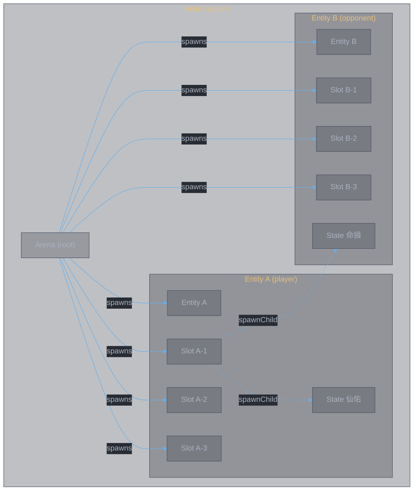
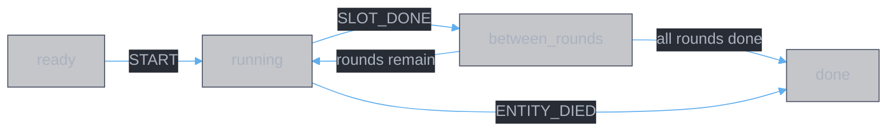
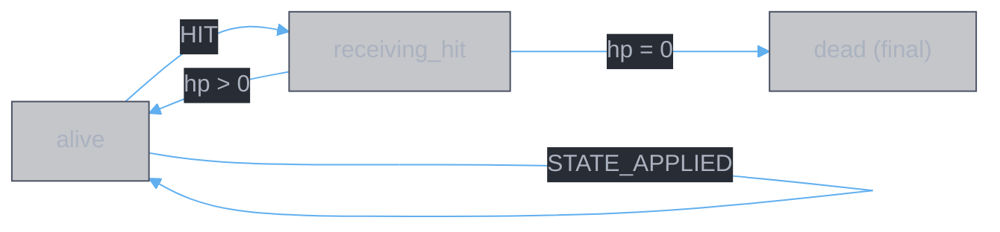
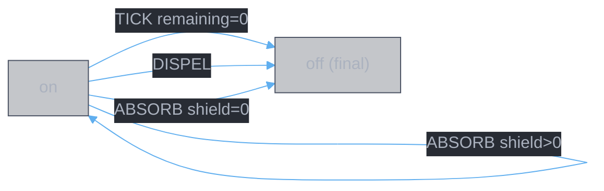
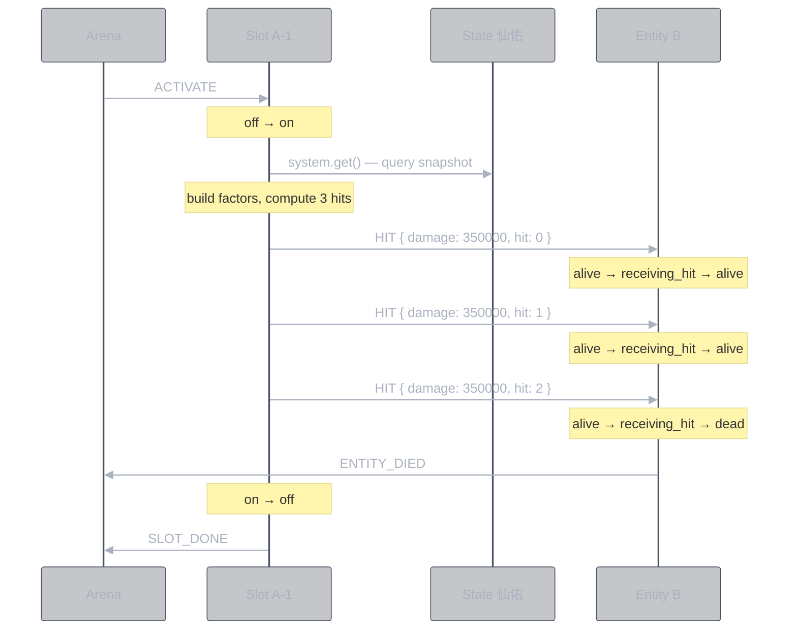
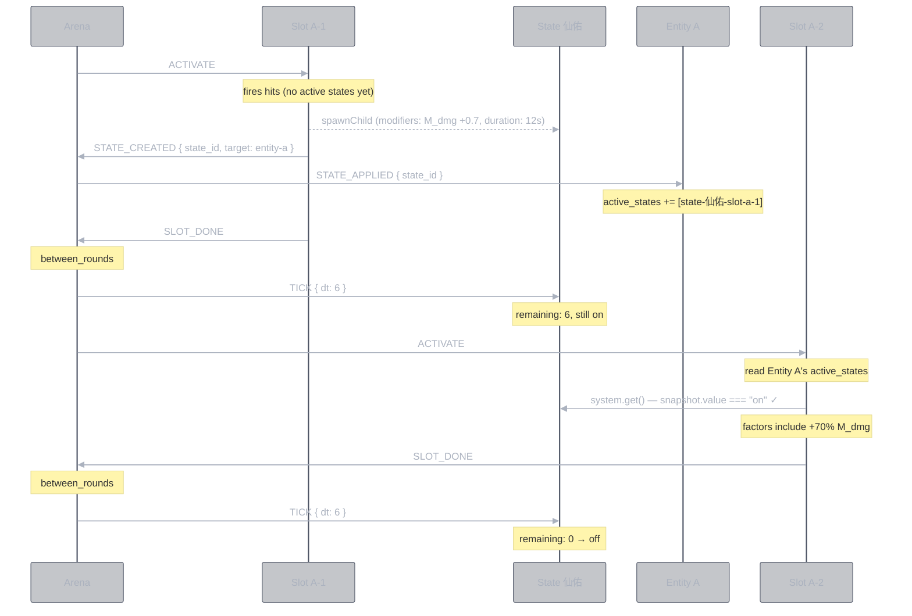
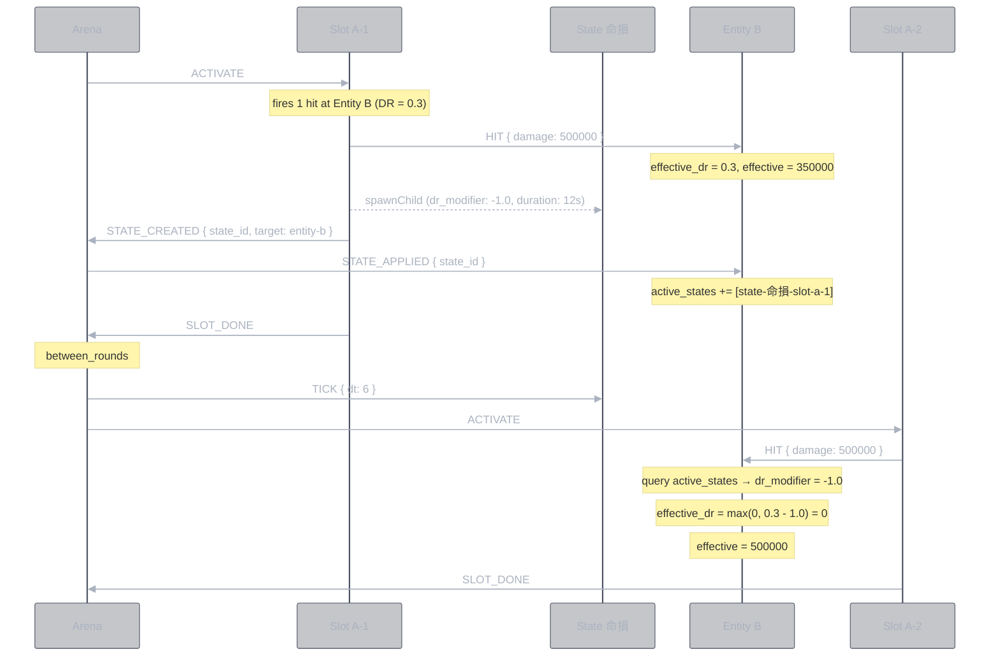
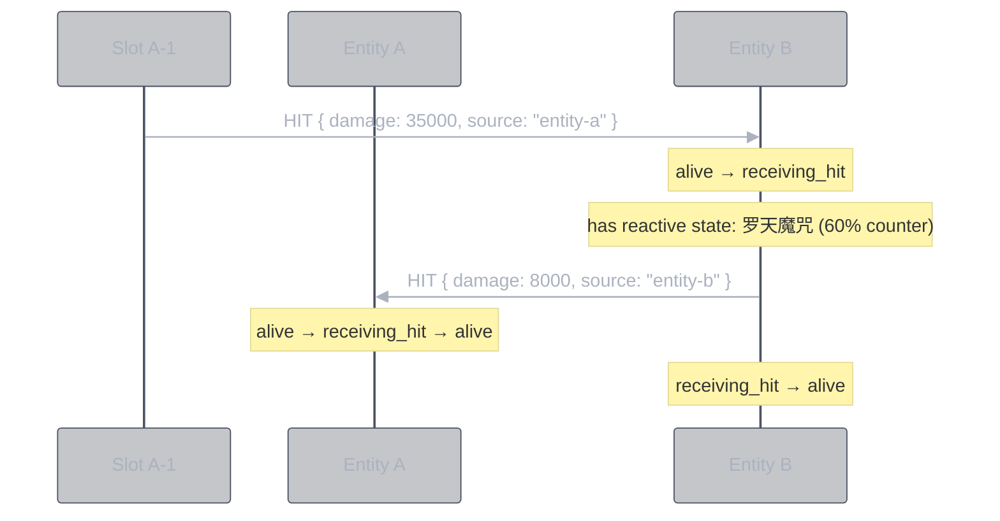

<style>
body {
  max-width: none !important;
  width: 95% !important;
  margin: 0 auto !important;
  padding: 20px 40px !important;
  background-color: #282c34 !important;
  color: #abb2bf !important;
  font-family: -apple-system, BlinkMacSystemFont, "Segoe UI", Helvetica, Arial, sans-serif !important;
  line-height: 1.6 !important;
  -webkit-print-color-adjust: exact !important;
  print-color-adjust: exact !important;
}

h1, h2, h3, h4, h5, h6 {
  color: #ffffff !important;
}

a {
  color: #61afef !important;
}

code {
  background-color: #3e4451 !important;
  color: #e5c07b !important;
  padding: 2px 6px !important;
  border-radius: 3px !important;
}

pre {
  background-color: #2c313a !important;
  border: 1px solid #4b5263 !important;
  border-radius: 6px !important;
  padding: 16px !important;
  overflow-x: auto !important;
}

pre code {
  background-color: transparent !important;
  color: #abb2bf !important;
  padding: 0 !important;
  border-radius: 0 !important;
  font-size: 13px !important;
  line-height: 1.5 !important;
}

table {
  border-collapse: collapse !important;
  width: auto !important;
  margin: 16px 0 !important;
  table-layout: auto !important;
  display: table !important;
}

table th,
table td {
  border: 1px solid #4b5263 !important;
  padding: 8px 10px !important;
  word-wrap: break-word !important;
}

table th:first-child,
table td:first-child {
  min-width: 60px !important;
}

table th {
  background: #3e4451 !important;
  color: #e5c07b !important;
  font-size: 14px !important;
  text-align: center !important;
}

table td {
  background: #2c313a !important;
  font-size: 12px !important;
  text-align: left !important;
}

blockquote {
  border-left: 3px solid #4b5263 !important;
  padding-left: 10px !important;
  color: #5c6370 !important;
  background-color: #2c313a !important;
}

strong {
  color: #e5c07b !important;
}
</style>

# Combat Simulator: Actor Architecture

**Date:** 2026-03-11
**Status:** Design v0.2 — spike validated, unified model

---

## 1. Actor Inventory

Four actor types. Each is an independent state machine communicating via events.

| Actor | systemId pattern | Instances | States | Purpose |
|:------|:----------------|:----------|:-------|:--------|
| **Arena** | `arena` | 1 | `ready → running ↔ between_rounds → done` | Root actor. Spawns all others. Owns the clock. |
| **Entity** | `entity-a`, `entity-b` | 2 | `alive → receiving_hit → alive/dead` | HP owner. Receives damage, applies DR. One machine definition, two instances. |
| **Slot** | `slot-a-1` … `slot-b-6` | 12 | `off → on → off` | Fires hits on activation. Pure trigger. |
| **State Effect** | `state-仙佑-slot-a-1` | dynamic | `on → off` | Duration-gated effect. Queryable state. Covers buffs, debuffs, DoTs — one machine. |

> **Key principle:** Entity is one machine definition instantiated twice with different parameters (HP, ATK, DR). State Effect is one machine definition — no buff/debuff split. The consumer reads whatever fields are relevant.



**One machine, two instances.** Entity A and Entity B run the same `entityMachine` code — only the input parameters differ (HP, ATK, DR, crit). This mirrors how real games model symmetric opponents. Precedent: [XState Rock Paper Scissors](https://github.com/statelyai/xstate/tree/main/examples) uses one `playerMachine` spawned twice.

---

## 2. Actor State Diagrams

### 2.1 Arena



The arena is **just a clock + scheduler**. It does not compute damage or manage HP. It:
- Sends `ACTIVATE` to current round's slots
- Sends `TICK` to all registered state effects between rounds
- Routes `STATE_CREATED` events to affected entities
- Ends combat on `ENTITY_DIED` or when all rounds are done

### 2.2 Entity



The entity owns its HP, base DR, and a single `active_states: string[]` list. On `HIT`:

1. Query own `active_states` for DR modifiers — sum all `dr_modifier` fields from active state effects
2. Clamp effective DR to `[0, 1]`
3. Apply: `effective = damage × (1 - effective_dr)`
4. Reduce HP
5. Guards route to `alive` or `dead`

On `STATE_APPLIED`: add the state effect's systemId to `active_states`. No classification needed — the entity doesn't care whether it's a "buff" or "debuff". It just has a list of active state references.

**Context:**
```typescript
context: {
  id: string;
  hp: number;
  max_hp: number;
  atk: number;
  base_dr: number;
  crit_rate: number;
  crit_damage: number;
  active_states: string[];   // systemIds of all active state effects on this entity
  damage_log: DamageEntry[];
}
```

### 2.3 Slot


On entry to `on`:
1. Read owner entity's `active_states` via `system.get()`
2. For each active state: query its snapshot for `modifiers` (factor vector deltas)
3. Build combined `FactorVector` (base + sum of active modifier deltas)
4. Compute N hits via `resolveHit()` (pure function)
5. `sendTo` target entity: N × `HIT` events
6. `spawnChild` any state effects defined in the slot
7. `sendTo` arena: `STATE_CREATED` (for each spawned state, so arena can route to affected entity)
8. `sendTo` arena: `SLOT_DONE`

The slot is **stateless between activations**. It doesn't hold results — it fires events and goes back to `off`.

### 2.4 State Effect



A state effect is **passive and queryable** by default. DoTs (`damage_per_tick > 0`) also send `HIT` events on each TICK. Other actors read its snapshot to check:
- Is it `on`?
- What are its `modifiers`? (factor vector deltas — M_dmg, M_skill, etc.)
- What is its `dr_modifier`? (DR delta — positive = more defense, negative = DR reduction)
- What is its `healing_modifier`? (healing delta)

**One machine, many roles.** The same `stateEffectMachine` handles:

| Role | `modifiers` | `dr_modifier` | `damage_per_tick` | `shield_hp` | Example |
|:-----|:-----------|:-------------|:-----------------|:-----------|:--------|
| Self-buff | `{ M_dmg: 0.7 }` | `0` | `0` | `0` | 仙佑 (+70% dmg) |
| DR debuff | `{}` | `-1.0` | `0` | `0` | 命損 (-100% DR) |
| DoT | `{}` | `0` | `5000` | `0` | 噬心 (damage/tick) |
| Shield | `{}` | `0` | `0` | `50000` | 护体 (absorb) |
| Counter | `{}` | `0` | `0` | `0` | 罗天魔咒 (`counter_damage: 8000`) |
| Mixed | `{ M_dmg: 0.3 }` | `-0.2` | `0` | `0` | (hypothetical) |

The consumer decides what to read:
- **Slot** reads `modifiers` from owner's active states → builds factor vector
- **Entity** reads `dr_modifier` from own active states → adjusts effective DR on HIT
- Nobody classifies a state as "buff" or "debuff" — the fields speak for themselves

**Context:**
```typescript
context: {
  id: string;
  remaining: number;          // seconds until expiry
  stacks: number;             // stack count (1 = single application)
  modifiers: Partial<FactorVector>;  // factor deltas (may be empty)
  dr_modifier: number;        // DR delta (0 = no effect)
  healing_modifier: number;   // healing delta (0 = no effect)
  damage_per_tick: number;    // > 0 makes this a DoT
  shield_hp: number;          // > 0 makes this a shield
  counter_damage: number;     // > 0 makes this a reactive trigger
  target_entity: string;      // who to HIT (for DoT/counter)
}
```

**Events:**
```typescript
| TICK { dt }    | decrement remaining, fire HIT if DoT |
| DISPEL         | transition to off                     |
| STACK          | increment stacks, optionally refresh  |
| ABSORB { amt } | decrement shield_hp, off if depleted  |
```

---

## 3. Component Contracts (Event Interfaces)

### 3.1 Events by Actor

| Actor | Receives | Sends |
|:------|:---------|:------|
| **Arena** | `ENTITY_DIED`, `SLOT_DONE`, `STATE_CREATED` | `START`, `ACTIVATE` (to slots), `TICK` (to state effects), `STATE_APPLIED` (to entities) |
| **Entity** | `HIT`, `STATE_APPLIED` | `ENTITY_DIED` (to arena) |
| **Slot** | `ACTIVATE` | `HIT` (to target entity), `SLOT_DONE` (to arena), `STATE_CREATED` (to arena), `spawnChild` (state effects) |
| **State Effect** | `TICK`, `DISPEL`, `STACK`, `ABSORB` | `HIT` (to target, if DoT) — otherwise passive/queryable |

### 3.2 Event Schemas

```typescript
// Arena → Slot
type ACTIVATE = { type: "ACTIVATE" }

// Slot → Entity (target)
type HIT = {
  type: "HIT";
  damage: number;          // pre-computed raw damage (before DR)
  source: string;          // systemId of attacker entity
  is_crit: boolean;
  hit_index: number;       // which hit in the sequence
}

// Arena → State Effects
type TICK = {
  type: "TICK";
  dt: number;              // seconds elapsed
}

// Slot → Arena
type SLOT_DONE = {
  type: "SLOT_DONE";
  slot_id: string;
}

// Slot → Arena (for routing to affected entity)
type STATE_CREATED = {
  type: "STATE_CREATED";
  state_id: string;        // systemId of spawned state effect
  target_entity: string;   // systemId of entity that should track this state
}

// Arena → Entity (routed from STATE_CREATED)
type STATE_APPLIED = {
  type: "STATE_APPLIED";
  state_id: string;        // systemId of state effect to add to active_states
}

// Entity → Arena
type ENTITY_DIED = {
  type: "ENTITY_DIED";
  entity_id: string;
}

// State Effect events
type DISPEL = { type: "DISPEL" }
type STACK = { type: "STACK" }
type ABSORB = { type: "ABSORB"; amount: number }
```

Note: `STATE_APPLIED` has no `kind` field. The entity just adds the state_id to its flat `active_states` list. When it needs DR modifiers, it queries each state and reads `dr_modifier`. When a slot needs factor modifiers, it queries each state and reads `modifiers`. No classification needed.

### 3.3 Contract: Who computes damage?

**The slot computes raw damage. The entity applies its own defenses.**

```
Slot (attacker side)              Entity (defender side)
─────────────────────             ─────────────────────
1. read owner entity's            1. receive HIT { damage }
   active_states                  2. read own active_states
2. query each state for              for dr_modifier
   .modifiers (factor deltas)     3. effective_dr = base_dr
3. build FactorVector                + sum(dr_modifiers)
   (base + buff deltas)           4. clamp to [0, 1]
4. resolve raw hit damage         5. effective = damage × (1-DR)
   (pure function)                6. update HP
5. sendTo target: HIT             7. guard: alive or dead?
```

This split is correct because:
- The **attacker** knows their ATK, active state modifiers, crit — they determine raw output
- The **defender** knows their DR, active state DR modifiers — they determine how much gets through
- Neither needs to read the other's internal state

### 3.4 Arena routing: how state effects reach the right entity

The slot knows which entity should be affected (from `StateDef.target`):
- `target: "self"` → route to `slot.owner_entity`
- `target: "opponent"` → route to `slot.target_entity`

The slot resolves this at spawn time and tells the arena via `STATE_CREATED { target_entity }`. The arena then forwards `STATE_APPLIED { state_id }` to that entity. The state effect machine itself has no `target` field — routing is external, handled by the slot + arena.

---

## 4. Logical Flows

### 4.1 Single Slot Activation (happy path)



### 4.2 State Effect Cross-Slot (self buff amplifies next slot)



### 4.3 State Effect Cross-Slot (opponent debuff reduces DR)



### 4.4 Reactive Trigger (counter on being hit)



---

## 5. Design Decisions

### 5.1 One machine definition, two instances (Entity)

Player and opponent run the same `entityMachine` — only input parameters differ. This is the standard XState pattern for symmetric game actors.

```typescript
// Arena context factory
context: ({ input, spawn }) => ({
  entity_a: spawn(entityMachine, { systemId: "entity-a", input: input.entity_a }),
  entity_b: spawn(entityMachine, { systemId: "entity-b", input: input.entity_b }),
  // same machine, different params
})
```

### 5.2 Unified state effects (no buff/debuff split)

State effects have optional fields: `modifiers`, `dr_modifier`, `healing_modifier`. The entity stores a single `active_states` list — no `buff_ids` / `debuff_ids` split.

**Why not separate types?**
- The machine behavior is identical: on/off with duration, queryable context
- Classification is the consumer's job, not the state's job
- A "buff" with `{ M_dmg: 0.7, dr_modifier: 0 }` and a "debuff" with `{ modifiers: {}, dr_modifier: -1.0 }` are structurally the same — duration-gated optional fields
- Adding new field types (e.g., `crit_modifier`) requires zero architectural changes

**Who reads what:**
- Slot → reads `modifiers` from owner entity's active states (for factor amplification)
- Entity → reads `dr_modifier` from own active states (for DR computation on HIT)

### 5.3 Slot computes all hits at once (enqueueActions), not one-at-a-time

The slot sends N `HIT` events via `enqueueActions`. Each HIT is a separate event processed as its own macrostep by the entity. But the slot computes all hit damages up front.

**Why not one-at-a-time?** Per-hit escalation (+5%/hit) depends only on hit index, not on defender state. The slot knows hit 1 = base, hit 2 = base × 1.05, etc. No need to wait for entity response.

**Exception:** If we later need "stop hitting if target dies mid-sequence" — the entity transitions to `dead` and ignores further HITs. The slot doesn't need to know.

### 5.4 State effects are pull (query), not push (event)

State effects don't broadcast "I'm active!" to all consumers. Slots and entities query state effect snapshots when they need values. This avoids N×M event spam and keeps state effects simple (just on/off + fields).

**XState mechanism:** `system.get('state-仙佑-slot-a-1').getSnapshot()` — read `.value` (on/off) and `.context.modifiers`.

### 5.5 Arena as event router

State effects are spawned by slots but need to be tracked by entities. The routing flow:

1. Slot spawns state effect via `spawnChild` with a `systemId`
2. Slot tells arena: `STATE_CREATED { state_id, target_entity }`
3. Arena tells target entity: `STATE_APPLIED { state_id }`
4. Entity adds `state_id` to its `active_states`

The arena is the only actor that needs to know the mapping. The state effect itself doesn't know which entity it belongs to — it's just a timer with fields.

### 5.6 Dead entities ignore further events

When entity transitions to `dead` (final state), XState stops the actor. Any queued HITs from remaining slot hits are simply dropped. No special "check if alive before hitting" logic needed.

### 5.7 DoT is a state effect with `damage_per_tick`

A DoT is the same state effect machine. When `damage_per_tick > 0`, the state effect sends `HIT` to its target on each `TICK`. When `damage_per_tick === 0`, it's passive (queryable only). Same on/off lifecycle, same duration tracking. The arena TICK drives it — no separate clock.

```typescript
// State effect context — DoT just has damage_per_tick > 0
context: {
  remaining: 12,
  modifiers: {},           // empty for pure DoT
  dr_modifier: 0,
  damage_per_tick: 5000,   // > 0 makes it a DoT
  target_entity: "entity-b", // who to HIT
}
```

On TICK: `if (damage_per_tick > 0) sendTo(target_entity, { type: "HIT", damage: damage_per_tick })`.

### 5.8 Stacking is a STACK event

When the same state effect is applied again to an entity that already has it, the arena sends `STACK` to the existing state effect actor instead of spawning a new one.

```
State effect receives STACK →
  assign({ stacks: context.stacks + 1 })
  optionally refresh duration (assign({ remaining: initial_duration }))
```

The `stacks` count can scale effect magnitude: `effective_modifier = base_modifier × stacks`. This is just context math, no architectural change.

### 5.9 Reactive triggers are part of HIT processing

When entity receives `HIT`, it checks its `active_states` for any with `counter_damage > 0`. If found, it sends `HIT` back to `event.source`. This is just additional logic in the entity's HIT action — no new actor type.

```
Entity receives HIT →
  1. apply DR (existing)
  2. reduce HP (existing)
  3. for each active state with counter_damage > 0:
     sendTo(event.source, { type: "HIT", damage: counter_damage })
```

### 5.10 Shields are state effects with `shield_hp`

A shield state effect has `shield_hp > 0`. When entity receives HIT, it checks active states for shields and sends `ABSORB { amount }` to the shield actor. The shield decrements its HP and transitions to `off` when depleted.

```
Entity receives HIT →
  1. check active states for shields
  2. sendTo(shield, { type: "ABSORB", amount: damage })
  3. shield responds: remaining_hp -= amount, if <= 0 → off
  4. entity applies remaining damage after absorption

Shield state effect receives ABSORB →
  absorbed = min(shield_hp, event.amount)
  shield_hp -= absorbed
  if shield_hp <= 0 → transition to off
```

### 5.11 Snapshot vs dynamic is per-effect configuration

When a DoT is spawned, it either:
- **Snapshots**: stores `damage_per_tick` computed at spawn time from current attacker stats (locked in)
- **Dynamic**: stores `owner_entity` and queries live ATK/buffs on each TICK

This is a configuration flag on `StateDef`, not an architectural choice. Most effects snapshot (simpler, matches game behavior). Dynamic is available for effects that explicitly need live stats.

---

## 6. File Layout

```
lib/simulator/
  damage.ts          # resolveHit(), resolveDoTTick() — pure functions
  types.ts           # event schemas, input types, shared interfaces
  actors/
    arena.ts         # arena machine — root, clock, scheduler, event router
    entity.ts        # entity machine — HP, DR, active_states, damage_log
    slot.ts          # slot machine — off/on, compute + fire hits, spawn states
    state-effect.ts  # state effect machine — on/off, duration, optional fields
```

---

## 7. Spike Status

Architecture validated with 12 passing tests:

| Component | What was proved |
|:----------|:---------------|
| Arena | Spawns entities + slots via context factory, sends ACTIVATE in sequence, handles ENTITY_DIED |
| Entity | Receives HIT, applies DR (base + debuff modifiers), tracks HP, transitions to dead |
| Slot | On ACTIVATE: queries owner's active states, computes damage, sends HITs to target, spawns state effects |
| State Effect | On/off with duration, queryable modifiers and dr_modifier |
| Cross-slot buff | State effect from slot 1 amplifies slot 2 damage via factor modifier pull |
| Cross-slot debuff | State effect from slot 1 reduces target DR for slot 2 hits |
| Expiry | Expired state effect stops affecting DR (confirmed with 3-slot test) |
| Death | Entity death stops combat, sets winner |

**Deferred:** Summon, healing.

---

## References

- [XState v5 Actor Model](https://stately.ai/docs/actors) — spawning, actor lifecycle
- [XState v5 Systems (systemId)](https://stately.ai/docs/system) — peer-to-peer via `system.get()`
- [XState v5 Actions](https://stately.ai/docs/actions) — `sendTo`, `raise`, `enqueueActions`, `spawnChild`
- [XState v5 Events & Transitions](https://stately.ai/docs/transitions) — `always` guards, eventless transitions
- [Thoughts on Building a Game with XState](https://asukawang.com/blog/thoughts-on-building-a-game-with-xstate/) — entity as actor, damage as event
- [systemId discussion (GitHub #4651)](https://github.com/statelyai/xstate/discussions/4651) — actor discovery patterns

---

## Document History

| Version | Date | Changes |
|:--------|:-----|:--------|
| 0.1 | 2026-03-11 | Initial actor architecture design |
| 0.2 | 2026-03-11 | Unified model: one entity machine (two instances), one state effect machine (no buff/debuff split), single `active_states` list, spike validation results |
| 1.0 | 2026-03-11 | Final design: DoT, stacking, reactive triggers, shields, snapshot/dynamic — all resolved as events on existing machines. No new actor types needed. |
